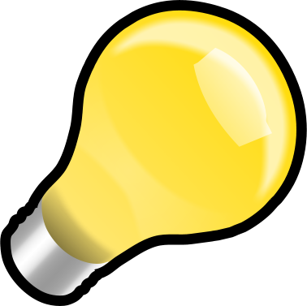
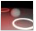

---
---

# {:height="75px" width="75px"} Luces
Las fuentes de luz artificial utilizan las luces normales de Rhino con propiedades añadidas de Flamingo al control de distribución de la luz. Si utiliza fuentes de luz, elija el tipo que representa más exactamente la lámpara real que se está modelado.

## Ficha Luces
{: #light-tab}
La ficha Luces mostrará una lista de todas las luces artificiales en la escena. Este tema trata sobre la ficha Luces de Flamingo.  También existe la ficha [Luces de Rhino](http://docs.mcneel.com/rhino/5/help/es-es/index.htm#commands/lights.htm).  Flamingo y Rhino los mantendrán las opciones de configuración de luces sincronizadas en las dos fichas.  La ficha Luces de Flamingo es un poco más flexible y dispone de [Propiedades de iluminación](#light-properties) adicionales.

#### ¿Dónde se encuentra el control de iluminación de Flamingo? 
La ficha Luces debe activarse a través de los [preajustes de iluminación](lighting-tab.html#lighting-presets) o las [opciones de iluminación personalizada](lighting-tab.html#sun).

 1. Barras de herramientas >Barra de herramientas de Flamingo nXt
 1. Menús > Flamingo  5.0 > Mostrar panel de control > Ficha Flamingo > Luces

En la ficha Luces puede insertar, activar/desactivar y cambiar la intensidad y ​​el canal de cada luz.

Flamingo admite estos tipos de luces:

> [Etiquetar objetos como luces](#tag-objects-as-lights)
> [Foco de luz](#spotlight)
> [Luz puntual](#pointlight)
> [Luz rectangular](#rectangularlight)
> [Luz lineal](#linearlight)

**Nota:** Las luces direccionales de Rhino  no son compatibles. No aparecen en la lista de las luces y no pueden tener propiedades de Flamingo nXt.

Algunas propiedades de luz se muestran de la pestaña Luces en forma de tabla para su edición rápida.

Las propiedades que contiene la tabla son:

 >[Activar/Desactivar](#on)
 >[Nombre](#name) 
 >[Distribución](#light-distribution)
 >[Objetivo](#aim-light)
 >[Vatios](#watts)
 >[Canal](#channel)

Al hacer clic con el botón derecho en la tabla de la ficha Luces, se abre el menú [Opciones adicionales](#additional-options).

También se puede acceder a las [Propiedades de iluminación](#light-properties) designando la luz y accediento al icono Propiedades de iluminación  del [panel Propiedades de objeto](http://docs.mcneel.com/rhino/5/help/es-es/commands/properties.htm).

## Tipos de luces
{: #light-types}
Las luces se pueden insertar desde las barras de herramientas de Rhino o la ficha Luces de Flamingo. Los objetos se pueden etiquetar como luces con Flamingo.

####  Etiquetar objetos como luces
{: #tag-objects-as-lights}
Cualquier objeto renderizable (superficie, sólido, etc.) puede etiquetarse como fuente de luz y tener asignadas propiedades de luz. Se pueden asignar propiedades adicionales como [distribución](#light-distribution), [dirección](#aim-light) e [intensidad](#watts). Los objetos etiquetados como luces pueden mostrar un widget de vista previa que muestra la dirección de la luz y y su posición central.

*Luces delanteras y luces de carretera LED etiquetadas como fuentes de luz*

####  Foco de luz
{: #spotlight}
Un foco de luz tiene una distribución de luz cónica con una dirección específica.  Las propiedades de luz incluyen un [radio de la fuente](#radius), [ángulo de haz](#vbeam-angle), atenuación, radio y dirección. Cuanto mayor sea el radio de la fuente, más suaves serán las sombras de la luz. De manera predeterminada hay es un disco visible en la posición de la luz. La información sobre la edición de la posición, dirección y ángulo de haz en pantalla mediante manejadores se puede encontrar en el tema [Foco de luz de Rhinoceros](http://docs.mcneel.com/rhino/5/help/es-es/commands/spotlight.htm) de la Ayuda.

*Foco de luz orientado a la caja roja*

####  Luz puntual
{: #pointlight}
Las luces puntuales son esferas pequeñas que distribuyen la luz por igual en todas las direcciones. Las propiedades de luz de esta luz incluyen el [radio de la fuente](#radius). Cuanto mayor sea el radio, más suaves serán las sombras proyectadas de la luz. De manera predeterminada hay una esfera de luz visible en la posición de la luz al renderizar. Tenga en cuenta que se pueden producir efectos inusuales si la luz puntual queda parcialmente oscurecida por un objeto que se cruza con la luz.

*Luz puntual pequeña cerca del muro de la derecha*

####  LuzRectangular
{: #rectangularlight}
Ofrece una aproximación de una luz empotrada con un difusor o deflectores. La luz distribuye luz en un patrón difuso basado en la orientación del rectángulo. Una flecha de dirección se dibuja en el punto central de la luz. La luz de mayor intensidad está directamente en frente del rectángulo.  Entonces la luz se atenua en ángulo hacia los objetos desde rectángulo. De manera predeterminada, se verá un rectángulo blanco al renderizar. Un error común es insertar estos rectángulos exactamente a la misma altura que el plano del techo. Para obtener resultados coherentes, asegúrese de que las luces están ligeramente más abajo que el techo. La información sobre la edición de la posición, dirección y ángulo de haz en pantalla mediante manejadores se puede encontrar en el tema [LuzRectangular de Rhinoceros](http://docs.mcneel.com/rhino/5/help/es-es/commands/rectangularlight.htm) de la Ayuda.

*Luz rectangular justo debajo del techo*

####  LuzLineal
{: #linearlight}
Distribuye la luz en un patrón cilíndrico similar a un tubo fluorescente. Las propiedades de luz de esta luz incluyen el [radio de la fuente](#radius) y la longitud. Cuanto mayor sea el radio, más suaves serán las sombras proyectadas de la luz. De manera predeterminada, hay una cilindro de luz visible en la posición de la luz al renderizar. Tenga en cuenta que se pueden producir efectos inusuales si la luz cilíndrica queda parcialmente oscurecida por un objeto que se cruza con la luz. Utilice los puntos de control de Rhino para activar los manejadores de la luz para su edición en pantalla.

## Propiedades de iluminación
{: #light-properties}
Cuando Flamingo es el renderizador actual en Rhino, se pueden establecer propiedades adicionales para las luces. Las luces tienen algunas propiedades en común.

#### Nombre
{: #name}
Nombre del objeto de luz. Sirve para diferenciar las luces del modelo que son del mismo tipo.

####  Activar/Desactivar
{: #on}
Activa y desactiva la luz. En la tabla de Luces, si el icono de de la bombilla está de color amarillo, significa que la luz está activada. Si el icono de la bombilla está de color gris, significa que la luz estará desactivada en el renderizado. Haga doble clic en el icono para activarla y desactivarla. En diálogo de propiedades, hay una casilla de verificación para Activar/Desactivar.

#### Visible
{: #visible}
De manera predeterminada, las luces se muestran como una fuente de luz brillante en el renderizado.  Si desactiva la propiedad Visible, el objeto de luz se volverá invisible en el renderizado.  Aún así, el objeto de luz proyectará su luz en la escena.

#### Distribución de la luz *([Solo objetos etiquetados](#tag-objects-as-lights))*
{: #light-distribution}
Cuando etiquete un objeto como luz, utilice la opción Distribución para especificar el patrón que la luz proyecta en la escena. En panel de luces, haga doble clic en la celda de distribución para ver la lista desplegable de opciones. Los tipos de distribución son: [Todas las direcciones](#pointlight), [Foco](#spotlight) y [Difusa](#rectangularlight). Las opciones Foco y Difusa requieren que se especifique una [dirección](#aim-light).

#### Dirigir luz ([solo objetos etiquetados](#tag-objects-as-lights))*
{: #aim-light}
Para las luces etiquetadas que tienen una distribución de Foco o Difusa, debe especificarse una dirección.  Haga doble clic en la opción "Objetivo >>" y siga las solicitudes de la línea de comandos.

#### Vatios
{: #watts}
Especifica la energía eléctrica de la luz.  Se recomienda empezar con valores realistas para la escena. En la tabla de luces, haga doble clic en la celda para cambiar el valor.

#### Ángulo de haz *([solo focos](lights-tab.html#spotlight))*
{: #beam-angle}
Ángulo en grados que controla la anchura de la luz que emana de una fuente de luz. También se puede modificar utilizando los manejadores en pantalla.  Puede encontrar información sobre la edición de manejadores en el tema [Foco de luz de Rhinoceros](http://docs.mcneel.com/rhino/5/help/es-es/commands/spotlight.htm) de la Ayuda.

#### Radio
{: #radius}
Tamaño de la fuente de luz visible. Las luces más pequeñas proyectan sombras más definidas.

#### Color
{: #color}
Color que emana la fuente de luz.

#### Utilizar color de material ([solo objetos etiquetados](#tag-objects-as-lights))*
Utiliza el color del material asignado al objeto de luz para la luz que produce.

#### Canal
{: #channel}
Las luces se pueden asignar a uno de los ocho canales. Permite ajustar la iluminación de la imagen renderizada en tiempo real, después de producirse el renderizado. Esta función es muy potente cuando se trabaja para equilibrar varias fuentes de luz en un renderizado. Para obtener más información, consulte el tema [Canales de renderizado](render-channel.html).

#### Archivo IES
{: #iesfile}
Los archivos IES (Illuminating Engineering Society) son archivos fotométricos que definen la distribución de la luz de una fuente de luz. Los fabricantes de luces a menudo proporcionan estos archivos. Si se utiliza el archivo IES para la distribución, se puede describir con mayor precisión la fuente de luz. La geometría del objeto de luz etiquetado no tiene relación con la distribución de la luz. La definición de la distribución de la luz procede únicamente del archivo de fotometría.

Notas:

* Flamingo nXt admite archivos de goniometría de Tipo C , que incluyen la mayoría de archivos IES. Los archivos de Tipo A, utilizados ocasionalmente por la industria del automóvil para definir los faros, y los de tipo B, que a veces se utilizan para definir la iluminación con focos, no son compatibles.
* Las distribuciones IES incluyen los efectos de elementos de luces, tales como deflectores, reflectores y difusores.
* Las distribuciones IES a menudo son asimétricas, por lo que no solo es necesario definir un objetivo para dirigir la fuente de luz, sino también un ángulo de rotación.

#### Brillo desde archivo
Utiliza la intensidad almacenada en el archivo IES. Si esta opción no está activada, se utiliza la opción [Vatios](lights-tab.html#watts).

## Menú de opciones adicionales
{: #additional-options}
Puede acceder a las opciones adicionales haciendo clic en la luz de la tabla de luces.

####  Activar
Activa y desactiva la luz [Activar/Desactivar](#on)

#### Eliminar
Elimina la luz seleccionada.

#### Quitar etiqueta de luz
Quita la [etiqueta](#tag-objects-as-lights) que marca un objeto como luz.

#### Propiedades
Accede a las [Propiedades de iluminación](#light-properties) de esa luz.

#### Seleccionar objetos y elementos coincidentes
Selecciona la luz en la vista.