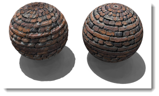
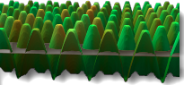
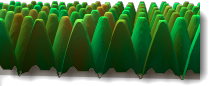

---
---

# {:height="75px" width="75px"} Material Image Properties

Los materiales pueden crearse a partir de imágenes. Puede escanear fotografías y objetos reales como papel tapiz y alfombra, crear plantillas en un programa de dibujo y utilizar imágenes de otras fuentes de bitmap.
Imagínese que el material se estira infinitamente hacia todas las direcciones en el espacio. El material se hace visible solo cuando un objeto le atraviesa. Los patrones se repiten infinitamente (mosaico) en cuatro direcciones en una escala especificada.
Las imágenes pequeñas que pueden ser repetidas en cuatro direcciones sin divisiones suelen funcionar mejor. Si el bitmap no se repite bien, utilice la opción de copiar losetas. De este modo, se garantiza que los bordes coincidan.

**Nota:**Para que una imagen bitmap cubra solamente una parte del objeto (como una etiqueta en una botella de vino o un logo en un producto), utilice la función [Calcomanía](properties-decal.html).

Los mapas de imagen pueden usarse de distintas formas. Un método frecuente es usar un dibujo de un material real como color del material.

## Nombre
Se puede asignar un nombre a las texturas de imagen. Este nombre lo utiliza la Librería de texturas del RDK y no tiene un impacto real en Flamingo.

## Imagen de Flamingo

### Vista previa de imagen
{: #image-preview}
Muestra una vista previa del archivo de imagen seleccionado. Pase el ratón por encima de la imagen para ver un elemento emergente con el nombre de archivo de imagen.  Haga clic en la imagen para seleccionar otra imagen.

#### Resolución de imagen
{: #image-resolution}
Muestra la resolución en píxeles del archivo de imagen actual.

### Mosaico
{: #tiles}
Los mapas de imagen que se usan en las definiciones de materiales siempre se repiten (mosaico). Estas opciones especifican el tamaño de cada loseta del mosaico en las unidades del modelo actual.

#### Anchura/Altura
{: #width-height}
Define el tamaño de loseta en unidades del modelo.




### Tipo de mapeado
{: #mapping-type}
Las imágenes normalmente se aplican al canal de color. Pero existen otras maneras de usar las imágenes.  Las imágenes se pueden definir como:

> [Estándar](#standard)
> [Normal](#normal)
> [Desplazamiento](#displacement)

### Estándar
{: standard}
La imagen proporciona color y relieve visual al material. Utilice los valores de Intensidad y Relieve para controlar el modo en que el bitmap influenciará en el material.

#### Intensidad de color
{: #color}
Determina cuánto influencia el mapa de imagen en la apariencia del material. En el ejemplo inferior, el material subyacente es de color magenta. La intensidad de color aumenta hasta que el color subyacente está completamente enmascarado por la textura en blanco y negro.

*Intensidad de color 0.2, 0.5, 1.0.*

#### Intensidad de relieve
{: #bump}
Simula relieves y arrugas en la superficie de un objeto alterando las normales de superficie de un objeto. El objeto subyacente no se modifica. En la imagen, el material de la izquierda utiliza el mapeado de desplazamiento, mientras que el material de la derecha utiliza el mapeado de relieve definido en su valor más alto. El uso de números de relieve negativo invertirán el efecto. El borde y la sombra son suaves en el material con mapeado de relieve. Véase: [Artículo de Wikipedia: Mapeado topológico](https://es.wikipedia.org/wiki/Mapeado_topol%C3%B3gico).

*Intensidad de relieve, 0.5 (izquierda) y 1.0 (derecha).*

### Normal
{: #normal}
Simula la iluminación de relieves y mellas sin utilizar más polígonos en la malla de renderizado. Véase: [Artículo de Wikipedia: Mapeado normal](https://es.wikipedia.org/wiki/Mapeado_normal).

Los mapas de normales funcionan de modo muy similar a los mapas de relieve, en el sentido que modifican la normal de la superficie. El efecto es esencialmente el mismo que el relieve, pero los mapas de normales permiten más control sobre la normal que un relieve. Un mapa de relieve utiliza el promedio en gris del RGB de un bitmap. El RGB de un mapa de normal corresponde a la modificación del XYZ de la normal. Porque el canal azul de la imagen controla la dirección Z de la normal. Los mapas de normales tienen un color azul considerable.

### Desplazamiento
{: #displacement}
Este mapa de imagen desplaza la malla de renderizado de la superficie según los valores de color de la imagen. El efecto es un cambio en la posición geométrica actual de la superficie. El desplazamiento se realiza normalmente a lo largo de la normal de la superficie local. Véase: [Artículo de Wikipedia: Mapeado de desplazamiento](http://en.wikipedia.org/wiki/Displacement_mapping).

 **Nota:**Utilice el mapeado de desplazamiento con moderación en objetos pequeños. El desplazamiento aumenta el tiempo de renderizado considerablemente.

#### Altura
{: #height}
Altura del punto más alto del desplazamiento.

#### Desfase
{: #offset}
Establece el punto inicial del desplazamiento con respecto a la normal de la superficie. El desplazamiento puede realizarse completamente fuera, dentro o una proporción dentro y fuera de la pieza.

*Desfase Z = -1.0*

*Desfase Z = -0.5*

*Desfase Z = 0.0*

#### Tamaño de faceta
{: #facet-size}
Tamaño de las facetas de la malla de desplazamiento. El tamaño aumentará el detalle en el desplazamiento, pero también aumentará el tamaño de renderizado y el uso de memoria.

## Opciones avanzadas de imagen de Flamingo
{: #advanced}
Normalmente una imagen de Flamingo se aplicará al canal del color principal de un material. El diálogo de opciones avanzadas de Flamingo especifica otros canales en los que puede repercutir el bitmap.  Estos canales se usan para efectos muy especiales.

####  Color base
Es la opción predeterminada.  Afecta al [color](advanced-material-properties-main.html#color) de un material.

####  Color especular
Afecta al color del [canal de reflexión](advanced-material-properties-main.html#highlight-color) basado en el color de la imagen en ese punto.

####  Intensidad especular
Cambia el [nivel de reflexión](advanced-material-properties-main.html#intensity) según la escala de grises de la imagen en ese punto.  Esta opción se usa a menudo en Conjunto de texturas como Mapa especular.

####  Definición del brillo
Ajusta la definición vs. desenfoque del [brillo](advanced-material-properties-main.html#intensity) según el valor de la escala de grises del mapa en ese punto. 

#### Forma de brillo
{: #advanced-highlight-shape}
Afecta a la forma del brillo.

####  Transparencia
Repercute en la cantidad de [transparencia](advanced-material-properties-main.html#intensity) del material según la escala de grises de la imagen.

####  Translucidez
Repercute en la cantidad de [translucidez](advanced-material-properties-transparency.html#translucency) del material según la escala de grises de la imagen.

####  Atenuación
Repercute en la cantidad de [atenuación](advanced-material-properties-transparency.html#attenuation) del material según la escala de grises de la imagen.

#### Desfases X/Y
{: #advanced-x-y-offset}
Desplaza el material desde el eje X e Y.

####  Rotación
Gira el mapa de imagen.  Utilice esta opción girar la imagen 90 o 180 grados si es necesario para reorientar la imagen desde la rotación predeterminada.