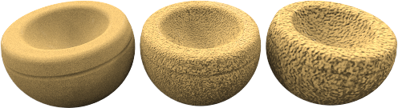

---
---

# {:height="75px" width="75px"} Propiedades de material avanzadas

Flamingo tiene el tipo de [Material simple](material-type-simple.html) y el tipo de Material avanzado.  El Material avanzado contiene la serie completa de grupos de propiedades de un material.  Utilice el Material avanzado para obtener la máxima flexibilidad y control de un material.

El conjunto completo de grupos de propiedades del Material avanzado son:

> [Nombre](#name)
> [Composiciones de material](#procedures)
> [Propiedades de material avanzadas](#advanced-materials-properties)
> [Acabado reflectante](#reflective-finish-and-highlight)
> [Propiedades de transparencia](#transparency)
> [Texturas algorítmicas](#bump-patterns)
> [Texturas de bitmap](#textures)
> [Notas](#notes)

## Nombre de material
{: #name}
Es el nombre del material en el modelo de Rhino.  Las materiales se guardan en el modelo de Rhino. Eso significa que si hay un modelo tiene el mismo nombre en la librería no se verá afectado por los cambios en el material en el modelo actual. Para utilizar cualquier material en otro modelo, debe exportarse a la [Librería](libraries.html) primero. El nombre del material también servirá como nombre de archivo exportado.

## Composiciones de material
{: #procedures}
El árbol Procedimientos combina uno o más materiales utilizando un conjunto de reglas para definir la interacción de los materiales. El árbol muestra los componentes que se usan para crear el material y permite añadir otros componentes. Para materiales estándar, solo habrá un componente en la lista: Base.

Cada componente combina dos materiales "secundarios" utilizando un método específico. Cada uno de los materiales secundarios puede, a su vez, estar formado por un componente, combinando dos materiales secundarios propios. De este modo, se pueden crear materiales sumamente elaborados a partir de elementos más simples. Los procedimientos para combinar materiales son [Mezcla angular](procedural-materials.html#angular-blend), [Mezcla](procedural-materials.html#blend), [Mármol](procedural-materials.html#marble), [Granito](procedural-materials.html#granite), [Loseta](procedural-materials.html#tile) y [Madera](procedural-materials.html#wood).

A modo de ejemplo, la composición de [Mármol](procedural-materials.html#marble) combina un material Base y un material Veta en un patrón en espiral.

<!-- TODO: We need an diagram describing the Proceedure Hirarchyarchy. -->

##### Para agregar un material algorítmico
1. Haga clic con el botón derecho en Base en la ventana Material algorítmico.
1. En el menú, haga clic en un tipo de procedimiento.
  * [Base](procedural-materials.html#base)
  * [Mezcla angular](procedural-materials.html#angular-blend)
  * [Mezcla](procedural-materials.html#blend)
  * [Granito](procedural-materials.html#granite)
  * [Mármol](procedural-materials.html#marble)
  * [Loseta](procedural-materials.html#tile)
  * [Madera](procedural-materials.html#wood)

##### Para quitar un procedimiento
 1. En la ventana Procedimientos, haga clic con el botón derecho en el nombre del procedimiento.
 2. En el menú, haga clic en Quitar.

## Propiedades de material avanzadas
{: #advanced-materials-properties}



#### Acabado reflectante y brillo
{: #reflective-finish-and-highlight}
Estas opciones cambian el modo en que el material refleja la luz y los objetos. El efecto de brillo se asocia normamente a las áreas de luz de los materiales relucientes donde la luz da con el objeto. El efecto reflectante utiliza normalmente reflejos de tipo espejo y refleja los objetos en el resto de la escena. Es importante destacar que el cromo y otros materiales reflectantes no son atractivos a menos que tengan algo que reflejar. Cuando trabaje con materiales reflectantes, tenga en cuenta también la creación de un entorno interesante y otros objetos para que se puedan reflejar en los materiales reflectantes.
 Nota : Para activar estas opciones, el valor Intensidad debe ser superior a cero.

#### Color de brillo
{: #highlight-color}
El color del brillo es el color que el material agrega a los reflejos. Este control tiene tres opciones: Blanco, Metálico y Personalizado.

#### Blanco
Los materiales con brillo blanco no añaden ningún color a los reflejos.  Los materiales con brillo blanco son comunes y suelen parecerse a la pintura estándar, el plástico o el acabado reflectante.

#### Metálico
{: #metallic}
Define el color del brillo igual que el color base. Muchos acabados metálicos suele utilizar el color de base como color reflectante.  Estas opciones utilizan el color del material como color reflectante.

#### Personalizado
En algunos acabados muy especializados, el reflejo del objeto será un color diferente al color base del material.  Sucede normalmente en materiales que están formados por múltiples capas. Utilice la opción Personalizado para especificar un color para el brillo. Utilice el [Selector de color](select-color.html)  para seleccionar un color reflectante.

#### Intensidad
{: #intensity}
Ajusta la intensidad del brillo. Los valores más bajos suelen crear objetos brillantes que reflejan la luz, pero no que no envuelve los objetos. Los valores más altos aumentan el tamaño y la intensidad del brillo y los reflejos.  Los valores más altos harán que el material sea como un espejo y refleje otros objetos y el entorno en la escena.

#### Fresnel
{: #fresnel}
El Fresnel controla la reflectividad de los materiales opacos, un fenómeno conocido como [Reflexión Fresnel de conductores](https://es.wikipedia.org/wiki/Ecuaciones_de_Fresnel). La opción Fresnel modela la tendencia que tienen muchos materiales de volverse más especulares en ángulos de incidencia, mientras que retienen más propiedades mates en ángulos de visión perpendiculares.
Reduzca el valor en materiales muy oscuros para evitar demasiada reflexión. Aumente el valor en materiales como la madera barnizada, donde la reflectividad Fresnel es más pronunciada.

#### Definición
{: #sharpness}
Determina el tamaño del brillo. Los valores más bajos especifican una iluminación más amplia; los valores más altos focalizan la iluminación en una área más reducida.  Cuando se aplica a una reflectividad de mayor intensidad, producirá reflejos borrosos (no enfocados) o nítidos (enfocados).

#### Tipo
{: #type}
Cambia la forma en que se calculan los reflejos cuando se reflejan fuentes de luz artificial. Los reflejos se caculan utilizando dos métodos: *proyección de rayos* y *brillo*. Estos dos métodos al final producirán los mismos resultados; sin embargo, en determinadas situaciones, verá que con uno de los métodos se obtiene un buen resultado con mayor rapidez. Por ejemplo, puede que los objetos no se vean bien porque un reflejo de la fuente de luz oculta el aspecto del material.

En la siguiente imagen del tipo Compensado, el objeto de la izquierda tiene un reflejo de color blanco brillante que predomina sobre el aspecto del material.

A veces, los renderizados de interiores donde las fuentes de luz son pequeñas pueden tener un artefacto irregular en las superficies. Las superficies que muestran el artefacto normalmente tienen reflejos borrosos. Si se cambia el tipo de reflexión a [Brillante](advanced-material-properties-main.html#glossy), [Sin reflejos de fuente de luz](advanced-material-properties-main.html#no-light-source-reflection) o [Monte Carlo](advanced-material-properties-main.html#monte-carlo), se puede solucionar el problema.

#### Compensado
{: #balanced}
Equilibra automáticamente la proyección de rayos y el brillo basándose en el ajuste de Definición. Se calculan tanto el reflejo de la fuente de luz como el brillo artificial.

#### Brillante
{: #glossy}
Aumenta el desenfoque del brillo y evita la proyección de rayos. No se calculan reflejos en los objetos ni en las luces y, por tanto, el rendimiento aumenta y se evitan artefactos en los materiales con reflejos muy borrosos. Se puede perder alguna sutileza en cuanto a los reflejos.

#### Monte Carlo
{: #monte-carlo}
Sólo se usa la proyección de rayos para calcular reflejos de las fuentes de luz. La proyección de rayos se produce inicialmente con ruido y converge gradualmente hacia la solución correcta. Es muy útil cuando el brillo no es borroso.

#### Sin brillo
{: #no-highlight}
Sólo se usa la proyección de rayos para calcular reflejos de las fuentes de luz. Es útil cuando las fuentes de luz son grandes y el material no es borroso, en cuyo caso, el cálculo de brillo puede tomar mucho tiempo. Los reflejos de la fuente de luz convergen gradualmente.

#### Sin reflejos de fuente de luz ni brillo
{: #no-light-source-reflection-and-no-highlight}
Excluye todos los reflejos de fuentes de luz artificial y el efecto de brillo artificial. Los reflejos de los objetos sí se calculan.

#### Sin reflejos de fuente de luz
{: #no-light-source-reflection}
Excluye los reflejos de fuentes de luz de proyección de rayos; solo se usa el brillo. A veces es útil para evitar artefactos de motas si el material se ve borroso y la escena contiene pequeñas fuentes de luz brillante.

## Transparencia
{: transparncy}
Las opciones de Transparencia controlan las propiedades asociadas con el paso de luz a través de un material.

#### Intensidad de transparencia
Cambia el material de opaco a transparente. Los materiales transparentes aumentan el tiempo de renderizado.

#### Índice de refracción
{: #index-of-refraction}
Determina el nivel de refracción al mirar más allá de los objetos a través del material.

La siguiente tabla muestra algunos ejemplos del índice de refracción:

 | Material      |     | IOR         |
 |:--------------|:---:|:------------|
 | Vacío        |     | 1.0         |
 | Aire           |     | 1.0029      |
 | Hielo           |     | 1.309       |
 | Agua         |     | 1.33        |
 | Vidrio         |     | 1.52 to 1.8 |
 | Esmeralda       |     | 1.57        |
 | Rubí/ Zafiro |     | 1.77        |
 | Diamante       |     | 2.417       |
{: .grided-table}

#### Translucidez
{: #translucency}
Medida de difusión. Una elevada translucidez produce un efecto de "pulido con chorro de arena", ya que se dispersa más luz aleatoriamente a través del material. Este efecto es muy sensible, los pequeños ajustes pueden marcar una gran diferencia.

#### Dispersión
{: #scattering}
Controla la probabilidad de que la luz encuentre una partícula por longitud de unidad. Para obtener este efecto se requiere el [Path Tracer](render-tab.html#path-tracer).
La dispersión de subsuperficies permite que la luz penetre en la superficie del objeto y se disperse en cualquier dirección. Con este efecto pueden modelarse muchos materiales translúcidos. Algunas superficies, como la piedra o la piel, pueden "suavizarse" permitiendo que la luz penetre una distancia corta.
El material debe tener un poco de transparencia para que tenga lugar la dispersión de subsuperficies. Este efecto es volumétrico. Los objetos con este material deben ser sólidos o "encerrar un espacio" para que funcione correctamente.

#### Atenuación
{: #attenuation}
Determina la luz que se absorbe al pasar a través del objeto; los valores más altos producen un aspecto más sombrío. Utilice la opción Atenuación para modelar líquidos. Los líquidos claros tienen valores bajos de Atenuación; los líquidos más oscuros tienen valores más altos de Atenuación.

#### dispersión
{: #dispersion}
Controla la cantidad de luz que se divide en las longitudes de onda del componente.

#### Saturación
{: #saturation}
Determina la cantidad de dispersión.

#### Transparencia borrosa
{: #blurry-transparency}
Cuando un material es parcialmente transparente, se introduce un poco de ruido en el reflejo, para que los reflejos parezcan más naturales.

#### Desenfoque
Controla la cantidad de ruido agregada.

#### Brillo
{: #glow}
Crea la ilusión de iluminación.

## Texturas
{: #textures}
Se pueden añadir dos tipos de texturas a un material: Texturas de imagen y patrones de relieve. Las texturas de imagen se basan en bitmaps, fotografías o imágenes escaneadas.  Los patrones de relieve son patrones aleatorios o repetitivos generados por Flamingo.

### Imágenes
{: #images}
Se pueden usar hasta cuatro imágenes bitmap para añadir detalles a un material. Los mapas de imagen pueden usarse de distintas formas, incluidos el color y la propiedad de superficie tridimensional. Los mapas de imagen son patrones bidimensionales creados mediante programas de dibujo ráster (en trama) escaneando fotografías u otros materiales. Un método frecuente es usar un dibujo de un material real como color del material. Las imágenes pueden estar formadas por un máximo de cuatro imágenes. A veces una imagen controla el color y otras pueden controlar las propiedades de relieve de la textura. Para controlar el efecto de una imagen sobre un material, vaya al diálogo [Propiedades de imagen](material-image-properties.html).



### Patrones de relieve
{: #bump-patterns}
Los patrones de relieve crean el aspecto de un tipo específico de superficie sin utilizar mapas de desplazamiento y sin la necesidad de mapas adicionales. Los relieves utilizan reglas matemáticas para proporcionar el efecto de relieve en la superficie del material. Los patrones son:

> [Papel de lija](#sandpaper)
> [Grava](#rubble)
> [Pirámide](#pyramid)
> [Rugoso](#wrinkled)
> [Marmolado](#marbled)

A modo de ejemplo, los materiales como el estucado, el hormigón y la arcilla tienen una textura fina. Probablemente no vale la pena escanear una pieza del material para hacerle un bitmap, a menos que se vaya a visualizar de cerca. El uso de un relieve algorítmico de Papel de lija sobre un [Color base](advanced-material-properties-main.html#color) emula este tipo de patrón fino. Cree un [Color base](advanced-material-properties-main.html#color) que sea el color del material. A continuación, añada un relieve algorítmico al material. Usar papel de lija para una textura delicada y rugosidad basta para una textura gruesa.

Cuando se selecciona uno de los mapas de relieve, se activan controles adicionales. Se puede añadir más de un patrón de relieve a un material.

#### Papel de lija
{: #sandpaper}
Proporciona una apariencia de fina rugosidad aleatoria. Cambie la [Escala](#scale), la [Intensidad](#strength) y la [Rotación](#rotation) para editar el papel de lija.

*Progreso del papel de lija de menor a mayor [Escala](#scale) e [Intensidad](#strength).*

#### Grava
{: #rubble}
Tiene el aspecto de una superficie grumosa y agujereada. Se puede aumentar la escala y utilizarse para efectos de agua, suciedad y barro en superficies. Se puede crear el efecto manchado utilizando una [Escala](#scale) mayor y una [Intensidad](#strength) menor mediante la opción de Grava. El relieve de Grava es más grueso que el de Papel de lija.

*Progreso de grava de menor a mayor [Escala](#scale) e [Intensidad](#strength).*

#### Pirámide
{: #pyramid}
Produce pequeñas protrusiones piramidales como en un patrón dentado.   La [Escala](#scale) controla solo el tamaño base X e Y de la pirámide. La [Intensidad](#strength) repercute en la "altura" de la pirámide.

*Patrón de Pirámide con una [Escala](#scale) cada vez mayor.*

#### Rugoso
{: #wrinkled}
Ofrece un aspecto rugoso. Cambie la [Escala](#scale), la [Intensidad](#strength) y la [Rotación](#rotation) para editar la rugosidad.

*Patrón Rugoso con una [Escala](#scale) cada vez mayor. La [Intensidad](#strength) se mantiene constante.*

#### Marmolado
{: #marbled}
Ofrece un aspecto marmolado.   Se trata de un patrón en espiral. Cambie la [Escala](#scale), la [Intensidad](#strength) y la [Rotación](#rotation) para editar la rugosidad.

*Patrón Marmolado con una [Escala](#scale) cada vez mayor. La [Intensidad](#strength) se mantiene constante.*

### Escala
{: #scale}
La escala controla el tamaño proporcional de los relieves.

#### X/Y/Z
Especifica la escala en cada dirección por separado.

#### Bloquear
Mantiene la relación altura/anchura.

### Intensidad
{: #strength}
Controla la apariencia de la profundidad.

### Rotación
{: #rotation}
Define el ángulo de rotación del patrón.
Normalmente se producen cambios en la orientación sólo si el mapa algorítmico tiene un patrón liso o si se ha escalado el mapa de relieve con diferentes componentes X, Y, Z para producir un patrón direccional.
