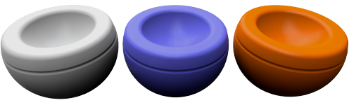

# {: .inline} {{page.title}}
Los materiales de Flamingo se definen mediante una serie de grupos de propiedades. Se trata de tipos de materiales simples de materiales de uso común.  Estos materiales presentan un grupo de controles sencillo. Estos controles facilitan el acceso a las propiedades que hay que cambiar para que un material tenga un aspecto diferente sin la complejidad de los controles avanzados. En la mayoría de materiales simples, cambiar el color es lo único necesario para obtener un aspecto diferente.

#### Tipos de materiales simples:

> {: .inline} [Color sólido](#solid-color)
> {: .inline} [Plástico](#plastic)
> {: .inline} [Metal](#metal)
> {: .inline} [Vidrio](#glass)
> {: .inline} [Brillante](#glossy)
> {: .inline} [ClearFinish](#clearfinish)
> {: .inline}[Texturizado](#flamingo-textured)
> {: .inline}[Conjunto de texturas](#texture-set)

Cualquier material se puede convertir en un material avanzado.  Los materiales avanzados disponen de todos los controles posibles para editar un material en Flamingo nXt.  Para tener el máximo control de un material, utilice los Materiales avanzados o convierta el material existente en un material avanzado.

#### Los materiales avanzados incluyen los siguientes grupos de propiedades:

> [Nombre](material-type-advanced.html#name)
> [Composiciones de material](material-type-advanced.html#procedures)
> [Propiedades de material avanzadas](material-type-advanced.html#advanced-materials-properties)
> [Acabado reflectante](material-type-advanced.html#reflective-finish-and-highlight)
> [Propiedades de transparencia](material-type-advanced.html#transparency)
> [Texturas algorítmicas](material-type-advanced.html#bump-patterns)
> [Texturas bitmap](material-type-advanced.html#textures)
> [Notas](material-type-advanced.html#notes)

Los materiales se guardan en el modelo de Rhino. Los materiales únicos pueden tener el mismo nombre en diferentes modelos de Rhino.

## Color sólido
{: #solid-color}
Los materiales de color sólido solo tienen un [nombre](material-type-advanced.html#name) y un [color](material-type-advanced.html#color).





## Plástico
{: #plastic}
Los materiales de plástico son ligeramente reflectantes con un [brillo](material-type-advanced.html#highlight-color) de color blanco.



 Utilice el Editor avanzado para reemplazar los preajustes de [Color de brillo](material-type-advanced.html#highlight-color), [Intensidad](material-type-advanced.html#intensity), [Fresnel](material-type-advanced.html#fresnel) y [Definición](material-type-advanced.html#sharpness).

## Metal
{: #metal}
Los materiales de metal tienen un brillo del mismo color que el [color](material-type-advanced.html#color). También puede controlar la [Definición](material-type-advanced.html#sharpness) del reflejo.



#### Definición
Controla la definición del brillo. Consulte el tema [Definición](material-type-advanced.html#sharpness) en las propiedades de material avanzadas para obtener más información.

 Utilice el Editor avanzado para reemplazar los preajustes de [Color de brillo](material-type-advanced.html#highlight-color), [Intensidad](material-type-advanced.html#intensity), [Fresnel](material-type-advanced.html#fresnel) y [Tipo](material-type-advanced.html#type).

## Vidrio
{: #glass}
Los materiales de vidrio tienen un [Color](material-type-advanced.html#color) y un [Índice de refracción](advanced-material-properties-main.html#index-of-refraction) (IOR).



#### Índice de refracción
Controla la cantidad de luz que se refracta en el material. Consulte el tema [Índice de Refracción](advanced-material-properties-main.html#index-of-refraction) en las propiedades de material avanzadas para obtener más información.

 Utilice el Editor avanzado para reemplazar los preajustes de [Color de brillo](material-type-advanced.html#highlight-color), [Intensidad](material-type-advanced.html#intensity), [Fresnel](material-type-advanced.html#fresnel), [Definición](material-type-advanced.html#sharpness) y [Transparencia](material-type-advanced.html#transparency).

## Brillante
{: #glossy}
Los materiales brillantes normalmente tienen una [Intensidad](material-type-advanced.html#intensity) de brillo y [Definición](material-type-advanced.html#sharpness) bajas.



#### Intensidad
Controla la intensidad del brillo de las luces en la superficie. Consulte el tema [Intensidad](material-type-advanced.html#intensity) en las propiedades de material avanzadas para obtener más información.

#### Definición del brillo
Controla la definición del brillo de las luces en la superficie. Consulte el tema [Definición del brillo](material-type-advanced.html#sharpness) en las propiedades de material avanzadas para obtener más información.

 Utilice el Editor avanzado para reemplazar los preajustes de [Fresnel](material-type-advanced.html#fresnel) y [Tipo](material-type-advanced.html#type).

## ClearFinish
{: #clearfinish}
El componente ClearFinish es un procedimiento en capas que simula la pintura de coche, porcelana, cerámica, madera barnizada o cualquier otro material que contenga una capa de pintura o de plástico. ClearFinish utiliza la opción [Fresnel](material-type-advanced.html#fresnel) para cambiar el color del material según el ángulo respecto a la vista. Estos materiales suelen ser de color oscuro cuando se mira directamente a la superficie, pero a medida que la superficie se encorva alejándose de la vista, los materiales se vuelven muy brillantes. Un buen ejemplo es la pintura de coches con acabados satinados o laqueados.



 Utilice el Editor avanzado para reemplazar los preajustes de [Color de brillo](material-type-advanced.html#highlight-color), [Intensidad](material-type-advanced.html#intensity), [Fresnel](material-type-advanced.html#fresnel) y [Definición](material-type-advanced.html#sharpness).

## Texturizado de Flamingo
{: #flamingo-textured}
Los materiales texturizados utilizan imágenes para crear colores y patrones. El nombre de la imagen, la resolución, el tamaño de loseta y la intensidad y definición del brillo se controlan desde este material simple.



#### Intensidad
Controla la intensidad del reflejo de espejo de la superficie. Consulte el tema [Intensidad](material-type-advanced.html#intensity) en las propiedades de material avanzadas para obtener más información.

#### Definición
Controla la definición del brillo. Consulte el tema [Definición](material-type-advanced.html#sharpness) en las propiedades de material avanzadas para obtener más información.

#### Imagen
Define el mapa de imagen y las propiedades del material. Aquí hay muchas opciones. Consulte el tema [Imágenes](material-type-advanced.html#texture) de las propiedades de material avanzadas para obtener más información.


 Utilice el Editor avanzado para reemplazar los preajustes de este material.

## Conjunto de texturas
{: #texture-set}

Los materiales de conjunto de texturas son un conjunto de texturas que definen un material. Estos conjuntos de texturas pueden son compatibles con mapas de texturas de terceros que contienen información de mapas de desplazamiento, de normal o de relieve. Los mapas de desplazamiento dan profundidad al material. La combinación de estos mapas de textura en conjunto puede crear materiales muy realistas. [PixPlant](http://www.pixplant.com/) es un programa de software que puede usar un bitmap estándar y crear estos conjuntos de texturas.


#### Anchura y altura
Controla el tamaño de todas las texturas del conjunto.  Utilice este control para que todos los bitmaps tengan el mismo tamaño y estén alineados.

#### Intensidad
Controla la intensidad del reflejo de espejo de la superficie. Consulte el tema [Intensidad](material-type-advanced.html#intensity) en las propiedades de material avanzadas para obtener más información.

#### Definición
Controla la definición del brillo. Consulte el tema [Definición](material-type-advanced.html#sharpness) en las propiedades de material avanzadas para obtener más información.

#### Tipos
Controla el tipo de reflexión en la superficie.  Consulte el tema [Tipo](material-type-advanced.html#type) en las propiedades de material avanzadas para obtener más información.

### Mapas de texturas
En la tabla del Mapa de texturas se mostrarán las texturas que forman parte del conjunto de texturas.  Haga clic con el botón derecho en la tabla para añadir, quitar o cambiar las texturas del conjunto.

#### Agregar mapas...
Utilice este comando del menú con el botón derecho para agregar nuevas texturas a la lista.  Se puede agregar más de una textura a la vez. Si los nombres de textura incluyen sufijos para uno de los tipos de mapeado, el tipo de mapa se agregará automáticamente.  Por ejemplo, si un mapa tiene *-normal* en el nombre, se etiquetará automáticamente como tipo de mapa normal.

#### Quitar mapa
Este comando del botón derecho del ratón quitará un mapa de textura de la tabla.

#### Color
Este tipo de mapeado con el botón derecho del ratón contribuye al color visible de la textura. Para obtener más información, consulte el tema [Tipo de mapeado estándar](material-image-properties.html#standard)

#### Relieve
El mapa de relieve utilizará la escala de grises de la textura para simular un cambiar en la altura o relieve en el material. Para obtener más información, consulte el tema [Mapeado de relieve avanzado](material-image-properties.html#bump)

#### Normal
Los mapas de normal son mapas de relieve especiales que utilizan el canal rojo, verde y azul de los bitmaps para ajustar la dirección relieve en cada píxel. Debido a que el canal azul está en la dirección Z del relieve, las imágenes tendrán un tono azul. Para obtener más información, consulte el tema [Mapeado de normal avanzado](material-image-properties.html#normal).

#### Especular
Un mapa especular utilizará los colores de escala de grises en el material para controlar la cantidad de reflexión en ese punto de la imagen. Para obtener más información, consulte el tema [Mapeado de transparencia avanzado](material-image-properties.html#transparency).

#### Opacidad
Un mapa de opacidad controlará la transparencia de un material en cada píxel en función de la escala de grises de la imagen. Para obtener más información, consulte el tema [Mapeado de normal avanzado](material-image-properties.html#normal).

#### Desplazamiento
Un mapa de desplazamiento desplazará la malla de renderizado en función del color de escala de grises del mapa. Para obtener más información, consulte el tema [Mapeado de fesplazamiento avanzado](material-image-properties.html#displacement).

### Material avanzado
El material [Avanzado de Flamingo](material-type-advanced) contiene un conjunto completo de propiedades de un material de Flamingo.  Si ninguno de estos materiales simples funciona, utilice el material [Avanzado de Flamingo](material-type-advanced) para crear un material y tener la máxima flexibilidad en la creación de materiales.