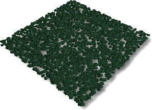
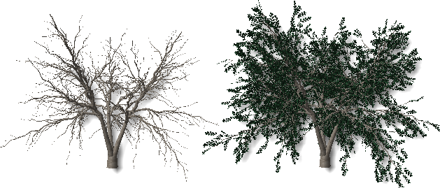

<!-- TODO: This could use an update. But the material is a start.  Let's localize what is here.  We can fill in the details later.-->

# {: .inline} {{page.title}}
{: #tree-editor}

### Desplegable de Archivo

#### Nuevo
Crea una nueva definición de planta basada en una plantilla.

 | {: .inline} | {: .inline} | {: .inline} |
 |:-------------------------------------------:|:-----------------------------------------:|:-------------------------------------:|
 | **Estándar**                                |   **Conífera**                             | **Copa ancha**                       |
 | {: .inline}         | {: .inline} | {: .inline} |
 | **Palmera**                                    |  **Cubresuelos**                          | **Complejo**                                  
{: .plant-table}

#### Abrir
Abre una definición de árbol existente.

#### Guardar
Guarda la definición de árbol actual.

#### Guardar como
Guarda la definición de árbol actual con otro nombre.

### Desplegable de Trazado de rayos
Renderiza la imagen de vista previa.

*Vista predeterminada (izquierda) y trazado de rayos (derecha).*

#### Iniciar
Inicia el renderizado de la imagen de vista previa.

#### Detener
Detiene el renderizado de la imagen de vista previa.

### Desplegable de Vista
Arrastre con el botón izquierdo del ratón para rotar la cámara de la vista alrededor del objetivo.
Arrastre con el botón derecho del ratón para rotar el objetivo alrededor de la cámara.
Mueva la rueda del ratón para ampliar y reducir.

#### Restaurar valores predeterminados
Restaura la vista sombreada predeterminada.

#### Mostrar hojas
Muestra la vista previa del árbol con hojas.

*Sin hojas (izquierda) y con hojas (derecha).*

### Desplegable de Ajustes
Define las unidades en el editor para que coincidan con las unidades de trabajo.