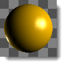
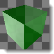

# {{page.title}}
Tanto las imágenes de miniatura de vista previa como el área de fondo entre las imágenes de miniatura tienen menús contextuales.

#### Acciones de vista previa de miniaturas

>Haga clic con el botón derecho y arrastre para cambiar la vista.

Esto no tiene mucho efecto si el objeto de vista previa es una esfera, pero si es un cubo, un cono u otra forma, al rotar la vista o el objeto se mostrará el objeto de vista previa desde diferentes puntos de vista.

>Haga clic con el botón derecho para ver el menú contextual.
>Haga doble clic para mostrar una ventana de vista previa más grande debajo de las miniaturas.
>Haga clic con el botón derecho y arrastre para cambiar la vista.
>Pulse la tecla Ctrl y arrastre para duplicar un material.
>Haga doble clic en la vista previa más grande para abrir una ventana flotante que pueda redimensionarse para obtener una vista previa de mayor resolución.

Esta ventana tiene las mismas funciones que la imagen de vista previa original, incluidos el menú contextual y la posibilidad de arrastrar y colocar en otros materiales u objetos del modelo.

### Geometría

#### Materiales
Los materiales pueden utilizar diferentes tipos de geometría.
 *Esfera*
 *Piramidal*
 *Cúbico*
 *Toroide*
 *Cono*
 *Plano*

#### Entornos
Los entornos solo utilizan el cono y la esfera.
 *Cono y esfera*

#### Texturas
Las texturas se muestran solo como una superficie plana bidimensional frente a la cámara.

#### Tamaño
Define el tamaño de unidad para la miniatura.

### Vista
Controla la rotación del objeto o la cámara con el botón derecho del ratón.

#### Rotar objeto
El arrastre con el botón derecho del ratón rota el objeto.

#### Rotar cámara
El arrastre con el botón derecho del ratón rota la cámara.

#### Ángulo X
Define el ángulo de rotación horizontal del objeto o la cámara.

#### Ángulo Y
Define el ángulo de rotación del objeto o la cámara.

### Fondo
Controla la apariencia del fondo de la miniatura.

#### Ninguna
Se utiliza el entorno gris predeterminado.

#### A cuadros
Se utiliza un fondo gris a cuadros.

#### Personalizado
Se puede utilizar cualquier material o textura como fondo personalizado.

####  **Guardar como predeterminado**
Guarda las propiedades de miniatura como configuración predeterminada.

####  **Cargar de predeterminados**
Carga las propiedades de miniatura como configuración predeterminada.