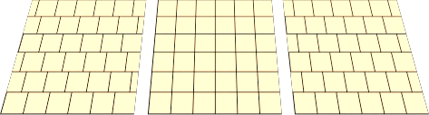
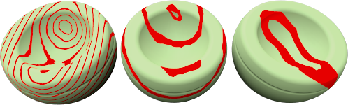
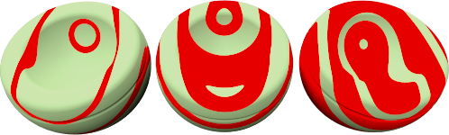

#  {: .inline} {{page.title}}
El árbol de Materiales algorítmicos combina uno o más materiales utilizando un conjunto de reglas para definir la interacción de los materiales. El árbol muestra los componentes que se usan para crear el material y permite añadir otros componentes. Para materiales simples, en la lista solo habrá un componente: Base.

Cada componente combina dos materiales "secundarios" utilizando un método específico. Cada uno de los materiales secundarios puede, a su vez, estar formado por un componente, combinando dos materiales secundarios propios. De este modo, se pueden crear materiales sumamente elaborados a partir de elementos más simples. Los materiales algorítmico para combinar son:

* [Base](#base)
* [Mezcla angular](#angular-blend)
* [Mezcla ](#blend)
* [Mármol](#marble)
* [Granito](#granite)
* [Loseta](#tile)
* [Madera](#wood)

##### Para agregar un material algorítmico
1. Haga clic con el botón derecho en cualquier parte de la ventana Material algorítmico.
1. En el menú, haga clic en un tipo de material algorítmico.

##### Para quitar un material algorítmico
 1. En la ventana Material algorítmico, haga clic con el botón derecho en el nombre del material algorítmico.
 2. En el menú, haga clic en Quitar.

## Base
{: #base}
Este es el material básico simple sin capas. Es el material algorítmico predeterminado.

## Mezcla angular
{: #angular-blend}
Muchos materiales cambian de color, reflexión o transparencia según el ángulo en el que se visualiza el material. El material algorítmico de Mezcla angular mezcla dos materiales según el ángulo de visión respecto a la superficie del objeto.

La Mezcla angular mezcla dos materiales diferentes para crear efectos especiales. Las dos capas del material algorítmico son la capa Interior y Exterior.

#### Interior
Desde 0 grados desde el punto de vista hasta el Angulo inicial, el compomente Interior se mostrará completamente. Considérelo un material base.

#### Exterior
Desde el Ángulo final hasta 90 grados de la vista, el componente Exterior será el único material que se verá. Considérelo un recubrimiento.

#### Ángulo inicial
Ángulo desde el punto de vista donde empieza el material del componente Exterior.

#### Ángulo final
Ángulo desde el punto de vista donde termina el material del componente Exterior.
Entre el Ángulo inicial y el Ángulo final, los componentes Interior y Exterior se mezclan.

En la siguiente ilustración, el Ángulo inicial{: .inline} es de 30 grados (que en el renderizado se traduce al círculo verde de la derecha) y el Ángulo final{: .inline} es de 60 grados (que en el renderizado se traduce al círculo rojo).

La imagen de la derecha muestra el material interior en blanco y el material exterior en negro.

 

* Entre 0 y 30 grados desde el punto de vista, se verá blanco.
* Entre 30 y 60 grados desde el punto de vista, se verá un gradiente de blanco a negro.
* Entre 60 y 90 grados desde el punto de vista, se verá negro.

## Mezcla
{: #blend}
El componente de Mezcla combina dos componentes base y controla las proporciones de cada uno. Todos los materiales de madera de la librería estándar usan una composición Mezcla para cambiar el acabado de la madera desde mate claro hasta brillante oscuro.

Las mezclas son adecuadas para cambiar toda la definición de un material añadiendo un color a un material base estampado.

#### Mezclar
Varía la porcentaje de cada material del componente usado en el material final. Por ejemplo, el material siguiente muestra una mezcla entre el material rayado y el color verde sólido. La imagen de la izquierda muestra el control deslizante hacia la izquierda, con un material rayado y un verde suave.  La imagen central muestra el control deslizante en el medio, con un 50% de rayado intenso y un 50% de color verde mezclados.  La imagen de la izquierda muestra el control deslizante hacia la derecha, con un material rayado suave y un material verde intenso.

#### Usar imagen
Una imagen se puede utilizar para controlar cómo interactúan dos materiales. Cuando se utiliza una imagen bitmap, los valores de escala de grises de los píxeles definen dónde se mezclarán los dos materiales. Utilice un mapa de imagen con escala de grises para mediar entre los componentes primero y segundo. El componente Primero se colocará donde haya negro en el patrón bitmap y el componente Segundo se colocará donde haya blanco.

En la imagen, se utilizan los mismos materiales para los componentes primero y segundo, pero la mezcla se controla mediante tres bitmaps diferentes.

La resolución del bitmap de la máscara influye en la calidad del material. Los bitmaps de más resolución permiten visualizar el material de más cerca sin apreciar problemas en la calidad, pero también usan más memoria.

#### Usar canal alfa
Si la imagen tiene un canal alfa, puede utilizarse en lugar de la escala de grises del bitmap para determinar donde se mezclan los colores.

#### Invertir
El material Primero se colocará donde haya blanco en el patrón bitmap, y el material Segundo se colocará donde haya negro.

#### Mosaico
La escala del material es independiente de la resolución del bitmap usado para definirla. Para escalar el material correctamente, decida el tamaño de área en unidades reales que representa una copia del bitmap. Si el bitmap representa la altura de seis losetas de 4 unidades y la longitud representa doce losetas de 4 unidades, la escala es de 48 unidades en la dirección X, y de 24 unidades en la dirección Y. De este modo se expande el bitmap al tamaño correcto del patrón.

#### Anchura
Anchura en píxeles de una instancia de la imagen.

#### Altura
Altura en píxeles de una instancia de la imagen.

## Granito
{: #granite}
Crea un material 3D con un segundo material incrustado en el componente Base. La composición de granito combina un material base y un material moteado. La composición de granito define la manera en que se combinan los materiales base y moteado. Los componentes de granito se pueden utilizar para una gran variedad de materiales diferentes, como óxido, plástico brillante y otros materiales moteados.

#### Base/Punto
Los componentes Base y Punto son dos materiales. Sus propiedades se especifican del mismo modo que cualquier otro material.



#### Densidad
Fracción de todo el patrón. Aumentar este valor incrementa el tamaño relativo de los puntos.



## Mármol
{: #marble}
Crea trozos alternos de componentes Base y Veta. El material algorítmico de mármol define la manera en la que se combinan los materiales base y veta. Las losas son muy grandes y la orientación del objeto afecta a la forma en que estas se orientan respecto al objeto.

El [mapeado](properties-object.html#mapping) de textura  de los objetos controla la orientación del material en el objeto.

*Sin mapeado de textura (izquierda). Con mapeado de textura (derecha).*

#### Base/Veta
Los componentes Base y Veta son dos materiales. Sus propiedades se especifican del mismo modo que cualquier otro material.


#### Anchura de veta
Modifica el tamaño relativo de las losas. La Anchura de veta es una fracción de distancia de una raya Base a la siguiente. Los valores oscilan entre 0 (cero) para el componente sin Veta y 1 para el componente sin Base.




*Revestimiento (izquierda); normal (derecha).*

## Mosaico
{: #tile}
El mosaico es un material 2D. El [mapeado](properties-object.html#mapping) de textura  de los objetos controla la orientación del material en el objeto. El material Mosaico combina el componente Base y el componente Junta. Cada uno de estos materiales puede incluir también otros materiales.

Es posible escalar el mosaico de manera diferente en cada dirección para obtener efectos especiales. Por ejemplo, utilice un material de mosaico que sea muy largo en una dirección para crear materiales tipo listones.

#### Mosaico
Establece el tamaño total de la loseta. Los tamaños de altura y anchura se pueden configurar de manera independiente.

#### Anchura/Altura
Especifica la anchura y altura del mosaico.


#### Junta
Especifica el tamaño del material de junta.

#### Junta horizontal/Junta vertical
Especifica la anchura y altura del material de junta.

#### Bloquear
Mantiene la relación de aspecto entre los tamaños de junta Horizontal y Vertical.

#### Desfase
Proporciona un desplazamiento horizontal relativo por loseta vertical. Por ejemplo, utilice un valor de desplazamiento de dirección de .60 para desplazar la junta de la loseta. Esto permite modelar materiales como losetas de mármol, sin el efecto de que la totalidad del suelo sea un único bloque de mármol.

#### Variar mosaico
Agrega aleatoriedad al color del material en cada loseta. Así se pueden modelar materiales como ladrillos no uniformes.

#### R/G/B
Modifica los componentes de color rojo, verde y azul.  Esta opción varía ligeramente el material base de cada loseta aleatoriamente.

#### X/Y/Z
Desplaza el material desde su punto de origen para cada loseta aleatoriamente. Puede hacerlo cuando una costura que marca el inicio del material aparezca en un lugar equivocado.

## Madera
{: #wood}
La madera consiste en cilindros concéntricos de componentes alternos Base y Anillo. Las opciones de Madera definen la manera en que se combinan los componentes Base y Anillo.

Utilice este método para crear materiales de madera si los objetos no se visualizan con detalle. Si necesita un material de madera detallado, utilice un [material de textura](material-type-simple.html#textured) para crear la madera.  Si el punto de vista no está cerca de la madera, se puede usar un color sólido para ocupar el lugar de la madera sin sacrificar la calidad de imagen. Esto permite un renderizado más rápido. Una ventaja adicional de usar el material de madera es que en el renderizado de los lados de un objeto, la veta de la madera se verá correctamente. El grano final se mostrará en los extremos y el grano paralelo se mostrará en los lados de un objeto.

#### Base/Anillo
Los componentes Base y Anillo son dos materiales. Sus propiedades se especifican del mismo modo que cualquier otro material.


#### Anchura de anillo
Fracción de la distancia entre una banda Base y la siguiente. Los valores oscilan entre 0 (cero) para el componente sin Anillo y 1 para el componente sin Base.




Revestimiento (izquierda); normal (derecha).