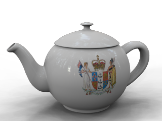

<!-- This is an old page, I am not sure it needs to be updated or translated,  The new Flamingo products used Rhino decals documented in Rhino help. -->

# {{page.title}}
Las calcomanías son mapas de imagen sin mosaico que se aplican directamente a los objetos en lugar de indirectamente utilizando un material. Utilice calcomanías para modificar una parte limitada del color de un objeto, reflectividad o relieves.
Las calcomanías están formadas por una sola imagen, en lugar de repetirse en varias direcciones como cuando se usan en una [definición de material](materials-tab.html).
Las calcomanías se usan principalmente para:

>Colgar obras de arte en paredes interiores.
>Colocar etiquetas o logotipos sobre productos.
>Añadir símbolos o carteles en el modelo.
>Crear ventanas de vidrio de colores.

 **Nota:** Las previsualizaciones de las calcomanías sólo se mostrarán en las vistas alámbricas si el OpenGL está activado para el modo alámbrico. La opción de **Canal de visualización** debe ser **OpenGL** en **Opciones** > **Vista**  > **Modos de visualización** > **Estructura alámbrica** > **Otras opciones**  > **Asignación de canal de visualización**.

## Colocación de calcomanías
{: #decal-list}
{: #decal-placement}

###  **Añadir**
{: #add-decal}
1. Seleccione uno o más objetos.
1. En el menú **Edición**, haga clic en **Propiedades de objeto**.
1. En la lista **Propiedades**, haga clic en **Calcomanías de Flamingo nXt**.
1. Haga clic en el botón Agregar.
1. En el cuadro de diálogo **Abrir bitmap**, seleccione un nombre de bitmap y haga clic en **Abrir**.
1. En el cuadro de diálogo **Propiedades de calcomanía** seleccione opciones y haga clic en **Colocar**.
1. Cuando le solicite puntos, designe puntos en el modelo para localizar la calcomanía.
La secuencia precisa depende del tipo de calcomanía seleccionado: [Plana](#decal-planarmapping), [Cilíndrica](#decal-cylindricalmapping) o [MapaUV](#decal-uvmapping).

###  **Editar colocación**
{: #decal-edit-placement}
1. Haga clic en el botón **Editar colocación**.
1. Cuando le solicite **Seleccione un punto de control**, utilice el editor gráfico para cambiar la posición de la calcomanía.
1. Pulse **Intro** cuando termine.

###  **Propiedades**
{: #decal-properties}
1. Haga clic en el botón Propiedades.
1. En el cuadro de diálogo **Propiedades de calcomanía**, utilice las opciones para cambiar las características de la calcomanía.

###  **Eliminar**
{: #decal-delete}

>Haga clic en el botón **Eliminar**.

###  **Subir** / **Bajar**
{: #decal-movedown}
{: #decal-moveup}
Cuando se aplican muchas calcomanías superpuestas a un solo objeto, es importante el orden en que se aplican. Las calcomanías se aplican en el orden en que aparecen en la lista. La última calcomanía de la lista aparece en la parte superior.

>Haga clic en **Subir** o **Bajar** para cambiar la posición de una calcomanía en la lista.

##### Para colocar una calcomanía plana
1. Cuando se lo solicite, seleccione las posiciones para la dirección de la **Anchura** y la **Altura**.
1. Cuando le solicite Seleccione un punto de control..., seleccione un punto de control para ajustar el tamaño, la rotación o la posición de la imagen.
O bien, pulse **Intro** para completar la colocación de la calcomanía.

### Opciones

#### Mover
Mueve la calcomanía. Cuando le solicite Punto desde el que mover y Punto al que mover, introduzca las posiciones como para el comando Mover de Rhino.

#### UsarRelaciónDeAspectoDeImagen
Restaura el tamaño original del bitmap de una calcomanía estirada.

##### Para colocar una calcomanía cilíndrica
1. Cuando se lo solicite, seleccione una posición para el Punto central cilindro.
1. Cuando le solicite Seleccione un punto de control..., seleccione un punto de control para ajustar el tamaño, la rotación o la posición de la imagen.
O bien, pulse **Intro** para completar la colocación de la calcomanía.

## Defina o edite la colocación de la calcomanía utilizando el cuadro de control
Nota: Si está utilizando el mapeado plano en un objeto curvado, todo el bitmap debe estar situado detrás de la superficie del objeto. Las partes del bitmap que estén delante de la superficie no serán visibles.

#### Para cambiar el tamaño de la anchura y la altura al mismo tiempo

>Arrastre los puntos de control en las esquinas del cuadro de control.

#### Para cambiar la altura de la calcomanía

>Arrastre el punto de control central de los bordes centrales superiores e inferiores del cuadro de control.

#### Para cambiar la anchura de la calcomanía

>Arrastre el punto de control central de los bordes de la izquierda y la derecha del cuadro de control.

#### Para mover la calcomanía

>Arrastre el punto de control central del cuadro de control.

#### Para rotar la calcomanía

>Arrastre el punto de control del eje X, Y o Z en el icono del eje del widget.

## Propiedades de calcomanía
{: #dialogbox-editdecal}
La información del bitmap reemplaza o mezcla el color del objeto con el color de la calcomanía. Éste es el uso más común de las calcomanías.

## Proyección
{: #projection}
El estilo de mapeado determina cómo proyectar la calcomanía sobre el objeto. Es conveniente dibujar líneas de construcción en la escena para ayudar a colocar las calcomanías con precisión. Un rectángulo dibujado justo detrás de una superficie puede actuar como guía para una calcomanía estándar. Utilice las referencias a objetos para colocar la calcomanía con precisión.

### Cilíndrico
{: #decal-cylindricalmapping}
El mapeado cilíndrico es útil para colocar calcomanías en objetos que se curvan hacia una dirección, como las etiquetas en botellas de vino.
La proyección cilíndrica mapea el bitmap sobre el cilindro con el eje vertical del bitmap a lo largo del eje del cilindro, y el eje horizontal se curva alrededor del cilindro, como en una etiqueta de vino.

### Plana
{: #decal-planarmapping}
El mapeado plano es el estilo de mapeado más común. Es apropiado al mapear objetos planos o suavemente curvados.
Las esquinas definen la ubicación del bitmap y la extensión. Si el rectángulo no tiene las mismas proporciones que su bitmap, el bitmap se estirará o comprimirá para ajustarse al rectángulo.
Si está utilizando el mapeado plano en un objeto curvado, toda la proyección bitmap debe estar situada detrás de la superficie del objeto. Las partes del bitmap que estén delante de la superficie no serán visibles.

### Mapa UV
{: #decal-uvmapping}
Las calcomanías que usan el mapeado UV sirven para objetos como el cabello y la corteza de un árbol, por ejemplo, donde es necesario que la calcomanía se mueva y se estire para ajustarse a la superficie.
La calcomanía cubre todo el objeto, no hay control sobre la colocación de la calcomanía.
El mapeado UV utiliza la parametrización U y V de la superficie para curvar y estirar la imagen.

### Examinar
{: #file-browse}
Cambia el archivo de imagen.



## Intensidad
{: #decalmappingstrength}

### Color
{: #decal-color}
Varía la fuerza relativa del color de la imagen con respecto al material subyacente. Consulte también [Propiedades de textura de material, Intensidad de color](texture-properties-main.html#color).

### Relieve
{: #decalmappingbump}
Los mapas de relieve crean sombras simuladas y brillos en la superficie. Consulte también [Propiedades de textura de material, Intensidad de relieve](texture-properties-main.html#bump).

## Acabado reflectante
{: #reflective-finish-and-highlight}
Controla las mismas propiedades que controla una definición de material. Aplique estas propiedades en áreas específicas del objeto influenciadas por la calcomanía. Por defecto, las calcomanías tienen un acabado mate.

### Intensidad
Ajusta la intensidad del brillo. Los valores más altos aumentan el tamaño y la fuerza del brillo. Consulte [Propiedades de material avanzadas, Intensidad](advanced-material-properties-main.html#intensity).

### Definición
Determina el tamaño del brillo. Los valores más bajos especifican una iluminación más amplia; los valores más altos focalizan la iluminación en una área más reducida. Consulte [Propiedades de material avanzadas, Definición](advanced-material-properties-main.html#sharpness).

### Metálico
Define el color del brillo igual que el color base. Consulte [Propiedades de material avanzadas: Metálico](advanced-material-properties-main.html#metallic).


## Avanzada
{: #advanced}

### Doble cara
{: #double}
Hace que la calcomanía aparezca tanto en la cara dorsal de la superficie en la que está colocada como en la cara frontal.

### Reflejar
{: #mirror}
Espejos la imagen de calcomanía.

## Dirección de proyección
{: #projection-direction}

### Detrás
Proyecta la calcomanía detrás de la imagen de calcomanía.
Frontal (izquierda), Posterior (derecha).

### Delante
Proyecta la calcomanía delante de la imagen de calcomanía.
Frontal (izquierda), Posterior (derecha).

### Delante y detrás
Proyecta la calcomanía en la parte frontal y posterior de la imagen de calcomanía.
Frontal (izquierda), Posterior (derecha).

### Transparencia
Define el nivel de transparencia para el área con máscara. Consulte [Transparencia](advanced-material-properties-transparency.html).
IOR
Define el índice de refracción de la calcomanía transparente. Consulte [Índice de refracción](advanced-material-properties-transparency.html#index-of-refraction)