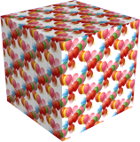

#  {: .inline} {{page.title}}
Las propiedades de objeto de Flamingo nXt sólo afectan al modo en que se renderizan los objetos en Flamingo nXt.

### {: .inline} Origen del material
{: #material-source}
Un material se puede asignar a capas, bloques y objetos.  Para obtener información sobre la asignación de materiales, consulte el tema [Asignaciones de materiales](material_assignment.html). Si el material está definido PorObjeto, las propiedades del material también se muestran en este diálogo.  Para obtener más información sobre cómo editar un material, consulte [Propiedades de material](material-type-simple.html).

### {: .inline} Mapeado de texturas
{: #texture-mapping}
El mapeado controla cómo se coloca (mapea) el material en un objeto en particular. El método utilizado para asignar un material a una capa o a un objeto no afecta al mapeado. Para materiales que no tienen patrón, normalmente no es necesario controlar el mapeado. Utilice el mapeado cuando el material sea direccional o tenga un patrón evidente. Incluso en estos casos, el mapeado predeterminado puede ser adecuado. El mapeado permanece en el objeto y se ajusta a él si se mueve, rota o escala. Para obtener más información sobre los tipos de mapeado, consulte el tema [Mapeado de texturas](http://docs.mcneel.com/rhino/5/help/en-us/index.htm#properties/texturemapping.htm).

 
*Dos direcciones de mapeado diferentes*

### {: .inline} Calcomanías
{: #decals}
Las calcomanías son mapas de imagen sin mosaico que se aplican directamente a los objetos en lugar de indirectamente utilizando un material. Utilice calcomanías para modificar una parte limitada del color de un objeto, reflectividad o relieves. Consulte [Calcomanías de Rhino](http://docs.mcneel.com/rhino/5/help/es-es/index.htm#properties/decal.htm) para obtener información sobre cómo crear y colocar calcomanías.

 
 
*Cuatro ejemplos de calcomanías diferentes*

### {: .inline} Mallas personalizadas
{: #custom-meshes}
Algunos modificadores de malla personalizadas se pueden utilizar en Rhino en modelos renderizados con detalles. Utilice estos modificadores para redondear bordes, añadir líneas de cierre de paneles y crear cables desde curvas.

Para obtener más información, consulte los temas siguientes:

* [Suavizado de bordes](http://docs.mcneel.com/rhino/5/help/es-es/index.htm#commands/applyedgesoftening.htm)
* [Tubería de curvas](http://docs.mcneel.com/rhino/5/help/es-es/index.htm#commands/applycurvepiping.htm)
* [Línea de cierre](http://docs.mcneel.com/rhino/5/help/es-es/index.htm#commands/applyshutlining.htm)
* [Desplazamiento](http://docs.mcneel.com/rhino/5/help/en-us/index.htm#commands/applydisplacement.htm)

### {: .inline} Propiedades de Flamingo
{: #flamingo-properties}

#### Canal alfa
{: #alpha-channel}
Hace el objeto invisible. Las sombras proyectadas por y sobre el objeto se renderizan. La imagen puede superponerse sobre otra imagen y las sombras se muestran en la imagen compuesta.

En el ejemplo anterior, se crearon algunas superficies planas simples que coinciden con la imagen para capturar las sombras proyectadas por los árboles sobre el edificio. Los planos fueron etiquetados con la propiedad de Canal alfa, de modo que cuando se renderizaron eran invisibles, pero seguían mostrando las sombras. Posteriormente, esta imagen parcialmente transparente se superpuso en la imagen.

#### Cáustica
{: #caustics}
Se trata de los rayos de luz reflejados o refractados por un objeto curvado o la proyección de esos rayos en otra superficie. La cáustica debe usarse en situaciones muy específicas. La cáustica solo se renderiza con el motor [Path Tracer](render-tab.html#path-tracer) o con el motor de renderizado [Híbrido](render-tab.html#hybrid).  Los cálculos de cáustica tardan muchos pases para converger. Véase el [artículo de Wikipedia: Cáustica (óptica)](https://es.wikipedia.org/wiki/C%C3%A1ustica_(%C3%B3ptica)) para obtener más información.

*Cáustica producida por un vaso de agua.*

*Sin cáustica (izquierda) y con cáustica (derecha).*

#### Delgado
{: #thin}
Un objeto transparente que encierra un espacio se trata normalmente como un sólido para la refracción transparente. Si se selecciona la propiedad Delgado, cada superficie será tratada como un objeto de dos caras para la refracción. Esta opción debe usarse si se utilizan superficies como el vidrio en modelos arquitectónicos.

 
*Modelo de Rhino base (izquierda), normal (medio) y delgado (derecha).*

#### Entrada de luz diurna
{: #daylight-portal}
Una entrada de luz diurna es una abertura por donde pasa la [luz de sol y cielo](lighting-tab.html#interior-daylight) en un renderizado de interior. Una entrada de luz diurna permite entrar la luz del sol, el cielo y la tierra en un espacio interior de un modo natural. Las entradas de luz diurna sólo tienen efecto cuando el [Sol](sun-and-sky-tabs.html#sun) está activado. Cuando el esquema de iluminación seleccionado es [Luz diurna interior](lighting-tab.html#interior-daylight), todas las superficies transparentes hacen de entradas de luz diurna automáticamente. Cuando el esquema de iluminación se ajusta a la Iluminación de estudio o Luz diurna exterior y desea que entre luz exterior de sol y cielo en un espacio interior, debe etiquetar manualmente las ventanas como entradas de luz diurna.

*Con entrada de luz diurna (izquierda), sin entrada de luz diurna (derecha).*