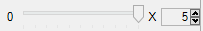

---
---

# {:height="75px" width="75px"} Canales
{: #channel}
Una función muy útil en Flamingo nXt 5 es la posibilidad de definir luces en uno de los ocho canales. Cada fuente de luz del dibujo, incluidos el sol y el cielo, se puede asignar a un canal. En el momento del renderizado, la luz de cada canal se coloca en su propia capa.  Cuando el renderizado termina, se puede ajustar la intensidad de los canales.  El cambio es en tiempo real sin la necesidad de volver a renderizar.  

Los canales son muy efectivos cuando:

* Se intenta equilibrar el entorno HDRI y la luz solar.  No todos los entornos HDRI están calibrados.  Es útil definir el cielo HDRi en un canal y el sol en otro. Luego ajuste la intensidad relativa de la luz cenital y frente a la del sol después del renderizado.
* Los renderizados de estudio utilizan una configuración de iluminación de fondo y relleno. Defina cada luz en un canal diferente y luego ajuste la intensidad en tiempo real en el renderizado utilizando los canales.
* Se utilizan diferentes bancos de luces en un renderizado exterior o interior.  Cada banco de luces se puede definir en un canal y tener su propio regulador para controlar la intensidad.
* Se renderiza con todas las luces activadas, y luego se desactivan y desactivan determinadas luces. No es necesario renderizar un interior para crear un renderizado nocturno y diurno.

Una vez que la imagen se renderiza, cada canal se puede escalar individualmente en la ventana de renderizado antes de guardar o se puede exportar como archivo .nXtImage para su posterior edición.

Utilice los canales para ajustar la intensidad de las luces entre sí, para no iluminar demasiado toda la imagen.  Si necesita iluminar toda la imagen a la vez, utilice los controles de Ajustar imagen.

<!-- TODO: Find original video clip.It is probably best to embed it from Vimeo.-->
Haga clic para reproducir el videoclip.
<!-- TODO: Is this supposed to link to a video? -->

Las siguientes condiciones son necesarias para producir y manipular una imagen de varios canales:

 1. Todas las luces participantes deben estar activadas.
 2. Cada fuente de luz debe estar asignada a un canal. De manera predeterminada, el sol y el cielo tienen asignados el canal 0, mientras que las luces artificiales, el canal 1.
 3. Inmediatamente después de renderizar, utilice el los controles de Canal en la ventana de renderizado.
 3. El único formato guardado que mantiene esta información de canal es el formato. nXtImage. La iluminación puede ajustarse ahí y luego se puede guardar la imagen en formato bitmap.

## Configuración de canales
{: setting}
El primer paso en configurar un renderizado multicanal es definir cada luz en un canal. Normalmente, el número de canal se define en cada propiedad luz.  Para obtener información sobre cómo definir luces específicas en un canal, consulte:

>[Canal de sol](sun-and-sky-tabs.html#sun-channel)
>[Canal de cielo](sun-and-sky-tabs.html#sky-channel)
>[Canal de luz artificial](lights-tab.html#channel)
>[Brillo de material](documentproperties-flamingo.html#channel)

En el mismo canal de luces se puede agrupar cualquier número de luces.  El ajuste de canal es un multiplicador. Las luces del mismo canal mantendrán sus intensidades relativas entre sí mientras se ajustan.

## Ajuste de canales
{: adjusting}
Los canales de iluminación se pueden ajustar inmediatamente después del renderizado o en el Editor de imágenes de Flamingo si el renderizado se guarda como archivo nXtImage.  Los canales se pueden ajustar mientras Flamingo continúa con renderizando, pero es recomendable detener el renderizado antes de realizar ajustes más importantes.

#### ¿Dónde se encuentra el control de iluminación de Flamingo?
Los controles del canal se encuentran en la ficha Flamingo nXt de la [ventana de renderizado](render-window.html), en Canales.

Hay ocho controles de canal, del 0 al 7. Solo se activarán los canales que tienen luces activadas.

Cada canal tiene un control deslizante y un control numérico. El control numérico representa el valor máximo del control deslizante. Si el control deslizante se encuentra en el extremo derecho, el valor total se usa para multiplicar las cantidades de luz en ese canal.  El control deslizante al 50% multiplicará toda la iluminación de la capa de ese canal por la mitad de la cantidad del control deslizante.  Si el control deslizante se encuentra en el extremo izquierdo, se desactivará toda la luz en ese canal.

El valor del control numérico puede ser muy importante. Puesto que el sol y el cielo pueden ser mucho más brillantes que las luces artificiales, es posible que el valor del control numérico en luces artificiales deba aumentarse a 20 o 50 para ver alguna diferencia.

Después de ajustar los canales correctamente, guarde la imagen como archivo JPG o PNG para el renderizado final.