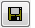
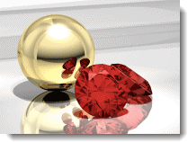

---
---

<!-- TODO: This is a combination of the old information here and the Rhino render Windows.  These two still need to be combined. -->

# Ventana de renderizado
La ventana de renderizado proporciona opciones para el ajuste de exposición y los efectos de postprocesamiento. La ventana principal de renderizado de Rhino forma parte del sistema de renderizado de Rhino.  Para obtener más información sobre los menús y los iconos de renderizado, consulte el tema [Ventanas de renderizado](http://docs.mcneel.com/rhino/5/help/es-es/index.htm#information/renderwindowpostprocess.htm) de la ayuda de Rhino.

### Menús desplegables
Para obtener más información sobre los menús y los iconos de renderizado, consulte el tema [Ventanas de renderizado](http://docs.mcneel.com/rhino/5/help/es-es/index.htm#information/renderwindowpostprocess.htm) de la ayuda de Rhino.

### Barras de herramientas

### Guardar con canal alfa de fondo
{: #save-with-alpha-channel}
Guarda la imagen como PNG, TIF y BMP de 32 bits con el fondo de canal alfa. Las versiones de canal alfa de los formatos de archivo se utilizan para la composición de alta calidad. Los fondos aparecerán en negro cuando el renderizado se guarde con canal alfa.

### Exportar a archivo nativo de Flamingo nXt (.nXtImage)
{: #export-to-nxtimage}
Guarda la luminancia descomprimida y la información del color. Guarda todos los canales renderizados, incluido el canal [alfa](environment-tab.html#alpha). Los archivos nXtImage pueden abrirse en el [Editor de imágenes](image-editor.html) donde se puede aplicar [exposición](#adjust-image) y [postefectos](#effects), y la imagen se puede volver a guardar en otro formato bitmap.
El formato. nXtImage es el formato de imagen nativo de los renderizadores de nXt. Es el formato recomendado para almacenar los renderizados, ya que conserva gran parte de la información de renderizado. Las imágenes almacenadas en este formato se pueden manipular en el [Editor de imágenes de nXt](image-editor.html) y se pueden agregar efectos especiales. Desde este editor, puede guardar en muchos de los formatos estándar conocidos, incluidos todos los formatos compatibles con nXt. También puede guardar al formato [Archivo EPix de Piranesi (.epx)](http://www.piranesi.co.uk/).

### Exportar a archivo HDR
{: #export-to-hdr}
Guarda la luminancia descomprimida y la información del color. El formato .HDR almacena datos de luminancia directamente en un formato de alto rango dinámico. Los fondos sin luminancia, como las fotografías normales, se verán de color negro cuando se guarden en uno de estos formatos.

### Exportar a archivo EXR
{: #export-to-exr}
EXR es un formato para archivos de imagen de alto rango dinámico, publicado como estándar abierto con un conjunto de herramientas de software creadas por Industrial Light and Magic (ILM) y bajo licencia de software libre. Este formato de archivo admite valores de punto flotante (media precisión) de 16 bits por canal con un bit de signo, cinco bits de exponente y un significante de diez bits. Esto permite un rango dinámico de más de treinta paradas por exposición. Véase: [Artículo de Wikipedia: OpenEXR](http://en.wikipedia.org/wiki/OpenEXR).
El formato EXR almacena datos de luminancia directamente en un formato de alto rango dinámico. Los fondos sin luminancia, como las fotografías normales, se verán de color negro cuando se guarden en uno de estos formatos.

## Salir
Cierra la ventana de renderizado.

##  [Ventana de renderizado de ficha Flamingo](render-window.html#help)

## Progreso
{: #progress}

### Acción

### Pase

### Línea de escaneado

### Tiempo transcurrido

### Rayos / segundo

### Píxeles / segundo

## Restricciones de renderizado
{: #number-of-passes}
{: #time}
{: #render-constraints}

## Ajustar imagen
{: #adjust-image}
Las opciones que controlan la visualización en pantalla también controlan cualquier archivo de imagen creado a partir de esa visualización. De un sólo renderizado pueden guardarse varios archivos de imagen con diferentes ajustes de exposición. Los ajustes de exposición de una imagen renderizada se aplicarán a la siguiente.
Este proceso de ajuste se denomina *mapeo de tonos.* El mapeo de tonos es el proceso de convertir los datos de luminancia utilizados por Flamingo nXt en píxeles de rojo, verde y azul (RGB) que se pueden visualizar o imprimir.

### Brillo
{: #brightness}
Ajusta el brillo global de la imagen. Por ejemplo, si una superficie blanca del modelo se renderiza en gris, puede aumentar el brillo hasta que la superficie parezca blanca. O bien, si la escena exterior parece sobreexpuesta, puede disminuir el brillo hasta que la escena sea más correcta.

*Brillo predeterminado (izquierda) y aumentado.*

### Sobreexposición
{: #burn}
Ajusta el punto blanco de la imagen. Se trata del color blanco más brillane de la imagen. La sobreexposición aporta dramatismo, dinamismo y definición al renderizado agregando más zonas de blanco para contrastar con las zonas oscuras.
Véase el [artículo de Wikipedia: White point](http://en.wikipedia.org/wiki/White_point).

*Sobreexposición predeterminada (izquierda) y aumentada.*

### Saturación
{: #saturation}
La saturación controla la cantidad de color de una imagen. Una saturación de 0.00 dará como resultado una imagen en escala de grises. Con valores superiores a 1.00, los colores son más intensos.

*Saturación predeterminada (izquierda) y aumentada a un valor de 3 (derecha).*

### Histograma
{: #histogram}
Muestra gráficamente la distribución de las áreas claras y oscuras en la imagen.
Véase: [Artículo de Wikipedia: Histograma](https://es.wikipedia.org/wiki/Histograma). Internet tiene muchos artículos sobre el uso de histogramas para evaluar la exposición en fotografía digital. Los principios son los mismos que para el renderizado.

*Histograma.*

#### Opciones de histograma

>Haga clic con el botón derecho en la imagen de histograma para ver las opciones

#### Ajustar

#### Mediana

#### Media

#### Mostrar gráfico ordenado

#### Mostrar escala

#### Color de gráfico

#### Mostrar valores de luminancia

### Bloquear exposición
{: #lock-exposure}
Cuando se bloquean los ajustes de exposición, cambiar la iluminación no ajustará la exposición para compensar.

## Información
{: #information}

### Resolución
Muestra la [resolución de renderizado](render-tab.html#resolution).

### Caras
Muestra el número de caras de malla que se utilizan para renderizar el modelo.

### Caras aparentes
Cuando hay bloques en el modelo, Flamingo nXt puede utilizar la definición de bloque para renderizar instancias de bloque sin remallar cada instancia. Las **Caras aparentes** muestran cuántas caras temporales adicionales se generan.

## Información de píxeles
Punto de ventana
Punto de imagen
Y-arriba de imagen
Color de píxel
Luminancia
Distancia

## Información de iluminación

###  [Preajustes](lighting-tab.html)

###  [Sol](sun-and-sky-tabs.html#sun)

###  [Cielo](sun-and-sky-tabs.html#sky)

###  [Luces](lights-tab.html)

###  [Indirecta](lighting-advanced-tab.html#indirect)

###  [Activar/Desactivar ambiente](lighting-advanced-tab.html#ambient)

## Canales
{: #channels}
Muestra el estado de los canales de iluminación.

## Efectos
{: #post-process-effects}
{: #effects}
Los efectos de postprocesamiento se aplican después de renderizar la imagen. Pueden activarse, desactivarse y reordenarse en la lista. Cada efecto tiene sus propias opciones.

## Opciones de efectos
Estas opciones también están disponibles desde el menú contextual.

>Haga clic con el botón derecho en un efecto para ver el menú contextual.

Alterna el estado de activado/desactivado del efecto seleccionado.
Sube el efecto seleccionado un nivel en la lista.
Baja el efecto seleccionado un nivel en la lista.
Propiedades de efecto seleccionado.
Guarda la lista de efectos actuales y las propiedades como predeterminados.
Guardar los efectos actuales como lista guardada.
Importar lista de efectos guardados.

## Profundidad de campo
{: #postprocessingdof}
El efecto de Profundidad de campo desenfoca la imagen según la distancia desde la cámara.

## Propiedades de profundidad de campo
{: #depth-of-field-properties}

### Propiedades visuales
{: #dofvisualproperties}

#### Intensidad de desenfoque
{: #dofblurringstrength}
Determina la cantidad de desenfoque. Es un valor arbitrario y los valores diferentes funcionan mejor con imágenes diferentes.

#### Desenfoque máx
{: #dofmaxblurring}
Determina el radio máximo de desenfoque máximo utilizado. Puesto que las áreas muy desenfocadas hacen que el efecto sea lento, esta opción limita el efecto.

### Área de efecto
{: #dofareaofeffect}

#### Distancia focal
{: #dofocaldistance}
Especifica la distancia desde la cámara en la que la imagen está enfocada (no desenfocada).

#### Designar
Designe una ubicación en la imagen para definir la distancia focal.

#### Fondo desenfocado
{: #dofblurbackground}
Determina si el fondo está desenfocado. El fondo se desenfocará al máximo.

## Niebla
{: #postprocessingfog}
El efecto de niebla añade color que depende de la profundidad en la imagen. Este efecto se puede utilizar para añadir un efecto de niebla densa o un sutil matiz de profundidad.

*Sin efectos de postprocesamiento.*

### Niebla como fondo gradiente
La niebla se puede utilizar para un fondo gradiente.
En este caso, las opciones para crear el fondo son las siguientes:
Intensidad = 1Ruido = .1Color de niebla =NegroDistancia final = aproximadamente 110Distancia inicial = aproximadamente 90Fondo de niebla = ActivadoCalado = 80

*Niebla como fondo gradiente.*

## Propiedades de niebla
{: #fogsettings}

### Propiedades visuales
{: #fogvisualproperties}
Determina la apariencia del efecto de niebla.

#### Intensidad
{: #fogstrength}
Determina la cantidad máxima de niebla. Un valor de Intensidad de 0.0 desactiva el efecto; un valor de Intensidad de 1.0 representa la cantidad total de niebla. Se pueden utilizar valores superiores a 1.0, pero sólo tienen sentido cuando se usan con el **Ruido**.

#### Ruido
{: #fognoise}
Añade una variación aleatoria de **Intensidad** de niebla.

#### Color
{: #fogcolor}
Especifica el color de la niebla.

>Haga clic en la muestra de color para seleccionar un color en el cuadro de diálogo [Seleccionar color](select-color.html).
>Haga clic en el botón **Designar** para seleccionar el color de la imagen renderizada.

### Área de efecto
Determina el área que abarca el efecto de niebla.

#### Distancia inicial
{: #fogstartdistance}
Especifica la distancia desde la cámara en la que se alcanza el máximo nivel de nubosidad.

>Haga clic en el botón **Designar** para designar la profundidad de la imagen renderizada.

#### Distancia final
{: #fogenddistance}
Especifica la distancia desde la cámara en la que se alcanza el máximo nivel de nubosidad.

>Haga clic en el botón **Designar** para designar la profundidad de la imagen renderizada.

### Contornos (izquierda, derecha, superior, inferior)
{: #fogbounds}
Especifica el área en que la imagen se verá afectada por la niebla. Puede usarse para crear un efecto de niebla baja.
Haga clic en el botón **Designar área** para designar el contorno de la imagen renderizada.

### Niebla

#### Fondo de niebla
Determina si la imagen de fondo también tiene que tener niebla. El fondo tendrá niebla con una intensidad máxima.

#### Calado
{: #fogfeathering}
Determina el número de píxeles fuera del área de contorno para aumentar progresivamente la niebla.

### Vista previa
Previsualiza el efecto en la imagen cuando se cambian los valores.

## Resplandor
{: #postprocessingglare}
El resplandor y el brillo son muy similares. Mientras que el brillo utiliza un color seleccionado, el resplandor usa el color blanco. El resplandor hace que las partes más brillantes de la imagen se iluminen intensamente. Hace más brillante la zona que rodea el área más iluminada. Este efecto sutil se usa normalmente para escenas nocturnas donde las luces parecerán más realistas.

*Resplandor desactivado (izquierda) y activado (derecha).*

## Propiedades de resplandor
{: #glaresettings}

### Límite de blanco
{: #glarewhitepointbound}
Determina dónde empezará el resplandor en la gama tonal. El valor se representa en el histograma y se puede ajustar gráficamente. Los píxeles más claros que el **Límite de blanco** (ya sea en luminancia o el valor de escala de grises) resplandecerán.

### Tamaño de reflejo
{: #glaresize}
Radio del resplandor alrededor del píxel brillante.

### Ganancia
{: #glaregain}
Multiplicador para la luminosidad del resplandor. El valor predeterminado de 1.0 produce efectos normales de resplandor. Utilice valores más elevados para obtener un resplandor intenso.

### Usar información fotométrica
{: #glareusephotometric}
Cuando se utiliza la información fotométrica, la cantidad de reflejo se controla aumentando el nivel de blanco del píxel. Por otra parte, el efecto utiliza los píxeles más blancos de la imagen.

### Histograma
{: #glarehistogram}
Muestra gráficamente la distribución de las áreas claras y oscuras.

#### Opciones de histograma

>Haga clic con el botón derecho en la imagen de histograma para ver las opciones

#### Ajustar

#### Mediana

#### Media

#### Mostrar gráfico ordenado

### Vista previa
Previsualiza el efecto en la imagen cuando se cambian los valores.

## Brillo
{: #postprocessingglow}
El efecto de brillo produce un área brillante alrededor de colores específicos. Se puede utilizar para hacer que las luces de colores o los objetos tipo fluorescentes emitan una luz intensa. Seleccione hasta 10 colores para que repercutan en la imagen.
En la imagen, un rojo color del rubí se utiliza con la ganancia configurada para que el color se acerque al blanco.

*Brillo destellante.*

*Brillo desactivado (izquierda) y activado (derecha).*

## Propiedades de brillo
{: #glowsettings}

### Activar
Activa el brillo del color correspondiente.

### Color
{: #glowcolor}
Especifica el color del brillo.

>Haga clic en la muestra de color para seleccionar un color en el cuadro de diálogo [Seleccionar color](select-color.html).
>Haga clic en el botón **Designar** para seleccionar el color de la imagen renderizada.

### Sensibilidad
{: #glowsensitivity}
Controla la variación que se permite en el color seleccionado cuando se calcula el brillo en los píxeles cercanos a ese color.

### Tamaño de brillo
{: #glowsize}
Radio del brillo alrededor del píxel brillante.

### Ganancia
{: #glowgain}
Multiplicador para la luminosidad del brillo. El valor predeterminado de 1.0 produce efectos normales de brillo. Utilice valores más elevados para obtener un brillo intenso.

### Vista previa
Previsualiza el efecto en la imagen cuando se cambian los valores.

## Estructura alámbrica y texto
{: #postprocessingwireframe}
Superpone curvas, texto, cotas, isocurvas, bordes de malla y objetos de punto en la imagen renderizada.

*Con (izquierda) y sin (derecha) estructura alámbrica y texto.*

## Propiedades de estructura alámbrica y texto

### Curvas
Muestra las curvas.

### Cotas y texto
Muestra las cotas y los objetos de texto.

### Curvas isoparamétricas
Muestra las curvas isoparamétricas de superficie.

### Bordes de malla
Muestra los bordes de malla.

### Puntos
Muestra los objetos de puntos.

### Vista previa
Previsualiza el efecto en la imagen cuando se cambian los valores.