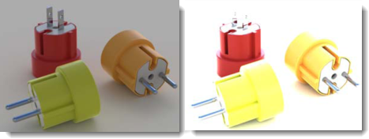

# {: .inline} {{page.title}}
La ventana de renderizado proporciona opciones para el ajuste de exposición y los efectos de postprocesamiento. La ventana principal de renderizado de Rhino forma parte del sistema de renderizado de Rhino.  Para obtener más información sobre los menús y los iconos de la ventana de renderizado, consulte el tema [Ventanas de renderizado](http://docs.mcneel.com/rhino/5/help/es-es/commands/render.htm).  Este tema trata sobre acciones específicas de Flamingo en el proceso de renderizado.

## Gestionar un renderizado activo
Cuando se inicia el renderizado, se abre la [Ventana de renderizado](http://docs.mcneel.com/rhino/5/help/es-es/commands/render.htm) y empieza el renderizado.  Flamingo es un sistema de múltiples pases que actualiza la imagen renderizada en etapas. Flamingo busca primero cualquier cambio en el modelo interno y luego empieza un proceso de inicialización.  Este proceso puede tardar unos segundos o unos minutos.  En este momento se importa el modelo, los bitmaps de material se recopilan del disco duro y se crea el búfer de la imagen de renderizado. Hay algunos pasos clave en el proceso para gestionar el renderizado:

1. [Renderizado de múltiples pases](#multi-pass)
1. [Detener un renderizado](#stop-render)
1. [Ajustar la imagen](#adjusting)
1. [Guardar la imagen](#saving)

### Renderizado de múltiples pases
{: #multi-pass}
Flamingo nXt es un motor de renderizado completamente nuevo. Con un método de refinamiento de múltiples pases, permite efectos de renderizado más avanzados sin la sobrecarga de una interfaz complicada. En los primeros pases de renderizado, habrá artefactos inusuales.  Por ejemplo, verá que las sombras son muy definidas y lineales. Con cada pase, las sombras se suavizarán y se mezclarán. Hay muchos otros efectos que también mejorarán con cada pase de renderizado.  Utilice la [ficha Flamingo](#flamingo-tab) para controlar el proceso de renderizado.

De este modo, un renderizado de nXt nunca está "acabado"; es el usuario quien decide cuándo quiere detenerlo. Puede dejar que las imágenes que ya se ventana bien continúen mejorando. Pero si quiere modificar o guardar algo, también puede detener una imagen en cualquier momento.

Algunos de los efectos que mejoran en cada pase son:

* Iluminación (como la iluminación global, si está activada)
* Sombras suaves
* Reflejos (desenfoque)
* Refracción
* Antialias
* Profundidad de campo

### Detener un renderizado
{: #stop-render}
Puede detener el renderizado de varias maneras:

{: .inline} Haga clic en el botón "X" en la parte superior de la ventana de renderizado para detener el renderizado inmediatamente y cerrar la ventana de renderizado. Este es el mejor método para volver rápidamente al modelo para hacer cambios.

{: .inline} Haga clic en el botón Detener trazado de rayos para detener el renderizado al final del pase actual. Es la mejor opción antes de guardar una imagen.

{: .inline} Haga doble clic en el botón Detener trazado de rayos para detener el renderizado inmediatamente y dejar abierta la ventana de renderizado.

### Ajustar un renderizado
{: #adjusting}
Después de detener una imagen, utilice los controles de la [pestaña Flamingo](#flamingo-tab) para ajustar rápidamente la imagen y la iluminación. Se trata de un conjunto muy importante de herramientas para producir imágenes de alta calidad.

Los controles que se utilizan para el ajuste de imágenes son:

* [Ajustar imagen](#adjust-image)
* [Canales](#channels)
* [Postefectos](#post-process-effects)

### Guardar imágenes
{: #saving}
Hay muchas maneras de guardar una imagen, según cuál sea el objetivo.  Normalmente, el proceso recomendado para la mayoría de imágenes es guardar como archivo JPG o PNG.  Pero también hay otras opciones.

#### {: .inline} Guardar imagen
El proceso común para ajustar la imagen es guardar como archivo JPG o PNG.  

Una imagen JPG es un formato de archivo pequeño y muy eficaz.  Funciona bien para imágenes para web o correo electrónico.  Pero esa eficacia tiene una pequeña desventaja, y es que algunos colores se eliminan de la imagen.

PNG es un formato comprimido que contiene el 100% de la información de color y canal alfa. Es un bueno formato para imágenes de alta calidad.

#### Guardar con canal alfa de fondo
{: #save-with-alpha-channel}
Guarda la imagen como PNG, TIF y BMP de 32 bits con el fondo de canal alfa. Utilice las versiones de canal alfa de los formatos de archivo para la composición de alta calidad. Los fondos aparecerán en negro cuando el renderizado se guarde con canal alfa.  Hay una casilla en la [ficha Flamingo](#flamingo-tab) y en el [diálogo Guardar](#saving) para guardar correctamente el canal alfa. El formato de archivo PNG es el formato adecuado para capturar la información del canal alfa.

#### Exportar a archivo nativo de Flamingo nXt (.nXtImage)
{: #export-to-nxtimage}
Guarda la luminancia descomprimida y la información del color. Guarda todos los canales renderizados, incluido el canal [alfa](environment-tab.html#alpha). Los archivos nXt Image pueden abrirse en el [Editor de imágenes](image-editor.html) donde se puede aplicar exposición y postefectos, y la imagen se puede volver a guardar en otro formato bitmap.

El formato. nXtImage es el formato de imagen nativo de los renderizadores de nXt. Es el formato recomendado para almacenar los renderizados, ya que conserva gran parte de la información de renderizado. Las imágenes almacenadas en este formato se pueden manipular en el [Editor de imágenes de nXt](image-editor.html) y se pueden agregar efectos especiales. Desde este editor, puede guardar en muchos de los formatos estándar conocidos, incluidos todos los formatos compatibles con nXt. También puede guardar al formato [Archivo EPix de Piranesi (.epx)](http://www.piranesi.co.uk/).

#### Exportar a archivo HDR
{: #export-to-hdr}
Guarda la luminancia descomprimida y la información del color. El formato .HDR almacena datos de luminancia directamente en un formato de alto rango dinámico. Los fondos sin luminancia, como las fotografías normales, se verán de color negro cuando se guarden en uno de estos formatos.

#### Exportar a archivo EXR
{: #export-to-exr}
EXR es un formato para archivos de imagen de alto rango dinámico, publicado como estándar abierto con un conjunto de herramientas de software creadas por Industrial Light and Magic (ILM) y bajo licencia de software libre. Este formato de archivo admite valores de punto flotante (media precisión) de 16 bits por canal con un bit de signo, cinco bits de exponente y un significante de diez bits. Esto permite un rango dinámico de más de treinta paradas por exposición. Véase el [artículo de Wikipedia: OpenEXR](https://es.wikipedia.org/wiki/OpenEXR).
El formato EXR almacena datos de luminancia directamente en un formato de alto rango dinámico. Los fondos sin luminancia, como las fotografías normales, se verán de color negro cuando se guarden en uno de estos formatos.

#### {: .inline} Salir
Cierra la ventana de renderizado.

#### Menús desplegables
Para obtener más información sobre los menús y los iconos de la ventana de renderizado, consulte el tema [Ventanas de renderizado](http://docs.mcneel.com/rhino/5/help/es-es/commands/render.htm).

## Ficha Flamingo
{: #flamingo-tab}
La ficha Flamingo de la ventana de renderizado añade muchos controles específicos al motor de renderizado de Flamingo.  Es importante saber cómo funcionan esos controles para gestionar los Flamingo renderizados activos de Flamingo.

#### Guardar con canal alfa
Guarda la imagen como PNG, TIF y BMP de 32 bits con el fondo de canal alfa. Las versiones de canal alfa de los formatos de archivo se utilizan para la composición de alta calidad. Los fondos aparecerán en negro cuando el renderizado se guarde con canal alfa.  Utilice esta casilla y el [diálogo Guardar](#saving) para guardar correctamente el canal alfa. El formato de archivo PNG es el formato adecuado para capturar la información del canal alfa.

## Progreso
{: #progress}
Utilice la información de Progreso para comprobar el estado y el progreso de un renderizado de Flamingo.

#### Acción
Muestra el estado actual del renderizado en el modelo.

Los mensajes de estado son:

* Renderizado iniciado: cuando se inicia un renderizado, hay que realizar unas tareas de configuración para convertir el modelo y ajustar la meoria para el renderizado.
* Acción realizada: cuando se pulsa el botón Detener y el motor de renderizado termina un paso, se lleva a acabo la acción de detención.
* Paso completado: este mensaje aparece cada vez que se completa un pase.
* Reanudar renderizado : cuando se puede reanudar el renderizado, aperece este mensaje.
* Actualizando: el motor de renderizado está en medio de un pase, actualizando el renderizado.

#### Pase
Es el pase actual que Flamingo está renderizando.  Flamingo es un motor de renderizado de múltiples pases.  Cada pase mejorará los efectos de iluminación y refinará los efectos de renderizado complejos.

#### Línea de escaneado
Un pase avanza por un tramo de píxeles horizontales.  Cada fila de píxeles es una línea de escaneo.  Muestra la línea de escaneo actual que devuelve el motor de renderizado.

#### Tiempo transcurrido
Es el tiempo que ha transcurrido desde el inicio del renderizado.  No incluye el tiempo de configuración del renderizado.

#### Rayos / segundo
Número de rayos proyectados en la escena por segundo.

#### Píxeles / segundo
Número de píxeles en la imagen por segundo.

## Ajustar imagen
{: #adjust-image}
Este es uno de los controles más importantes de Flamingo. Al igual que una cámara, es posible ajustar la exposición de la imagen.  El ajuste de exposición permite hacer renderizados más brillantes, más oscuros, añadir contraste o aumentar la saturación del color. Este ajuste se denomina [mapeo de tonos](https://es.wikipedia.org/wiki/Mapeo_tonal). Flamingo funciona en el espacio de luminancia, una gama mucho más amplia de colores y brillo que se puede mostrar en una pantalla o impresora.  El mapeo de tonos es el proceso de convertir los datos de luminancia en píxeles de rojo, verde y azul (RGB) que se pueden visualizar en una pantalla o imprimir. Los ajustes también controlan cómo se guardan las imágenes.

{: .inline} , sobreexposición (0.16) y saturación (1.20).*
Utilice este proceso para ajustar rápidamente el brillo y el color de una imagen sin tener que volver a renderizar.

### Brillo
{: #brightness}
Ajusta el brillo global de la imagen. Por ejemplo, si una superficie blanca del modelo se renderiza en gris, puede aumentar el brillo hasta que la superficie parezca blanca. O bien, si la escena exterior parece sobreexpuesta, puede disminuir el brillo hasta que la escena sea más correcta.

*Brillo predeterminado (izquierda) y aumentado.*



### Sobreexposición
{: #burn}
Ajusta el punto blanco de la imagen. Se trata del color blanco más brillane de la imagen. La sobreexposición aporta dramatismo, dinamismo y definición al renderizado agregando más zonas de blanco para contrastar con las zonas oscuras.
Véase el [artículo de Wikipedia: White point](http://en.wikipedia.org/wiki/White_point).

*Sobreexposición predeterminada (izquierda) y aumentada.*

### Saturación
{: #saturation}
La saturación controla la cantidad de color de una imagen. Una saturación de 0.00 dará como resultado una imagen en escala de grises. Con valores superiores a 1.00, los colores son más intensos.

*Saturación predeterminada (izquierda) y aumentada a un valor de 3 (derecha).*

### Histograma
{: #histogram}
Muestra gráficamente la distribución de las áreas claras y oscuras en la imagen después de haber aplicado los controles de ajuste de imagen. El borde izquierdo del gráfico son los colores oscuros hacia negro.  El borde derecho del gráfico muestra los colores claros hacia blanco. Es un modo adecuado de determinar las partes importantes de la imagen. Un buen objetivo es ajustar la imagen para tener una gama completa de valores en la imagen.  Por ejemplo, si el histograma se detiene antes de llegar al extremo derecho del gráfico, si utiliza más brillo o sobreexposición se los valores se moverán hacia el borde derecho. Véase: [Artículo de Wikipedia: Histograma](https://es.wikipedia.org/wiki/Histograma). Internet tiene muchos artículos sobre el uso de histogramas para evaluar la exposición en fotografía digital. Los principios son los mismos que para el renderizado.

* Ejemplo histograma que muestra la distribución de color de una imagen.  El gráfico gris muestra algunas áreas oscuras (izquierda) y una amplia gama de colores más claros (derecha). Este gráfico también muestra que hay algunos píxeles completamente blancos, porque se queda corto en el lado derecho (los colores de brillante a blanco se encuentran en el extremo derecho).*

#### Opciones de histograma
Haga clic con el botón derecho en la imagen de histograma para ver las opciones siguientes.  Estas opciones simplemente cambian el modo en que el histograma muestra la información. En realidad, no cambian los valores del histograma.

* **Ajustar** - Ajusta las verticales más elevadas en el gráfico.
* **Mediana** - Ajusta el valor de mediana en la vertical. Es una buena manera de ver los detalles en los bordes del gráfico.
* **Mediana** - Ajusta el valor de mediana en la dirección vertical.
* **Mostrar gráfico ordenado** - Ordena todos los valores en función de la cantidad que contiene la imagen.
* **Mostrar escala** - Muestra los valores correspondientes en la parte inferior del gráfico.
* **Color de gráfico...** - Define el color del gráfico.

### Bloquear exposición
{: #lock-exposure}
Cuando se bloquean los ajustes de exposición, cambiar la iluminación no ajustará la exposición para compensar.

## Restricciones de renderizado
{: #number-of-passes}
{: #time}
{: #render-constraints}


## Información
{: #information}

#### Resolución
Muestra la [resolución de renderizado](render-tab.html#resolution) actual.

#### Caras
Muestra el número de caras de malla que se utilizan para renderizar el modelo.  Este valor sirve para comparar varias [opciones de malla de renderizado](http://docs.mcneel.com/rhino/5/help/es-es/index.htm#documentproperties/mesh.htm) en Rhino.

#### Caras aparentes
Cuando hay bloques en el modelo, Flamingo nXt puede utilizar la definición de bloque para renderizar instancias de bloque sin remallar cada instancia. Las Caras aparentes muestran cómo se generarían muchas caras más temporales si no existieran las instancias de bloque.

#### Información de iluminación
Se trata de la información sobre la configuración de iluminación actual del renderizado.  Aquí se muestra una lista de la información de iluminación disponible:

* [Preajustes](lighting-tab.html)
* [Sol](sun-and-sky-tabs.html#sun)
* [Cielo](sun-and-sky-tabs.html#sky)
* [Luces](lights-tab.html)
* [Indirecta](lighting-advanced-tab.html#indirect)
* [Activar/Desactivar ambiente](lighting-tab.html#ambient)

## Canales
{: #channels}
Utilice estos controles para cambiar los canales de iluminación en tiempo real. Asigne luces a uno de los ocho canales. Después de producir el renderizado, ajuste la iluminación en la imagen renderizada. Esta función es potente cuando se trabaja para equilibrar varias fuentes de luz en un renderizado. Para obtener más información, consulte el tema [Canales de renderizado](render-channel.html#adjustng-channels).

## Postefectos
{: #post-process-effects}
Aplique los efectos de postprocesamiento después de renderizar la imagen. Puede activar y desactivar los efectos de postprocesamiento, y reordenarlos en la lista. Cada efecto tiene sus propias opciones. Los efectos son:

* Niebla
* Brillo
* Resplandor
* Profundidad de campo
* Puntos
* Curvas
* Curvas isoparamétricas
* Anotaciones

Para obtener más información sobre filtros específicos, consulte el tema [Posprocesamiento de imágenes](http://docs.mcneel.com/rhino/5/help/es-es/commands/render.htm).