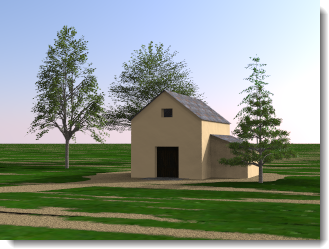
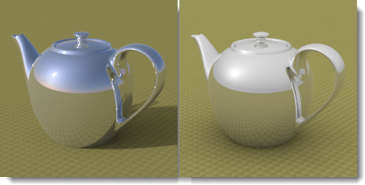

---
---

# {:height="75px" width="75px"} Sun and Sky
El [Sol](#sun) y el [Cielo](#sky) están estrechamente relacionados. El Sol puede cambiar el brillo del Cielo en el Modo automático. Si el Sol está activado y el Cielo es un HDRI, el equilibrio de sus intensidades es importante.

## Sol
{: #sun}
El sol es una luz paralela invisible muy potente. Los factores que simulan condiciones reales, como la latitud y la longitud, la hora del día y la estacionalidad controlan la dirección y el brillo del sol.

Este tema de la Ayuda describe el control de Sol de Flamingo.  El control [Sol de Rhino](http://docs.mcneel.com/rhino/5/help/es-es/commands/sun.htm) también puede usarse para colocar el sol.  Flamingo mantendrá los dos controles del sol sincronizados.

##### ¿Dónde se encuentra el control del sol de Flamingo? 

El Sol debe activarse a través de los [Preajustes de iluminación](lighting-tab.html#lighting-presets) o las opciones de [Iluminación personalizada](lighting-tab.html#sun).

* Toolbars >Barra de herramientas de Flamingo nXt
* Menús > Flamingo  5.0 > Mostrar panel de control > Ficha Flamingo nXt > Sol

**Nota:** La ficha Sol solo estará visible si el Sol se activa a través de un Preajuste de iluminación.

Los ángulos solares son necesarios para realizar cálculos de luz solar. Hay dos maneras de especificar la dirección del sol: por fecha, hora y lugar, y por ángulo directo. Utilice el posicionamiento por fecha, hora y lugar para simular el sol real en un estudio de la situación del modelo. El ángulo del sol directo controla el ángulo de la luz sin referencia a un sol real. Utilice el ángulo del sol directo para intentar efectos de iluminación.

  
*Sydney, Australia, 21 Junio, 09:30 (a la izquierda). Estocolmo, Suecia, 21 Junio, 09:30 (a la derecha).*

### Definir acimut y altitud
{: #set-azimuth-and-altitude}
Utiliza ángulos solares para definir manualmente la dirección del sol. Activa los controles de [Acimut](#azimuth) y [Altitud](#altitude).

#### Acimut
{: #azimuth}
Define la dirección del sol en grados de ángulo desde el norte (0) en el plano horizontal. El mapa circular muestra el mundo en una vista en planta.

#### Altitud
{: #altitude}
Define la altura del sol en el cielo en grados de ángulo desde el ecuador (0).  El mapa de la mitad del círculo simula una sección a través de la dirección vertical de las coordenadas universales.

### Definir ubicación en la Tierra
{: #set-location-on-earth}
Utilice la calculadora de ángulo solar para colocar el sol según la fecha, hora y posición.  **Nota:** Al igual que con todas las calculadoras solares, la precisión de la posición del sol puede variar. Si se requiere una precisión absoluta, se recomienda verificar la ubicación del sol.  

#### Fecha
{: #date}
Especifica la fecha.

#### Hora
{: #time}
Especifica la hora local.

#### Cambio horario estacional
{: #daylight-savings-time}
Se adelanta una hora el reloj.

#### Latitud/Longitud
{: #latitude-longitude}
Introduzca una latitud y longitud o designe una ubicación en el mapa.
Los números también se actualizarán y mostrarán la latitud y la longitud de la ubicación designada en el mapa con el cursor del ratón.

#### zona horaria
{: #time-zone}
Muestra la zona horaria de la ubicación actual según la Latitud y la Longitud.

#### Lista de ciudades
{: #city-list}
Utilice esta opción para seleccionar una ciudad para definir la ubicación.

#### Mapa
{: #map}
Haga clic en el mapa para especificar una ubicación. Arrastre con el botón izquierdo del ratón para desplazar el mapa.

### Intensidad del sol
{: #sun-intensity}
Modifica el brillo del componente de luz solar (directa). La intensidad del sol se calcula automáticamente en base a los ángulos solares y las condiciones del cielo, pero puede modificarse para equilibrarla con otras luces.

### Brillo de sol
{: #sun-highlight}
Intensidad del brillo de sol.

*Brillo de sol=0 (izquierda) y 1 (derecha).*

**Nota:**A veces se pueden ver artefactos del brillo solar destacar en renderizados de exteriores cuando se utiliza la opción Brillo de sol. Para mitigar o eliminar este artefacto, defina un valor más bajo para el Brillo de sol.
{: #speckle-artifacts}



#### Dirección norte
{: #north}
**Nota:** El norte es la dirección Y universal.

## Cielo
{: #sky}
El cielo es una esfera grande alrededor del renderizado que puede utilizarse para la iluminación. El cielo es muy diferente del entorno.  El cielo controla la iluminación. El entorno controla lo que se refleja y lo que está visible en el fondo. Hay muchas situaciones en las que el cielo y el entorno pueden definirse de modo diferente.

#### ¿Dónde se encuentra el control de cielo de Flamingo? 
El Cielo debe activarse a través de los [Preajustes de iluminación](lighting-tab.html#lighting-presets) o las opciones de [Iluminación personalizada](lighting-tab.html#sky).

 1. Barras de herramientas >Barra de herramientas de Flamingo nXt
 1. Menús > Flamingo  5.0 > Mostrar panel de control > Ficha Flamingo nXt > Cielo

Los preajustes de iluminación para luz diurna [Exterior](lighting-tab.html#exterior-daylight) e [Interior](lighting-tab.html#interior-daylight) utilizan el Cielo automático de manera predeterminada. El preajuste de iluminación de [Estudio](lighting-tab.html#studio-lighting) utiliza la iluminación de la imagen HDR de manera predeterminada.

El cielo se puede definir de cinco maneras:

>[Desactivar](lighting-tab.html#off)
>[Cielo automático](#automatic-sky)
>[Imagen de alto rango dinámico (HDRI)](#high-dynamic-range-image-sky)
>[Color](#color-sky)
>[Imagen](#image-sky)

Las dos mejores opciones para los tipos de iluminación de cielo son [Imagen HDR](#high-dynamic-range-image-sky) y [Cielo automático](#automatic-sky). El cielo de imagen HDR utiliza una imagen con los valores de iluminación almacenados en cada píxel para proporcionar luz y reflejos. El cielo automático utiliza la ubicación real del sol y la nubosidad para simular un cielo.  Estas opciones permitirán crear los renderizados más dinámicos.

### Cielo automático
{: #automatic-sky}
El cielo automático utiliza los ajustes de la [ficha Sol](sun-and-sky-tabs.html) para especificar la gama de colores y la intensidad del cielo.  Por ejemplo, cuando el sol está alto en el cielo, la iluminación y los colores del cielo son muy diferentes a cuando está bajo.

*Cielo automático: Sol alto (izquierda) y bajo (derecha) en el cielo.*

#### Nubosidad
{: #sky-cloudiness}
Cuando la nubosidad está desactivada, el cielo se considera claro y se crean sombras duras. Cuanto más grande sea la nubosidad, menos contraste habrá entre luces y sombras. Si hay más nubosidad se crearán sombras más suaves y un efecto de iluminación más uniforme. La opción Nubosidad influye en varios aspectos del cálculo de luz diurna, como son la cantidad relativa de luz directa vs. luz indirecta, la manera de calcular la luz indirecta y el color de fondo si se ha seleccionado el modo de Cielo automático. La opción de nubosidad Cloudiness varía entre 0 (claro) y 1 (completamente nublado). Los ajustes de nubosidad alrededor de 0.35 - 0.50 es un rango muy sensible y dinámico.

*Nubosidad de 0 (izquierda) y 1 (derecha).*

#### Intensidad del cielo
{: #sky-intensity}
Modifica el brillo del componente de luz solar del cielo (indirecta). La intensidad de la luz cenital se calcula automáticamente en base a los ángulos solares y las condiciones del cielo, pero puede modificarse. **Nota:** Esta opción sólo es relevante si hay que compensar otras luces de la escena. Si no hay otras luces, el indicador de tono compensará la exposición y la imagen renderizada no será más brillante ni más tenue según esta opción.



### Cielo de imagen de alto rango dinámico
{: #high-dynamic-range-image-sky}
Una imagen de [alto rando dinámico (HDR o HDRI)](https://es.wikipedia.org/wiki/High_dynamic_range) es un archivo de imagen en 2D especial. Estas imágenes contienen muchos más valores en cada píxel que los archivos de imagen estándar, como un .jpg o .png. Estos datos extra pueden utilizarse para iluminar los modelos. Si los valores contenidos en el HDR son exactos, la iluminación será exacta. Esto puede producir una iluminación muy dinámica en una escena. El preajuste de Iluminación de estudio utiliza imágenes HDR para el cielo. En la iluminación de estudio para interiores, la imagen HDR es como un techo que emite luz basándose en los colores de la imagen.

*Iluminación HDRI.*

Se supone que las imágenes HDR contienen valores de radiancia expresados en unidades de vatios. Si no es el caso, es posible que la intensidad de estas imágenes HDR deba ajustarse para alcanzar los niveles adecuados de iluminación.

Además del Cielo, puede utilizarse una imagen HDR diferente para cada uno de los tres fondos visibles: [Visible](environment-tab.html#advanced-background), [Reflejado](environment-tab.html#advanced-background) y [Refractado](environment-tab.html#advanced-background).

#### Imagen HDRI
Especifica el archivo de imagen HDR (HDR y HDRI son el mismo tipo de archivo). Haga clic en la imagen para seleccionar un HDRI diferente.

*Proyección equidistante.*

Las imágenes HDR vienen en dos tipos de proyección que permiten que la imagen quede envuelta alrededor de la esfera del cielo. La más popular es la equirectangular.  Estas imágenes son rectangulares con una relación de aspecto de 2:1. Las imágenes equirectangulares tendrán una resolución similar en toda la imagen. La segunda proyección es esférica. Las imágenes HDRI esféricas son cuadrado en la relación de aspecto y la imagen mostrará una gran curvatura. Las proyecciones esféricas tienen menos resolución en la costura.

#### Intensidad
Modifica el brillo de la luz de la imagen HDR. Esta opción sólo es relevante si hay que compensar otras luces de la escena. Si no hay otras luces, el indicador de tono compensará la exposición y la imagen renderizada no será más brillante ni más tenue según esta opción.

*Intensidad HDR baja y alta.*

En la ilustración, la imagen se ha girado para que la reflexión del sol aparezca en el objeto. Introduzca los grados de rotación o mueva interactivamente el indicador del widget de rotación.

*Imagen girada para que el sol aparezca en el objeto.*

#### Saturación
Saturación del color de la luz. Puesto que la luz de una imagen HDR es el color de los píxeles de la imagen, a veces se producen efectos de color no deseados. Baje la saturación si quiere la luz de la imagen, pero no el color.

*Saturación baja (izquierda) y alta (derecha.*





### Color
{: #color-sky}
Es posible utilizar un color o gradiente de color para iluminar la escena. Los colores del cielo se multiplican por el valor de intensidad para brindar un valor de iluminación a los colores.

#### Intensidad
El valor de Intensidad se usa para multiplicar los colores del Cielo y dan como resultado un valor de iluminación.  El rango de colores oscila entre el 0 y el 256 por canal. La intensidad multiplicará esos valores.

#### Tipo de color
Hay tres maneras de controlar el color del cielo.  Son similares a los controles de Entorno de color.  Consulte los controles de [Fondo de color](environment-tab.html#environment-color-and-gradient-backgrounds) para obtener más información.

### Imagen
{: #image-sky}
Es posible utilizar una imagen para iluminar la escena. Los colores de la imagen se multiplican por el valor de intensidad para brindar un valor de iluminación a los colores.

#### Intensidad
El valor de Intensidad se usa para multiplicar los colores del Cielo y dan como resultado un valor de iluminación.  El rango de colores oscila entre el 0 y el 256 por canal. La intensidad multiplicará esos valores.

#### Proyección de imagen
Hay varias maneras de controlar cómo se mapea una imagen en el cielo.  Son similares a los controles de Fondo de la imagen.  Consulte los controles de [Fondo de imagen](environment-tab.html#environment-image) para obtener más información.