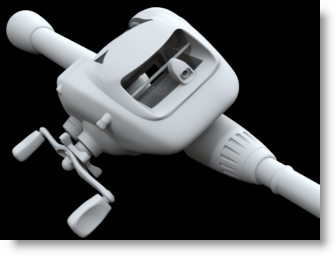
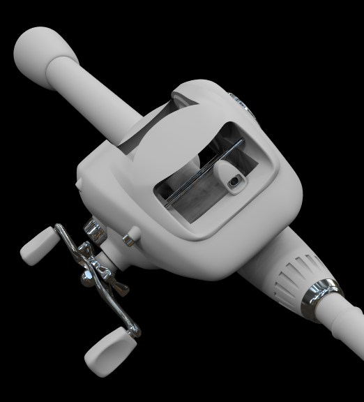

<!-- TODO: Make sure to update this page and get working in the guides section of the documentation. -->

# {{page.title}}
Ce tutoriel montre comment rendre un modèle standard de Rhino en utilisant nXt. Le tutoriel couvre les étapes de base du rendu avec nXt qui comprennent :

1. Ouverture du modèle
1. Création de matériaux
1. Modification de matériaux
1. Ajout d'un plan au sol

La première étape est de télécharger et décomprimer les fichiers du tutoriel. Pour télécharger le fichier zip, cliquez sur le lien [Moulinet de canne à pêche.zip](files/nxt5%20moulinet.zip). Décomprimez les fichiers dans un dossier facile à retrouver sur votre ordinateur. Ouvrez le fichier Fishing Reel.3dm dans Rhino. Vérifiez que Flamingo nXt est le moteur de rendu actuel dans le menu déroulant Rendu.

## Vérifiez le moteur de rendu actuel
{: #check-current}
Plusieurs moteurs de rendu peuvent être installés dans Rhino. Pour vérifier que Flamingo nXt 5 est le moteur de rendu actuel, ouvrez le menu Rendu > Moteur de rendu actuel > Flamingo nXt 5. Si une marque se trouve devant Flamingo nXt 5, alors il s'agit du moteur de rendu actuel. 

## Processus de rendu
{: #render_controls}
{: .float-img-right} Pour le premier rendu du modèle, cliquez sur le bouton de rendu. L'image obtenue devrait ressembler à celle de droite. nXt fonctionne différemment des versions précédentes de Flamingo. Tout nouveau modèle comprend un éclairage HDRI par défaut, et utiliser un matériau blanc par défaut pour tous les objets. Vous remarquerez également que les ombres sont très précises et linéaires au début. Les ombres seront de plus en plus douces à chaque passe et se mélangeront petit à petit. De nombreux autres effets s'amélioreront à chaque passe de rendu.

Parmi les effets qui s'améliorent à chaque passe

* Éclairage (comme l'illumination globale si elle est activée)
* Ombres floues
* Réflexions (floues)
* Réfraction
* Anticrénelage
* Profondeur de champ

De cette façon, le rendu de nXt n'est jamais vraiment terminé ; c'est à vous de décider du moment où il est assez bien pour l'arrêter. Vous pouvez ainsi laisser les images qui semblent correctes continuer à s'améliorer. Mais vous pouvez également arrêter une image à tout moment, si vous voulez modifier ou enregistrer quelque chose. Différentes options permettent d'arrêter le rendu :
{: .clear-img}

* Cliquer sur le bouton Arrêter le lancer de rayons pour arrêter le rendu à la fin de la passe en cours.
* Double cliquer sur le bouton Arrêter le lancer de rayons pour arrêter le rendu immédiatement.
* Cliquer sur le bouton "X" en haut à droite de la fenêtre de rendu pour arrêter immédiatement le rendu et fermer la fenêtre de rendu.

## Assigner des matériaux à partir de la bibliothèque
{: #materials}
L'éclairage de base étant déjà intégré dans nXt, la partie la plus importante du travail correspond donc normalement à la création des bons matériaux. Les matériaux sont enregistrés directement dans chaque modèle. Des modèles de matériaux permettent de créer de nouveaux matériaux rapidement.

  1. Ouvrez le panneau de configuration de Flamingo nXt à partir du menu Flamingo nXt dans Rhino.
  1. Pour assigner un matériau. Ouvrez l'onglet Bibliothèque dans le panneau de configuration. 
  1. Les matériaux sont organisés dans des dossiers. Ouvrez le dossier des matériaux de Flamingo.
  
  1. Ouvrez le dossier Matériaux de Flamingo > Métaux.
  {: .wide-img}
  1. Déposez le matériau Chrome sur le calque Poignée et pièces métalliques. 
  1. Lancez le rendu. Les pièces se trouvant sur le calque Poignée et pièces métalliques sont maintenant rendues avec une finition chromée.
  
  1. Assignez maintenant les autres matériaux à ces calques :

 | Bibliothèque | Matériau | Calque |
 |:-------|:------|:------|
 | Marine | Caoutchouc noir | Bague et rondelle |
 | Marine | Caoutchouc noir | Poignées |
 | Marine | Caoutchouc noir | Poignées de la canne |
 | Peinture de voiture | Peinture de voiture rouge | Corps externe |
 | Métaux > Or | Or Satiné Normal | Corps interne |
 | Métal > Anodisé | Aluminium - Anodisé rouge | Bobine |
 | Plastique > Noir > Lisse | Plastique noir - Lisse | Canne |
 | Plastique > Noir > Lisse | Plastique noir - Lisse | Poignée de la canne |
 | Plastique > Noir > Lisse | Plastique noir - Lisse | Guide du fil |
{: .grided-table}

##### Lancez le rendu pour voir le résultat :
 

## Créer un nouveau matériau
{: #new-material}
Vous aurez souvent besoin d'un matériau autre que ceux prédéfinis dans la bibliothèque. Par exemple, la poignée de la canne à pêche devrait être recouverte de liège. La création d'un nouveau matériau est la seule option. Pour le liège, nous allons créer un nouveau type de matériau. 

 1. Ouvrez l'onglet Matériaux
 1. Descendez en bas de la liste des matériaux. 
 1. Cliquez sur le bouton Nouveau matériau (symbole plus)
  
 1. Sélectionnez un nouveau matériau texturé de Flamingo.
 1. Ici, vous devez choisir une texture.
 1. Ouvrez le dossier que vous avez créé lorsque vous avec décomprimé les fichiers des tutoriels et sélectionnez Liège.jpg puis cliquez sur Ouvrir.
 1. Vous obtenez un matériau texturé simple. La taille de la mosaïque est souvent importante. Pour changer la taille de la mosaïque, cliquez sur le nom de l'image.

 1. Ajustez la taille de la mosaïque à 100 sur la largeur.

 1. Dans la case du nom, tapez Liège et cliquez sur Accepter.

 1. Une fois créé, assignez le matériau Liège au calque Poignée en liège en déplaçant le matériau sur le calque. 

## Activer le plan au sol
{: #groundplane}
L'ajout d'un plan au sol peut aider à définir les objets dans une scène. 

1. Ouvrez le panneau Plan au sol. S'il n'est pas visible, cliquez avec le bouton droit sur un autre onglet du panneau et sélectionnez Plan au sol. 
1. Cliquez sur le bouton Activer pour activer le plan au sol. Dans ce cas, nous utiliserons la hauteur par défaut. 
1. Dans ce cas, un nouveau matériau doit être créé pour le plan au sol. Descendez en bas de la liste de matériaux et cliquez sur le symbole plus.

1. Sélectionnez un nouveau matériau texturé de Flamingo.
1. Ici, vous devez choisir une texture.
1. Ouvrez le dossier que vous avez créé lorsque vous avec décomprimé les fichiers des tutoriels et sélectionnez Bois du pont.jpg puis cliquez sur Ouvrir.
1. Vous obtenez un matériau texturé simple. La taille de la mosaïque est souvent importante. Pour changer la taille de la mosaïque, cliquez sur le nom de l'image.
1. Ajustez la taille de la mosaïque à 125 sur la largeur.
1. Dans la case du nom, tapez Sol et cliquez sur Accepter.
1. Le rendu doit ressembler à ceci

## Retouches sur l'image rendue
{: #image-adjust}
La retouche de l'image après le rendu est très importante pour tirer le meilleur profit de Flamingo. Les modifications sont réalisées en temps réel avant d'enregistrer l'image. Il est souvent recommandé d'ajouter un peu de saturation et peut-être un peu de luminosité. 

1. Dans la fenêtre de rendu, ouvrez l'onglet Flamingo. 
1. Vérifiez que le rendu est arrêté en cliquant sur l'icône Arrêter. 
1. Dans la section Ajuster l'image, entrez 0.1 pour la Saturation. 
1. Entrez 0.1 pour la Luminosité.

1. Le résultat doit ressembler à ceci :

*Remarquez comme les blancs sont plus limpides (saturation) et comme l'image est plus lumineuse (luminosité).  La saturation est particulièrement efficace pour la production d'une image plus dynamique.*

Le didacticiel est terminé. J'espère qu'il vous aura été utile.