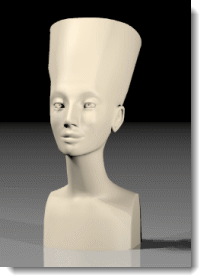
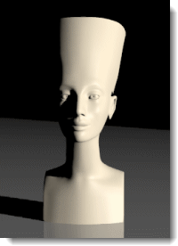

---
---
<!-- TODO: Make sure to update this page and get working in the guides section of the documentation. -->

# Bases de l'éclairage de studio
{: #studio-lighting-bascis}
L'éclairage de studio doit être défini comme dans un studio photographique. Pour un plus grand contrôle, utilisez les sources de lumière pour éclairer la scène.

Lors de la mise en place des lumières d'un studio, il est important d'avoir un éclairage scénique. Cet éclairage est obtenu en produisant de grands contrastes. En d'autres termes, les zones sombres sont aussi importantes que les zones claires. L'éclairage scénique demande un certain nombre de sources de lumière placées de façon à créer des zones très sombres et des zones très claires.
L'éclairage de studio de base utilise une lumière principale (1), une lumière d'appoint (2) et un contre-jour (3). Cette technique est la plus communément utilisée pour des personnages ou des objets seuls dans un studio. Un éclairage avec trois points donnera de bons résultats immédiatement et c'est un excellent point de départ pour créer des effets spéciaux. Les projecteurs sont utiles car vous pouvez contrôler leur direction et leur foyer pour donner plus d'effet à la scène.

## Angle de la caméra
{: #cameraangle}
Les paramètres de l'éclairage dépendent de l'angle de la caméra par rapport au sujet. Vous devriez commencer par choisir l'angle de la caméra. Utilisez les commandes **Caméra** ou **VueNommée** pour définir la position et l'angle de la caméra. Vous pourrez alors déterminer plus facilement la position des lumières.

## Configuration de base avec trois lumières
{: basic-three-light-setup}
Un éclairage de studio de base comprend trois lumières : une lumière principale, une lumière d'appoint et un contre-jour.

### Lumière principale
{: #keylight}
La lumière principale est la lumière de base de la scène et la plus importante. Elle définit l'ambiance, elle indique la direction, elle montre la dimension et la texture et elle crée les ombres les plus fortes. La lumière principale est normalement placée à un angle de 30 à 45 degrés sur le côté et au-dessus de l'objet en fonction du sujet que vous éclairez.
Plus la lumière principale est proche de la caméra, moins elle accentue la modélisation et la texture. La lumière principale est normalement plus élevée que l'objectif et les ombres sont diffusées vers le bas. Lorsque cette lumière est déplacée sur le côté, l'effet tridimensionnel de l'objet augmente.  Dans le rendu d'un portait, la lumière principale est placée à un angle de 45 degrés entre le sujet et la caméra, assez haut pour que les ombres soient diffusées vers le bas mais pas trop afin que les yeux du sujet ne se trouvent pas dans l'ombre.
Si la lumière principale est une lumière floue, vous n'aurez besoin que d'une petite lumière d'appoint voir même aucune. Cette solution est un autre exemple d'éclairage de petits montages en studio.
L'ombre diffusée par la lumière principale sera visible sur le sujet. Dans des images de visages, cette technique entraîne souvent une ombre dure au niveau du nez.

### Lumière d'appoint
{: #filllight}
La lumière d'appoint est placée juste au-dessus de l'objectif à l'opposé de la lumière principale. Son but est de réduire le contraste et d'apporter plus de détail dans les ombres en simulant une lumière indirecte à proximité des objets. La lumière principale et la lumière d'appoint peuvent avoir la même intensité pour obtenir un faible contraste, cependant la lumière principale est normalement plus lumineuse et plus précise que la lumière d'appoint. La lumière d'appoint est aussi appelée lumière secondaire de la scène. La scène ne devrait plus présenter d'ombres dures.
Dans l'image ci-dessous vous remarquerez que l'ombre à gauche du nez et le long du côté gauche est plus claire et plus floue que celle de l'image précédente où nous n'avions qu'une lumière principale.

### Contre-jour
{: #backlight}
L'effet du contre-jour est subtile mais il peut définir les bords des objets dans la scène et ajouter de la profondeur en évitant que les objets ne se mélangent avec l'arrière-plan. Les lumières en contre-jour sont placées derrière et au-dessus de l'objet et sont dirigées vers la caméra.
L'efficacité des lumières en contre-jour dépend en partie de la réflectivité des surfaces éclairées.
Dans l'image suivante, la lumière au-dessus des épaules aide à séparer le sujet de l'arrière-plan. Le contre-jour adoucit aussi les ombres et éclaire la surface où repose l'objet.

## Qualités de la lumière
{: #lightquality}
Il est possible de créer des images avec des ombres, des reflets et des réflexions précis mais si votre éclairage n'est pas correctement défini, vous ne pourrez pas obtenir de bons rendus. Lorsque vous configurez l'éclairage, tenez compte de ce que vous essayez d'obtenir. Les images sont de bonnes images si elles sont saisissantes, schématiques et simples. Un trop grand nombre de reflets dans les objets en verre ou d'ombres sur les objets peut ajouter une complexité inutile à une scène et nuire à son essence.
Parmi les qualité à prendre en compte :

>La gamme de contraste de la scène
>La profondeur de la scène (sa qualité tridimensionnelle)
>La séparation des objets de l'arrière plan
>Si l'éclairage doit être précis ou doux
>Si l'éclairage doit avoir une couleur chaude ou froide

### Gamme de contraste
{: #contrastrange}
La gamme de contraste est la différence entre les zones les plus claires et les zones les plus sombres dans une scène donnée. L'oeil humain peut prendre en compte une gamme de contraste beaucoup plus grande qu'un film ou une pellicule et peut effectuer une compensation locale pour voir des détails dans des zones très claires ou très sombres.  Vous pouvez voir cette différence sur une photo prise un jour ensoleillé.
En principe, le côté éclairé est trop clair ou le côté à l'ombre est trop sombre même si vous n'aviez aucun problème à voir les détails dans les zones claires et sombres à l'oeil.  La gamme de contraste est tout simplement trop grande pour la pellicule. Cette théorie s'applique aussi aux images de rendu puisqu'il existe une limite au niveau des couleurs que  l'ordinateur peut afficher.

Une image avec un contraste plus faible évite que les détails ne soient obscurcis dans les zones très claires ou très sombres.

### Qualité tridimensionnelle
{: #three-dimensional}
Une illusion de profondeur doit être créée pour représenter trois dimensions dans un espace en deux dimensions. Un objet opaque éclairé sur le côté implique une profondeur puisqu'il présente un côté avec un reflet clair et un côté avec une ombre sombre. Une boîte dont trois faces sont visibles aura une plus grande ampleur si chaque face représente une  valeur différente.  Le plus souvent, le dessus sera la zone la plus claire puisque la lumière vient normalement du haut dans les situations réelles.

### Séparation de l'arrière plan
{: #separation}
Pour qu'un objet ressorte de la page, la séparation de l'arrière-plan doit être bien définie en plus de la qualité tridimensionnelle et de l'utilisation de toute la gamme de contraste. En d'autres termes, les bords de votre sujet doivent être considérablement plus clairs ou plus sombres que l'arrière-plan. Sans séparation, l'objet se mélange avec l'arrière-plan.
Dans l'image suivante, la lumière au-dessus de l'objet aide à le séparer de l'arrière-plan
L'ombre du sujet peut aider à la séparation mais elle entraîne parfois le mélange de l'objet avec l'arrière-plan. Une lumière en contre-jour peut faciliter la séparation en créant un bord clair autour de l'objet.

### Lumière précise ou floue
{: #hard-soft}
La lumière peut être séparée en deux groupes : lumière précise (directe) et lumière floue (diffuse).
Une lumière précise projette une ombre clairement définie aux bords précis.

Une lumière diffuse projette une ombre floue parfois même impossible à distinguer.
La lumière diffuse produit une image plus agréable que la lumière précise car ses ombres sont plus floues. Plus la lumière est grande et plus elle est proche du sujet, plus elle est floue. Une grande lumière floue peut simuler la lumière d'une fenêtre.

L'éclairage diffus peut convenir aux objets en plastique sombres car il produira un reflet large aidant à définir la forme des objets brillants noirs.

Lors de l'éclairage d'un montage en studio, il est important d'obtenir une lumière d'effet avec un grand contraste. En d'autres termes, les zones sombres sont aussi importantes que les zones claires. L'éclairage d'effet demande un certain nombre de lumières placées de façon à créer des zones sombres et des zones éclairées.
Les techniques d'éclairage en photographie sont normalement les mêmes que celles utilisées pour le rendu. Si vous voulez en apprendre plus sur ce thème, vous devriez donc commencer par un livre sur l'éclairage en photographie.
Flamingo nXt possède des [schémas d'éclairage](lighting-tab.html#lighting-presets) prédéfinis qui peuvent vous aider à démarrer avec l'éclairage de votre modèle. Les paramètres de [l'onglet Avancé](lighting-advanced-tab.html) sont optimisés pour chaque méthode d'éclairage.