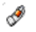
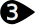
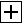
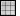
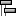
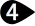
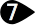

# {: .inline} {{page.title}}
{: #environment-tab}
Les environnements ne sont pas uniquement ce qui peut être vu à l'arrière-plan d'un rendu, mais ils contrôlent également une sphère infinie enveloppant le modèle. Les objets dans la scène réfléchiront et réfracteront l'environnement. La sphère de l'environnement n'est pas un objet qui peut être sélectionné mais une surface de référence pour les effets d'arrière-plan.

L'environnement agit sur la partie visible de l'arrière-plan et des réflexions.  Pour des effets agissant sur l'éclairage de la scène, consultez la rubrique de l'aide sur le [Ciel](sun-and-sky.html).

Flamingo possède un environnement spécial appelé *[Environnement par défaut de Flamingo](environment.html)*.  Cet environnement est synchronisé avec les [Préréglages d'éclairage](lighting-tab.html). En utilisant les [Préréglages d'éclairage](lighting-tab.html), l'éclairage et l'environnement seront définis avec les valeurs par défaut adaptées à la scène.

{:  #panel_map height="600px" style="float: right"}

##### Où puis-je trouver cette commande ?
 1. {: .inline} Onglet Environnement
 1. {: .inline} Barres d'outils Outils  pour le rendu > {: .inline} Éditeur d'environnement
 1. {: .inline} Menus > Rendu > Éditeur d'environnement
 1. Commande > ÉditeurEnvironnement

Le panneau de l'éditeur d'environnement est divisé en plusieurs sections.  En fonction du type d'environnement, les panneaux avancés peuvent varier.

Il est possible de faire glisser les couleurs et les textures à partir de la palette et de les déposer sur une autre palette ou sur une option de l'éditeur de matériaux, de la [palette textures](texturepalette.html) ou de [l'éditeur d'environnement](environmenteditor.html).
Panneau Environnement

 1. [Type d'arrière-plan](#type)
 1. [Barre de paramètres](#settings)
 1. [Liste d'environnements](#environment_list)
 1. [Diviseur de fenêtre](#divider)
 1. [Section des propriétés de l'environnement](#properties)
 1. [Nom](#name)
 1. [Panneaux des propriétés de l'environnement](#panels)

## [Type d'arrière-plan](#panel_map) {: .inline}
{: #type style="clear: both;"}
Sélectionnez le type d'arrière-plan pour le modèle.  L'[environnement](#flamingo-environment) est un environnement de rendu tout compris et devrait être le paramètre par défaut pour Flamingo.  Les trois aux paramètres présentent un ensemble de paramètres beaucoup plus simple qui correspond à l'ancien mode de définition des arrière-plans. Pour plus d'informations, consultez la rubrique [arrière-plan simple de Rhinoceros](http://docs.mcneel.com/rhino/5/help/fr-fr/commands/environmenteditor.htm#Basic_settings).

Le reste de cette rubrique couvre le type d'environnement.

## [Barre de paramètres](#panel_map) {: .inline}
{: #settings}
Utilisez cette barre pour mieux naviguer dans la liste des environnements.

#### {: .inline} Flèche de retour arrière
Sélectionne l'environnement précédent.  Par exemple un environnement avec des couches réfléchissantes ou réfringentes.  Utilisez cette flèche pour revenir à l'environnement parent depuis les détails de réflexion ou réfraction.

####  {: .inline} Flèche pour avancer
Sélectionne l'environnement suivant.  Par exemple un environnement avec des couches réfléchissantes ou réfringentes.  Utilisez cette flèche pour passer à l'environnement parent suivant depuis les détails de réflexion ou réfraction.

#### {: .inline} {: .inline} Nom de l'environnement actuellement sélectionné
Affiche le nom de l'environnement actuel et le niveau d'édition.  Par exemple, si un niveau Réfléchi ou Réfracté existe, le signe > est affiché. Vous pouvez voir ici l'environnement actuel. 

#### {: .inline} Menu Outils
Affiche le [menu Outils](#tools-menu).    Ce menu contient de nombreuses commandes, paramètres et outils concernant les environnements. 

#### {: .inline} Aide

## [Liste des environnements](#panel_map) {: .inline}
{: #environment_list}
Affiche une liste de tous les environnements disponibles dans le modèle. Un environnement sera sélectionné comme environnement actuel. L'environnement actuel est utilisé pour le rendu. Des petits signes jaunes sont affichés dans les coins de l'environnement actuel. 

À partir de cette liste :

* Cliquez sur un environnement pour le définir comme environnement actuel. Une fois sélectionné, les propriétés de l'environnement seront affichées dans les panneaux inférieurs. Voir [Propriétés des matériaux de rendu](#properties) pour plus d'informations.
* Naviguez dans la liste pour voir tous les environnements du modèle.
* Ajoutez un nouvel environnement, en utilisant le bouton Ajouter {: .inline} en bas de la liste.
* Cliquez avec le bouton de droite sur une miniature pour afficher le menu contextuel de l'environnement
* Cliquez avec le  bouton de droite dans la zone vide pour afficher le menu contextuel de création d'un nouvel environnement

###  {: .inline} Ajouter un nouvel environnement
{: #add_environment}
L'icône ajouter se trouve en bas de la liste des environnements. 

Il ouvre le [bibliothèque](libraries.html) d'environnements du contenu de rendu.
Les environnements de la bibliothèque agissent comme des modèles pour créer d'autres environnements dans le document.

### Menu contextuel de l'environnement
{: environment_context}
Le menu est disponible en cliquant avec le bouton droit sur un élément de la liste d'environnements. Consultez le [menu Outils](#tools_menu) pour plus d'informations sur les options de ce menu. 

### Menu contextuel de création d'un nouvel environnement
{: new_envrionment_context}
Ce menu est disponible en cliquant avec le bouton droit dans une zone vide de la liste d'environnements.

#### {: .inline} Créer un nouvel environnement
Crée un nouvel environnement de Flamingo.

#### {: .inline} Importer un environnement à partir d'un fichier...
Utilisez cette commande pour sélectionner un environnement précédemment exporté. 

#### {: .inline} Coller
Crée un nouvel environnement à partir du contenu du presse-papiers.

#### {: .inline} Coller comme instance
Crée un nouvel environnement à partir du contenu du presse-papiers qui est lié à l'original par instanciation.

#### {: .inline} Grille
Affiche les aperçus sous forme de grille de miniatures.

#### {: .inline} Liste
Affiche les aperçus sous forme de liste de miniatures.

#### {: .inline} Arbre
Affiche les aperçus sous forme d'arbre affichant les différentes branches.

#### {: .inline} Mise en page horizontale
Affiche les aperçus à gauche des contrôles.

#### {: .inline} Afficher le panneau d'aperçu
Affiche les propriétés d'aperçu pour la miniature sélectionnée. Vous pouvez définir la géométrie de l'aperçu, sa taille, l'arrière-plan utilisé et la méthode de rotation.

#### {: .inline} Flottante
Affiche l'image d'aperçu dans une fenêtre flottante dont la taille peut être modifiée.

#### Miniatures

##### {: .inline} Petit
Définit la plus petite taille de miniature.

##### {: .inline} Moyen
Définit la taille moyenne de miniature.

##### {: .inline} Grand
Définit la plus grande taille de miniature.

##### {: .inline} Montrer les étiquettes
Affiche les étiquettes du nom de la miniature en mode Grille.
Le mode Liste affiche toujours les étiquettes.

##### {: .inline} Montrer les unités
Affiche la taille dans les unités du modèle.

##### {: .inline} Actualisation automatique de l'aperçu
Actualise automatiquement tous les aperçus lorsque les paramètres sont modifiés.

##### {: .inline} Actualiser tous les aperçus
Actualise les aperçus manuellement lorsque l'option Actualisation automatique de l'aperçu est désactivée.

## [Diviseur de fenêtre](#panel_map){: .inline} {: .inline}
{: #divider}
Déplacez le diviseur pour modifier la longueur de la liste des environnements par rapport à la longueur de la section des propriétés de l'environnement.

## [Section des propriétés de l'environnement](#panel_map) {: .inline}
{: #properties}

### [Nom de l'environnement](#panel_map) {: .inline}
{: #name}
Cette section indique le nom de l'environnement. Le nom de l'environnement est également enregistré comme nom du fichier lors de l'exportation de l'environnement vers la bibliothèque. **Remarque :** Les environnements sont sauvegardés dans le modèle de Rhino, des environnements uniques peuvent avoir le même nom dans différents modèles de Rhino.

### [Panneaux Environnement](#panel_map) {: .inline}
{: #panels}
La section des propriétés de l'environnement comprend plusieurs panneaux. Chaque panneau peut être ouvert ou fermé en cliquant sur la barre de titre en gris. Cliquez sur la barre de titre pour afficher le contenu.

Les panneaux de l'environnement varieront en fonction du type d'environnement et du niveau actif de l'environnement actuel. Pour plus d'informations sur chaque panneau, consultez la section [Environnement de Flamingo](environment.html).

## Menu Outils {: .inline}
{: tools_menu}
Ces paramètres apparaissent également dans les menus contextuels du bouton de droite de la souris pour les aperçus et arrière-plan miniatures.

#### {: .inline} Définir comme environnement actuel
L'environnement cible est défini comme environnement actuel.  L'environnement actuel sera utilisé lors du prochain rendu.

#### {: .inline} Créer un nouvel environnement
Crée un nouvel environnement de Flamingo.
<!-- Cette partie vient de la page http://docs.mcneel.com/rhino/5/help/en-us/popup_moreinformation/materialthumbnail_contextmenu.htm -->
Ces paramètres apparaissent également dans les menus contextuels du bouton de droite de la souris pour les aperçus et arrière-plan miniatures.

#### {: .inline} Importer un environnement à partir d'un fichier
Importe un environnement à partir d'un fichier .renv de Rhino.

#### {: .inline} Enregistrer dans un fichier
Enregistre un fichier environnement .renv de Rhino.

#### {: .inline} Changer le type
Change le type d'un environnement.

#### {: .inline} Changer le type (Copier les paramètres)
Change le type d'un environnement.
Le comportement par défaut dépend du statut actuel de la case [Options de rendu](http://docs.mcneel.com/rhino/5/help/en-us/options/rendering.htm) >  [Copier les paramètres similaires lorsque le type de contenu est modifié](http://docs.mcneel.com/rhino/5/help/en-us/options/rendering.htm#Copy_similar_settings_when_content_type_is_changed). Si cette case est cochée, les paramètres compatibles de l'ancien contenu seront copiés dans le nouveau.

#### {: .inline} Rétablir les valeurs par défaut
Redéfinit tous les paramètres par défaut de l'environnement (arrière-plan uni noir, arrière-plan réfléchi, ciel et arrière-plan réfracté visible).

#### {: .inline} Copier
Copie l'environnement sélectionné dans le presse-papiers de Windows. Le presse-papiers peut ensuite être collé dans l'éditeur afin de créer un nouvel environnement ou collé directement dans un dossier pour créer un  fichier de [bibliothèque](libraries.html) file.

#### {: .inline} Coller
Crée un nouvel environnement à partir du contenu du presse-papiers.

#### {: .inline} Coller comme instance
Crée un nouvel environnement à partir du contenu du presse-papiers qui est lié à l'original par instanciation.

#### {: .inline} Supprimer
Supprime l'environnement sélectionné.

#### {: .inline} Renommer...
Renomme l'environnement sélectionné.

#### {: .inline} Dupliquer
Copie l'environnement sélectionné sur un nouvel environnement avec les mêmes paramètres.

#### {: .inline} Supprimer l'instanciation
Supprime la connexion entre les environnements [copiés par instance](#paste-as-instance) .



#### {: .inline} Filtre de contenu
Ouvre la boîte de dialogue [Filtres de contenu](content_filters.html) .

#### {: .inline} Propriétés
Ouvre la  boîte de dialogue [Propriétés de l'aperçu](previewproperties.html).