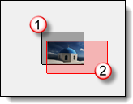

#  {{page.title}}
Rhino possède de nombreux [types d'environnements](http://docs.mcneel.com/rhino/5/help/fr-fr/commands/environmenteditor.htm). Cette rubrique traite de l'environnement de Flamingo.

L'environnement agit sur la partie visible de l'arrière-plan et des réflexions.  Pour des effets agissant sur l'éclairage de la scène, consultez la rubrique de l'aide sur le [Ciel](sun-and-sky-tabs.html).

Flamingo possède un environnement spécial appelé **Environnement par défaut de Flamingo**.  Cet environnement est synchronisé avec les [Préréglages d'éclairage](lighting-tab.html). En utilisant les [Préréglages d'éclairage](lighting-tab.html), l'éclairage et l'environnement seront définis avec les valeurs par défaut adaptées à la scène.

Les propriétés de l'environnement de Flamingo sont divisées en plusieurs groupes :

> [Nom](#name)
> [Environnement de Flamingo](#environment)
> [Couleur de l'arrière-plan](#color-backgrounds)
> [Arrière-plan avancé](#advanced-background-reflected-sky)

## Nom de l'environnement
{: #name}
Cette section indique le nom de l'environnement dans le modèle de Rhino. Les environnements sont enregistrés dans le modèle de Rhino. Ce qui signifie qu'un environnement portant le même nom dans la bibliothèque ou un autre modèle ne sera pas affecté par les modifications réalisées sur l'environnement de ce modèle. Pour utiliser un environnement dans un autre modèle il doit toit d'abord être exporté vers la [bibliothèque](libraries.html). Le nom de l'environnement servira également à définir le nom du fichier exporté. 

## Environnement de Flamingo
{: #environment}
L'environnement a trois fonctions dans un rendu :

>Arrière-plan visible
>[Arrière-plan réfléchissant](#advanced-background-reflected-sky)
>[Arrière-plan réfringent](#advanced-background-reflected-sky)

L'arrière-plan visible est la couleur de base dans l'arrière-plan de la scène. Il est défini dans le panneaux des propriétés générales. Les arrière-plans [réfléchissant](#advanced-background-reflected-sky) et [réfringent](#advanced-background-refracted-sky) peuvent différer et sont disponibles dans la section Arrière-plan avancé.

#### Intensité
{: #background-intensity}
Modifie la clarté relative de l'arrière-plan. La valeur de l'intensité est utilisée pour multiplier les couleurs de l'arrière-plan afin d'obtenir une valeur d'éclairage.  Les couleurs peuvent aller de 0 à 255 par canal. L'intensité multipliera ces valeurs.  Ce paramètre devient important si l'arrière-plan est très sombre par rapport au modèle rendu. 

#### Type d'arrière-plan
{: #background-type}
Définit le schéma de couleur qui remplira l'arrière-plan de l'image rendue. Il existe différents types d'arrière-plans :

> [Ciel](#environment-sky)
> [Uni et dégradé de couleurs](#color-backgrounds)
> [Image](#environment-image)
> [Images HDR et HDR planes](#hdr-background)

## Ciel en arrière-plan
{: #environment-sky}
L'environnement Ciel utilise les paramètres du soleil et du ciel définis dans l'onglet [Éclairage(lighting-tab.html) .  Il s'agit du paramètre par défaut pour les rendus utilisant le ciel. 

*Automatique (gauche) et image HDR et soleil (droite).*

## Couleur en arrière-plan
{: #color-backgrounds}
Les paramètres de couleur pour l'arrière-plan sont toujours présents. Une couleur est toujours définie pour l'arrière-plan même si elle est entièrement masquée par une image, une image HDR ou le ciel.

### Couleur unie
{: #solid-color}
Un arrière-plan de couleur unie est composé d'une seule couleur qui remplit tout l'arrière-plan.

*Arrière-plan de couleur unie.*
Voir [Contrôle de couleur](#enviroment-sky-color-controls) ci-dessous pour plus d'informations sur la modification de la couleur unie.

#### Dégradé de deux couleurs
{: #two-color-gradient}
Les arrière-plans avec un dégradé de deux ou trois couleurs ne sont appliqués que dans les vues en perspective. Les arrière-plans avec un dégradé de deux couleurs interpolent la couleur de l'arrière-plan entre deux couleurs sélectionnées.

*Arrière-plan avec un dégradé de deux couleurs : bleu et jaune.*
Voir [Contrôles de couleur](#enviroment-sky-color-controls) ci-dessous pour plus d'informations sur la modification d'un dégradé de deux couleurs.

#### Dégradé de trois couleurs
{: #three-color-gradient}
Les arrière-plans avec un dégradé de trois couleurs interpolent la couleur de l'arrière-plan entre trois couleurs sélectionnées.

*Arrière-plan avec un dégradé de trois couleurs : bleu, blanc et jaune.*
Voir [Contrôles de couleur](#enviroment-sky-color-controls) ci-dessous pour plus d'informations sur la modification d'un dégradé de trois couleurs.

### Contrôles de couleur
{: #enviroment-sky-color-controls}
Le nombre de contrôles disponibles peut varier en fonction du type d'arrière-plan actuellement sélectionné. Les arrière-plans avec un dégradé auront jusqu'à trois sélecteurs de couleur qui peuvent comprendre une couleur supérieure, médiane et inférieure.



#### Inverser les couleurs
Utilisez ce bouton pour inverser la couleur du dégradé entre le haut et le bas.

#### Contrôle de placage du dégradé
{: #gradient-mapping}
Les couleurs d'un arrière-plan avec dégradé de couleurs doivent être plaquées sur la sphère de l'environnement. Utilisez un système de placage de dégradé pour ce faire.  Les contrôle de placage du dégradé ne seront activés que lorsqu'un dégradé de deux ou trois couleurs est sélectionné. Les dégradés ne peuvent être plaqués que dans les vues en perspective.

#### Angles à partir d'une vue
{: #angle-from-views}
Si l'option Angles à partir d'une vue est cochée, le dégradé de couleurs actuel sera synchronisé avec la vue en perspective actuelle.  La couleur supérieure sera plaquée en haut de la vue et la couleur inférieure en bas.  Toutes les autres couleurs seront réparties entre ces extrémités. 

#### Icône de visualisation de l'altitude
{: #colorrange}
Si la fenêtre active est une projection en perspective, vous pouvez contrôler les couleurs supérieure et inférieure et l'étendue du dégradé par rapport à votre vue.

{: style="float: left; padding-right: 25px;padding-bottom: 15px;padding-top:15px;"}

* Le contrôle affiche l'environnement dans une vue de section. La marqueur 90 degrés correspond à la coordonnée Z vers le haut. La coordonnée 0 représente le plan au sol horizontal. La marqueur -90 degrés correspond à la coordonnée Z vers le bas.
* Le cône de vision gris affiche la dernière coordonnée de la vue en perspective actuelle. 
* La flèche rouge représente la position de la couleur supérieure. La couleur supérieure sera affichée à cet angle et au-dessus. 
* La double flèche verte représente le milieu du mélange entre les couleurs supérieure et inférieure. S'il s'agit d'un dégradé de trois couleurs il s'agit également de la position de la couleur du milieu. 
* La flèche rouge représente la position de la couleur inférieure. En-dessous de cet angle, seule la couleur inférieure apparaîtra. 

####  Obtenir les angles à partir du bouton de la vue
Utilisez ce bouton pour effacer les contrôles de placage du dégradé et utiliser les coordonnées de la vue en perspective actuelle. 

#### Angles supérieur/milieu/inférieur
Ces valeurs correspondent aux couleurs supérieure, médiane et inférieure du dégradé actuel. Ils correspondent à la position des flèches rouge, verte et bleu dans l'icône de visualisation de l'altitude. 

## Image en arrière-plan
{: #environment-image}

Une image est projetée sur l'arrière-plan. Cette fonctions est souvent utilisée pour placer un modèle dans un contexte existant ou pour définir une vue derrière des fenêtres. Une photographie, une illustration scannée ou une image créée avec un programme de dessin peuvent être utilisées comme image. Pour obtenir de meilleurs résultats, utilisez des images de haute résolution pour les arrière-plans. Vous pouvez aussi rendre les images plus floues ou plus claires pour simuler une mise au point naturelle ou une perspective aérienne. L'image en l'arrière-plan peut être plaquée dans la scène en utilisant une projection plane, cylindrique ou sphérique. 

*Une image plane définie comme arrière-plan.*

### Fichier image
{: #image-properties}
Définissez l'image en arrière-plan en cliquant sur le bouton *(vide - cliquer pour assigner)*, puis sélectionnez une image.  Pour assigner une autre image, cliquez sur l'image en miniature. 

### Projection
{: #backgroud-image-projection}
Sélectionnez une des trois projections d'image dans le menu déroulant :

>[Plane](#planar)
>[Cylindrique](#cylindrical)
>[Sphérique](#spherical)

Chaque méthode de projection possède ses propres options pour positionner l'image.

### Projection plane
{: #planar}
L'image est projetée sur un arrière plan plat dans la vue actuelle. Les coordonnées de la projection plane sont toujours relatives à la vue actuelle. 

#### Angle à partir d'une vue
La case angle à partir de vue permettra de synchroniser l'image avec la vue actuelle. L'image sera alors étirée pour l'adapter à la vue actuelle.

#### Contrôle de positionnement de l'image
Utilisez le contrôle de positionnement de l'image pour la placer l'image par rapport à la vue actuelle. La forme de la fenêtre apparaît sous forme de rectangle gris foncé. Faites glisser le rectangle rose ou utilisez les options numériques pour déplacer ou changer l'échelle de l'image en arrière-plan par rapport à la vue. 

*Zone de la fenêtre active (1), taille et forme de l'image (2).*

#### Échelle X / Échelle Y
Définit la taille de l'image en arrière-plan en appliquant une échelle de 0 à 1 à la largeur et la hauteur de la fenêtre. Par exemple, une valeur de 1.0 représente 100 % de la taille de la vue, une valeur de 0.5 représente 50 % de la largeur de la vue, etc. 

#### Décalage X / Décalage Y
Définit le décalage de l'image en arrière-plan à partir du coin inférieur gauche de la fenêtre en appliquant une échelle de 0 à 1 à la largeur et la hauteur de la vue.  Par exemple, une valeur de 0.25 représente 25 % de la taille de la vue, une valeur de 0.5 représente 50 % de la largeur de la vue, etc.

#### Contrôle de positionnement de l'image
Utilisez le contrôle de positionnement de l'image pour la placer l'image par rapport à la vue actuelle. La forme de la fenêtre apparaît sous forme de rectangle gris foncé. Faites glisser le rectangle rose ou utilisez les options numériques pour déplacer ou changer l'échelle de l'image en arrière-plan par rapport à la vue. 

*Zone de la fenêtre active (1), taille et forme de l'image (2).*

#### Échelle X / Échelle Y
Définit la taille de l'image en arrière-plan en appliquant une échelle de 0 à 1 à la largeur et la hauteur de la fenêtre. Par exemple, une valeur de 1.0 représente 100 % de la taille de la vue, une valeur de 0.5 représente 50 % de la largeur de la vue, etc. 

#### Décalage X / Décalage Y
Définit le décalage de l'image en arrière-plan à partir du coin inférieur gauche de la fenêtre en appliquant une échelle de 0 à 1 à la largeur et la hauteur de la vue.  Par exemple, une valeur de 0.25 représente 25 % de la taille de la vue, une valeur de 0.5 représente 50 % de la largeur de la vue, etc.

### Projection cylindrique
{: #cylindrical}
La projection cylindrique plaque l'image sur un cylindre imaginaire entourant le modèle. Même si cette projection donne les meilleurs résultats avec des images cylindriques, elle peut aussi être utilisée avec des panoramas standards créés à partir de photographies.

Spécifiez la taille et la position du placage selon l'angle de hauteur et l'angle de largeur. Utilisez les outils graphiques et la souris pour positionner et redimensionner l'image. Le cône de vision est affiché dans le graphique sous forme de zone gris clair.

#### Angle à partir d'une vue
La case angle à partir de vue permettra de synchroniser l'image avec la vue actuelle. L'image sera alors étirée pour l'adapter à la vue actuelle.

#### Contrôle du plan
Détermine la largeur angulaire du placage de l'image. Indiquez un angle ou faites glisser les drapeaux dans l'application de contrôle pour définir la largeur. La zone bleue indique les dimensions de la largeur angulaire.

{: .float-img-left}

* Le contrôle affiche l'environnement dans une vue en plan. 
* Le cône de vision gris foncé affiche les dernières coordonnées dans la vue en perspective actuelle.
* Le cône bleu affiche l'intervalle d'angles où l'image sera visible. 
* La flèche bleue représente la coordonnée gauche du placage de l'image. 
* Le point rouge représente le centre de l'image en arrière-plan.
* La flèche violette représente la coordonnée droite du placage de l'image.

#### Contrôle vertical
{: .clear-img}
Définit les dimensions verticales de la projection cylindrique. Indiquez un angle ou faites glisser les drapeaux dans l'application de contrôle pour définir les angles supérieur et inférieur. La projection cylindrique est limitée à 45 degrés au-dessus et en dessous de l'horizon.

{: .float-img-left}

* Le contrôle affiche le cylindre dans une vue de section.
* Le cône de vision gris affiche les dernières coordonnées dans la vue en perspective actuelle.
* La flèche bleue représente la bordure inférieure du placage de l'image.
* La flèche rouge représente la bordure supérieure du placage de l'image.

#### Rotation
{: .clear-img}
Définit la rotation de l'image. Le point rouge indique le centre de l'image.

#### Largeur
Définit la largeur de l'image en degrés par rapport à la vue en plan. 

#### Haut/Bas
Définit les angles verticaux de l'image en fonction de la direction du plan au sol horizontal dans le modèle.

####  Obtenir les angles à partir de la vue
Définit l'angle de rotation en fonction de la  fenêtre perspective actuelle.  Cette option permet par exemple de redéfinir les valeur de la projection.

### Projection sphérique
{: #spherical}
La projection sphérique plaque l'image sur une sphère complète. Cette méthode produit généralement de bons résultats si une image cylindrique équidistante est utilisée.  Le rapport de forme d'une image cylindrique équidistante est un rectangle de 2:1.

#### Angle à partir d'une vue
La case angle à partir de vue permettra de synchroniser l'image avec la vue actuelle. L'image sera alors étirée pour l'adapter à la vue actuelle.

#### Contrôle sphérique
Détermine la direction du placage de l'image. Indiquez un angle ou faites glisser l'indicateur dans l'application de contrôle pour définir la largeur. Le point rouge représente le centre de l'image en arrière-plan.

#### Rotation
{: .clear-img}
Définit la rotation de l'image. Le point rouge indique le centre de l'image.

####  Obtenir les angles à partir de la vue
Définit l'angle de rotation en fonction de la  fenêtre perspective actuelle.  Cette option permet par exemple de redéfinir les valeur de la projection.

## Arrière-plan HDR
{: #hdr-background}
L'utilisation d'une image HDR comme environnement permet de mieux contrôler la relation entre la lumière de l'arrière plan et les autres lumières de l'image. Cette option est particulièrement utile pour représenter un espace intérieur avec un espace clair extérieur passant par une fenêtre. Une image d'environnement HDR dispose d'une plage de lumières plus grande qu'une image bitmap normale et elle peut posséder un canal ; ainsi, le contraste peut être géré dans un  rendu [multicanal](lights-tab.html#channel) .

#### Fichier image
{: #hdri-image}
Définissez l'image HDR en arrière-plan en cliquant sur le bouton *(vide - cliquer pour assigner)*, puis sélectionnez une image.  Pour assigner une autre image, cliquez sur l'image en miniature.






## Options d'image HDR plane
{: #planar-hdr-options}

Les images à grande plage dynamique planes sont rarement utilisées mais peuvent être très utiles.  Une image HDR offre une large gamme de possibilités de couleurs. Les fichiers HDR peuvent être très utiles pour les fenêtre extérieures de rendus architecturaux où l'arrière-plan est trop clair ou trop foncé.  Un placage plan est toujours utilisé pour les fichiers HDR.

*Une image en arrière plan (gauche) et une image HDR plane (droite) présentent des différences d'éclairage subtiles en arrière-plan.*

#### Fichier image
{: #hdri-planar-image}
Définissez l'image HDR en arrière-plan en cliquant sur le bouton *(vide - cliquer pour assigner)*, puis sélectionnez une image.  Pour assigner une autre image, cliquez sur l'image en miniature.



## Arrière-plan avancé
{: #advanced-background}
Les paramètres de l'arrière-plan avancé contrôlent les environnements qui ne sont pas visibles dans les rendus, mais qui se voient dans les réflexions et réfractions sur les objets. Il est ainsi possible d'avoir un environnement visible différent de celui utilisé pour les réfractions et réfractions sur les objets. Par exemple, dans l'illustration ci-dessous, l'arrière-plan est noir mais l'environnement de réflexion est une image HDR d'un intérieur.

*Environnement normal (gauche) et environnement de réflexion avec un ciel HDR (droite).*

### Réfléchi
{: #advanced-background-reflected-sky}
Un environnement de réflexion n'est pas visible dans l'image rendue mais il se reflète dans les objets brillants.

#### Ciel
Les objets reflètent le ciel tel qu'il est défini dans les paramètres [Éclairage : Soleil et ciel](sun-and-sky-tabs.html).

#### Personnalisé
Les objets reflètent un arrière-plan constitué [d'une couleur unie, d'un dégradé de couleurs](#color-backgrounds), d'une [image](#environment-image) ou d'une image à grande plage dynamique [(HDR)](#hdr-image).

#### Arrière-plan visible
Les objets reflètent l'arrière-plan visible tel qu'il est défini dans les  paramètres [Environnementt](environment-tab.html).

### Réfracté
{: #advanced-background-refracted-sky}

#### Ciel
Les objets réfractent le ciel tel qu'il est défini dans les paramètres [Éclairage : Soleil et ciel](sun-and-sky-tabs.html).

#### Personnaliser
Les objets réfractent un arrière-plan constitué [d'une couleur unie, d'un dégradé de couleurs](#color-and-gradient-backgrounds), d'une [image](#image) ou d'une image à grande plage dynamique [(HDR)](#hdr-image).

#### Arrière-plan visible
Les objets réfractent l'arrière-plan visible tel qu'il est défini dans les  paramètres [Environnementt](environment-tab.html).

#### Objets alpha non transparents
{: #no-transparent-alpha-objects}
Le canal alpha ne sera pas visible à travers les objets transparents et le compositing du canal alpha ne sera pas possible à travers les objets transparents.
Si des images doivent être collées dans le canal alpha, désactivez ce paramètre.