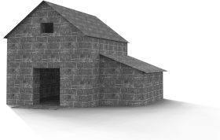

# {{page.title}}
{: #ground-plane}

Le plan au sol fournit une plate-forme horizontale infinie à l'image, qui s'étend jusqu'à l'horizon dans toutes les directions et positionnée à une élévation définie. Le rendu sera beaucoup plus rapide si vous utilisez un plan au sol que si vous utilisez une grande surface plane.

### Activé
{: #groundplane-enabled}
Active le plan au sol

*Plan au sol désactivé (gauche) et activé (droite).*

### Alpha
{: #groundplane-alpha}
Cette option applique un canal alpha transparent sur le plan au sol afin que l'image puisse être combinée avec l'ombre projetée dans une autre image. Voir : [article Wikipedia : Alpha compositing](http://en.wikipedia.org/wiki/Alpha_compositing).

 *Le plan au sol affiche une ombre mais sinon, il est transparent dans l'image.*

### Élévation
{: #groundplane-elevation}
Définit l'élévation du plan au sol au-dessus de zéro.

*Élévation du plan au sol au-dessus de zéro.*

### Matériau
{: #groundplane-material}
Assigne un [matériau](simple-material-properties.html) au plan au sol.

*Plan au sol plus élevé avec une texture d'eau.*