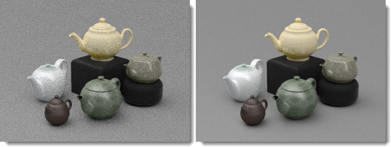

# {{page.title}}
L'éditeur d'images nXt permet de modifier des fichiers images natifs (.nXtImage) produits par une des plates-formes nXt. Ces fichiers natifs conservent toutes les informations recueillies pendant le rendu.
Avec l'éditeur d'image nXt, vous pouvez :

> Ajuster les paramètres du [contrôle de tonalité](image-editor.html#tone-mapping).
> Changer l'intensité de tous les canaux d'éclairage.
> Ajouter des effets spéciaux basés sur l'image : [Brume](image-editor.html#haze), [Flou de profondeur](image-editor.html#depth-blur) et [Éclat](image-editor.html#glare).
> [Enregistrer](image-editor.html#save-tonemapped-image-as) une image dont les tonalités ont été ajustées dans un format bitmap tel que .jpg ou .png.
> Enregistrer les informations de luminance dans un [format HDR](image-editor.html#save-hdr-image-as).
> Voir et enregistrer des canaux masqués supplémentaires : ( [alpha](image-editor.html#alpha-channel), [distance](image-editor.html#distance-channel), [matériau](image-editor.html#material-channel) ) afin de les utiliser en composition avancée. 
> Enregistrer un fichier au format [Piranesi©](http://www.piranesi.co.uk/) (*.epx) qui peut être utilisée pour des rendus non photoréalistes. 
> Utiliser l'[arithmétique](image-editor.html#arithmetic) d'image pour recoller par exemple une image qui a été générée par plusieurs noeuds de la ferme de rendu.
> Enregistrer les [paramètres d'éclairage](image-editor.html#save-lighting-settings-as) utilisés pour générer ce rendu. Ces paramètres peuvent ensuite être utilisés pour générer d'autres rendus.

Pour lancer l'éditeur

> Dans le menu **Flamingo nXt 5.0**, cliquez sur **Plus d'outils &gt; Éditeur d'images de Flamingo nXt**.

## Menu Fichier
{: #file-menu}

### Ouvrir
Ouvre un fichier enregistré au format nXtImage.

### Enregistrer l'image source
Enregistre le fichier nXtImage.

### Enregistrer l'image source sous
Enregistre le fichier nXtImage sous un autre nom.

### Enregistrer une image avec transfert de tonalité sous
{: #save-tonemapped-image-as}
Enregistre l'image modifiée dans un fichier bitmap.

 * JPEG (.jpg)
 * TIFF (.tif)
 * TIFF avec canal alpha (.tif)
 * PNG (.png)
 * PNG avec canal alpha (.png)
 * [Piranesi EPix (.epx)](http://www.piranesi.co.uk/)

Piranesi est un outil de peinture 3D qui crée des images avec une apparence peinte à la main.

### Enregistrer l'image HDR sous
{: #save-hdr-image-as}

 * Fichier HDR (.hdr)
 * Fichier EXR (.exr)
 * EXR avec canal alpha (.exr)

### Enregistrer le masque
{: #save-mask}
Les fichiers nXtImage contiennent trois canaux supplémentaires qui peuvent être utilisés pour des tâches de composition avancée dans la plupart des éditeurs d'image. Ces canaux portent des informations sur le canal alpha, la distance et le matériau pour chaque pixel. Les informations sont encodées dans une image en échelle de gris. Chaque canal peut être observé et enregistré dans un fichier .png.

##### Remarques :

 1. Le canal alpha peut être inclus avec une image dont les tonalités ont été réparties en sélectionnant un format de fichier avec canal alpha lors de l'enregistrement d'une image dont les tonalités ont été réparties.
 1. Les canaux de distance et de matériaux ne sont pas anticrénelés et peuvent laisser apparaître des défauts aux bords marqués. L'ajout d'une petite quantité de flou gaussien à un masque avant de l'utiliser peut aider à adoucir ces bords.
 1. Le canal de matériaux n'encodera que 255 matériaux différents. Si votre modèle contient plus de matériaux, certaines couleurs de masque seront répétées.

#### Canal de matériau
{: #material-channel}
Enregistre le masque du canal de matériau.

#### Canal Alpha
{: #alpha-channel}
Enregistre le masque du canal alpha.

#### Canal de distance
{: #distance-channel}
Enregistre le masque du canal de distance.

### Enregistrer les paramètres d'éclairage sous
{: #save-lighting-settings-as}
Enregistre le [schéma d'éclairage](lighting-tab.html#open-lighting-scheme).

## Menu Image
{: #renderwindowimage}

### Info
{: #info}
Affiche des informations sur l'image.

### Arithmétique
{: #arithmetic}
Permet d'assembler ou de superposer des segments d'images rendus en utilisant la fonction [Image simple de la ferme de rendu](automate-rendering.html#single-images) .

##### Pour assembler des segments d'image :

 1. Dans le menu **Fichier**, cliquez sur **Ouvrir**.
 1. Sélectionnez la première image de la séquence, par exemple, 000000.nXtImage.
 1. Dans le menu **Image**, cliquez sur **Arithmétique** puis sur **Ajouter**.
 1. Sélectionnez toutes les autres images de la séquence.

*Remarque :** Ne sélectionnez pas la première image (000000.nXtImage) à nouveau, sinon elle sera ajoutée deux fois.

#### Ajouter
Ajoute les valeurs de pixel d'une couche sur l'autre. Lorsque les valeurs sont supérieures à 255 (dans le cas de RVB), la couleur blanche est affichée.

#### Soustraire
Soustraie les valeurs de pixel d'une couche dans l'autre. Lorsque les valeurs sont négatives, la couleur noire est affichée.

#### Différence
Soustraie la couche supérieure de la couche inférieure ou inversement afin de toujours obtenir une valeur positive. Le mélange avec le noir ne produit aucun changement car les valeurs de toutes les couleurs sont nulles. Le mélange avec du blanc inverse l'image.

#### Ajout de masque
Tient compte du masque de canal alpha transparent lors du mélange.

#### Combiner les tracés
Combine les images rendues en utilisant le moteur Path Tracer de sorte que par exemple, la combinaison de dix images rendues avec 20 passes chacune donne l'équivalent d'une image rendue avec 200 passes.

*Rendue avec 20 passes (gauche), images de 20 passes combinées pour créer une image de 200 passes (droite).*

### Appliquer le patch
{: #apply-patch}
Insère une image rendue sous forme de portion sélectionnée dans l'image rendue.

### Animation
Vous pouvez animer le changement des informations de l'image.

##### Pour animer des effets d'image

 1. Configurez la première image. Cliquez sur le bouton **Plus (+)** à côté de case **Images clés**.
 1. Modifiez l'image et ajoutez des images clés.
 1. Cliquez sur **Image > Animation** et dans la boîte de dialogue, cliquez sur **Aperçu**.
 1. Une fois terminé, cliquez sur **Animer**.

### Créez un dossier.
Une séquence d'images sera créée. Vous pourrez utiliser ensuite ces images pour créer une animation à l'aide d'un logiciel prévu pour cela.

## Menu Vue
{: #view-menu}
Indique ce qui est affiché dans l'image.

### Image
Affiche l'image rendue originale.

### Image et masque Alpha
Affiche l'image et le masque de canal alpha ensemble.

### Masque de matériau
Affiche le [masque du matériau](image-editor.html#material-channel).

### Masque de distance
Affiche le [masque de distance](image-editor.html#material-channel).

## Utiliser l'éditeur d'images

##### Charger une image

 1.  [Enregistrer](render-window.html#export-to-nxtimage) vos résultats de rendu dans un fichier **.nXtImage**.
 1. Dans le menu **Flamingo nXt**, cliquez sur **Outils &gt Éditeur d'images de Flamingo nXt**.
 1. Dans l'**Éditeur d'image de nXt**, dans le menu Fichier, cliquez sur **Ouvrir** pour charger l'image dans l'éditeur d'images.

## Répartition des tonalités
{: #tone-mapping}
La répartition des tonalités est le procédé de conversion des données de luminance utilisées par nXt en pixels RVB qui peuvent être affichés ou imprimés.

#### Luminosité
{: #brightness}
Voir [Fenêtre de rendu : Luminosité](render-window.html#brightness).


#### Densité
Voir [Fenêtre de rendu : Densité](render-window.html#burn).

#### Saturation
Voir [Fenêtre de rendu : Saturation](render-window.html#saturation).

#### Histogramme
Voir [Fenêtre de rendu : Histogramme](render-window.html#histogram).

## Champs de statut
Les champs de statut sont situés en bas de l'écran. Lorsque vous déplacez le curseur sur l'images, ces champs affichent les informations sur chaque pixel.

#### Pixel
{: #pixel}
Les coordonnées du pixel, mesurées à partir du sommet inférieur gauche.

#### Couleur
{: #color}
Les trois premiers champs contiennent les couleurs RVB affichées dans l'image après la répartition des tonalités. Le quatrième champ affiche le canal alpha (transparence) qui est utilisé pour la composition.

#### Valeur
{: #value}
La valeur de luminance pour chaque sous canal rouge, vert et bleu.

#### Lum
{: #lum}
Une moyenne pondérée des valeurs de luminance enregistrées dans chaque pixel.

#### Profondeur
{: #depth}
La distance entre chaque pixel et le point de vue en mètres. Les valeurs négatives indiquent un pixel de l'arrière-plan.

#### Matériau
{: #material}
Le nom du matériau utilisé pour rendre le pixel.

## Paramètres des effets
Des effets spéciaux peuvent être ajoutés à une image. La plupart de ces effets utilisent les informations supplémentaires que le format d'image nXt enregistre. Par exemple, l'éclat utilise l'espace de luminance en travaillant sur les valeurs réelles de lumière et la brume utilise la distance dans l'image. 

### Brume
{: #haze}
Ajoute une couleur aux pixels les plus éloignés de la caméra. Cet effet peut être utilisé pour ajouter de la brume ou du brouillard dans la scène ou pour masquer un arrière-plan avec de la couleur ou pour changer la couleur de l'arrière plan.

*Image originale (gauche) et avec de la brume (droite).*

#### Intensité
Définit l'intensité de la couleur de la brume.

#### Proche
La distance à partir de la caméra où la brume commencera à ajouter de la couleur à chaque pixel.

#### Sélectionner
Cliquez dans l'image pour indiquer la distance.

#### Lointain
La distance à laquelle l'effet de brume est à son maximum. Pour tous les pixels au-delà de ce point, l'effet maximum de brume est ajouté à chaque pixel.
Entre les distances proche et lointaine l'ajout de la brume augmente de façon linéaire.

#### Sélectionner
Cliquez dans l'image pour indiquer la distance.

#### Couleur
La couleur de la brume.

#### Sélectionner
Cliquez dans l'image pour indiquer la couleur.

### Flou de profondeur
{: #depth-blur}
Puisque chaque pixel de l'image contient une valeur de distance, cette option peut être utilisée pour ajouter du flou dans l'image entre les distances indiquées.

*Image originale (gauche) et avec un flou de profondeur (droite).*

#### Intensité
Indique la quantité de flou.

#### Foyer
{: #depthblurfocus}
Définit une distance dans l'image qui correspondra à la zone de mise au point.

#### Sélectionner
Cliquez dans l'image pour indiquer la distance de mise au point.

#### Zone nette
{: #in-focus-zone}
L'étendue de la zone nette autour de la **Mise au point**. Cette valeur est exprimée en mètres. Tous les pixels à cette distance seront nets et seront ignorés par le filtre de flou. Les pixels au-delà de cette distance seront progressivement estompés avec les pixels adjacents afin de donner l'impression de profondeur.

#### Flou
Contrôle la direction dans laquelle le filtre de flou fonctionnera. La valeur par défaut est définie sur **Arrière-plan**. Ceci signifie que tous les pixels plus éloignés de la caméra que la **Zone nette** deviendront progressivement flous.

*Flou premier plan (gauche) et arrière-plan (droite).*

#### Arrière-plan
Tous les pixels plus éloignés de la caméra que la **Zone nette** seront flous.

#### Premier plan
Tous les pixels plus proches de la caméra que la **Zone nette** deviendront flous.

#### LesDeux
Tous les pixels, qu'ils soient devant ou derrière la **Zone nette** sont flous. Cette option permet d'obtenir rapidement un effet de profondeur de champ. Elle n'est pas aussi précise que la [profondeur de champ](render-tab.html#depthoffieldoption) intégrée qui s'utilise avant le rendu.

### Éclat
{: #glare}
L'éclat affecte les pixels plus clairs que le seuil indiqué en lumens en créant un effet de halo sur les pixels voisins. Seuls les pixels les plus clairs de l'image sont concernés.
Laissez le curseur sur les pixels pour voir l'éclat et lire la valeur totale de lumens de ce pixel.

*Image originale (gauche) et avec de l'éclat (droite).*

#### Intensité
Ajuste la quantité de halo qui apparaît sur les pixels voisins.

#### Seuil
La Limite inférieure de la valeur affectée par le filtre d'éclat. Tous les pixels plus brillants que cette valeur seront affectés.

#### Sélectionner
Cliquez dans l'image pour indiquer la valeur de luminosité.

### Vignette
{: #vignette}
Les couleurs des bords de l'images sont estompées et mélangées pour créer un effet de halo.

*Image originale (gauche) et avec une vignette (droite).*