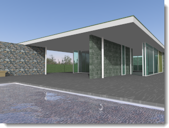
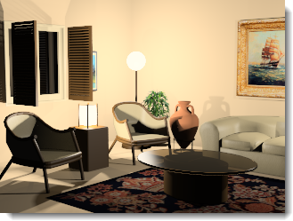

#  {{page.title}}
L'éclairage est la partie la plus importante et la plus souvent négligée lors de la création d'images. Ce n'est pas uniquement une façon d'éclairer le modèle. L'éclairage définit l'ambiance et il s'agit d'un composant clé dans la définition de la scène.

*Image de Christopher Soto Gutiérrez.*

#### Où puis-je trouver les contrôles d'éclairage de Flamingo ?

* Menus > Flamingo nXt 5.0 > Montrer le panneau de configuration.
* Cliquez avec le bouton de droite et cochez Flamingo nXt.

Essayez de respecter les instructions suivantes lorsque vous définissez l'éclairage de votre modèle :

* Commencez avec un préréglage d'éclairage.
* Étant donné que Flamingo nXt simule l'éclairage du monde réel, donnez des informations précises si possible. 
* Évitez d'utiliser des niveaux d'intensité irréalistes pour les sources de lumière.
* Définissez correctement les unités dans le modèle. L'éclairage ne sera pas correct si les unités ne sont pas. Par exemple, si votre modèle est en millimètres, définissez les unités du modèle en millimètres.
* Réglez la luminosité globale du rendu en utilisant le contrôle [Luminosité](render-window.html#brightness) dans la fenêtre d'affichage du rendu. N'essayez pas d'ajuster la luminosité globale de la scène en changeant l'intensité de toutes les sources de lumière ; le réglage d'[exposition automatique](render-window.html#brightness) annulerait cette augmentation. 

Pour améliorer les techniques d'éclairage, soyez attentifs à la lumière et à son influence sur les surfaces. Les matériaux peuvent masquer certains effets d'ombres et de réflexions, certains experts du rendu appliquent donc l'éclairage à leurs modèles avant d'appliquer les matériaux. Essayez de voir la lumière objectivement, comme un appareil photo.

## Préréglages d'éclairage
{: #lighting-presets}
Une bonne option pour commencer à définir un éclairage est d'utiliser les préréglages qui correspondent à des situations d'éclairage du monde réel. Flamingo nXt possède des réglages de l'éclairage qui peuvent vous aider à démarrer avec l'éclairage de votre modèle. De nombreuses autres options d'éclairage sont disponibles, mais les préréglages sont souvent suffisants pour la plupart des rendus. Choisissez le schéma de préréglages qui se rapproche le plus à votre scène.

L'éclairage de Flamingo nXt utilise quatre modes prédéfinis :

> [Éclairage de studio](lighting-tab.html#studio-lighting)
> [Lumière du jour extérieure](lighting-tab.html#exterior-daylight)
> [Lumière du jour intérieure](lighting-tab.html#interior-daylight)
> [Éclairage artificiel](lighting-tab.html#artificial-lighting)

### Éclairage de studio
{: #studio-lighting}
Ce schéma imite l'éclairage d'un studio de photographie. Il est très adapté au rendu d'objets isolés de petite taille ou de taille moyenne.  Utilisez-le également pour une scène bien éclairée par un environnement HDR.

{: .float-img-left} Un fichier image à grande plage dynamique (HDR) fournit l'éclairage principal. La lumière de l'image HDR imite les niveaux d'éclairage intérieur du studio. Les paramètres HDR sont définis dans l'[onglet Ciel](sun-and-sky-tabs.html#sky). Vous pouvez également ajouter des lumières artificielles à votre scène en utilisant l'onglet Lumières. L'arrière-plan visible dans le préréglage Studio est noir.

L'éclairage Studio est optimisé pour le rendu de petits articles tels que des bijoux ou des produits industriels qui sont présentés sur des supports ou des tables. Dans ce schéma, le soleil est désactivé et un ciel défini avec une image HDR apporte une base de réflexion pour les objets brillants.

Pour un plus grand contrôle, utilisez les sources de lumière pour éclairer la scène. Lors de la mise en place des lumières d'un studio, il est important d'avoir un éclairage scénique. Cet éclairage est obtenu en produisant de grands contrastes. En d'autres termes, les zones sombres sont aussi importantes que les zones claires. L'éclairage scénique demande un certain nombre de sources de lumière placées de façon à créer des zones très sombres et des zones très claires.

Les techniques d'éclairage pour la photographie sont généralement les mêmes que l'éclairage pour le rendu. Si vous voulez en apprendre plus sur ce thème, vous devriez donc commencer par un livre sur l'éclairage en photographie. Pour plus d'informations sur les paramètres d'un éclairage de studio, consultez la section : [Bases de l'éclairage de studio](../guides/studio-lighting-basics.html).

### Lumière du jour extérieure
{: #exterior-daylight .clear-img}
Ce schéma simule la lumière du jour pour des rendus extérieurs utilisant le soleil et le ciel naturels.

{: .float-img-right} Définissez les paramètres dans les onglets [Soleil](sun-and-sky-tabs.html#sun) et [Ciel](sun-and-sky-tabs.html#sky). Définissez les [angles du soleil](sun-and-sky-tabs.html#set-azimuth-and-altitude) directement ou utilisez la [position géographique](sun-and-sky-tabs.html#set-location-on-earth), la date et l'heure. L'arrière-plan visible par défaut correspond au ciel simulé.

L'éclairage de l'extérieur d'un bâtiment est le modèle d'éclairage le plus simple. La plupart des scènes extérieures n'auront besoin de rien d'autre que le [soleil](sun-and-sky-tabs.html#sun)  par défaut.

Lorsque le [soleil](sun-and-sky-tabs.html#sun) est activé, la scène doit être définie comme [intérieure](#interior) ou [extérieure](#exterior) . En effet, la contribution de la lumière du ciel, de la lumière réfléchie par le sol et de la lumière réfléchie par les autres surface est très différente dans les scènes intérieures et extérieures. L'utilisation des bons paramètres [Intérieur/Extérieur](#indirect) donne un éclairage très efficace et réaliste.

Parfois il est facile de déterminer si une scène est un intérieur ou un extérieur. Si le point de vue est en dehors d'un bâtiment, il s'agit d'une scène extérieure. Si le point de vue se trouve à l'intérieur d'une pièce, il s'agit d'un intérieur. Mais certains types de scènes ne sont pas aussi évidents. Prenez par exemple les cours, les belvédères, les vues décomposées et les sections. Si une cour est beaucoup plus large que haute, elle laisse alors pénétrer une grande quantité de lumière du ciel, essayez de l'éclairer comme une scène extérieure. Si elle est plus haute que large, essayez d'éclairer la scène comme un intérieur. Dans ce cas, un des trucs est d'ajouter des entrées de lumière du jour au-dessus de la cour pour aider à diriger la lumière du ciel dans la scène.

Les lumières peuvent également simuler l'éclairage d'un paysage. Utilisez des projecteurs pour mettre en valeur des caractéristiques architecturales et les arbres. Cet effet est très utile pour les scènes de nuit ou très sombres. Pendant la journée, le soleil sera normalement plus puissant que tout autre éclairage artificiel dans une scène extérieure, comme dans le monde réel.

Les vues éclatées, les sections et les dessins techniques mentionnés ci-dessus sont également assez compliqués. La décision dépend des résultats désirés. Pour une scène extérieure avec le rendu le plus rapide, utilisez la méthode de rendu extérieur. Si cette méthode ne donne pas une image assez intéressante, essayez d'utiliser un rendu intérieur. L'intérieur peut être plus intéressant mais la définition de l'éclairage prend plus de temps.

### Lumière du jour intérieure
{: #interior-daylight .clear-img}
Ce schéma simule un intérieur éclairé par la lumière naturelle.

{: .float-img-left} Il est divisé en deux composants : la lumière directe du soleil  transmise par le [soleil](sun-and-sky-tabs.html#sun) et la lumière indirecte du soleil transmise par le [ciel](sun-and-sky-tabs.html#sky), le sol et les autres objets extérieurs.

Les paramètres du [soleil](sun-and-sky-tabs.html#sun) et du [ciel](sun-and-sky-tabs.html#sky) sont similaires aux préréglages d'un éclairage [extérieur](lighting-tab.html#exterior-daylight).
La lumière directe du soleil implique un calcul direct et il vous suffit d'indiquer l'heure, la date et le lieu afin d'assurer la précision des résultats.

Remarques sur les rendus intérieurs :
{: .clear-img}

* Dans la mesure du possible, essayez d'utiliser des valeurs précises pour vos [lumières](lights-tab.html), pour les [paramètres du ciel](sun-and-sky-tabs.html#sky) ainsi que les vitres des fenêtres.
* Étant donné que le soleil et le ciel sont plus brillants que les autres lumières, vous ne verrez peut-être pas beaucoup de différence lors de l'ajout d'un éclairage artificiel si le soleil est activé. C'est normal. Évitez d'augmenter artificiellement la puissance de vos sources de lumière.
* Vous pouvez baisser l'intensité du [soleil](sun-and-sky-tabs.html#sun-intensity) ou du [ciel](sun-and-sky-tabs.html#sky-intensity). Ces paramètres simulent un ciel dégagé, la réduction de leur intensité permettra de simuler des conditions plus sombres, comme s'il y avait des nuages.
* Un rendu [multi-canaux](lights-tab.html#channel) peut vous aider à obtenir l'image que vous voulez, tout en conservant des données précises.

### Éclairage artificiel
{: #artificial-lighting}
{: style="float: right; padding-left: 25px;"} Ce schéma offre une simulation d'un intérieur architectural éclairé par des lampes la nuit. Utilisez l'[onglet des lumières](lights-tab.html) ou les [commandes de lumière de Rhino](lights-tab.html#rhino-light-commands) pour insérer et gérer des objets lumineux dans votre modèle.

L'éclairage indirect, c'est-à-dire la lumière qui est réfléchie par les surfaces, est activé lorsqu'un des deux préréglages intérieurs est sélectionné et désactivé pour l'éclairage studio et extérieur. Ce type d'éclairage est un composant important d'une simulation d'éclairage intérieur. Pour les extérieurs et les modèles de studio, les effets de l'éclairage indirect sont plus subtils, c'est pourquoi il est désactivé par défaut.

### Éclairage personnalisé
{: #custom  style="clear:both;"}
Cet onglet permet de mélanger tous les paramètres d'éclairage.  Par exemple, si la scène est une lumière du jour extérieure dans laquelle un environnement HDR a été ajouté, utilisez l'onglet Personnalisé pour désactiver ou activer des parties du modèle d'éclairage.  Si les valeurs d'un schéma par défaut sont modifiées, le schéma devient un schéma personnalisé.

####  [Soleil](sun-and-sky-tabs.html#sun)
{: #sun}
Vous pouvez activer et désactiver l'onglet du soleil dans le menu contextuel. L'onglet [Soleil](sun-and-sky-tabs.html#sun) permet de modifier les paramètres de la position du soleil. 

*Soleil activé et désactivé.*
Le soleil est une source de lumière directionnelle très brillante située infiniment loin du modèle. Les contrôles du soleil définissent sa direction en utilisant des coordonnées sphériques. Pour plus d'informations, consultez la rubrique sur l'[onglet Soleil](sun-and-sky-tabs.html#sun).

####  [Ciel](sun-and-sky-tabs.html#sky)
{: #sky}
Définissez le canal du ciel sur une des quatre options :

> Auto
> HDRI
> Couleur
> Image

Pour plus d'informations, consultez la rubrique sur l'[onglet Ciel](sun-and-sky-tabs.html#sky).
Le ciel est une source de lumière hémisphérique située infiniment loin du modèle.

#### Désactivé
{: #off}
Désactive le ciel.

#### Auto
{: #auto}
Offre un modèle analytique basé sur les conditions du ciel dans le monde réel. Les paramètres de l'onglet [Soleil](sun-and-sky-tabs.html) contrôlent l'apparence et les qualités de lumière du ciel.

#### Image HDR
{: #hdri}
Une image HDR apporte une base pour les réflexions des objets brillants.

#### Couleur
{: #color}
Le ciel sera composé d'une couleur unie ou d'un dégradé de deux ou trois couleurs et il utilisera des contrôles similaires à ceux de la section [Environnement : Arrière-plan d'une couleur ou dégradés](environment-tab.html#color-and-gradient-backgrounds).

#### Image
{: #image}
Le ciel est constitué d'une image avec une projection plane, cylindrique ou sphérique, comme dans [Environnement : Image](environment-tab.html#image).

### Luminosité de studio
{: #studio-brightness}
La luminosité du [soleil](sun-and-sky-tabs.html) et du ciel sont réduites, afin d'imiter les niveaux d'éclairage intérieur d'un studio de photographie.

*Luminosité de studio désactivée (gauche) et activée (droite).*

### Lumières
{: #lights}
Active ou désactive l'éclairage artificiel.

*Lumières activées (gauche) et désactivées (droite).*

### Indirect
{: #indirect}
Définit l'éclairage qui se réfléchit à partir des surfaces. Par défaut, cette option est activée pour l'éclairage intérieur et désactivée pour l'extérieur et l'éclairage de studio. Il est possible d'activer l'éclairage indirect pour les rendus d' extérieurs.

#### Méthode
Définit la méthode de calcul de l'éclairage indirect.

#### Désactivé
L'éclairage indirect est désactivé.

#### Intérieur
{: #interior}
Optimise l'éclairage indirect pour les scènes intérieures.

#### Extérieur
{: #exterior}
Optimise l'éclairage indirect pour les scènes extérieures.

L'éclairage indirect réfléchi à partir des autres surfaces peut apporter de la subtilité du réalisme à vous rendues extérieures. En particulier, les parties inférieures d'objets suspendus, tels que les avancées de toit ou les balcons, sont rendues avec plus de précision avec un éclairage indirect.

#### Rebonds
{: #bounces}
Définit le nombre de réflexions entraînées par un éclairage indirect.

### Lumière ambiante
{: #ambient}
La lumière ambiante est une lumière constante ajoutée au rendu. Ces paramètres contrôlent l'intensité de la lumière ambiante sous forme de pourcentage de la lumière ambiante totale calculée dans la scène.

En général, si la lumière ambiante est réduite, les images présentent un contraste plus important. Une lumière ambiante trop importante peut entraîner une image plate et fade et une lumière ambiante trop faible peut donner un contraste trop important.

#### Aucune
Aucune lumière ambiante.

#### Extérieur
Optimise la lumière ambiante pour les scènes extérieures.

#### Intérieur
Optimise la lumière ambiante pour les scènes intérieures.

#### Studio
Optimise la lumière ambiante pour les scènes de studio.

## Enregistrer un éclairage personnalisé

### Enregistrer le schéma d'éclairage
{: #save-lighting-scheme}
 Enregistre le schéma d'éclairage actuel.

### Ouvrir un schéma d'éclairage
{: #open-lighting-scheme}
 Ouvre un schéma d'éclairage enregistré.