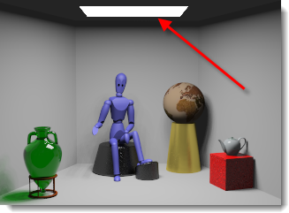

#  {{page.title}}
Les sources de lumière artificielles utilisent les lumières standards de Flamingo en ajoutant des propriétés pour contrôler la distribution de la lumière. Lorsque vous utilisez des sources de lumière, choisissez le type qui représente le mieux la lampe réelle que vous modélisez.

## Onglet Lumières
{: #light-tab}
L'onglet Lumières affiche toutes les lumières artificielles de la scène. La rubrique couvre l'onglet Lumières de Flamingo. Il existe également un [onglet Lumières de Rhino](http://docs.mcneel.com/rhino/5/help/fr-fr/index.htm#commands/lights.htm).  Flamingo et Rhino synchronisent les paramètres d'éclairage des deux onglets. L'onglet Lumières de Flamingo est un peu plus flexible grâce à des [propriétés de lumière](#light-properties) supplémentaires.

L'onglet Lumières doit être activé à travers les [préréglages d'éclairage](lighting-tab.html#lighting-presets) ou les [paramètres d'éclairage personnalisé](lighting-tab.html#sun).

<!-- #### Is this supposed to be a code? It's showing up as ####. To fix this, there needs to be a new line above the headline for the markdown to work.-->

#### Où puis-je trouver les contrôles d'éclairage de Flamingo ?
Si l'onglet Lumières est activé à travers les [préréglages d'éclairage](lighting-tab.html#lighting-presets) ou les [paramètres d'éclairage personnalisé](lighting-tab.html#sun), l'onglet des lumières se trouve ici :

 1. Barres d'outils >Barre d'outils de Flamingo nXt
 1. Menus > Flamingo nXt 5.0 > Montrer le panneau de configuration > Onglet Flamingo > Lumières

Vous pouvez insérer des lumières, les activer et les désactiver, et changer l'intensité et le canal de chaque lumière dans l'onglet Lumières. 

Flamingo permet d'insérer différents types de lumières :

> [Marquer des objets en tant que lumières](#tag-objects-as-lights)
> [Projecteur](#spotlight)
> [Lumière ponctuelle)](#pointlight)
> [Lumière rectangulaire](#rectangularlight)
> [Lumière linéaire](#linearlight)

**Remarque :** Les lumières directionnelles de Rhino  ne sont pas prises en charge. Elles n'apparaissent pas dans la liste des lumières et elles ne peuvent pas posséder de propriétés de Flamingo nXt.

Certaines propriétés de lumières sont affichées dans le tableau de l'onglet Lumières afin de pouvoir les modifier rapidement.

Propriétés contenues dans le tableau :

 >[Activer/Désactiver](#on)
 >[Nom](#name)
 >[Distribution](#light-distribution)
 >[Objectif](#aim-light)
 >[Watts](#watts)
 >[Canal](#channel)

Un clic droit sur l'onglet Lumières permet d'ouvrir le menu des [options supplémentaires](#additional-options).

Accédez aux [propriétés des lumières](#light-properties) en cliquant sur la lumière puis sur l'icône Propriétés de la lumière  dans le [panneau des propriétés objet](http://docs.mcneel.com/rhino/5/help/en-us/commands/properties.htm).

## Types de lumières
{: #light-types}
Les lumières peuvent être insérées à partir de la barres d'outils de Rhino ou de l'onglet Lumières de Flamingo. Les objets peuvent être marqués en tant que lumières avec Flamingo. 

####  Marquer des objets en tant que lumières
{: #tag-objects-as-lights}
Tout objet pouvant être rendu (surface, solide, etc.) peut être marqué en tant que source de lumière et peut recevoir des propriétés de lumière. D'autres propriétés, telles que la [distribution](#light-distribution), la [direction](#aim-light), et l'[intensité](#watts) peuvent être définies. Les objets marqués en tant lumières affichent une application d'aperçu indiquant la direction et la position du centre de la lumière.

*Phares LED marqués en tant que sources de lumière*

####  Projecteur
{: #spotlight}
Un projecteur est une lumière avec une distribution conique dans une direction donnée. Les propriétés de la lumière comprennent un [rayon de la source](#radius), un [angle de faisceau](#beam-angle), un rayon d'atténuation et une direction. Plus le rayon de la source est grand, plus les ombres de la lumière seront douces. Un disque est visible par défaut à l'emplacement de la lumière. Vous trouverez des informations sur la modification de la position, de la direction et de l'angle du faisceau à l'écran à l'aide de poignées dans la rubrique [Projecteur](http://docs.mcneel.com/rhino/5/help/fr-fr/commands/spotlight.htm) de l'aide de Rhino.

*Un projecteur dirigé sur la boîte rouge*

####  Lumière ponctuelle
{: #pointlight}
Les lumières ponctuelles sont de petites sphères qui distribuent une lumière uniforme dans toutes les directions. Il est possible de définir le [rayon de la source](#radius) de ces lumières. Plus le rayon est grand, plus les ombres projetées par la lumière sont douces. Une sphère de lumière est visible par défaut à l'emplacement de la lumière lors du rendu. Des effets insolites peuvent se produire si la lumière ponctuelle est partiellement masquée par un objet qui coupe la lumière. 

*Une petite lumière ponctuelle près du mur blanc*

####  LumièreRectangulaire
{: #rectangularlight}
Imite un spot encastré équipé d'un diffuseur ou de déflecteurs. La lumière est distribuée de façon diffuse en fonction de l'orientation du rectangle. Une flèche de direction est dessinée au centre de la lumière. L'intensité maximale est diffusée en face du rectangle. La lumière diminue ensuite lorsqu'elle s'éloigne du centre du rectangle. Un rectangle blanc est visible par défaut lors du rendu. Ces rectangles ne doivent pas être insérés à la même hauteur que le plan du plafond. Pour des résultats plus réguliers, les lumières doivent être placées légèrement en-dessous du plafond. Vous trouverez des informations sur la modification de la position, de la direction et de l'angle du faisceau à l'écran à l'aide de poignées dans la rubrique [Lumière rectangulaire](http://docs.mcneel.com/rhino/5/help/fr-fr/commands/spotlight.htm) de l'aide de Rhino.

*Une lumière rectangulaire juste en dessous du plafond*

####  LumièreLinéaire
{: #linearlight}
Distribue la lumière sur un modèle cylindrique qui imite un néon. Il est possible de définir le [rayon de la source](#radius) et la longueur de ces lumières. Plus le rayon est grand, plus les ombres projetées par la lumière sont douces. Un cylindre de lumière est visible par défaut à l'emplacement de la lumière lors du rendu. Des effets insolites peuvent se produire si la lumière cylindrique est partiellement masquée par un objet qui coupe la lumière. Utilisez les points de contrôle de Rhino pour activer les poignées des lumières afin de les modifier à l'écran. 

## Propriétés de la lumière
{: #light-properties}
Lorsque Flamingo est le moteur de rendu actif dans Rhino, des propriétés supplémentaires peuvent être assignées aux lumières. Seules certaines propriétés sont communes à toutes  lumières.

#### Nom
{: #name}
Le nom de l'objet lumineux. Il permet de facilement différencier les lumières de même type dans le modèle. 

####  Activer/Désactiver
{: #on}
Active et désactive la lumière. Dans le tableau des lumières, si l'icône de l'ampoule est en jaune, la lumière est allumée. Si l'ampoule est grise, la lumière sera désactivée dans le rendu. Double cliquez sur l'icône pour activer ou désactiver la lumière. La boîte de dialogue des propriétés possède une case Activée/Désactivée. 

#### Visible
{: #visible}
Par défaut, les lumières sont affichées sous forme de sources de lumière brillantes dans le rendu. En désactivant la propriété Visible, l'objet de la lumière sera invisible dans le rendu. Mais la lumière sera toujours projetée dans la scène. 

#### Distribution de la lumière *([Objets marqués uniquement](#tag-objects-as-lights))*
{: #light-distribution}
Lorsqu'un objet est marqué en tant que lumière, utilisez ce paramètre pour définir le mode utilisé pour projeter la lumière dans la scène. Dans le panneau Lumière, double cliquez sur la cellule Distribution pour voir le menu déroulant avec les options. Il existe différents types de distribution : [Toutes les directions](#pointlight), [Spot](#spotlight) et [Diffuse](#rectangularlight). Pour les options Spot et Diffuse, une [direction](#aim-light) doit être indiquée.

#### Diriger la lumière *([Objets marqués uniquement](#tag-objects-as-lights))*
{: #aim-light}
Pour les lumières marquées ayant une distribution Spot ou Diffuse, indiquez une direction.   Double-cliquez sur l'icône "Objectif >>" et suivez les invites de la ligne de commandes.

#### Watts
{: #watts}
Définit la puissance électrique de la lumière. Nous recommandons de commencer avec des valeurs réalistes pour la scène. Double cliquez sur la cellule dans le tableau pour changer la valeur. 

#### Angle du faisceau *([Projecteurs uniquement](lights-tab.html#spotlight))*
{: #beam-angle}
L'angle en degrés qui contrôle la largeur de la lumière émanant de la source. Cette valeur peut également être modifiée en utilisant les poignées à l'écran.  Vous trouverez des informations sur la modification à l'aide de poignées dans la rubrique [Projecteur](http://docs.mcneel.com/rhino/5/help/fr-fr/commands/spotlight.htm) de l'aide de Rhino.

#### Rayon
{: #radius}
Taille de la source de lumière visble. Les lumières plus petites projettent des ombres plus précises.

#### Couleur
{: #color}
La couleur de la lumière à partir de laquelle la source émane.

#### Utiliser la couleur du matériau *([Objets marqués uniquement](#tag-objects-as-lights))*
Utilise la couleur du matériau assigné à l'objet lumineux pour définir la lumière qu'il produit.

#### Canal
{: #channel}
Les lumières peuvent être liées à un des huit canaux disponibles. Les canaux permettent d'ajuster l'éclairage directement dans l'image rendue. Cette fonction est très utile pour travailler sur l'équilibrage de plusieurs sources de lumière dans un rendu. Pour plus d'informations, voir la rubrique [Canaux de rendu](render-channel.html).

#### Fichier IES
{: #iesfile}
Les fichiers IES (Illuminating Engineering Society) sont des fichiers de photométrie qui définissent la distribution de la lumière à partir d'une source de lumière. Les fabricants de luminaires fournissent souvent ces fichiers. En utilisant un fichier IES pour définir votre distribution, vous pouvez décrir plus précisément votre source de lumière. La géométrie de l'objet de lumière marqué n'a pas de relation avec la distribution de la lumière. La définition de la distribution de la lumière provient uniquement du fichier de photométrie.

Remarques :

* Flamingo nXt est compatible avec les fichiers goniométriques de Type C, dont font partie la plupart des fichiers IES. Les fichiers de Type A, parfois utilisés pour l'industrie automobile pour définir des phares et ceux de Type B, parfois utilisés pour définir des projecteurs ne sont pas pris en charge.
* Les distributions IES comprennent les effets des éléments composant le luminaire, tels que les déflecteurs, les réflecteurs et les diffuseurs.
* Les distributions IES sont souvent asymétriques, il est donc nécessaire de définir non seulement une cible mais également un angle de rotation pour diriger la source de lumière.

#### Luminosité à partir d'un fichier
Utiliser l'intensité enregistrée dans le fichier IES. Si cette option n'est pas cochée, le paramètre [Watts](lights-tab.html#watts) est utilisé.

## Menu des options supplémentaires
{: #additional-options}
Accédez à d'autres options pour les lumières en cliquant avec le bouton de droite dans le tableau. 

####  Activée
[Active et désactive](#on) la lumière.

#### Supprimer
Supprime la lumière sélectionnée.

#### Supprimer la marque de lumière
Supprime la [marque](#tag-objects-as-lights) qui transforme un objet en lumière.

#### Propriétés
Permet d'accéder aux [propriétés](#light-properties) de cette lumière. 

#### Sélectionner des objets et les éléments correspondants
Sélectionne la lumière dans la fenêtre.