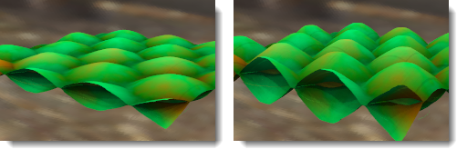

#  {{page.title}}

Les matériaux peuvent être créés à partir d'images. Scannez des photos ou des objets tels que de la  de la moquette, créez des motifs dans un programme de dessin ou utilisez des images provenant d'autres sources.

Imaginez que le matériau se prolonge infiniment dans toutes les directions de l'espace. Le matériau ne devient visible que lorsqu'un objet passe à travers. Les motifs se répètent infiniment (mosaïque) dans les quatre directions avec une échelle déterminée.

Les petites images, qui peuvent être accolées sans que la jointure ne soit visible donnent de meilleurs résultats. Si la mosaïque ne se crée pas correctement, utilisez l'option Mirror tiles pour copier l'image par symétrie. Cette méthode permet de s'assurer que les bords coïncident.

**Remarque :** Pour qu'une image ne couvre qu'une seule partie d'un objet (étiquette sur une bouteille de vin ou logo sur un produit) utilisez plutôt la fonction [décalcomanie](properties-decal.html).

Les placages d'images peuvent être utilisés de plusieurs façons. Une des méthodes les plus courantes est d'utiliser l'image d'un matériau réel pour définir la couleur.

## Nom
Les textures d'images peuvent être nommées. Ce nom est utilisé par la bibliothèque de textures du RDK et n'a pas d'impact réel sur Flamingo. 

## Image de Flamingo

### Aperçu de l'image
{: #image-preview}
Affiche un aperçu du fichier image sélectionné. Laissez le curseur sur l'image pour voir le nom du fichier image. Cliquez sur l'image pour choisir une autre image. 

#### Résolution de l'image
{: #image-resolution}
Affiche la résolution en pixels du fichier image actuel.

### Mosaïque
{: #tiles}
Les placages d'image utilisés dans les définitions de matériau sont toujours répétés (mosaïque). Ces paramètres définissent la taille de chaque carré dans les unités du modèle.

#### Largeur/Hauteur
{: #width-height}
Définit la taille de la mosaïque en unités du modèle.  




### Type de placage
{: #mapping-type}
Les images sont normalement appliquées au canal de couleur. Mais il existe d'autres façons d'utiliser les images. Les images peuvent être définies en tant que :

> [Standard](#standard)
> [Normale](#normal)
> [Déplacement](#displacement)

### Standard
{: standard}
L'image apporte de la couleur et un relief apparent au matériau. Utilisez les valeurs d'intensité et de relief pour contrôler comment l'image joue sur le matériau. 

#### Intensité de la couleur
{: #color}
Détermine l'influence de l'image sur l'apparence du matériau. Dans l'exemple ci-dessous, le matériau de base est coloré en magenta. L'intensité de la couleur diminue jusqu'à ce que la couleur de base soit entièrement masquée par la texture en noir et blanc.

*Intensité de la couleur 0.2, 0.5, 1.0.*

#### Intensité du relief
{: #bump}
Simule des reliefs et des plis sur la surface d'un objet en perturbant les normales de surface de l'objet. L'objet lui-même n'est pas modifié. Dans l'image, le matériau de gauche utilise un placage de déplacement alors que celui de droite utilise un placage de relief défini sur sa valeur la plus élevée. Un relief avec une valeur négative inversera l'effet. Le bord et l'ombre sont lisses pour le matériau avec le placage de relief. Voir : [Article de Wikipedia : Placage de relief](https://fr.wikipedia.org/wiki/Placage_de_relief).

*Intensité du relief : 0,5 (gauche) et 1 (droite).*

### Normal
{: #normal}
Imite l'éclairage des parties saillantes et des creux sans utiliser de polygones supplémentaires pour le maillage de rendu. Voir : [Article de Wikipedia : Normal mapping](http://en.wikipedia.org/wiki/Normal_mapping).

Les placages normaux fonctionnent comme les placages de relief étant donné qu'ils modifient la normale de la surface. L'effet est fondamentalement similaire au relief ; mais les placages normaux permettent un meilleur contrôle sur la normale qu'un relief. Un placage de relief utilise la moyenne grise des valeurs RVB d'une image. Le RVB d'un placage normal correspond à la modification des valeurs XYZ de la normale. Le canal bleu de l'image contrôlant la direction Z de la normale, les placages normaux ont une couleur bleu importante. 

### Déplacement
{: #displacement}
Le placage d'image déplace le maillage de rendu de la surface à partir des valeurs de couleur de l'image. L'effet produit est un changement de position géométrique de la surface. Le déplacement se fait souvent le long de la normale de la surface. Voir : [Article de Wikipedia : Displacement mapping](https://fr.wikipedia.org/wiki/Displacement_mapping).

 ** Remarque :** utilisez le placage de déplacement avec parcimonie pour les petits objets. Le déplacement augmente considérablement le temps de rendu.

#### Hauteur
{: #height}
La hauteur du point le plus haut du déplacement.

#### Décalage
{: #offset}
Définit le point de départ du déplacement par rapport à la normale de la surface. Le déplacement peut se produire entièrement en dehors, à l'intérieur et de part et d'autre de la pièce.  

*Décalage Z = -1.0*

*Décalage Z = -0.5*

*Décalage Z = -0.0*

#### Taille d'une facette
{: #facet-size}
La taille des facettes du maillage de déplacement. Le déplacement sera plus détaillé mais la taille du rendu et la mémoire utilisée seront également plus importantes. 

## Image avancée de Flamingo
{: #advanced}
Une image de Flamingo sera normalement appliquée au canal principal de couleur d'un matériau. La boîte de dialogue des options avancées de Flamingo permet de définir d'autres canaux affectés par l'image. Ces canaux sont utilisés pour obtenir des effets très particuliers. 

####  Couleur de base
Il s'agit du paramètre par défaut.  Une image affectera la [couleur](advanced-material-properties-main.html#color) d'un matériau. 

####  Couleur spéculaire
Dans ce cas, c'est la couleur du [canal de réflexion](advanced-material-properties-main.html#highlight-color) définie à partir de la couleur de l'image en ce point, qui est affectée. 

####  Intensité spéculaire
Cette option modifiera la [quantité de réflexion](advanced-material-properties-main.html#intensity) calculée à partir de l'échelle de gris de l'image en ce point. Elle est souvent utilisée dans les ensembles de texture en tant que placage spéculaire. 

####  Netteté du reflet
Cette option modifiera la netteté par rapport au flou du [reflet](advanced-material-properties-main.html#intensity) calculée à partir de l'échelle de gris du placage en ce point. 

#### Forme du reflet
{: #advanced-highlight-shape}
Joue sur la forme du reflet.

####  Transparence
Cette option modifiera la quantité de [transparence](advanced-material-properties-transparency.html) du matériau calculée à partir de l'échelle de gris de l'image.

####  Translucidité
Cette option modifiera la quantité de [translucidité](advanced-material-properties-transparency.html#translucency) du matériau calculée à partir de l'échelle de gris de l'image.

####  Atténuation
Cette option modifiera la quantité d'[atténuation](advanced-material-properties-transparency.html#attenuation) du matériau calculée à partir de l'échelle de gris de l'image.

#### Décalage X/Y
{: #advanced-x-y-offset}
Décale le matériau à partir des axes X et Y.

#### Rotation
Une rotation sera appliquée au placage d'image. Utilisez pour faire pivoter l'image de 90 ou 180 degrés si nécessaire afin de la réorienter. 