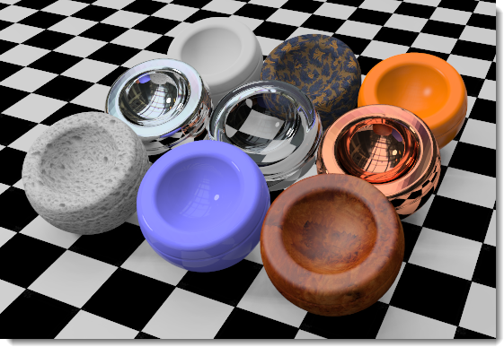
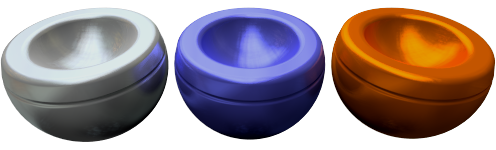
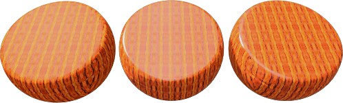
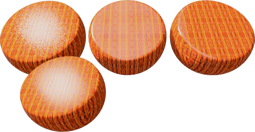
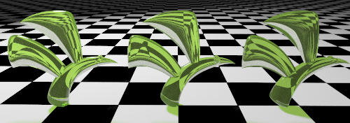
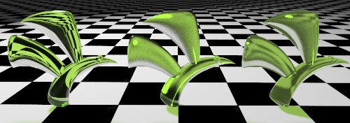

# {: .inline} {{page.title}}

Flamingo possède des [matériaux simples](material-type-simple.html) et des matériaux plus complexes. Les matériaux complexes comprennent tous les groupes de propriétés disponibles pour un matériau. Utilisez les matériaux complexes pour avoir un maximum de flexibilité et de contrôle sur un matériau. 

Les propriétés des matériaux complexes sont divisées en plusieurs groupes :

* [Nom](#name)
* [Matériau algorithmique](#procedures)
* [Propriétés avancées du matériau](#advanced-materials-properties)
* [Finition réfléchissante ](#reflective-finish-and-highlight)
* [Propriétés de transparence](#transparency)
* [Textures algorithmiques](#bump-patterns)
* [Textures bitmap](#textures)
* [Notes](#notes)

## Nom du matériau
{: #name}
Cette section indique le nom du matériau dans le modèle de Rhino.  Les matériaux sont enregistrés dans le modèle de Rhino. Ce qui signifie qu'un matériau portant le même nom dans la bibliothèque ou un autre modèle ne sera pas affecté par les modifications réalisées sur le matériau de ce modèle. Pour utiliser un matériau dans un autre modèle il doit toit d'abord être exporté vers la [bibliothèque](libraries.html). Le nom du matériau servira également à définir le nom du fichier exporté.

## Matériau algorithmique
{: #procedures}
L'arbre des algorithmes combine un ou plusieurs matériaux en utilisant des règles pour définir l'interaction entre eux. L'arbre affiche les composants utilisés pour créer ce matériau et vous permet d'ajouter des composants. Pour des matériaux standards, il n'y aura qu'un seul composant dans la liste : Base.

Chaque algorithme combine deux sous-matériaux en utilisant une méthode déterminée. Chaque sous-matériau peut à son tour être constitué d'un algorithme, en combinant deux sous-matériaux. De cette façon, des matériaux extrêmement élaborés peuvent être créés à partir de composants simples. Algorithmes permettant de combiner des matériaux : [Mélange angulaire](procedural-materials.html#angular-blend), [Mélange](procedural-materials.html#blend), [Marbre](procedural-materials.html#marble), [Granit](procedural-materials.html#granite), [Mosaïque](procedural-materials.html#tile) et [Bois](procedural-materials.html#wood).

Par exemple, le [Marbre](procedural-materials.html#marble) combine un matériau de base et un matériau de veine en utilisant un motif en tourbillon. 

##### Pour ajouter un algorithme

1. Cliquez avec le bouton de droite sur Base dans la fenêtre Matériau algorithmique.
1. Dans le menu, cliquez sur un type d'algorithme.

  * [Base](procedural-materials.html#base)
  * [Mélange angulaire](procedural-materials.html#angular-blend)
  * [Mélange](procedural-materials.html#blend)
  * [Granit](procedural-materials.html#granite)
  * [Marbre](procedural-materials.html#marble)
  * [Mosaïque](procedural-materials.html#tile)
  * [Bois](procedural-materials.html#wood)

##### Pour supprimer un algorithme

1. Dans la fenêtre Matériau algorithmique, cliquez avec le bouton droit sur le nom de l'algorithme.
1. Dans le menu, cliquez sur Supprimer.

## Propriétés avancées du matériau
{: #advanced-materials-properties}



#### Reflet et finition réfléchissante
{: #reflective-finish-and-highlight}
Ces paramètres font varier la façon dont un matériau réfléchit la lumière et les objets. L'effet de reflet est normalement associé avec les zones des matériaux brillants où la lumière rencontre l'objet. L'effet réfléchissant est normalement défini avec des réflexions telles un miroir reflétant les objets dans le reste de la scène. Il est important de savoir que le chrome et les autres matériaux réfléchissants ne sont pas rendus correctement s'ils ne peuvent pas refléter quelque chose. Lorsque vous travaillez avec des matériaux réfléchissants, pensez également à un environnement intéressant et d'autres objets que les matériaux pourront réfléchir. 
 Remarque : Pour activer ces paramètres, la valeur d'intensité doit être supérieure à zéro.

#### Couleur du reflet
{: #highlight-color}
La couleur du reflet est la couleur ajoutée par le matériau aux réflexions. Trois paramètres sont possibles pour ce contrôle : Blanc, Métallique et Personnalisé. 

#### Blanc
Les matériaux avec un reflet blanc n'ajouteront aucune couleur aux réflexions. Les matériaux avec un reflet blanc sont courants et tendent à ressembler aux peintures standard, aux plastiques ou à une finition de miroir.

#### Métallique
{: #metallic}
Définit la même couleur pour le reflet que pour la couleur de base de l'objet. De nombreuses finitions de métaux utilisent normalement la couleur de base comme couleur réfléchissante. Cette option utilise la couleur de base du matériau comme couleur réfléchissante. 

#### Personnalisé
Pour certaines finitions très spéciales, la réflexion de l'objet sera d'une couleur différente de celle du matériau.  Il s'agit normalement de matériaux composés de plusieurs couches. Utilisez l'option Personnalisé pour définir la couleur du reflet. Utilisez le [sélecteur de couleur](select-color.html) {: .inline} pour sélectionner une couleur de réflexion.

#### Intensité
{: #intensity}
Ajuste l'intensité du reflet. Des valeurs plus petites tendent à créer des objets brillants qui réfléchissent la lumière mais pas les objets autour. Des valeurs élevées augmentent la taille et l'intensité du reflet et des réflexions.  Les valeurs les plus élevées créeront un matériau tel un miroir, réfléchissant les autres objets et l'environnement de la scène. 

#### Fresnel
{: #fresnel}
Prononcé [frè-nel]. Contrôle la réflectivité des matériaux opaques, un phénomène connu sous le nom de [Réflexion de Fresnel](https://fr.wikipedia.org/wiki/Coefficients_de_Fresnel).  Le paramètre de Fresnel reproduit la tendance de nombreux matériaux à devenir plus réfléchissants (proche d'un miroir) lorsqu'ils sont regardés en oblique et à devenir plus mats lorsqu'ils sont regardés à la perpendiculaire.

Réduisez la valeur pour les matériaux très foncés afin d'éviter une réflexion trop importante. Augmentez la valeur pour les matériaux tels que le bois vernis, pour lesquels la réflexion de Fresnel est plus prononcée.

#### Netteté
{: #sharpness}
Définit la taille du reflet. De petites valeurs donnent un reflet plus ample ; de grandes valeurs concentrent le reflet sur une plus petite zone.  Lorsque cette option est appliquée à une réflectivité d'intensité plus élevée, les réflexions sont floues ou nettes. 

#### Type
{: #type}
Change comment les réflexions sont calculées lorsque des sources de lumière artificielles sont réfléchies. Les réflexions sont calculées selon deux méthodes : le *raycasting* et le *reflet*. Ces deux méthodes produiront finalement des résultats identiques ; cependant, dans certains cas, vous verrez qu'une des méthodes donne un bon résultat plus rapidement. Par exemple, les objets peuvent voir un mauvaise aspect car une réflexion de source de lumière cache l'apparence du matériau.

Dans l'illustration suivante concernant le type Équilibré, l'objet à gauche présente une réflexion blanche très claire qui masque l'apparence du matériau.

Les rendus d'intérieur avec de petites sources de lumière peuvent parfois présenter un aspect tacheté sur les surfaces.  Les surfaces présentant cet aspect ont normalement des réflexions floues. La modification du type de réflexion, pour utiliser une réflexion [brillante](advanced-material-properties-main.html#glossy), [aucune réflexion de la source de lumière](advanced-material-properties-main.html#no-light-source-reflection) ou une réflexion de [Monte Carlo](advanced-material-properties-main.html#monte-carlo), peut aider à résoudre ce problème. 

#### Équilibré
{: #balanced}
Équilibre automatiquement le raycasting et le reflet en fonction du paramètre de Netteté. La réflexion réelle de la source de lumière ainsi que le reflet artificiel sont tous deux calculés.

#### Brillant
{: #glossy}
Augmente l'aspect flou du reflet et empêche le raycasting. Aucune réflexion n'est calculée, aussi bien pour les objets que pour les lumières, La performance est donc meilleure et les défauts sur les matériaux présentant des réflexions très floues sont évités. On peut cependant perdre un peu de subtilité au niveau des réflexions.

#### Monte Carlo
{: #monte-carlo}
Seul le raycasting est utilisé pour calculer les réflexions des sources de lumière. Le raycasting présente initialement un bruit assez important pour converger ensuite vers une solution correcte. Il est plus utile lorsque le reflet n'est pas flou.

#### Sans reflet
{: #no-highlight}
Seul le raycasting est utilisé pour calculer les réflexions des sources de lumière. Cette option est utile lorsque les sources de lumière sont large et le matériau n'est pas brillant ; dans ce cas, le calcul du reflet peut prendre beaucoup de temps. Les réflexions de la source de lumière convergent petit à petit.

#### Aucune réflexion ni reflet de la source de lumière
{: #no-light-source-reflection-and-no-highlight}
Exclue toutes les réflexions des sources de lumière artificielles et tous les effets de reflet artificiels. Les réflexions des objets sont toujours calculées.

#### Aucune réflexion de la source de lumière
{: #no-light-source-reflection}
Exclue les réflexions de raycasting des sources de lumière. Seul le reflet est utilisé. Cette option est utile parfois pour éviter des artefacts mouchetés si le matériau est flou et si la scène contient des sources de lumière petites et brillantes.

## Transparence
{: #transparency}
Les paramètres de transparence contrôlent les propriétés liées au passage de la lumière à travers un matériau.

#### Intensité de la transparence
Fait varier le matériau entre opaque et transparent. Les matériaux transparents augmentent les temps de rendu.

#### Indice de réfraction
{: #index-of-refraction}
Détermine la quantité de réfraction produite lorsque l'on regarde des objets au travers de ce matériau.

Le tableau suivant montre des exemples d'indices de réfraction :

 | Matériau      |     | Indice de réfraction         |
 |:--------------|:---:|:------------|
 | Vide        |     | 1         |
 | Air           |     | 1,0029      |
 | Glace           |     | 1,309       |
 | Eau         |     | 1,33        |
 | Verre         |     | entre 1,52 et 1,8 |
 | Émeraude        |     | 1,57        |
 | Rubis/Saphir        |     | 1,77        |
 | Diamant       |     | 2,417       |
{: .grided-table}

#### Translucidité
{: #translucency}
Une mesure de la diffusion. Une translucidité élevée produit un effet sablé, car une plus grande quantité de lumière est dispersée aléatoirement à travers le matériau. Il s'agit d'un effet très sensible. De petits réglages peuvent faire une grande différence. 

#### Diffusion
{: #scattering}
Contrôle la probabilité que la lumière rencontre une particule par unité de longueur. Le [Path Tracer](render-tab.html#path-tracer) doit être activé pour pouvoir utiliser cet effet.

La dispersion en sous-surface permet à la lumière de pénétrer la surface de l'objet et de se disperser dans une direction. Beaucoup de matériaux translucides peuvent être modélisés avec cet effet. Certaines surfaces, telles que la pierre ou la peau peuvent être adoucies de façon réaliste en permettant à la lumière de pénétrer sur une courte distance.

Le matériau doit avoir une certaine transparence pour que la dispersion en sous-surface puisse avoir lieu. Il s'agit d'un effet de volume. Les objets avec ce type de matériau doivent être solides ou "enfermer un espace" pour que l'effet fonctionne correctement.

#### Atténuation
{: #attenuation}
Détermine la quantité de lumière absorbée lorsqu'elle passe à travers l'objet. Plus les valeurs sont élevées plus l'apparence est trouble. Utilisez l'atténuation pour modéliser des liquides. Les liquides limpides ont une atténuation faible. Les liquides troubles ont une atténuation élevée. 

#### Dispersion
{: #dispersion}
Contrôle la quantité de lumière divisée suivant les longueurs d'onde de ses composants.

#### Saturation
{: #saturation}
Détermine la quantité de dispersion.

#### Transparence floue
{: #blurry-transparency}
Lorsqu'un matériau est partiellement transparent, un petit bruit est introduit dans la transparence, afin que le résultat soit plus naturel.

#### Flou
Contrôle la quantité de bruit ajouté.

#### Incandescence
{: #glow}
Crée l'illusion d'une illumination.

## Textures
{: #textures}
Deux types de textures peuvent être ajoutées à un matériau : les textures d'image et les motifs de relief. Les textures d'image sont basées sur des bitmaps, des photographies ou des images scannées. Les motifs de relief sont des motifs aléatoires ou répétés générés par Flamingo. 

### Images
{: #images}
Il est possible d'utiliser jusqu'à quatre images pour ajouter des détails à un matériau. Les placages d'images peuvent être utilisés de plusieurs façons : pour modifier la couleur de la surface ou la qualité tridimensionnelle de la surface. Les placages d'image sont des motifs en deux dimensions créés avec des programmes de dessin à base de trames ou en scannant des photographies ou d'autres matériaux. Une des méthodes les plus courantes est d'utiliser l'image d'un matériau réel pour définir la couleur. Les images peuvent être constituées de quatre images maximum. Il se peut parfois qu'une image contrôle la couleur et une autre le relief de la texture. Pour choisir comment une image joue sur un matériau, ouvrez la boîte de dialogue [Propriétés de l'image](material-image-properties.html).



### Motifs de relief
{: #bump-patterns}
Les motifs de relief créent l'apparence d'un certain type de surface sans utiliser de placage de déplacement ni de placages supplémentaires. Les reliefs utilisent des règles mathématiques pour donner l'illusion d'aspérités et de creux sur la surface d'un matériau. Motifs disponibles :

* [Papier de verre](#sandpaper)
* [Crépi](#rubble)
* [Pyramide](#pyramid)
* [Plissé](#wrinkled)
* [Marbré](#marbled)

Les matériaux tels que le stuc, le béton et l'argile ont une texture fine. Il n'est probablement pas nécessaire de scanner une pièce du matériau pour créer une image sauf s'il doit être vu de très près. L'utilisation d'un placage algorithmique de type papier de verre sur une [couleur de base](advanced-material-properties-main.html#color) simule ce type de motif fin. Créez une [couleur de base](advanced-material-properties-main.html#color) qui sera la couleur du matériau. Ajoutez ensuite un relief algorithmique au matériau. Utilisez Papier de verre pour obtenir une texture fine et Crépi pour une texture grossière.

Lorsqu'un placage de relief est sélectionné, d'autres options deviennent disponibles. Il est possible d'ajouter plusieurs motifs de relief à un seul matériau.

#### Papier de verre
{: #sandpaper}
Le papier de verre donne une apparence fine et aléatoire. Changez l'[échelle](#scale), l'[intensité](#strength) et la [rotation](#rotation) pour modifier le papier de verre. 

*Papier de verre dont l'[échelle](#scale) et l'[intensité](#strength) passent de faibles à élevées.*

#### Crépi
{: #rubble}
Donne l'apparence d'une surface grumeleuse, piquetée. Son échelle peut être modifiée et il peut être utilisé pour représenter de l'eau, une surface sale et des taches. Des tâches peuvent être créées en utilisant un crépi avec une grande [échelle](#scale) et une très faible [intensité](#strength). Le placage de type crépi offre un éventail de taille plus grand que le papier de verre.

*Crépi dont l'[échelle](#scale) et l'[intensité](#strength) passent de faibles à élevées.*

#### Pyramide
{: #pyramid}
Donne l'apparence de petites protubérances formant un motif pyramidal.  L'[échelle](#scale) contrôlera uniquement la taille X et Y de la base de la pyramide. L'[intensité](#strength) jouera sur l'effet de hauteur de la pyramide. 

*Pyramide avec une [échelle](#scale) plus élevée.*

#### Plissé
{: #wrinkled}
Donne une apparence plissée. Changez l'[échelle](#scale), l'[intensité](#strength) et la [rotation](#rotation) pour modifier le plissé.

*Plissé avec une [échelle](#scale) plus élevée. L'[intensité](#strength) reste constante.*

#### Marbré
{: #marbled}
Donne une apparence marbrée.  Il s'agit d'un motif en tourbillon. Changez l'[échelle](#scale), l'[intensité](#strength) et la [rotation](#rotation) pour modifier le marbré.

*Marbré avec une [échelle](#scale) plus élevée. L'[intensité](#strength) reste constante.*

### Échelle
{: #scale}
Contrôle la taille proportionnelle des reliefs.

#### X/Y/Z
Définit l'échelle dans chaque direction séparément.

#### Verrouiller
Conserve les proportions de l'image.

### Intensité
{: #strength}
Contrôle l'apparence de profondeur.

### Rotation
{: #rotation}
Définit l'angle de rotation du motif. Les changements réalisés sur l'orientation ne sont normalement apparents que si le placage algorithmique a un motif évident ou si le relief a été modifié avec différentes valeurs pour les directions x, y et z afin de produire un motif directionnel.
