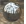

#  {{page.title}}
Les matériaux de Flamingo sont définis par un ensemble de groupes de propriétés. Il s'agit de matériaux simples communément utilisés. Ces matériaux présentent un ensemble très simple de contrôles. Cela permet d'accéder rapidement aux propriétés que vous pouvez modifier pour qu'un matériau paraisse différent sans la complexité des options supplémentaires. Pour la plupart des matériaux simples, seule la couleur a besoin d'être modifiée pour obtenir un aspect différent.

#### Types de matériaux simples :

> [Couleur unie](#solid-color)
> [Plastique](#plastic)
> [Métal](#metal)
> [Verre](#glass)
> [Brillant](#glossy)
> [ClearFinish](#clearfinish)
> [Texturé de Flamingo](#flamingo-textured)
> [Ensemble de textures](#texture-set)

Tous les matériaux peuvent être convertis en matériaux complexes. Les matériaux complexes présentent tous les contrôles possibles afin de modifier un matériau dans Flamingo nXt. Pour avoir un contrôle maximum sur un matériau, utilisez les matériaux complexes ou convertissez votre matériau en matériau complexe. 

#### Les matériaux complexes sont divisés en plusieurs groupes de propriétés :

> [Nom](material-type-advanced.html#name)
> [Algorithme](material-type-advanced.html#procedures)
> [Propriétés avancées des matériaux](material-type-advanced.html#advanced-materials-properties)
> [Finition réfléchissante ](material-type-advanced.html#reflective-finish-and-highlight)
> [Propriétés de la transparence](material-type-advanced.html#transparency)
> [Textures algorithmiques](material-type-advanced.html#bump-patterns)
> [Textures d'image](material-type-advanced.html#textures)
> [Notes](material-type-advanced.html#notes)

Les matériaux sont enregistrés dans le modèle de Rhino. Des matériaux uniques peuvent avoir le même nom dans différents modèles de Rhino.

## Couleur unie
{: #solid-color}
Les matériaux avec couleur unie ont uniquement un [nom](material-type-advanced.html#name) et une [couleur](material-type-advanced.html#color).





## Plastique
{: #plastic}
Les matériaux plastiques sont légèrement réfléchissants avec un [reflet](material-type-advanced.html#highlight-color) blanc.



 Utilisez l'éditeur avancé pour remplacer les réglages de la [couleur du reflet](material-type-advanced.html#highlight-color), de l'[intensité](material-type-advanced.html#intensity), de [Fresnel](material-type-advanced.html#fresnel) et de [netteté](material-type-advanced.html#sharpness).

## Métal
{: #metal}
Pour les matériaux métalliques, la couleur du reflet est la même que la [couleur](material-type-advanced.html#color). Vous pouvez également contrôler la [netteté](material-type-advanced.html#sharpness) de la réflexion. 



#### Netteté
Contrôle la netteté ou le flou de la réflexion. Voir la rubrique sur la [netteté](material-type-advanced.html#sharpness) pour plus d'informations. 

 Utilisez l'éditeur avancé pour remplacer les réglages de la [couleur du reflet](material-type-advanced.html#highlight-color), de l'[intensité](material-type-advanced.html#intensity), de [Fresnel](material-type-advanced.html#fresnel) et de [type](material-type-advanced.html#type).

## Verre
{: #glass}
Les matériaux en verre ont une [couleur](material-type-advanced.html#color) et un [indice de réfraction](advanced-material-properties-main.html#index-of-refraction).



#### Indice de réfraction
Contrôle l'inclinaison de la lumière lorsqu'elle passe à travers le matériau. Voir la rubrique [indice de réfraction](advanced-material-properties-main.html#index-of-refraction) pour plus d'informations.

 Utilisez l'éditeur avancé pour remplacer les réglages de la [couleur du reflet](material-type-advanced.html#highlight-color), de l'[intensité](material-type-advanced.html#intensity), de [Fresnel](material-type-advanced.html#fresnel), de [netteté](material-type-advanced.html#sharpness) et de  [transparence](material-type-advanced.html#transparency).

## Brillant
{: #glossy}
Les matériaux brillants présentent une [intensité](material-type-advanced.html#intensity) et [netteté](material-type-advanced.html#sharpness) du reflet de faible valeur. 



#### Intensité
Contrôle l'intensité du reflet des lumières sur la surface. Voir la rubrique détaillée sur l'[intensté](material-type-advanced.html#intensity) pour plus d'informations. 

#### Netteté du reflet
Contrôle la netteté (par rapport au flou) du point netteté lumières sur la surface. Voir la rubrique détaillée sur la [netteté du reflet](material-type-advanced.html#sharpness) pour plus d'informations.

 Utilisez l'éditeur avancé pour remplacer les réglages de [Fresnel](material-type-advanced.html#fresnel) et de [type](material-type-advanced.html#type).

## ClearFinish
{: #clearfinish}
Le matériau ClearFinish simule la peinture des voitures, la porcelaine, la céramique, les  bois vernis ou tout autre matériau avec une couche en plastique ou un enduit lustré. Le ClearFinish utilise le paramètre [Fresnel](material-type-advanced.html#fresnel) pour modifier la couleur du matériau en fonction de l'angle de vue. Ces matériaux présentent une couleur profonde lorsque vous regardez directement la surface mais lorsque celle-ci s'éloignent de la vue en se courbant, ils deviennent de plus en plus réfléchissants. Les peintures de voiture, laquées ou satinées, sont de bons exemples de ClearFinish.



 Utilisez l'éditeur avancé pour remplacer les réglages de la [couleur du reflet](material-type-advanced.html#highlight-color), de l'[intensité](material-type-advanced.html#intensity), de [Fresnel](material-type-advanced.html#fresnel) et de [netteté](material-type-advanced.html#sharpness).

## Texturé de Flamingo 
{: #flamingo-textured}
Les matériaux texturés utilisent des images pour définir des motifs et des couleurs. Le nom et la résolution de l'image, la taille de la mosaïque ainsi que l'intensité et la netteté du reflet sont contrôlables. 



#### Intensité
Contrôle l'intensité de la réflexion en miroir de la surface. Voir la rubrique détaillée sur l'[intensté](material-type-advanced.html#intensity) pour plus d'informations.

#### Netteté
Contrôle la netteté ou le flou de la réflexion. Voir la rubrique sur la [netteté](material-type-advanced.html#sharpness) pour plus d'informations.

#### Image
Définit le placage d'image et les propriétés du matériau. Cette rubrique contient de nombreuses options. Voir la rubrique détaillée sur les [images](material-type-advanced.html#texture) pour plus d'informations. 


 Utilisez l'éditeur avancé pour remplacer les réglages de ce matériau. 

## Ensemble de textures
{: #texture-set}
Les [matériaux avec ensemble de textures](material-type-texture-set.html) sont un ensemble de coordonnées de textures qui définissent un matériau.  Ces ensembles de coordonnées peuvent être créés à partir de placages de textures externes qui contiennent des informations telles que les placages de déplacement, normaux ou de relief. Les placages de déplacement permettent de donner une profondeur au matériau. En combinant ces placages de texture dans un ensemble, il est possible de créer des matériaux très réalistes. Le [logiciel PixPlant](http://www.pixplant.com/) peut créer des ensembles de textures à partir d'une image standard.


#### Largeur et Hauteur
Contrôle la taille de toutes les textures de l'ensemble. Utilisez ce contrôle pour conserver une cohérence au niveau de la taille et de l'alignement de toutes les images.

#### Intensité
Contrôle l'intensité de la réflexion en miroir de la surface. Voir la rubrique détaillée sur l'[intensté](material-type-advanced.html#intensity) pour plus d'informations.

#### Netteté
Contrôle la netteté ou le flou de la réflexion. Voir la rubrique sur la [netteté](material-type-advanced.html#sharpness) pour plus d'informations.

#### Types
Contrôle le type de réflexion sur la surface. Voir la rubrique détaillée sur le [type](material-type-advanced.html#type) pour plus d'informations.

### Placages de texture
Le tableau des placages de texture affiche la liste des textures faisant partie de l'ensemble. Cliquez avec le bouton droit dans le tableau pour ajouter, supprimer ou modifier les textures de l'ensemble. 

#### Ajouter des placages...
Utilisez cette commande du menu contextuel pour ajouter de nouvelles textures dans la liste. Plusieurs textures peuvent être ajoutées en même temps. Si les noms des textures incluent des suffixes pour un des types de placage, celui-ci est automatiquement ajouté. Par exemple, si une texture comprend *-normal* dans son nom, elle sera automatiquement marquée comme un placage normal. 

#### Supprimer un placage
Cette commande du menu contextuel supprimera un placage de texture dans le tableau. 

#### Couleur
Ce type de placage contribue à la couleur visible de la texture. Pour plus d'informations, voir [Type de placage standard](material-image-properties.html#standard)

#### Relief
Le placage de relief utilisera l'échelle de gris de la texture pour simuler une modification de la hauteur ou u relief sur le matériau. Pour plus d'informations, voir [Placage de relief avancé](material-image-properties.html#bump)

#### Normal
Les placages normaux sont des placages de relief spéciaux qui utilisent le canal rouge, vert et bleu de l'image pour ajuster la direction de relief au niveau de chaque pixel. Le canal bleu représentant la direction Z du relief, les images tendent à prendre une teinte bleue. Pour plus d'informations, voir [Placage normal avancé](material-image-properties.html#normal)

#### Spéculaire
Un placage spéculaire utilise les couleurs de l'échelle de gris du matériau pour contrôler la quantité de réflexion dans l'image en ce point. Pour plus d'informations, voir [Placage de transparence avancé](material-image-properties.html#transparency)

#### Opacité
Un placage d'opacité contrôle la transparence d'un matériau au niveau de chaque pixel à partir de l'échelle de gris de l'image. Pour plus d'informations, voir [Placage normal avancé](material-image-properties.html#normal)

#### Déplacement
Un placage de déplacement déplacera le maillage de rendu en fonction de l'échelle de gris du placage. Pour plus d'informations, voir [Placage de déplacement avancé](material-image-properties.html#displacement)

### Matériau complexe
Le matériau [avancé de Flamingo](material-type-advanced) contient un ensemble complet de propriétés.  Si aucun de ces matériaux simples ne fonctionne, utilisez le matériau [avancé de Flamingo](material-type-advanced) pour disposer d'une flexibilité maximale.