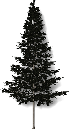
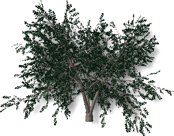
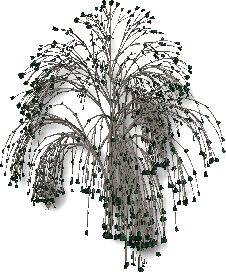

<!-- TODO: This could use an update. But the material is a start.  Let's localize what is here.  We can fill in the details later.-->

#  {{page.title}}
{: #tree-editor}

### Menu Fichier

#### Nouveau
Créer une nouvelle définition de plante en utilisant un fichier modèle.

 |  |  |  |
 |:-------------------------------------------:|:-----------------------------------------:|:-------------------------------------:|
 | **Standard**                                |   **Conifère**                             | **Cime large**                       |
 |          |  |  |
 | **Palmier**                                    |  **Couvre-sol**                          | **Complexe**                                  
{: .plant-table}

#### Ouvrir
Ouvre une définition d'arbre existante.

#### Enregistrer
Enregistre la définition d'arbre actuelle.

#### Enregistrer sous
Enregistre la définition d'arbre actuelle sous un autre nom.

### Menus Lancer de rayons
Calcule le rendu de l'image d'aperçu.

*Défaut (gauche) et Lancer de rayons (droite.*

#### Démarrer
Lancer le rendu de l'image d'aperçu.

#### Arrêter
Arrêter le rendu de l'image d'aperçu.

Menu Vue
Déplacez la souris en maintenant le bouton gauche pour faire tourner la caméra de la vue autour de la cible.
Déplacez la souris en maintenant le bouton droit pour faire tourner la cible autour de la caméra. 
Faites tourner la molette de la souris pour zoomer en avant et en arrière.

#### Restaurer les valeurs par défaut
Restaure la vue ombrée par défaut.

#### Afficher les feuilles
Affiche l'aperçu de l'arbre avec des feuilles.

*Sans feuilles (gauche) et avec feuilles (droite).*

### Menu Paramètres
Définissez les unités de l'éditeur de sorte à ce qu'elle correspondent avec les unités de travail. 