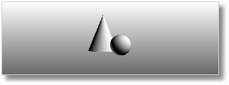

# {{page.title}}
Les images miniatures d'aperçu ainsi que la zone de fond des miniatures ont un menu contextuel.

#### Actions sur les miniatures

> Cliquez avec le bouton de droite pour changer la vue. 

Le changement ne sera pas très intéressant sir l'objet est un sphère mais s'il s'agit d'un cube, d'un cône ou d'une autre forme, la rotation de la vue ou des objets permet de voir l'objet sous un autre angle.

> Cliquez avec le bouton de droite pour afficher un menu contextuel. .
> Double cliquez pour afficher une plus grande fenêtre d'aperçu en-dessous des miniatures.
> Déplacez les miniatures pour changer l'ordre de la liste.
> Appuyez sur la touche Ctrl et déplacez les miniatures pour dupliquer un matériau.
> Double cliquez sur le plus grand aperçu pour ouvrir une fenêtre flottante dont la taille peut être modifiée pour obtenir une vue de l'aperçu avec une meilleure résolution.

Cette fenêtre possède les mêmes fonctions que l'image d'aperçu originale, y compris le menu contextuel et la possibilité de la faire glisser et de la déposer sur d'autres matériaux ou objets dans le modèle.

### Géométrie

#### Matériaux
Les matériaux peuvent utiliser plusieurs types de géométrie.
 *Sphère*
 *Pyramide*
 *Cube*
 *Tore*
 *Cône*
 *Plan*

#### Environnements
Les environnements utilisent uniquement le cône et la sphère.
 *Cône et sphère*

#### Textures
Les textures sont affichées uniquement sous forme de surfaces plates en deux dimensions faces à la caméra.

#### Taille
Définit la taille de l'unité pour les miniatures.

### Vue
Contrôle déplacement des objets ou la rotation de la caméra avec le bouton de droite.

#### Rotation de l'objet
Si vous cliquez avec le bouton de droite et faites glisser la souris sur la miniature, l'objet tourne.

#### Rotation de la caméra
Si vous cliquez avec le bouton de droite et faites glisser la souris sur la miniature, la caméra tourne.

#### Angle X
Définit l'angle de rotation horizontale de l'objet ou de la caméra.

#### Angle Y
Définit l'angle de rotation verticale de l'objet ou de la caméra.

### Arrière-plan
Contrôle l'apparence de l'arrière-plan de la miniature.

#### Aucun
L'environnement gris par défaut est utilisé.

#### Damier
Un arrière-plan en damier gris est utilisé.

#### Personnaliser
Une texture ou un matériau peut être utilisé comme arrière-plan.

####  **Enregistrer comme défaut**
Enregistre les propriétés de la miniature comme paramètres par défaut.

####  **Charger les valeurs par défaut**
Charge les propriétés de la miniature à partir des paramètres par défaut.