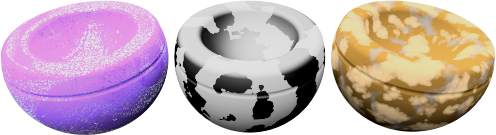
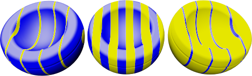

#   {{page.title}}
L'arbre des algorithmes combine un ou plusieurs matériaux en utilisant des règles pour définir l'interaction entre eux. L'arbre affiche les composants utilisés pour créer ce matériau et vous permet d'ajouter des composants. Pour des matériaux simples, il n'y aura qu'un seul composant dans la liste : Base.

Chaque algorithme combine deux sous-matériaux en utilisant une méthode déterminée. Chaque sous-matériau peut à son tour être constitué d'un algorithme, en combinant deux sous-matériaux. De cette façon, des matériaux extrêmement élaborés peuvent être créés à partir de composants simples. Algorithmes de combinaison de matériaux :

> [Base](#base)
> [Mélange angulaire](#angular-blend)
> [Mélange](#blend)
> [Marbre](#marble)
> [Granit](#granite)
> [Mosaïque](#tile)
> [Bois](#wood)

##### Pour ajouter un algorithme
1. Cliquez avec le bouton de droite dans la fenêtre des Algorithmes.
1. Dans le menu, cliquez sur un type d'algorithme.

##### Pour supprimer un algorithme
 1. Dans la fenêtre Algorithmes, cliquez avec le bouton droit sur le nom de l'algorithme.
 2. Dans le menu, cliquez sur Supprimer.

## Base
{: #base}
Ce matériau est le matériau simple de base sans couche. Il s'agit de l'algorithme par défaut. 

## Mélange angulaire
{: #angular-blend}
De nombreux matériaux changent de couleur, de réflexion ou de transparence en fonction de l'angle selon lequel le matériau est regardé. L'algorithme de mélange angulaire mélange deux matériaux en fonction de l'angle de vue sur la surface de l'objet.

L'algorithme Mélange angulaire mélange deux composants différents pour créer des effets spéciaux. Les deux couches utilisées par l'algorithme sont la couche intérieure et extérieure.

#### Intérieur
De 0 degré à partir du point de vue jusqu'à l'angle de départ, le composant intérieur se verra entièrement. Vous pouvez considérer cet élément comme le matériau de base.

#### Extérieur
À partir de l'angle final jusqu'à 90 degrés, le matériau extérieur sera le seul visible. Vous pouvez considérer cet élément comme le revêtement.

#### Angle de départ
L'angle avec le point de vue à partir duquel le composant extérieur commence.

#### Angle final
L'angle avec le point de vue à partir duquel le composant extérieur s'arrête.
Entre l'angle de départ et l'angle final, les composants intérieur et extérieur se mélangent.

Dans l'illustration ci-dessous, l'angle de départ est égal à 30 degrés (ce qui, dans le rendu, se traduit par le cercle vert à droite) et l'angle final est égal à 60 degrés (ce qui, dans le rendu, se traduit par le cercle rouge).

L'image de droite montre un matériau intérieur blanc et un matériau extérieur noir.

 

* Entre 0 et 30 degrés à partir du point de vue, vous voyez le blanc.
* Entre 30 et 60 degrés à partir du point de vue, vous voyez un dégradé passant du blanc au noir.
* Entre 60 et 90 degrés à partir du point de vue, vous voyez noir.

## Mélange
{: #blend}
L'algorithme de mélange combine deux composants de base et permet de définir les proportions de chacun. Tous les bois inclus dans la bibliothèque de Flamingo utilisent un algorithme de mélange pour donner une finition brillante et foncée au bois.

Les mélanges permettent de changer entièrement la définition d'un matériau en ajoutant une couleur à un motif de base.

#### Mélange
Permet de changer le pourcentage de chaque matériau utilisé pour le matériau final.  Par exemple, le matériau ci-dessous montre un mélange entre un matériau rayé et une couleur verte unie. Pour l'image de gauche, le glisseur est situé vers la gauche, ce qui donne plus d'importance au matériau rayé et réduit la force du matériau vert.  Pour l'image du milieu, le glisseur est situé au milieu et les deux matériaux sont mélangés à parts égales.  Pour l'image de droite, le glisseur est situé vers la droite, ce qui donne moins d'importance au matériau rayé et renforce le matériau vert.

#### Utiliser une image
Une image peut être utilisée pour contrôler l'interaction entre les deux matériaux. Lorsqu'une image est utilisée, les valeurs d'échelle de gris des pixels définissent le mélange entre les deux composants. Utilisez une image en échelle de gris pour créer des nuances intermédiaires entre le premier et le deuxième composant. Le premier composant sera placé sur les parties noires de l'image et le deuxième composant sera placé sur les parties blanches.

Dans l'image, les mêmes matériaux sont utilisés pour le premier et le deuxième composants, mais le mélange est contrôlé par trois images différentes.

La résolution de l'image du masque joue sur la qualité du matériau. Des images de haute résolution vous permettront de regarder le matériau de plus près sans perdre de qualité mais elles utiliseront plus de mémoire.

#### Utiliser le canal alpha
Si l'image possède un canal alpha, il peut être utilisé au lieu de l'échelle de gris de l'image pour déterminer le mélange des couleurs.

#### Inverser
Le premier composant sera placé sur les parties blanches de l'image et le deuxième sur les parties noires.

#### Mosaïque
L'échelle du matériau lors du rendu ne dépend pas de la résolution de l'image. Afin de définir correctement l'échelle du matériau, vous devez définir la taille, en unités réelles, de la zone représentée par une copie de l'image. Si la hauteur de l'image représente six carreaux de 4 unités et la longueur représente douze carreaux de 4 unités, l'échelle est de 48 unités dans la direction des x et de 24 unités dans la direction des y. L'image est alors ajustée à la taille appropriée pour le motif.

#### Largeur
La largeur en pixels d'une seule copie de l'image.

#### Hauteur
La hauteur en pixels d'une seule copie de l'image.

## Granit
{: #granite}
Crée un matériau 3D dont le composant de base est incrusté de tâches d'un deuxième matériau. L'algorithme de granit combine un composant de point (spot) réparti de façon aléatoire dans un composant de base. L'algorithme du granit définit comment les composants de base et de point se combinent. Les algorithmes de granit peuvent être utilisés pour une grande variété de matériaux tels que la rouille, le plastique brillant et autres matériaux mouchetés de façon aléatoire.

#### Base/Point
Les composants de Base et de Point sont deux matériaux. Leurs propriétés sont définies comme pour tout autre matériau.



#### Densité
Une fraction du motif dans son ensemble. La taille relative des points est proportionnelle à cette valeur.



## Marbre
{: #marble}
Crée des tranches alternant les composants de base et de nervure. L'algorithme du marbre définit comment les composants de base et de veine se combinent. Les  dalles sont infiniment larges et l'orientation de l'objet joue sur la façon dont les dalles sont orientées par rapport à l'objet.

Le [placage de texture](properties-object.html#mapping) des objets contrôle l'orientation du matériau sur l'objet.

*Pas de placage de texture (gauche). Avec placage de texture (droite).*

#### Base/Veine
Les composants de Base et de Veine sont deux matériaux. Leurs propriétés sont définies comme pour tout autre matériau.


#### Largeur de la veine
Permet de changer la taille relative des tranches les unes par rapport aux autres. La valeur donnée à la largeur de veine est une fraction de la distance entre une rayure de la base et la suivante. Les valeurs peuvent aller de 0 (zéro) pour indiquer qu'il n'y a pas de composant de veine à 1 pour aucun composant de base.




*Revêtement (gauche) ; normal (droite).*

## Mosaïque
{: #tile}
La mosaïque est un matériau 2D. Le [placage de texture](properties-object.html#mapping) des objets contrôle l'orientation du matériau sur l'objet. L'algorithme de mosaïque est constitué d'un composant de base et d'un composant de jointure. Chacun des composants peut inclure d'autres matériaux.

Utilisez une taille différente dans chaque direction afin de créer des effets spéciaux. Par exemple, utilisez une mosaïque très longue dans une direction pour créer des matériaux de pavement.

#### Mosaïque
Définit la taille générale de la mosaïque. La largeur et la hauteur peuvent être définies indépendamment l'une de l'autre.

#### Largeur/Hauteur
Définit la largeur et la hauteur des carreaux.


#### Joint
Change la taille de la jointure.

#### Jointure horizontale / Jointure verticale
Définit la largeur et la hauteur de la jointure.

#### Verrouiller
Conserve le rapport entre la taille des jointures horizontale et verticale.

#### Décalage
Permet d'obtenir un décalage horizontal relatif. Par exemple, utilisez un décalage de .5 pour créer une structure standard de panneresse. Ceci permet de modéliser des matériaux tels que des mosaïques de marbre, sans avoir l'impression que tout le sol a été taillé dans un seul bloc de marbre.

#### Variation des carreaux
Ajoute un effet aléatoire à la couleur du matériau pour chaque carreau. Cette option permet de modéliser des matériaux tels que des briques non uniformes.

#### R/V/B
Modifie les composantes rouge, verte et bleue de la couleur.  Le matériau de base de chaque carreau variera alors légèrement de façon aléatoire.

#### X/Y/Z
Décale le matériau par rapport à l'origine du repère général pour chaque carreau de façon aléatoire. Le décalage peut être intéressant si une jointure qui marque le début du matériau est mal placée.

## Bois
{: #wood}
Le bois est constitué de cylindres concentriques avec une alternance des composants de base et d'anneau. L'algorithme du bois définit comment les composants de base et d'anneau se combinent.

Utiliser cette méthode pour créer des matériaux imitant le bois si les objets ne sont pas vus de près. Si vous avez besoin d'un bois plus détaillé, utilisez un [matériau avec texture](material-type-simple.html#textured) pour le définir. Si votre point de vue n'est pas trop proche du bois, une couleur unie peut être utilisée pour remplacer le bois sans que l'image ne perde de qualité. Le rendu sera alors plus rapide. Un autre avantage du bois est que le grain est correctement dessiné, quel que soit l'angle sous lequel il est vu. L'extrémité du grain se verra sur les extrémités et le grain parallèle sur les côtés de l'objet.

#### Base/Anneau
Les composants de Base et d'Anneau sont deux matériaux. Leurs propriétés sont définies comme pour tout autre matériau.


#### Largeur des anneaux
Une fraction de la distance entre une rayure de la base et la suivante. Les valeurs peuvent aller de 0 (zéro) pour indiquer qu'il n'y a pas de composant d'anneau à 1 pour aucun composant de base.




Revêtement (gauche) ; normal (droite)