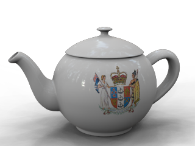
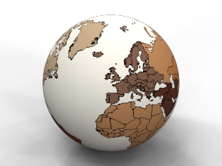

1<!-- This is an old page, I am not sure it needs to be updated or translated,  The new Flamingo products used Rhino decals documented in Rhino help. -->

# {{page.title}}
Les décalcomanies sont des placages d'image sans mosaïque appliqués directement sur les objets au lieu d'utiliser un matériau. Utilisez les décalcomanies pour modifier une partie déterminée de la couleur, de la réflectivité ou du reliefs d'un objet.
Les décalcomanies sont composées d'une seule image et ne sont pas disposées en mosaïque comme dans une [définition de matériaux](materials-tab.html).
Les décalcomanies peuvent être utilisées pour :

>Accrocher des illustrations sur des murs intérieurs.
>Placer des étiquettes ou des logos sur un produit.
>Ajouter des marques au modèle.
>Créer des vitraux.

 **Remarque :** Les aperçus des décalcomanies ne sont visibles dans les vues filaires que si OpenGL est activé pour le mode filaire. Le paramètre **Canal d'affichage** doit être défini sur **OpenGL** dans **Options**  &gt; **Vue**  &gt; **Modes d'affichage**  &gt; **Filaire**  &gt; **Autres paramètres**  &gt; **Canal d'affichage**.

## Positionnement de la décalcomanie
{: #decal-list}
{: #decal-placement}

###  **Ajouter**
{: #add-decal}
1. Sélectionnez un ou plusieurs objets.
1. Dans le menu **Édition**, cliquez sur **Propriétés de l'objet**.
1. Dans la liste des **Propriétés**, cliquez sur **Décalcomanies de Flamingo nXt**.
1. Cliquer sur le bouton **Ajouter**.
1. Dans la boîte de dialogue Ouvrir une image, choisissez un fichier image et cliquez sur Ouvrir**.
1. Dans la boîte de dialogue Propriétés de la décalcomanie, sélectionnez les options et cliquez sur Positionner**.
1. Aux invites demandant les points, choisissez des points dans le modèle pour positionner la décalcomanie.
La séquence précise dépend du type de décalcomanie sélectionné : [Plane](#decal-planarmapping), [Cylindrique](#decal-cylindricalmapping) ou [Placage UV](#decal-uvmapping).

###  **Changer de position**
{: #decal-edit-placement}
1. Cliquez sur le bouton **Changer de position**.
1. À l'invite Sélectionner un point de contrôle, utilisez l'éditeur graphique pour changer la position de la décalcomanie.
1. Appuyez sur **Entrée** une fois terminé.

###  **Propriétés**
{: #decal-properties}
1. Cliquez sur le bouton **Propriétés**.
1. Dans la boîte de dialogue Propriétés de la décalcomanie, utilisez les différentes options pour changer les caractéristiques de la décalcomanie.

###  **Supprimer**
{: #decal-delete}

>Cliquez sur le bouton **Supprimer**.

###  **Déplacer vers le haut** / **Déplacer vers le bas**
{: #decal-movedown}
{: #decal-moveup}
Quand plusieurs décalcomanies sont superposées sur un seul objet, l'ordre dans lequel elles sont appliquées peut être important. Les décalcomanies sont appliquées dans l'ordre dans lequel elles apparaissent dans la liste. La dernière décalcomanie de la liste est au-dessus des autres.

>Cliquez sur Vers le haut ou Vers le bas pour changer la position de la décalcomanie dans la liste.

##### Pour placer une décalcomanie plane
1. Aux différentes invites, choisissez les points définissant la Largeur et la Direction de la hauteur**.
1. À l'invite Sélectionner un point de contrôle..., sélectionnez un point de contrôle pour ajuster la taille, la rotation et la position de l'image.
Ou appuyez sur Entrée pour terminer le placement de la décalcomanie.

### Options

#### Déplacer
Déplace la décalcomanie. Aux invites Point de départ et Point final, entrez des points tout comme pour la commande Déplacer de Rhino.

#### UtiliserRapportImage
La décalcomanie est étirée en fonction du rapport de l'image originale.

##### Pour placer une décalcomanie cylindrique
1. À l'invite, choisissez la position du centre du cylindre.
1. À l'invite Sélectionner un point de contrôle..., sélectionnez un point de contrôle pour ajuster la taille, la rotation et la position de l'image.
Ou appuyez sur Entrée pour terminer le placement de la décalcomanie.

## Définissez ou modifiez le placement de la décalcomanie en utilisant l'application de contrôle
Note : Si vous utilisez un placage plan sur un objet courbé, toute l'image doit se trouver derrière la surface de l'objet. Les portions de l'image qui se trouvent devant la surface ne seront pas visibles.

#### Pour modifier la largeur et la hauteur de la décalcomanie en même temps

>Faites glisser les points de contrôle situés au sommet de l'application.

#### Pour changer la hauteur d'une décalcomanie

>Faites glisser le point de contrôle situé au milieu des bords supérieur et inférieur de l'application.

#### Pour changer la largeur d'une décalcomanie

>Faites glisser le point de contrôle situé au milieu des bords gauche et droite de l'application.

#### Pour déplacer la décalcomanie

>Faites glisser le point de contrôle situé au centre de l'application.

#### Pour faire tourner la décalcomanie

>Faites glisser le point de contrôle de l'axe x, y ou z sur l'icône de l'application.

## Propriétés de la décalcomanie
{: #dialogbox-editdecal}
La couleur de l'objet est remplacée par la couleur de la décalcomanie ou les deux couleurs sont mélangées. Ce résultat est celui le plus souvent recherché lors de l'utilisation des décalcomanies.

## Projection
{: #projection}
Le style de placage indique comment projeter la décalcomanie sur l'objet. Vous pouvez dessiner des lignes de construction dans votre scène pour vous aider à placer la décalcomanie avec précision. Un rectangle dessiné juste derrière une surface peut servir de guide au moment de placer une décalcomanie normale. Utilisez les accrochages aux objets pour un positionnement précis.

### Cylindrique
{: #decal-cylindricalmapping}
Le placage cylindrique est utile pour placer des décalcomanies sur des objets qui sont courbés dans une seule direction, tels que les étiquettes sur des bouteilles de vin.
Lorsque l'image est plaquée sur le cylindre, son axe vertical est placé le long de l'axe du cylindre et son axe horizontal autour de celui-ci.

### Plan
{: #decal-planarmapping}
Ce style de placage est le plus commun. Il est utilisé pour effectuer un placage sur des objets plats ou présentant une légère une courbure.
Les sommets définissent la position de l'image et ses dimensions. Si le rectangle n'a pas les mêmes proportions que la texture, cette dernière sera étirée ou comprimée en conséquence.
Lors d'un placage plan sur un objet courbé, toute la projection de l'image doit se trouver derrière la surface de l'objet. Les portions de l'image qui se trouvent devant la surface ne seront pas visibles.

### Placage UV
{: #decal-uvmapping}
Les décalcomanies utilisant un placage UV sont utiles pour les objets tels que les cheveux, les écorces d'arbres où la décalcomanie doit glisser et s'étirer pour s'adapter à la surface.
La décalcomanie couvre tout l'objet, il n'est pas possible de contrôler le placement.
Le placage UV utilise la paramétrisation u et v de la surface pour courber et étirer l'image ; aucun positionnement manuel n'est donc nécessaire.

### Parcourir
{: #file-browse}
Change le fichier image.



## Intensité
{: #decalmappingstrength}

### Couleur
{: #decal-color}
Fait varier l'intensité relative de la couleur de l'image par rapport au matériau sous-jacent. Voir aussi, [Propriétés de la texture d'un matériau, Intensité de la couleur](texture-properties-main.html#color).

### Relief
{: #decalmappingbump}
Les placages de relief créent des ombres et des reflets simulés sur la surface. Voir aussi, [Propriétés de la texture d'un matériau, Intensité du relief](texture-properties-main.html#bump).

## Finition réfléchissante
{: #reflective-finish-and-highlight}
Les options de finition de la décalcomanie sont les mêmes que celles de définition d'un matériau. Appliquez ces propriétés aux zones spécifiques de l'objet où se trouve la décalcomanie. Par défaut, la finition des décalcomanies est mate.

### Intensité
Définit l'intensité du reflet. Des valeurs élevées augmentent la taille et l'intensité du reflet. Voir [Propriétés avancées du matériau, Intensité](advanced-material-properties-main.html#intensity).

### Netteté
Définit la taille du reflet. De petites valeurs donnent un reflet plus ample ; de grandes valeurs concentrent le reflet sur une plus petite zone. Voir [Propriétés avancées du matériau, Netteté](advanced-material-properties-main.html#sharpness).

### Métallique
Définit la même couleur pour le reflet que pour la couleur de base de l'objet. Voir [Propriétés avancées du matériau : Métallique](advanced-material-properties-main.html#metallic).


## Paramètres avancés
{: #advanced}

### Double face
{: #double}
La décalcomanie apparaît sur la face arrière de la surface sur laquelle elle est placée, ainsi que sur la face avant.

### Miroir
{: #mirror}
Copie symétriquement l'image de la décalcomanie.

## Direction de projection
{: #projection-direction}

### Arrière
Projette la décalcomanie à partir de la face arrière de l'image de la décalcomanie.
Avant (gauche), arrière (droite)

### Avant
Projette la décalcomanie à partir de la face avant de l'image de la décalcomanie.
Avant (gauche), arrière (droite)

### Avant et Arrière
Projette la décalcomanie à partir des deux faces (avant et la face arrière) de l'image de la décalcomanie.
Avant (gauche), arrière (droite)

### Transparence
Définit la transparence de la décalcomanie. Voir [Transparence](advanced-material-properties-transparency.html).
Indice de réfraction
Définit l'indice de réfraction de la décalcomanie transparente. Voir [Indice de réfraction](advanced-material-properties-transparency.html#index-of-refraction)