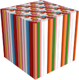

#   {{page.title}}
Les propriétés Flamingo nXt des objets jouent uniquement sur l'apparence des objets lors du rendu dans Flamingo nXt.

###  Source du matériau
{: #material-source}
Un matériau peut être assigné à des calques, des blocs et des objets. Pour plus d'informations sur l'assignation de matériaux, consultez la rubrique [Assignation des matériaux](material_assignment.html). Si le matériau est défini par objet, les propriétés du matériau sont également affichées dans cette boîte de dialogue. Pour plus d'informations sur l'édition d'un matériau, consultez [Propriétés des matériaux](material-type-simple.html).

###  Placage de texture
{: #texture-mapping}
Le placage contrôle comment le matériau est positionné (plaqué) sur un objet précis. La méthode utilisée pour assigner un matériau, que ce soit par calque ou par objet, ne joue pas sur le placage. Pour les matériaux ne présentant pas de motif perceptible, le placage n'est normalement pas nécessaire. Utilisez le placage lorsque le matériau est directionnel ou lorsqu'il présente un motif évident.  Même dans ces cas, le placage par défaut peut servir. Le placage est lié à l'objet et il le suit s'il est déplacé, tourné ou si son échelle est changée. Pour plus d'informations sur les types de placage, consultez la section [Placage de texture](http://docs.mcneel.com/rhino/5/help/fr-fr/index.htm#properties/texturemapping.htm).

 
*Deux directions de placage différentes*

###  Décalcomanies
{: #decals}
Les décalcomanies sont des placages d'image sans mosaïque appliqués directement sur les objets au lieu d'utiliser un matériau. Utilisez les décalcomanies pour modifier une partie déterminée de la couleur, de la réflectivité ou du reliefs d'un objet. Voir la section [Décalcomanies de Rhino](http://docs.mcneel.com/rhino/5/help/en-us/index.htm#properties/decal.htm) pour plus d'informations sur la création et le positionnement des décalcomanies. 

 
 
*Quatre exemples différents de décalcomanies*

### Maillages personnalisés
{: #custom-meshes}
Plusieurs modificateurs de maillage peuvent être utilisés dans Rhino afin de donner plus de détails aux modèles rendus. Utilisez ces modificateurs pour arrondir les bords, ajouter des lignes de fermetures entre des surfaces et créer des câbles à partir de courbes. 

Pour plus d'informations, consultez les sections suivantes :

>[Adoucissement des bords](http://docs.mcneel.com/rhino/5/help/fr-fr/index.htm#commands/applyedgesoftening.htm)
>[Gaine](http://docs.mcneel.com/rhino/5/help/fr-fr/index.htm#commands/applycurvepiping.htm)
>[Ligne de fermeture](http://docs.mcneel.com/rhino/5/help/fr-fr/index.htm#commands/applyshutlining.htm)
>[Déplacement](http://docs.mcneel.com/rhino/5/help/fr-fr/index.htm#commands/applydisplacement.htm)

###  Propriétés de Flamingo
{: #flamingo-properties}

#### Canal Alpha
{: #alpha-channel}
Rend l'objet invisible. Les ombres projetées par l'objet et reçues par celui-ci sont rendues. L'image peut ensuite être superposée sur une autre et les ombres apparaîtront dans l'image composite.

Dans l'exemple ci-dessus, quelques surfaces planes simples correspondant à l'image ont été créées afin de recevoir les ombres projetées sur le bâtiment par les arbres. La propriété de canal Alpha a été attribuée aux plans afin qu'ils soient invisibles lors du rendu tout en affichant les ombres. Cette image partiellement transparente a ensuite été déposée sur l'image.

#### Caustiques
{: #caustics}
Les rayons de lumière réfléchis ou réfractés par un objet courbé ou la projection de ces rayons sur une autre surface. Les caustiques s'utilisent dans des situations très spécifiques. Elle ne sont rendues qu'avec le moteur [Path Tracer](render-tab.html#path-tracer) ou [Hybride](render-tab.html#hybrid) Les calculs des caustiques demandent un grand nombre de passes pour donner un résultat. Voir l'[article de Wikipedia : Caustique (optique)](https://fr.wikipedia.org/wiki/Caustique) pour plus d'informations. 

*Les caustiques produites par un verre d'eau.*

*Sans caustique (gauche) et avec caustiques (droite).*

#### Fin
{: #thin}
Un objet renfermant un espace et transparent est normalement traité comme un solide pour la réfraction transparente. La propriété Fin permet de traiter chaque surface comme un objet à deux faces pour la réfraction. C'est le paramètre à utiliser si des surfaces simples comme du verre sont utilisées pour les modèles d'architecture. 

 
*Modèle de base de Rhino (gauche), normal (milieu) et fin (droite).*

#### Entrée de lumière
{: #daylight-portal}
Une entrée de lumière naturelle est une ouverture laissant entrer l'[éclairage du soleil et du ciel](lighting-tab.html#interior-daylight) dans un rendu intérieur. Une entrée de lumière envoie la lumière du soleil, du ciel et du sol dans un espace intérieur de façon naturelle. Les entrées de lumière n'ont un effet que lorsque le [soleil](sun-and-sky-tabs.html#sun) est activé. Lorsque le schéma d'éclairage [Lumière du jour intérieure](lighting-tab.html#interior-daylight) est utilisé, toutes les surfaces transparentes agissent automatiquement comme des entrées de lumière. En revanche, si vous voulez apporter la lumière extérieure du soleil et du ciel dans une scène avec un schéma d'éclairage Studio ou Extérieur, vous devez marquer manuellement les fenêtres comme des entrées de lumière.

*Avec entrée de lumière (gauche), sans entrée de lumière (droite).*