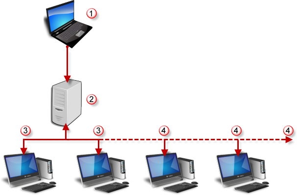

# {{page.title}}
La ferme de rendu de Flamingo nXt utilise la puissance de plusieurs ordinateurs pour rendre des images simples, des lots de plusieurs images ou des animations en fonction de la vue. Ni Rhino ni Flamingo nXt ne sont nécessaires sur les ordinateurs utilisés uniquement comme clients de la ferme de rendu.

#### Organisation typique d'un réseau avec une ferme de rendu
{: #render-farm}

{: style="margin-top:25px;"}

1. Un ordinateur avec Rhino et Flamingo nXt.
1. Serveur de réseau ou dossier partagé.
1. Deux clients de la ferme de rendu. (La ferme de rendu de nXt est livrée avec deux copies gratuites du logiciel client.)
1. Clients de la ferme de rendu achetés en supplément.

La ferme de rendu est gratuite jusqu'à deux ordinateurs clients. Pour ajouter d'autres ordinateurs clients, achetez une licence de la Ferme de rendu nXt sur [https://www2.mcneel.com/commerce/accurender/buy-farm.asp](https://www2.mcneel.com/commerce/accurender/buy-farm.asp).

#### Dossier partagé de la ferme
{: farm-folder}
La clé d'une ferme de rendu fonctionnelle est un dossier partagé auquel l'ordinateur principal et tous les ordinateur clients peuvent accéder. Ce dossier est normalement un dossier réseau partagé. Il peut se trouver sur l'ordinateur principal ou sur un réseau. Le dossier ne doit pas forcément avoir le même nom sur chaque client mais chaque client doit pouvoir lire, écrire et supprimer dans ce dossier. Le dossier partagé devrait disposer d'au moins 20 Go de mémoire libre.

#### La ferme de rendu nXt inclut deux applications :

##### Le client de la ferme de rendu (nXtFarmer64.exe)
Un petit programme qui est lancé sur chaque client de Rendu du réseau et qui attend les travaux à réaliser. Normalement, les fermes de Rendu travaillent en silence sans afficher les rendus sur un moniteur pendant leurs calculs. Grâce à cette méthode, vous pouvez utiliser la puissance de plusieurs ordinateurs pour exécuter des tâches longues pour lesquelles vous n'avez pas besoin d'intervenir au cours du rendu.

##### Le moniteur de la ferme (nXtFarmMonitor64.exe)
Une application qui vous montre le statut de vos travaux de rendu et qui offre quelques outils de contrôle simple.
La ferme de rendu nXt vous permet de travailler avec des gestionnaires de rendu externes. Les procédures suivantes s'appliquent à la ferme de rendu incluse avec Flamingo nXt. Si vous prévoyez utiliser un logiciel de ferme de rendu externe, certaines procédures seront différentes.

#### Mode de fonctionnement de la ferme
{: #the-farm-process}

1. Pour lancer un rendu avec la ferme de Flamingo nXt, au lieu d'utiliser la commande Rendu, utilisez la ferme de rendu *(menu Flamingo nXt 5.0 > Ferme de rendu)*. Un travail de rendu sera envoyé dans le [dossier de destination de la ferme](options-flamingo.html#farm-output-folder). Tous les matériaux et toutes les informations sur les ressources seront automatiquement envoyés avec le travail.
1. Les travaux de rendu sont divisés en plusieurs tâches différentes. Les clients de la ferme de rendu vérifient continuellement le dossier de destination de la ferme pour voir s'il y a de nouvelles tâches à réaliser. Chaque client choisira une tâche et commencera le rendu. Le moniteur de la ferme *(Flamingo nXt 5.0 > Ferme de rendu > Moniteur de la ferme)* assure un suivi de l'avancée du travail.
1. Chaque client de la ferme dépose les résultats dans le dossier de la ferme sous <<nom du travail>>\\Résultat.
1. Au fur et à mesure que les clients finissent le travail, ils choisissent de nouveaux travaux suivant leur ordre d'arrivée dans la ferme.
1. Le résultat sera au [format image nXt (.nXtImage)](image-editor.html). Les images dans ce format peuvent être modifiées avec l'[éditeur d'images nXt](image-editor.html). Les résultats peuvent également être enregistrés dans des fichiers TGA, PNG, TIF et JPG à partir de l'[éditeur d'images nXt](image-editor.html). 

## Installation et configuration de la ferme
{: #install}
Le client de rendu de la ferme et le moniteur sont installés avec Flamingo sur l'ordinateur principal où se trouve Rhino. Le client de la ferme doit être installé sur les autres ordinateurs clients où Rhino et Flamingo nXt ne sont pas installés. 

##### Installer la ferme de rendu
Installez le client de la ferme sur les ordinateurs où Rhino et Flamingo nXt ne sont pas installés:

1. Téléchargez le [logiciel de la ferme de rendu](http://www.rhino3d.com/download/The-Farm/1.0/release).
1. Lancez le programme d'installation sur chaque ordinateur client.
1. Dans le menu Démarrer, exécutez la ferme de rendu sur chaque machine.
1. La ferme de rendu apparaîtra sous forme d'icône dans la barre de système.

##### Pour configurer la ferme de rendu
{: #configure-the-render-farm}

1.  [Cliquez avec le bouton de droite](mouse-button-right.html) sur l'icône et sélectionnez Restaurer.
1. Dans la fenêtre nXt Farmer, dans le menu Options, cliquez sur Chemin... et sélectionnez le chemin du dossier de la ferme de rendu.

Sur l'ordinateur avec Rhino et Flamingo nXt, définissez le dossier du Zoo dans Rhino. Dans le menu Outils, cliquez sur Options, définissez l'emplacement commun de la ferme à partir du [dossier de destination de la ferme](options-flamingo.html#farm-output-folder).

La ferme de rendu est maintenant configuré.

## Utiliser la ferme de rendu
{: #using-the-render-farm-from-flamingo-nxt}
À l'heure actuelle, la ferme peut être utilisée de trois façons pour traiter les rendus sur plusieurs ordinateurs : travail de rendu simple, travail par lot et animation.

##### Pour vérifier que les stations clients répondent
Après avoir lancé le client de la ferme de rendu sur tous les ordinateurs clients :

1. Sur un des ordinateurs client, dans le menu Démarrer de Windows, cliquez sur [Moniteur de la ferme](#render-farm-monitor).
1. Les ordinateurs clients devraient apparaître dans la liste supérieure.
1. Chaque client de la ferme de rendu devrait apparaître dans la liste des ordinateurs.  Leur statut devrait indiquer Actif. 

En cas de problème avec cette section, consultez les rubriques [Installation](#install) et [Configuration](#configure-the-render-farm).

##### Pour envoyer un travail de rendu vers la ferme de rendu

1. Dans Rhino, configurez votre rendu et votre vue comme pour un rendu normal.
1. Dans le menu Flamingo nXt, cliquez sur Lancer la ferme de rendu. 
1. La boîte de dialogue [Travail de rendu](#farm-job) s'ouvre.
1. Vérifiez les options et cliquez sur Accepter. 

##### Contrôler la ferme
Après avoir envoyé un travail vers la ferme de rendu, utilisez le [moniteur de la ferme](#render-farm-monitor).

1. Sur l'ordinateur principal, dans le menu Démarrer de Windows, cliquez sur [Moniteur de la ferme](#render-farm-monitor).
1. Les derniers travaux envoyés devraient apparaître dans la liste. Ceci peut prendre quelques minutes pour les travaux de grande taille.
1. Le statut du travail deviendra actif.
1. Les ordinateurs devraient ensuite choisir des tâches avec la même date.
1. La valeur du pourcentage achevé augmente au fur et à mesure que les tâches sont terminées.
1. Recherchez les tâches dont le statut est Terminé lorsque le travail est fini.

## Options de travail de la ferme
{: #farm-job}

#### Nom
{: #job-name}
La date et l'heure sont automatiquement ajoutées au nom que vous avez choisi. Un sous-dossier est créé pour le travail dans le dossier partagé de la ferme de rendu. Un dossier de destination est également créé dans le nouveau dossier du travail.
À la fin de chaque travail, le résultat est placé dans le dossier de destination du travail.

#### Lancer le travail
Un travail peut être démarré juste après avoir été envoyé, plus tard ou manuellement en utilisant le moniteur de la ferme. 

#### Maintenant
Lancer le travail maintenant.

#### Plus tard (Manuellement)
Le travail est lancé plus tard en utilisant le [moniteur de la ferme](#render-farm-monitor) de rendu.

#### Après
Lancer le travail à une date et une heure précise.

#### Passes de contraintes de rendu
{: #rendering-constraints}
Définir le nombre de passes nécessaires pour terminer le travail de rendu. Voir la rubrique [Passes](documentproperties-flamingo.html#number-of-passes) pour plus d'informations.

## Moniteur de la ferme de rendu
{: #render-farm-monitor}
Le Moniteur de la ferme de rendu est un programme autonome qui indique le statut des stations de travail et des travaux présents dans la ferme. Les travaux peuvent être interrompus et redémarrés à partir du moniteur ; il est également possible d'empêcher une station de travail de participer à la ferme de rendu.

Pour accéder au moniteur de la ferme à partir de Rhino, ouvrez le menu Flamingo nXt 5.0 > Ferme de rendu > Moniteur de la ferme. 

Pour accéder au moniteur de la ferme à partir de Windows, dans le menu Démarrer, cliquez sur **Tous les programmes > nXt Render Farm > Farm Monitor**.

#### Options
Cliquez avec le bouton droit sur un ordinateur ou un travail pour accéder aux options.

#### Actualiser
Actualiser la liste des travaux.

#### Interrompre l'ordinateur
Empêcher la station de travail de participer à la ferme de rendu.

#### Continuer l'ordinateur
Ré-autoriser la station de travail à participer à la ferme de rendu.

#### Interrompre le travail
Interrompt le travail indiqué.

#### Continuer le travail
Reprend le travail indiqué.

#### Supprimer le travail
Supprimer de la liste le travail indiqué .

## Licence de la ferme de rendu
{: #licensing-the-render-farm-}
La ferme de rendu permet à des ordinateurs en réseau (noeuds) de travailler simultanément sur des travaux de rendu.  [Télécharger et installer le Client de la ferme de rendu](http://nxt.flamingo3d.com/page/nxt-render-farm).

##### Pour autoriser le nœud

 1. Attendez la fin de tous les travaux actifs de la ferme avant de commencer l'activation de la licence.
 1. Enregistrez la clé de produit dans un fichier de texte sur le réseau afin de pouvoir la copier et la coller facilement sur chaque nœud.
 1. Si le nœud est actuellement actif, dans la barre d'état système de Windows, [cliquez avec le bouton droit](mouse-button-right.html) sur l'icône de la Ferme de rendu puis cliquez sur **Fermer**.
 1. Cliquez sur le bouton **Démarrer de Windows** puis sur **Tous les programmes**.
 1. Dans le dossier nXt Render Farm, cliquez sur **Authorize Farm**.
 1. Collez ou tapez votre Clé de produit dans la case correspondante et cliquez sur OK**.

##### Pour commencer le nœud

1. Cliquez sur le bouton **Démarrer de Windows** puis sur **Tous les programmes**.
1. Dans le dossier nXt Render Farm, cliquez sur **Render Farmer**.
1. [Cliquez avec le bouton de droite](mouse-button-right.html) sur l'icône de la barre de tâche et, dans le menu contextuel, cliquez sur **Restaurer**.
1. Dans le menu Aide, cliquez sur **À propos**.
1. Si le numéro de version indique une version d’évaluation, l'activation de la licence ne s'est pas faite correctement.
1. Minimiser la fenêtre Render Farmer dans la barre de tâches.