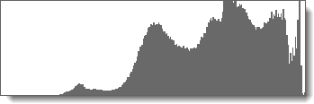
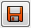
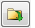
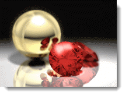

---
---

<!-- TODO: This is a combination of the old information here and the Rhino render Windows.  These two still need to be combined. -->

# Rectangle Rendu
La fenêtre de rendu offre des options pour régler l'exposition et ajouter des effets par post-traitement. Le cadre principal de la fenêtre de rendu fait partie du cadre de rendu de Rhino.  Pour plus d'informations sur les menus et icônes de la fenêtre de rendu, consultez la [rubrique sur la fenêtre de rendu de Rhino](http://docs.mcneel.com/rhino/5/help/fr-fr/index.htm#information/renderwindowpostprocess.htm)

### Menus déroulants
Pour plus d'informations sur les menus et icônes de la fenêtre de rendu, consultez la [rubrique sur la fenêtre de rendu de Rhino](http://docs.mcneel.com/rhino/5/help/fr-fr/index.htm#information/renderwindowpostprocess.htm)

### Barres d'outils

### Enregistrer avec le canal alpha de l'arrière-plan
{: #save-with-alpha-channel}
Enregistre une image 32 bits au format PNG, TIF ou BMP avec l'arrière-plan du canal alpha. Les versions canal alpha des formats de fichier sont utilisées pour la composition haute qualité. Les arrière-plans apparaîtront en noir lorsque le rendu sera enregistré avec le canal alpha.

### Exporter vers un fichier natif de Flamingo nXt (.nXtImage)
{: #export-to-nxtimage}
Enregistre les informations de couleur et de luminance non comprimées. Enregistre tous les canaux de rendu, y compris le canal [alpha](environment-tab.html#alpha). Les fichiers nXt Image peuvent être ouverts dans l'[éditeur d'images](image-editor.html). Vous pouvez alors ajuster l'[exposition](#adjust-image) et appliquer des [effets](#effects) avant d'enregistrer l'image dans un autre format.
Le format .nXtImage est le format d'image natif des moteurs de rendu nXt. Ce format est recommandé pour l'enregistrement de vos rendus car il conserve la plupart des informations sur votre rendu. Les images enregistrées dans ce format peuvent être manipulées dans l'[éditeur d'images nXt](image-editor.html) et des effets spéciaux peuvent être ajoutés. Cet éditeur permet d'enregistrer dans de nombreux formats standards, y compris tous les formats pris en charge dans nXt. Il est également possible d'enregistrer au format [Piranesi EPix file (.epx)](http://www.piranesi.co.uk/).

### Exporter vers un fichier HDR
{: #export-to-hdr}
Enregistre les informations de couleur et de luminance non comprimées. Le format .hdr enregistre les données de luminance directement dans un format à grande plage dynamique. Les arrière-plans sans luminance, comme les photographies normales, apparaîtront en noir s'ils sont enregistrés dans un de ces formats.

### Exporter vers un fichier EXR
{: #export-to-exr}
Format de fichier image à grande plage dynamique créé par la société Industrial Light and Magic (ILM) et distribué sous forme de licence libre. Ce format de fichier gère les nombres flottants en 16 bits par canal avec un bit pour le signe, cinq bits pour l'exposant et dix bits pour la mantisse. Ceci permet d'avoir une plage dynamique de plus de trente niveaux d'exposition. Voir : [Article de Wikipedia : OpenEXR](http://fr.wikipedia.org/wiki/OpenEXR).
Le format EXR enregistre les données de luminance directement dans un format à grande plage dynamique. Les arrière-plans sans luminance, comme les photographies normales, apparaîtront en noir s'ils sont enregistrés dans un de ces formats.

## Quitter
Ferme la fenêtre de rendu.

##  [Fenêtre de rendu, Onglet Flamingo](render-window.html#help)

## Avancement
{: #progress}

### Action

### Passe

### Ligne de balayage

### Temps total écoulé

### Rayons / seconde

### Pixels / seconde

## Contraintes de rendu
{: #number-of-passes}
{: #time}
{: #render-constraints}

## Ajuster l'image
{: #adjust-image}
Les paramètres qui contrôlent l'affichage à l'écran contrôlent aussi tous les fichiers image créé à partir de cet affichage. Plusieurs fichiers image avec des paramètres d'exposition différents peuvent être enregistrés à partir d'une seul rendu. Les paramètres d'exposition définis pour une image rendue seront appliqués à la suivante.
Ce procédé est appelé *adaptation des tons.* L'adaptation des tons est le procédé de conversion des données de luminance utilisées par nXt en pixels rouges, verts et bleus (RVB) qui peuvent être affichés ou imprimés.

### Luminosité
{: #brightness}
Ajuste la luminosité générale de l'image. Par exemple, si une surface blanche est rendue en gris, augmentez la luminosité jusqu'à ce que la surface apparaisse blanche. Ou, si une scène extérieure semble surexposée, diminuez la luminosité jusqu'à ce que les résultats soient plus corrects.

*Luminosité par défaut (gauche) et augmentée.*

### Densité
{: #burn}
Ajuste le point blanc de l'image. Il s'agit de la couleur blanche la plus claire de l'image. La densité peuvent apporter un effet de scène, de la vie et de la netteté au rendu en ajoutant plus de zones de blanc afin de contraster avec les zones sombres.
Voir l'article de Wikipedia : Point blanc](https://fr.wikipedia.org/wiki/Point_blanc).

*Densité par défaut (gauche) et augmentée.*

### Saturation
{: #saturation}
La saturation contrôle la quantité de couleurs d'une image. Une saturation nulle donnera une image en échelle de gris. Les valeurs supérieures à 1 peuvent donner des couleurs plus  extrêmes.

*Saturation par défaut (gauche) et multipliée par 3 (droite).*

### Histogramme
{: #histogram}
Affiche la distribution de la lumière et des zones sombres de l'image.
Voir : [Article de Wikipedia : Histogramme](https://fr.wikipedia.org/wiki/Histogramme). Internet contient de nombreux articles sur l'utilisation des histogrammes pour évaluer l'exposition en photographie numérique. Les principes sont les mêmes pour le rendu.

*Histogramme.*

#### Options de l'histogramme

>Cliquez avec le bouton de droite sur l'image de l'histogramme pour voir les options

#### Ajuster

#### Médiane

#### Moyenne

#### Afficher le diagramme trié

#### Afficher l'échelle

#### Couleur du diagramme

#### Afficher les valeurs de luminance

### Verrouiller l'exposition
{: #lock-exposure}
Si les paramètres d'exposition sont verrouillés, lorsque vous changez l'éclairage, l'exposition n'est pas modifiée en fonction.

## Informations
{: #information}

### Résolution
Affiche la [résolution de rendu](render-tab.html#resolution).

### Faces
Affiche le nombre de faces de maillage utilisées pour rendre le modèle.

### Faces apparentes
Lorsque le modèle contient des blocs, Flamingo nXt peut utiliser la définition de bloc pour rendre les instances sans mailler chaque instance séparément. L'affichage des faces apparentes montre combien de faces temporaires supplémentaires sont générées.

## Informations sur le pixel
Point dans la fenêtre
Point sur l'image
Coordonnée Y dans l'image
Couleur du pixel
Luminance
Distance

## Informations sur l'éclairage

###  [Préréglages](lighting-tab.html)

###  [Soleil](sun-and-sky-tabs.html#sun)

###  [Ciel](sun-and-sky-tabs.html#sky)

###  [Lumières](lights-tab.html)

###  [Indirecte](lighting-advanced-tab.html#indirect)

###  [Lumière ambiante Activée/Désactivée](lighting-advanced-tab.html#ambient)

## Canaux
{: #channels}
Affiche le statut des canaux d'éclairage.

## Effets
{: #post-process-effects}
{: #effects}
Les effets de post-traitement sont appliqués après le rendu de l'image. Ils peuvent être activés et désactivés et l'ordre de la liste peut être modifié. Chaque effet a ses propres paramètres.

## Options des effets
Ces options sont également disponibles dans un menu contextuel.

>Cliquez avec le bouton de droite sur un effet pour afficher le menu contextuel.

Activer/désactiver l'effet sélectionné.
Déplacer l'effet sélectionné vers le haut dans la liste.
Déplacer l'effet sélectionné vers le bas dans la liste.
Propriétés de l'effet sélectionné.
Enregistre comme valeur par défaut l'ordre actuel des effets ainsi que les propriétés.
Enregistre et donne un nom à la liste d'effets actuelle.
Importer une liste nommée d'effets.

## Profondeur de champ
{: #postprocessingdof}
L'effet de profondeur de champ estompe l'image en fonction de la distance à partir de la caméra.

## Propriétés de la profondeur de champ
{: #depth-of-field-properties}

### Propriétés visuelles
{: #dofvisualproperties}

#### Intensité du flou
{: #dofblurringstrength}
Détermine la quantité de flou dans l'image. Il s'agit d'une valeur arbitraire et des valeurs très différentes donneront des résultats intéressants dans différentes images.

#### Flou maximum
{: #dofmaxblurring}
Détermine le rayon maximum de flou utilisé. Étant donné que les zones très floues peuvent rendre l'application de cet effet assez lente, cette option permet de limiter l'effet.

### Zone d'effet
{: #dofareaofeffect}

#### Distance focale
{: #dofocaldistance}
Indique la distance à partir de la caméra sur laquelle l'image est nette.

#### Sélectionner
Cliquer dans l'image pour définir la distance focale.

#### Arrière-plan flou
{: #dofblurbackground}
Détermine si l'arrière-plan est également flou. L'arrière-plan reçoit le flou maximal.

## Brouillard
{: #postprocessingfog}
L'effet de brouillard ajoute à l'image une coloration en fonction de la profondeur. Cet effet peut être utilisé pour ajouter un brouillard épais ou un effet subtil de profondeur.

*Aucun effet n'est appliqué.*

### Brouillard comme arrière-plan dégradé
Le brouillard peut être utilisé pour créer un arrière-plan dégradé.
Dans ce cas, les paramètres de création de l'arrière-plan sont les suivants :
Intensité = 1 Bruit = .1 Couleur du brouillard = Noire Distance finale = environ 110 Distance de départ = environ 90 Arrière-plan avec brouillard = Activé Tremblement = 80

*Brouillard comme arrière-plan dégradé.*

## Propriétés de brouillard
{: #fogsettings}

### Propriétés visuelles
{: #fogvisualproperties}
Détermine l'apparence de l'effet de brouillard.

#### Intensité
{: #fogstrength}
Détermine la quantité maximum de brouillard. Si l'intensité est égale à 0, l'effet est désactivé ; si elle est égale à 1, l'effet est à son maximum. Des valeurs supérieures à 1 peuvent être utilisées mais ceci n'a de sens que si le Bruit est activé**.

#### Bruit
{: #fognoise}
Ajoute un effet aléatoire à l'intensité du brouillard**.

#### Couleur
{: #fogcolor}
Indique la couleur du brouillard.

>Cliquez sur la palette de couleurs pour sélectionner une couleur dans la boîte de dialogue [Sélectionner une couleur](select-color.html).
>Cliquez sur le bouton Sélectionner pour sélectionner la couleur dans l'image rendue.

### Zone d'effet
Détermine la zone concernée par le brouillard.

#### Distance de départ
{: #fogstartdistance}
Indique la distance entre la caméra et le point où le brouillard commence à apparaître.

>Cliquez sur le bouton Sélectionner pour indiquer la profondeur dans l'image rendue.

#### Distance finale
{: #fogenddistance}
Indique la distance entre la caméra et le niveau maximal de brouillard.

>Cliquez sur le bouton Sélectionner pour indiquer la profondeur dans l'image rendue.

### Limites (gauche, droite, haut, bas)
{: #fogbounds}
Indique la zone de l'image affectée par le brouillard. Cette option peut être utilisée pour représenter de légers nuages bas.
Cliquez sur le bouton Sélectionner une zone pour indiquer la zone d'application dans l'image rendue.

### Brouillard

#### Arrière-plan avec brouillard
Détermine si le brouillard est aussi appliqué à l'image en arrière-plan. Au niveau de l'arrière-plan, l'intensité du brouillard sera à son maximum.

#### Tremblement
{: #fogfeathering}
Détermine le nombre de pixels en dehors de la zone d'application où le brouillard disparaîtra petit à petit.

### Aperçu
Permet de voir l'effet sur l'image lorsque vous changez les valeurs.

## Éclat
{: #postprocessingglare}
L'éclat et l'incandescence sont très similaires. L'incandescence utilise une couleur sélectionnée alors que l'éclat pousse la couleur vers le blanc. Avec l'éclat, les zones extrêmement claires de l'image semblent briller. Pour ce faire, la zone entourant la zone claire est éclaircie. Cet effet très subtile est utilisé normalement pour les scènes de nuit car il rend les lumières encore plus réalistes.

*Éclat désactivé (gauche) et activé (droite).*

## Propriétés de l'éclat
{: #glaresettings}

### Limite du point blanc
{: #glarewhitepointbound}
Détermine où commence l'éclat dans la gamme de tons. La valeur est représentée sur l'histogramme et peut aussi être réglée directement sur celui-ci. Les pixels plus clairs que la limite du point blanc (en termes de luminance ou en valeur sur l'échelle des gris) brilleront.

### Taille de l'éclat
{: #glaresize}
Le rayon de l'éclat autour du pixel clair.

### Gain
{: #glaregain}
Multiplicateur de la luminosité de l'éclat. La valeur par défaut est égale à 1 et elle devrait donner des effets normaux. Utilisez des valeurs supérieures pour un éclat extrêmement clair.

### Utiliser les informations photométriques
{: #glareusephotometric}
En mode photométrique, la quantité d'éclat est contrôlée en déterminant dans quelle mesure le pixel est "plus blanc que blanc". Sinon, l'effet utilise les pixels les plus blancs de l'image.

### Histogramme
{: #glarehistogram}
Affiche la distribution des zones sombres et claires.

#### Options de l'histogramme

>Cliquez avec le bouton de droite sur l'image de l'histogramme pour voir les options

#### Ajuster

#### Médiane

#### Moyenne

#### Afficher le diagramme trié

### Aperçu
Permet de voir l'effet sur l'image lorsque vous changez les valeurs.

## Incandescence
{: #postprocessingglow}
L'effet incandescent produit une zone claire autour de couleurs spécifiques. Il peut être utilisé pour faire briller les lumières colorées et les néons par exemple. Vous pouvez sélectionner jusqu'à 10 couleurs sur lesquelles appliquer cet effet.
Dans l'illustration ci-contre, l'effet est appliqué sur une des couleurs rouges du rubis et le gain est défini de sorte que la couleur se rapproche du blanc.

*L'incandescence pour faire scintiller un objet.*

*Incandescence désactivée (gauche) et activée (droite).*

## Propriétés de l'incandescence
{: #glowsettings}

### Activé
Active l'incandescence sur la couleur correspondante.

### Couleur
{: #glowcolor}
Indique la couleur de l'incandescence.

>Cliquez sur la palette de couleurs pour sélectionner une couleur dans la boîte de dialogue [Sélectionner une couleur](select-color.html).
>Cliquez sur le bouton Sélectionner pour sélectionner la couleur dans l'image rendue.

### Sensibilité
{: #glowsensitivity}
Contrôle la variation permise sur la couleur sélectionnée lors du calcul de l'incandescence sur des pixels proches de cette couleur.

### Taille de l'incandescence
{: #glowsize}
Le rayon de l'incandescence autour du pixel clair.

### Gain
{: #glowgain}
Multiplicateur de la luminosité de l'incandescence. La valeur par défaut est égale à 1 et elle devrait donner des effets normaux. Utilisez des valeurs supérieures pour une incandescence extrêmement claire.

### Aperçu
Permet de voir l'effet sur l'image lorsque vous changez les valeurs.

## Fils et texte
{: #postprocessingwireframe}
Reproduit les courbes, les textes, les cotes, les courbes isoparamétriques, les bords de maillage et les objets ponctuels dans l'image rendue.

*Avec (gauche) et sans Fils et texte (droite).*

## Propriétés de l'option Fils et texte

### Courbes
Affiche les courbes.

### Cotes et texte
Affiche toutes les cotes et tous les objets de texte.

### Courbes isoparamétriques
Affiche les courbes isoparamétriques des surfaces.

### Bords de maillage
Affiche les bords des maillages.

### Points
Affiche les objets ponctuels.

### Aperçu
Permet de voir l'effet sur l'image lorsque vous changez les valeurs.