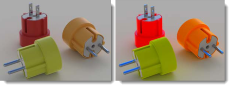

# {: .inline} {{page.title}}
La fenêtre de rendu offre des options pour régler l'exposition et ajouter des effets par post-traitement. Le cadre principal de la fenêtre de rendu fait partie du cadre de rendu de Rhino.  Pour plus d'informations sur les menus et icônes de la fenêtre de rendu, consultez la [rubrique sur la fenêtre de rendu de Rhino](http://docs.mcneel.com/rhino/5/help/fr-fr/index.htm#information/renderwindowpostprocess.htm).  Cette rubrique couvre les options supplémentaires apportées spécifiquement par Flamingo.

## Gérer un rendu en cours
Lorsque le rendu est lancé, la [fenêtre de rendu](http://docs.mcneel.com/rhino/5/help/fr-fr/index.htm#information/renderwindowpostprocess.htm) s'ouvre et le calcul du rendu débute.  Le système de Flamingo utilise plusieurs passes qui actualisent l'image rendue par étapes. Flamingo recherche tout d'abord les modifications sur son modèle interne puis lance un processus d'initialisation. Ce processus peut prendre quelques secondes voire plusieurs minutes. Le modèle est importé, les images des matériaux sont copiées à partir du disque dur et la mémoire tampon de l'image rendue est créée. Il est possible de gérer le rendu à plusieurs moments :

1. [Rendu multi-passes](#multi-pass)
1. [Arrêter un rendu](#stop-render)
1. [Ajuster une image](#adjusting)
1. [Enregistrer une image](#saving)

### Rendu multi-passes
{: #multi-pass}
Flamingo nXt est un tout nouveau moteur de rendu. Le rendu avec un perfectionnement en plusieurs passes permet des effets de rendu plus avancés sans interface compliquée. Les premières passes de rendu produiront des défauts inattendus.  Par exemple, vous verrez que les ombres sont très précises et linéaires au début. Les ombres seront de plus en plus douces à chaque passe et se mélangeront petit à petit. De nombreux autres effets s'amélioreront à chaque passe de rendu.  Utilisez l'[onglet Flamingo](#flamingo-tab) pour suivre le processus de rendu. 

De cette façon, le rendu de nXt n'est jamais vraiment terminé ; c'est à vous de décider du moment où il est assez bien pour l'arrêter. Vous pouvez laisser les images qui semblent correctes continuer à s'améliorer. Mais, si vous voulez réaliser une modification ou enregistrer une image, vous pouvez également arrêter un rendu à tout moment.

Parmi les effets qui s'améliorent à chaque passe :

* Éclairage (comme l'illumination globale si elle est activée)
* Ombres floues
* Réflexions (floues)
* Réfraction
* Anticrénelage
* Profondeur de champ

### Arrêter un rendu
{: #stop-render}
Différentes options permettent d'arrêter le rendu :

{: .inline} Cliquer sur le bouton X en haut à droite de la fenêtre de rendu pour arrêter immédiatement le rendu et fermer la fenêtre de rendu. C'est la meilleure option pour revenir rapidement au modèle afin de réaliser des modifications.

{: .inline} Cliquer sur le bouton Arrêter le lancer de rayons pour arrêter le rendu à la fin de la passe en cours. C'est la meilleure option pour enregistrer une image.

{: .inline} Double cliquer sur le bouton Arrêter le lancer de rayons pour arrêter le rendu immédiatement et laisser la fenêtre de rendu ouverte.

### Ajuster un rendu
{: #adjusting}
Après avoir arrêté une image, utilisez les contrôles de l'[onglet Flamingo](#flamingo-tab) pour ajuster rapidement l'image et l'éclairage. Cet ensemble d'outils est très important pour la production d'images de haute qualité. 

Contrôles permettant d'ajuster les images :

* [Ajuster l'image](#adjust-image)
* [Canaux](#channels)
* [Effets postérieurs](#post-process-effects)

### Enregistrer des images
{: #saving}
Plusieurs options sont disponibles pour enregistrer une image en fonction de son utilisation postérieure. La plupart des images pourront être enregistrées au format JPG ou PNG. Mais il existe d'autres options.

#### {: .inline} Enregistrer l'image
Après avoir ajusté l'image, le procédé normal consiste à enregistrer le fichier au format JPG ou PNG.  

Une image JPG est un format de fichier très performant et assez petit. Ce format convient très bien aux images publiées sur Internet ou envoyées par mail. Mais cette performance a un prix, en effet certaines couleurs sont supprimées de l'image. 

PNG est un format comprimé qui contient 100 % des informations de couleur et de canal Alpha. Ce format convient très bien aux images de haute qualité.

#### Enregistrer avec le canal alpha de l'arrière-plan
{: #save-with-alpha-channel}
Enregistre une image 32 bits au format PNG, TIF ou BMP avec l'arrière-plan du canal alpha. Utilisez les versions canal alpha des formats de fichier pour la composition haute qualité. Les arrière-plans apparaîtront en noir lorsque le rendu sera enregistré avec le canal alpha.  Une case dans l'[onglet Flamingo](#flamingo-tab) et la [boîte de dialogue Enregistrer](#saving) permet d'enregistrer le canal alpha. Le format de fichier PNG permet de capturer les informations sur le canal alpha.

#### Exporter vers un fichier natif de Flamingo nXt (.nXtImage)
{: #export-to-nxtimage}
Enregistre les informations de couleur et de luminance non comprimées. Enregistre tous les canaux de rendu, y compris le canal [alpha](environment-tab.html#alpha). Les fichiers nXt Image peuvent être ouverts dans l'[éditeur d'images](image-editor.html). Vous pouvez alors ajuster l'[exposition](#adjust-image) et appliquer des [effets](#effects) avant d'enregistrer l'image dans un autre format.

Le format .nXtImage est le format d'image natif des moteurs de rendu nXt. Ce format est recommandé pour l'enregistrement de vos rendus car il conserve la plupart des informations sur votre rendu. Les images enregistrées dans ce format peuvent être manipulées dans l'[éditeur d'images nXt](image-editor.html) et des effets spéciaux peuvent être ajoutés. Cet éditeur permet d'enregistrer dans de nombreux formats standards, y compris tous les formats pris en charge dans nXt. Il est également possible d'enregistrer au format [Piranesi EPix file (.epx)](http://www.piranesi.co.uk/).

#### Exporter vers un fichier HDR
{: #export-to-hdr}
Enregistre les informations de couleur et de luminance non comprimées. Le format .hdr enregistre les données de luminance directement dans un format à grande plage dynamique. Les arrière-plans sans luminance, comme les photographies normales, apparaissent en noir s'ils sont enregistrés dans un de ces formats.

#### Exporter vers un fichier EXR
{: #export-to-exr}
Format de fichier image à grande plage dynamique créé par la société Industrial Light and Magic (ILM) et distribué sous forme de licence libre. Ce format de fichier gère les nombres flottants en 16 bits par canal avec un bit pour le signe, cinq bits pour l'exposant et dix bits pour la mantisse. Ceci permet d'avoir une plage dynamique de plus de trente niveaux d'exposition. Voir l'[article de Wikipedia : OpenEXR](http://fr.wikipedia.org/wiki/OpenEXR).
Le format EXR enregistre les données de luminance directement dans un format à grande plage dynamique. Les arrière-plans sans luminance, comme les photographies normales, apparaissent en noir s'ils sont enregistrés dans un de ces formats.

#### {: .inline} Quitter
Ferme la fenêtre de rendu.

#### Menus déroulants
Pour plus d'informations sur les menus et icônes de la fenêtre de rendu, consultez la [rubrique sur la fenêtre de rendu de Rhino](docs.mcneel.com/rhino/5/help/fr-fr/commands/render.htm#The_Render_Window).

## Onglet de Flamingo
{: #flamingo-tab}
L'onglet Flamingo de la fenêtre de rendu apporte de nombreuses options spécifiques au moteur de rendu de Flamingo. La compréhension de ces options est indispensable pour bien gérer les rendus de Flamingo.

#### Enregistrer avec le canal alpha
Enregistre des images 32 bits au format PNG, TIF ou BMP avec l'arrière-plan du canal alpha. Les versions canal alpha des formats de fichier sont utilisées pour la composition haute qualité. Les arrière-plans apparaîtront en noir lorsque le rendu sera enregistré avec le canal alpha.  Utilisez cette case et la case de la [boîte de dialogue Enregistrer](#saving) pour enregistrer le canal alpha. Le format de fichier PNG permet de capturer les informations sur le canal alpha.

## Avancement
{: #progress}
Utilisez les informations sur l'avancement pour vérifier le statut d'un rendu de Flamingo. 

#### Action
Affiche le statut actuel du calcul de rendu. 

Messages de statut :

* Rendu démarré - Une fois qu'un rendu est lancé, Flamingo réalise quelques tâches telles que la conversion du modèle et la configuration de la mémoire nécessaire au rendu. 
* Action réalisée - Lorsque le bouton Arrêter est utilisé et que le moteur de rendu a terminé la passe en cours, l'action est réalisée. 
* Passe terminée - Ce message est affiché à chaque fois qu'une passe est terminée. 
* Reprendre le rendu - S'il est possible de reprendre le rendu, ce message est affiché. 
* Actualisation - Le moteur de rendu est au milieu d'une passe, en cours d'actualisation du rendu. 

#### Passe
Passe actuellement en cours de rendu. Flamingo est un moteur de rendu fonctionnant avec plusieurs passes. Chaque passe améliore les effets d'éclairage et de rendu complexes.

#### Ligne de balayage
Une passe avance le long d'une bande de pixels horizontaux.  Chaque ligne de pixels est une ligne de balayage. Cette information indique la ligne de balayage envoyée par le moteur de rendu.

#### Temps total écoulé
Temps écoulé depuis le début du rendu.  Le temps de préparation pour le rendu n'est pas compris dans cette valeur.

#### Rayons / seconde
Nombre de rayons calculés dans la scène par seconde.

#### Pixels / seconde
Nombre de pixels calculés dans l'image par seconde.

## Ajuster l'image
{: #adjust-image}
Cette option est une des plus importantes de Flamingo. Tout comme sur un appareil-photo, vous pouvez ajuster l'exposition de l'image. Cette option est idéale pour rendre des rendus plus clairs, plus foncés, ajouter du contraste ou augmenter la saturation de couleur. Ce réglage est appelé l'[adaptation des tons](https://en.wikipedia.org/wiki/Tone_mapping). Flamingo travaille dans l'espace de luminance, une gamme beaucoup plus importante de couleurs et d'intensités que celle pouvant être affichée sur un écran ou une imprimante. L'adaptation des tons est le procédé de conversion des données de luminance en pixels rouges, verts et bleus (RVB) qui peuvent être affichés sur un écran ou imprimés. Les paramètres contrôlent également comment les images sont enregistrées.

{: .inline} {: .inline}
*L'image de gauche est celle produite par défaut. L'image corrigée après avoir appliqué une luminosité de 0.20, une densité de 0.16 et une saturation de 1.20.*
Utilisez ce procédé pour ajuster rapidement la luminosité d'une image ainsi que sa couleur générale sans relancer le rendu.

### Luminosité
{: #brightness}
Ajuste la luminosité générale de l'image. Par exemple, si une surface blanche est rendue en gris, augmentez la luminosité jusqu'à ce que la surface apparaisse blanche. Ou, si une scène extérieure semble surexposée, diminuez la luminosité jusqu'à ce que les résultats soient plus corrects.

*Luminosité par défaut (gauche) et augmentée.*



### Densité
{: #burn}
Ajuste le point blanc de l'image. Il s'agit de la couleur blanche la plus claire de l'image. Un peu de densité peut apporter un effet de scène, de la vie et de la netteté au rendu en ajoutant plus de zones de blanc afin de contraster avec les zones sombres.
Voir l'[article de Wikipedia : Point blanc](https://fr.wikipedia.org/wiki/Point_blanc).

*Densité par défaut (gauche) et augmentée.*

### Saturation
{: #saturation}
La saturation contrôle la quantité de couleurs d'une image. Une saturation nulle donnera une image en échelle de gris. Les valeurs supérieures à 1 peuvent donner des couleurs plus  extrêmes.

*Saturation par défaut (gauche) et multipliée par 3 (droite).*

### Histogramme
{: #histogram}
Affiche la distribution de la lumière et des zones sombres de l'image après l'application des ajustements sur l'image. Le bord gauche du diagramme représente les couleurs sombres jusqu'au noir.  Le bord droit du diagramme montre la quantité de couleurs claires jusqu'au blanc. Cette représentation est très utile pour déterminer les parties importantes de l'image. Il peut être intéressant d'ajuster l'image jusqu'à obtenir toute la gamme de valeurs dans l'image.  Par exemple, si l'histogramme s'arrête avant d'atteindre l'extrémité droite du diagramme, ajoutez de la luminosité ou de la densité afin de faire tendre vers le blanc les portions les plus claires du rendu. Voir : [Article de Wikipedia : Histogramme](https://fr.wikipedia.org/wiki/Histogramme). Internet contient de nombreux articles sur l'utilisation des histogrammes pour évaluer l'exposition en photographie numérique. Les principes sont les mêmes pour le rendu.

*Exemple d'histogramme montrant la distribution de couleurs dans une image. Le diagramme gris montre quelques zones sombres (côté gauche) et une grande gamme de couleurs claires (côté droite). Ce diagramme montre également qu'il existe quelques pixels entièrement blancs étant donné que le diagramme est coupé sur le bord droit (les couleurs claires jusqu'au blanc sont représentées sur l'extrémité droite).* 

#### Options de l'histogramme
Cliquez avec le bouton de droite sur l'image de l'histogramme pour voir les options suivantes.  Ces options changent la façon dont l'histogramme affiche les informations. Elles ne changent pas les valeurs de l'histogramme. 

* **Ajuster** - Cette option ajuste les verticales les plus élevées du graphique. 
* **Médiane** - Cette option ajuste la valeur médiane sur la verticale. Elle permet de voir les détails au niveau des bords du diagramme. 
* **Moyenne** - Cette option ajuste la valeur moyenne sur la verticale.
* **Afficher le diagramme trié** - Cette option trie toutes les valeurs en fonction de leur quantité dans l'image. 
* **Afficher l'échelle** - Affiche les valeurs correspondantes le long de la partie inférieure du diagramme. 
* **Couleur du diagramme...** - Définit la couleur du diagramme.

### Verrouiller l'exposition
{: #lock-exposure}
Si les paramètres d'exposition sont verrouillés, lorsque vous changez l'éclairage, l'exposition n'est pas modifiée en fonction.

## Contraintes de rendu
{: #number-of-passes}
{: #time}
{: #render-constraints}


## Informations
{: #information}

#### Résolution
Affiche la [résolution de rendu](render-tab.html#resolution) actuelle. 

#### Faces
Affiche le nombre de faces de maillage utilisées pour rendre le modèle.  Cette valeur permet de comparer plusieurs [paramètres de maillage de rendu](http://docs.mcneel.com/rhino/5/help/fr-fr/index.htm#documentproperties/mesh.htm) dans Rhino.

#### Faces apparentes
Lorsque le modèle contient des blocs, Flamingo nXt peut utiliser la définition de bloc pour rendre les instances sans mailler chaque instance séparément. L'affichage des faces apparentes montre combien de faces temporaires seraient générées en plus si les occurrences de bloc n'existaient pas.

#### Informations sur l'éclairage
Informations sur la configuration actuelle de l'éclairage du rendu.  Liste des informations données sur l'éclairage :

* [Préréglages](lighting-tab.html)
* [Soleil](sun-and-sky-tabs.html#sun)
* [Ciel](sun-and-sky-tabs.html#sky)
* [Lumières](lights-tab.html)
* [Indirecte](lighting-tab.html#indirect)
* [Lumière ambiante Activée/Désactivée](lighting-tab.html#ambient)

## Canaux
{: #channels}
Utilisez ces contrôles pour changer les canaux de lumières en temps réel. Assignez des lumières à un des huit canaux disponibles. Après le rendu, ajustez l'éclairage dans l'image rendue. Cette fonction permet de travailler sur l'équilibrage de plusieurs sources de lumière dans un rendu. Pour plus d'informations, voir la  rubrique [Canaux de rendu](render-channel.html#adjustng-channels).

## Effets postérieurs
{: #post-process-effects}
Applique des effets de traitement postérieur après avoir calculé le rendu de l'image. Les effets peuvent être activés et désactivés et l'ordre de la liste peut être modifié. Chaque effet a ses propres paramètres. Effets disponibles :

* Brouillard
* Incandescence
* Éclat
* Profondeur de champ
* Points
* Courbes
* Courbes isoparamétriques
* Annotations

Pour plus d'informations sur les filtres voir la rubrique [post-traitement des images](docs.mcneel.com/rhino/5/help/fr-fr/commands/render.htm#The_Render_Window).