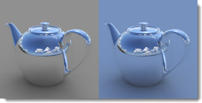

# {: .inline} {{page.title}}
Le [soleil](#sun) et le [ciel](#sky) sont étroitement liés entre eux. Le soleil peut modifier la luminosité du ciel en mode automatique. Si le soleil est activé et que le ciel est une image HDR, il est important d'équilibrer leurs intensités. 

## Soleil
{: #sun}
Le soleil est une lumière parallèle invisible très puissante. Les facteurs simulant des conditions du monde réel tels que la latitude et la longitude, l'heure de la journée et la saison contrôlent la direction et la luminosité du soleil.

Cette rubrique de l'aide couvre les contrôles de Flamingo pour le soleil. Le contrôle du [soleil de Rhinoceros](http://docs.mcneel.com/rhino/5/help/fr-fr/commands/sun.htm) peut également être utilisé pour placer le soleil. Flamingo synchronisera les deux contrôles.  

##### Où puis-je trouver les contrôles du soleil de Flamingo ?

Le soleil doit être activé à travers les [préréglages d'éclairage](lighting-tab.html#lighting-presets) ou les [paramètres d'éclairage personnalisé](lighting-tab.html#sun).

* {: .inline} Barres d'outils >{: .inline} Barre d'outils de Flamingo nXt
* {: .inline} Menus > Flamingo nXt 5.0 > Montrer le panneau de configuration > Onglet Flamingo nXt > Soleil

**Remarque :** L'onglet Soleil ne sera visible que si le soleil est activé dans un préréglage d'éclairage.

Les angles solaires devront être indiqués afin de pouvoir calculer la lumière du soleil. Vous pouvez indiquer la direction du soleil de deux façons : avec la date, l'heure et le lieu ou directement avec l'angle. Utilisez le positionnement selon la date, l'heure et le lieu si vous essayez de simuler le soleil réel dans une étude de l'emplacement du modèle. Le positionnement par angle direct permet de contrôler l'angle de la lumière sans faire référence à un soleil réel. Utilisez cette option pour essayer des effets de lumière.

  
*Sydney, Australie, 21 juin, 09h30 (à gauche). Stockholm, Suède, 21 Juin, 09h30 (à droite).*

### Définir l'azimut et l'altitude
{: #set-azimuth-and-altitude}
Utilise des angles pour définir manuellement la direction du soleil. Active les contrôles de l'[azimut](#azimuth) et de l'[altitude](#altitude).

#### Azimut
{: #azimuth}
Définit la direction du soleil en degrés angulaires à partir du Nord (0) sur le plan horizontal.  La carte circulaire montre le monde sur une vue en plan. 

#### Altitude
{: #altitude}
Définit la hauteur du soleil dans le ciel en degrés angulaires à partir de l'équateur (0).  La carte en demi-cercle simule une section dans la direction verticale des coordonnées dans le repère général. 

### Définir le lieu sur la terre
{: #set-location-on-earth}
Utilisez l'angle du soleil pour placer le soleil en fonction de la date, de l'heure et du lieu. **Remarque :** Comme pour tous les calculateurs de soleil, la précision du positionnement du soleil peut varier. Si une précision absolue est nécessaire, nous vous recommandons de vérifier la position du soleil. 

#### Date
{: #date}
Définit la date.

#### Heure
{: #time}
Indique l'heure.

#### Heure d'été
{: #daylight-savings-time}
Avance l'heure d'une heure.

#### Latitude/Longitude
{: #latitude-longitude}
Entrez une latitude et une longitude ou choisissez une position sur la carte.
Les nombres seront également actualisés pour afficher la latitude et la longitude de la position sélectionnée sur la carte avec la souris.

#### Fuseau horaire
{: #time-zone}
Affiche le fuseau horaire à partir de la latitude et la longitude du lieu indiqué.

#### Liste des villes
{: #city-list}
Utilisez cette liste pour sélectionner une ville afin de définir le lieu.

#### Carte
{: #map}
Cliquez sur la carte pour sélectionner un lieu. Faites glisser la carte avec le bouton de gauche pour la déplacer.

### Intensité du soleil
{: #sun-intensity}
Permet de modifier la luminosité du composant de lumière directe de la lumière du jour (le soleil). L'intensité du soleil est automatiquement calculée selon les angles solaires et les conditions du ciel mais elle peut être modifiée pour s'équilibrer avec les autres lumières.

### Reflet du soleil
{: #sun-highlight}
La netteté du reflet du soleil.

*Reflet du soleil=0 (gauche) et 1 (droite).*

**Remarque :** Des défauts de reflet solaire peuvent parfois être vus sur les rendus extérieurs lorsque le paramètre de Reflet du soleil est activé. Pour atténuer ou éliminer cet artefact, définissez le Reflet du soleil sur une plus petite valeur.
{: #speckle-artifacts}



#### Direction du nord
{: #north}
**Remarque :** Nord correspond à la direction y positive du repère général.

## Ciel
{: #sky}
Le ciel est une grande sphère autour du rendu qui peut être utilisée pour l'éclairage. Le ciel est très différent de l'environnement. Le ciel contrôle l'éclairage. L'environnement contrôle ce qui est réfléchi et visible en arrière-plan. Dans de nombreux cas le ciel et l'environnement devront être définis différemment l'un de l'autre. 

#### Où puis-je trouver les contrôles du ciel de Flamingo ?
Le ciel doit être activé à travers les [préréglages d'éclairage](lighting-tab.html#lighting-presets) ou les [paramètres d'éclairage personnalisé](lighting-tab.html#sky).

 1. {: .inline} Barres d'outils >{: .inline} Barre d'outils de Flamingo nXt
 1. {: .inline} Menus > Flamingo nXt 5.0 > Montrer le panneau de configuration > Onglet Flamingo nXt > Ciel

Les schémas d'éclairage prédéfinis pour la lumière du jour [Extérieure](lighting-tab.html#exterior-daylight) et [Intérieure](lighting-tab.html#interior-daylight) utilisent le ciel automatique par défaut. Le schéma d'éclairage de [studio](lighting-tab.html#studio-lighting) prédéfini utilise un éclairage par image HDR.

Le ciel peut être défini de cinq façon différentes :

* [Désactivé](lighting-tab.html#off)
* [Ciel automatique](#automatic-sky)
* [Image à grande plage dynamique (HDRI)](#high-dynamic-range-image-sky)
* [Couleur](#color-sky)
* [Image](#image-sky)

Les deux meilleurs paramètres pour les types d'éclairage zénithal sont [Image HDR](#high-dynamic-range-image-sky) et [Ciel automatique](#automatic-sky). Le ciel avec image HDR utilise une image contenant des valeurs d'éclairage enregistrées sur chaque pixel pour définir l'éclairage et les réflexions. Le ciel automatique utilise une nébulosité et une position du soleil dans le monde réel pour simuler le ciel.  Ces paramètres produiront les rendus les plus dynamiques. 

### Ciel automatique
{: #automatic-sky}
Le ciel automatique utilise les paramètre de l'[onglet Soleil](sun-and-sky-tabs.html) pour déterminer la gamme de couleurs et l'intensité de la lumière zénithale. Par exemple, lorsque le soleil est haut dans le ciel, l'éclairage et les couleurs du ciel sont très différents de ceux appliqués lorsque le soleil est bas. 

*Ciel automatique : soleil haut (gauche) et bas (droite) dans le ciel.*

#### Nébulosité
{: #sky-cloudiness}
Lorsque la nébulosité est désactivée, le ciel est considéré comme dégagé et des ombres dures sont créées. Plus la nébulosité est élevée, moins il y a de contraste entre la lumière et les ombres. Une nébulosité plus importante créera des ombres plus légères et un effet d'éclairage plus régulier. Le paramètre de nébulosité touche de nombreux aspects du calcul de la lumière du jour, y compris la quantité relative de lumière directe et indirecte, le mode de calcul de la lumière indirecte et la couleur de l'arrière-plan si le mode ciel automatique a été sélectionné. La nébulosité varie de 0 (dégagé) à 1 (complètement couvert). La gamme de nébulosité entre 0.35 et 0.50 est très sensible et dynamique. 

*Nébulosité 0 (gauche) et 1 (droite).*

#### Intensité du ciel
{: #sky-intensity}
Permet de modifier la luminosité du composant de lumière indirecte de la lumière du jour (le ciel). L'intensité de la lumière zénithale est automatiquement calculée selon les angles solaires et les conditions du ciel mais elle peut être modifiée. **Remarque :** Ce paramètre n'est important que si la scène possède d'autres lumières qui doivent être compensées. Si aucune autre lumière n'est définie, le contrôle de tonalité compensera l'exposition et l'image rendue ne sera pas plus brillante ni plus terne en fonction de ce paramètre.



### Ciel avec image à grande plage dynamique
{: #high-dynamic-range-image-sky}
Une [image à grande plage dynamique (HDR)](https://fr.wikipedia.org/wiki/Imagerie_%C3%A0_grande_gamme_dynamique) est un fichier image spécial en 2D. Ces images contiennent une plus grande plage de valeurs au niveau de chaque pixel qu'un fichier image standard, comme .jpg ou .png. Ces données supplémentaires peuvent être utilisées pour éclairer les modèles. Si les valeurs contenues dans l'image HDR sont justes, l'éclairage peut être précis. Cet effet peut produire un éclairage très dynamique dans la scène. Le schéma d'éclairage de studio prédéfini utilise des images HDR pour le ciel. Si vous considérez l'éclairage de studio comme une activité d'intérieur, imaginez l'image HDR comme un plafond qui émet de la lumière à partir des couleurs de l'image.

*Éclairage avec une image HDR.*

Les images HDR contiennent normalement des valeurs de rayonnement exprimées en watts. Si ce n'est pas le cas, l'intensité de ces images HDR devra probablement être ajustée pour obtenir des niveaux corrects d'illumination.

En plus du ciel, une autre image HDR peut être utilisée pour chacun des trois arrière-plans : [Visible](environment-tab.html#advanced-background), [Réfléchi ](environment-tab.html#advanced-background) et [Réfracté ](environment-tab.html#advanced-background).

#### Image HDR
Définit le fichier image HDR à utiliser. Cliquer sur l'image pour choisir une autre image. 

*Projection cylindrique équidistante.*

Les images HDR peuvent avoir deux types de projection afin de d'envelopper correctement l'image autour de la sphère du ciel. La plus connue est la projection cylindrique équidistante. Ces images sont rectangulaires avec des proportions de 2:1. Les images cylindriques équidistantes ont une résolution uniforme sur toute l'image. La deuxième projection est la projection sphérique. Les images HDR sphériques sont carrées avec une courbure élevée. Les projections sphériques présentent une résolution réduite au niveau de la jonction. 

#### Intensité
Modifie la luminosité de la lumière émise par l'image HDR. Ce paramètre n'est important que si la scène possède d'autres lumières qui doivent être compensées. Si aucune autre lumière n'est définie, le contrôle de tonalité compensera l'exposition et l'image rendue ne sera pas plus brillante ni plus terne en fonction de ce paramètre.

*Intensité HDR faible et élevée.*

{: .inline} Dans l'illustration, l'image a été tournée afin que le reflet du soleil apparaisse sur l'objet. Indiquez les degrés de rotation ou déplacez l'indicateur de rotation.

*Image tournée de sorte que le soleil apparaisse sur l'objet.*

#### Saturation
La saturation de la couleur de la lumière. Étant donné que la lumière d'une image HDR provient de la couleur des pixels de l'image, des effets de couleur indésirables peuvent se produire parfois. Choisissez une saturation peu élevée si vous ne voulez utiliser que la lumière de l'image, sans la couleur.

*Saturation faible (gauche) et élevée (droite.*





### Couleur
{: #color-sky}
Il est possible d'utiliser une couleur ou un dégradé de couleurs pour éclairer la scène. Les couleurs du ciel sont multipliées par la valeur de l'intensité afin de donner aux couleurs une valeur d'éclairage. 

#### Intensité
La valeur de l'intensité est utilisée pour multiplier les couleurs du ciel afin d'obtenir une valeur d'éclairage.  Les couleurs peuvent aller de 0 à 255 par canal. L'intensité multipliera ces valeurs.

#### Type de couleur
Il existe trois façons de contrôler la couleur du ciel. Les contrôles sont similaires à ceux de l'environnement. Voir les contrôles de l'[arrière-plan avec une couleur](environment-tab.html#environment-color-and-gradient-backgrounds) pour plus d'informations. 

### Image
{: #image-sky}
Il est possible d'utiliser une image pour éclairer la scène. Les couleurs de l'image sont multipliées par la valeur de l'intensité afin de donner aux couleurs une valeur d'éclairage.

#### Intensité
La valeur de l'intensité est utilisée pour multiplier les couleurs du ciel afin d'obtenir une valeur d'éclairage.  Les couleurs peuvent aller de 0 à 255 par canal. L'intensité multipliera ces valeurs.

#### Projection de l'image
Il existe plusieurs façons de contrôler le placage d'une image sur le ciel. Les contrôles sont similaires à ceux de l'image en arrière-plan.  Voir les contrôles de l'[arrière-plan avec une image](environment-tab.html#environment-image) pour plus d'informations.