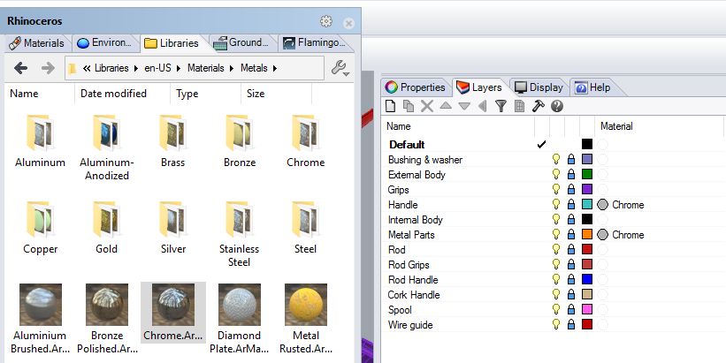

<!-- TODO: Make sure to update this page and get working in the guides section of the documentation. -->

# {{page.title}}
Questo tutorial mostra come renderizzare un modello standard di Rhino usando nXt. Il tutorial esamina i passi principali del rendering con nXt:

1. Apertura di un modello
1. Creazione dei materiali
1. Modifica dei materiali
1. Aggiunta di un piano d'appoggio

Prima di tutto, occorre scaricare e decomprimere i file del tutorial. Per scaricare il file zip, cliccare sul link [Mulinello.zip](files/Mulinello.zip). Decomprimere i file nella loro cartella. Aprire il file Mulinello.3dm con Rhino. Verificare che Flamingo nXt sia impostato come modulo di rendering corrente nella relativa opzione del menu di rendering.

## Verificare il motore di rendering corrente
{: #check-current}
In Rhino si possono installare vari motori di rendering.  Per verificare che Flamingo nXt 5 sia il motore di rendering corrente, andare al menu Rendering > Modulo di rendering corrente > Flamingo nXt 5.  Se, di fianco alla scritta Flamingo nXt 5 appare un segno di spunta, vuol dire che si tratta del motore di rendering corrente.

## Processo di rendering
{: #render_controls}
{: .float-img-right} Per il primo rendering del modello, cliccare sul pulsante di rendering. L'immagine risultante dovrebbe essere come quella sulla destra. nXt funziona diversamente dalle versioni precedenti di Flamingo. I modelli nuovi includono un setup di illuminazione HDRI predefinito.  I modelli nuovi usano un materiale predefinito bianco per tutti gli oggetti. Come potete notare, all'inizio le ombre appaiono molto nette e lineari. Quindi, sfumandosi tra di loro ad ogni successiva passata, esse diventeranno più morbide. Di fatto, ad ogni passata di rendering, migliorano molti altri effetti.

Alcuni degli effetti che migliorano ad ogni passata

* Illuminazione (come l'illuminazione globale, se attivata)
* Ombre morbide
* Riflessioni (diffuse)
* Rifrazione
* Antialiasing
* Profondità di campo

In un certo senso, i rendering di nXt non sono mai del tutto "finiti"; sta a voi decidere quando la loro qualità soddisfa le vostre esigenze e quindi quando fermarvi. Siete liberi di lasciare che le immagini continuino a migliorare. Oppure potete interrompere il rendering in qualsiasi momento per effettuare eventuali modifiche o salvataggi. È possibile arrestare il rendering in vari modi:
{: .clear-img}

* Cliccare sul pulsante "Arresta rendering" per arrestare il rendering al termine della passata in corso.
* Fare doppo clic sul pulsante "Arresta rendering" per arrestare il rendering immediatamente.
* Cliccare sulla "X" in alto a destra della finestra di rendering per arrestare il rendering immediatamente e chiudere la finestra di rendering.

## Assegnare i materiali dalla libreria
{: #materials}
Visto che in nXt è già integrata un'illuminazione di base, di solito la maggior parte del lavoro di configurazione dei rendering risiede nel creare i materiali giusti per ciascun modello. I materiali vengono memorizzati direttamente in ciascun modello. Per creare velocemente dei nuovi materiali, si possono usare i materiali modello.

  1. Aprire il pannello di controllo di Flamingo nXt dal menu di Flamingo nXt all'interno di Rhino.
  1. Per assegnare un materiale esistente. Nel pannello di controllo, andare alla cartella Librerie.
  1. I materiali sono organizzati in cartelle. Andare alla cartella Materiali di Flamingo.
  
  1. All'interno della cartella Materiali di Flamingo, andare alla cartella Metalli.
  {: .wide-img}
  1. Cliccare e trascinare il materiale Cromo sui livelli Manovella e Parti metalliche. 
  1. Renderizzare i risultati. Gli elementi che si trovano nei livelli Manovella e Parti metalliche ora vengono renderizzati con una finitura in cromo.
  
  1. Assegnare quindi i seguenti materiali ai seguenti livelli:

 | Libreria | Materiale | Livello |
 |:-------|:------|:------|
 | Progettazione navale | Gomma nera | Boccola e rondella |
 | Progettazione navale | Gomma nera | Grip |
 | Progettazione navale | Gomma nera | Grip della canna |
 | Vernici auto | Vernice auto, rosso | Corpo esterno |
 | Metalli > Oro | Oro - Satinato, Liscio | Corpo interno |
 | Metallo > Alluminio - Anodizzato | Alluminio - Anodizzato rosso | Bobina |
 | Plastiche > Bianco e nero > Liscio | Plastica - Nero, Liscio | Canna |
 | Plastiche > Bianco e nero > Liscio | Plastica - Nero, Liscio | Impugnatura della canna |
 | Plastiche > Bianco e nero > Liscio | Plastica - Nero, Liscio | Anelli guida filo |
{: .grided-table}

##### Renderizzare per ottenere questi risultati:
 

## Creare un nuovo materiale
{: #new-material}
Nella libreria, non sempre si trova il materiale di cui si ha bisogno. Per esempio, l'impugnatura qui va ricoperta di sughero. In questo caso, l'unica opzione è quella di creare un nuovo materiale. Per il materiale sughero, si creerà un nuovo tipo di materiale con texture.

 1. Andare alla scheda Materiali.
 1. Scorrere l'elenco dei materiali verso il basso.
 1. Selezionare il pulsante Nuovo materiale (simbolo "+")
  
 1. Selezionare un nuovo materiale "Flamingo con texture".
 1. Viene richiesto di selezionare una texture.
 1. Accedere alla cartella dove si sono decompressi i file del tutorial, cliccare su Sughero.jpg e quindi cliccare su Apri.
 1. Si tratta di un materiale con texture semplice. Le dimensioni delle mattonelle della bitmap spesso sono importanti. Per cambiare le dimensioni delle mattonelle, fare clic sul nome della bitmap.

 1. Si imposti la larghezza sul 100.

 1. Nel campo del nome, digitare "Sughero" e cliccare su OK.

 1. Una volta creato il materiale sughero, assegnarlo al livello "Impugnatura in sughero" trascinandolo su di esso.

## Attivare il piano d'appoggio
{: #groundplane}
L'aggiunta di un piano d'appoggio può aiutare ad impostare l'oggetto nella scena.

1. Andare nel pannello "Piano d'appoggio".  Se non è visibile, fare clic con il pulsante destro del mouse sulla scheda di un altro pannello e selezionare "Piano d'appoggio".
1. Fare clic sulla casella On per attivare il piano d'appoggio.  In questo caso, useremo l'altezza predefinita per il piano d'appoggio.
1. Occorre quindi creare un nuovo materiale per il piano d'appoggio. Scorrere l'elenco dei materiali verso il basso e fare clic sul simbolo "+".

1. Selezionare un nuovo materiale "Flamingo con texture".
1. Viene richiesto di selezionare una texture.
1. Accedere alla cartella dove si sono decompressi i file del tutorial, cliccare su DeckingLegno.jpg e quindi cliccare su Apri.
1. Si tratta di un materiale con texture semplice. Le dimensioni delle mattonelle della bitmap spesso sono importanti. Per cambiare le dimensioni delle mattonelle, fare clic sul nome della bitmap.
1. Si imposti la larghezza sul 125.
1. Nel campo del nome, digitare "Pavimento" e cliccare su OK.
1. Il rendering risultante dovrebbe essere simile a questo

## Regolare l'immagine di rendering
{: #image-adjust}
Regolare l'immagine dopo il rendering è molto importante per trarre il massimo profitto da Flamingo. Questa operazione si può realizzare in tempo reale prima di salvare l'immagine. In molti casi è consigliabile aggiungere una leggera sovraesposizione ed una certa luminosità.

1. Nella finestra di rendering, andare alla scheda Flamingo.
1. Assicurarsi che il rendering non sia attivo facendo clic sull'icona di arresto.
1. Nella sezione Regola immagine, impostare la Sovraesposizione su 0.1
1. Nella sezione Regola immagine, impostare la Luminosità su 0.1

1. Il risultato dovrebbe essere simile a questo:

*Si notino i bianchi più luminosi (Sovraesposizione) e la luminosità complessiva (Luminosità) dell'immagine.  La sovraesposizione è particolarmente efficace nel produrre un'immagine più dinamica.*

Il tutorial è finito. Ci auguriamo che vi sia stato utile.