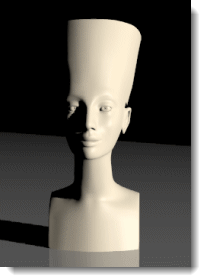

---
---
<!-- TODO: Make sure to update this page and get working in the guides section of the documentation. -->

# Nozioni di base sull'illuminazione da studio
{: #studio-lighting-bascis}
L'illuminazione da studio va impostata come se ci trovassimo in uno studio fotografico. Per un maggiore controllo, si usino le sorgenti luminose per illuminare la scena.

Quando si illumina una scena da studio, è importante che il contrasto luminoso sia elevato. Questo tipo di illuminazione si ottiene generando forti contrasti di illuminazione. Ciò significa che le aree di colore scuro sono tanto importanti quanto quelle di colore chiaro. Per ottenere forti contrasti di illuminazione occorre sistemare varie sorgenti luminose in modo tale  che esse generino alcune zone molto scure ed altre molto chiare.
L'illuminazione da studio più comune è quella che si avvale dei seguenti tipi di luce: una luce principale (1), una luce di riempimento (2) ed una controluce (3). Si è soliti illuminare in questo modo singoli personaggi o oggetti in uno studio. L'impostazione da tre punti fornisce dei buoni risultati e costituisce un eccellente punto di partenza per la creazione di effetti speciali. I riflettori risultano utili perché è possibile controllarne la direzione e lo spot per conferire enfasi alla scena.

## Angolo visivo della camera
{: #cameraangle}
Le impostazioni dell'illuminazione dipendono sempre dall'angolo della camera rispetto al soggetto. È opportuno iniziare a definire l'illuminazione partendo dal settaggio dell'angolo della camera. Si usino i comandi **Camera** o **VistaConNome** per impostare la posizione e l'angolo della camera. Ciò aiuterà a determinare la posizione delle luci.

## Setup di illuminazione di base "a tre punti"
{: basic-three-light-setup}
Un'illuminazione da studio di base si avvale di tre luci: una luce principale, una luce di riempimento ed una controluce.

### Luce principale
{: #keylight}
La luce principale è la sorgente luminosa preponderante nella scena. Essa definisce l'atmosfera della scena, indica la direzione della luce, mostra le dimensioni e le texture e crea le ombre più scure. La luce principale è generalmente impostata tra i 30 ed i 45 gradi rispetto al piano del soggetto da illuminare.
Quanto più vicina è la luce principale alla camera, tanto minore sarà l'effetto di modellazione e texturizzazione prodotto. La luce principale in genere è più alta rispetto all'obiettivo e proietta le ombre verso il basso. Quanto più laterale la luce, tanto maggiore la tridimensionalità dell'oggetto. Nell'impostazione classica di un ritratto, la luce principale viene impostata a circa 45 gradi tra il soggetto e la camera ed è sufficientemente alta da proiettare le ombre verso il basso, ma non tale da rendere gli occhi del soggetto in ombra.
Se la luce principale è morbida, può non essere necessario il riempimento. Questa semplice impostazione rappresenta la soluzione di base anche per l'illuminazione di piccoli studi.
La proiezione delle ombre generate dalla luce principale è visibile sul soggetto. Nelle immagini di volti, spesso si osserva un'ombra evidente generata dal naso. 

### Luce di riempimento
{: #filllight}
La luce di riempimento viene disposta giusto sopra l'obiettivo, sul lato opposto alla luce principale. Il suo scopo è quello di ridurre il contrasto ed evidenziare i dettagli nelle ombre, simulando la riflessione della luce da parte degli oggetti circostanti. La luce principale e la luce di riempimento possono avere la stessa intensità nel caso in cui si desideri ottenere un basso contrasto; tuttavia, in genere, la luce principale è più intensa e luminosa rispetto a quella di riempimento. Quest’ultima è una sorgente di luce secondaria nella scena. Essa non dovrebbe quindi introdurci ulteriori ombre scure.
Si noti come, nell'immagine, le ombre sul lato sinistro del naso e lungo il lato sinistro del volto siano più chiare e più morbide rispetto all'immagine ottenuta usando solo la luce principale.

### Controluce
{: #backlight}
Pur essendo tenue, l'effetto controluce aiuta a definire i contorni degli oggetti nella scena ed a fornire una maggiore profondità, impedendo che gli oggetti si mescolino con lo sfondo. Le controluci di solito si sistemano dietro e al di sopra dell'oggetto e sono rivolte verso la camera.
L'efficacia di una controluce dipende in parte dalla riflettività della superficie che essa illumina.
Nell'immagine, la luce proveniente da sopra le spalle del soggetto aiuta a separarlo dallo sfondo. La controluce, inoltre, attenua le ombre e rende più luminosa la superficie su cui giace l'oggetto.

## Qualità della luce
{: #lightquality}
Si possono generare delle immagini con ombre, zone di massima luce e riflessioni accurate, tuttavia, senza un'opportuna illuminazione, ci si può allontanare dallo scopo desiderato. Quando si imposta l'illuminazione, occorre considerare ciò che si desidera ottenere. Un'immagine efficace deve essere semplice, grafica e chiara. Troppi riflessi brillanti o troppe ombre possono infatti complicare inutilmente una scena, distogliendola dalla sua essenza.
Tra le qualità da considerare troviamo:

>L'intervallo di contrasto della scena
>La profondità della scena (la sua qualità tridimensionale)
>La separazione degli oggetti dallo sfondo
>Se la luce dev'essere contrastata o morbida
>Se la luce deve avere un colore caldo o freddo

### Intervallo di contrasto
{: #contrastrange}
L'intervallo di contrasto rappresenta la differenza tra le aree più luminose e quelle più scure in una data scena. L'occhio umano è capace di distinguere i dettagli in un intervallo di contrasto maggiore rispetto ad una pellicola e può compensare la visione localmente per percepire i dettagli nelle zone estreme. Questo effetto è visibile nelle istantanee scattate in un giornata di sole.
È tipico che il lato illuminato sia troppo luminoso o che il lato in ombra sia troppo scuro; ciò nonostante, non si hanno problemi nel distinguere i dettagli sia nelle zone chiare che in quelle scure. L'intervallo di contrasto è però troppo elevato per essere rilevato da una pellicola. Ciò è vero anche per le immagini renderizzate, dato che esiste un limite nei colori che il computer può mostrare.

Le immagini a basso contrasto fanno sì che i dettagli siano distinguibili nelle zone illuminate o in ombra.

### Qualità tridimensionale
{: #three-dimensional}
La rappresentazione tridimensionale in uno spazio bidimensionale richiede un'illusione ottica di profondità. Un oggetto opaco illuminato da un lato dà una sensazione di profondità perché presenta un lato più luminoso ed un lato in ombra più scuro. Ad esempio, un parallelepipedo che mostra tre facce renderà una maggiore impressione di volume se ciascuna faccia ha un valore diverso. Spesso il piano più chiaro è quello superiore, dato che in genere, in una situazione reale, la luce proviene dall'alto.

### Separazione dallo sfondo
{: #separation}
Affinché un prodotto dia l'impressione di emergere dal foglio, oltre alla tridimensionalità e all'uso di tutto l'intervallo di contrasto, ci deve essere anche una chiara separazione rispetto allo sfondo. I bordi del soggetto devono quindi essere nettamente più chiari o più scuri rispetto allo sfondo. Se non vi è separazione, il soggetto si confonderà con lo sfondo.
Nell'immagine, l'illuminazione presente nella parte superiore dell'oggetto aiuta a separarlo dallo sfondo.
L'ombra del soggetto a volte può favorire l'impressione di separazione, altre volte invece può far confondere il soggetto con lo sfondo. Una controluce può facilitare la distinzione dell'oggetto dallo sfondo creando un contrasto sui suoi contorni.

### Luce dura e luce morbida
{: #hard-soft}
A seconda dei contrasti prodotti da una luce su un'immagine, si distinguono due categorie di luci: la luce dura (diretta) e la luce morbida (diffusa).
La luce dura (luce contrastata) proietta ombre nette, dense e profonde.

La luce morbida proietta ombre soffuse con contorni a volte indistinti.
Grazie a queste ombre soffuse, la luce morbida spesso crea delle immagini più attraenti rispetto alla luce diretta. Quanto più grande e più vicina al soggetto è la luce, tanto maggiore sarà l'effetto di luce diffusa. Una luce morbida grande può simulare la luce che proviene da una finestra.

L'illuminazione diffusa è ideale per oggetti plastici di colore scuro, dato che produce un'illuminazione estesa che aiuta a definirne la forma.

Quando si illumina una scena da studio, è fondamentale che il contrasto luminoso sia elevato. Ciò significa che le aree di colore scuro sono tanto importanti quanto quelle di colore chiaro. Questo tipo di illuminazione richiede un certo numero di sorgenti di luce disposte in modo da creare un effetto chiaroscuro molto netto ed evidenziare il contrasto.
L'illuminazione nei rendering in genere si avvale delle tecniche di illuminazione usate in fotografia, per cui, per avvicinarsi al suo studio, può risultare utile consultare alcune delle tante guide alle tecniche di illuminazione fotografica disponibili sul mercato.
Flamingo nXt fornisce degli [schemi di illuminazione predefiniti](lighting-tab.html#lighting-presets) per aiutare l'utente a prendere dimestichezza con l'illuminazione di un modello. I settaggi della [scheda Avanzato](lighting-advanced-tab.html) sono ottimizzati per ciascun metodo di illuminazione.