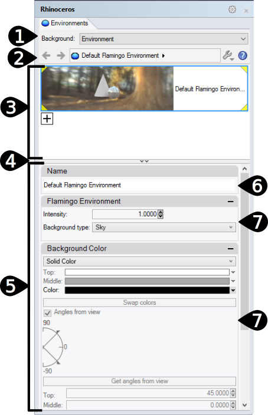

# {: .inline} {{page.title}}
{: #environment-tab}
Gli ambienti non sono solo ciò che si può vedere nello sfondo di un rendering, ma controllano anche una sfera infinita che racchiude il modello. Gli oggetti all'interno della scena riflettono e rifraggono l'ambiente. La sfera dell'ambiente non è un oggetto selezionabile, ma solo una superficie di riferimento per tutti gli effetti relativi allo sfondo.

L'ambiente influisce sulla parte visibile dello sfondo e sulle riflessioni.  Per gli effetti che influiscono sull'illuminazione della scena, si veda l'argomento della guida in linea [Cielo](sun-and-sky.html).

Flamingo presenta un ambiente speciale denominato [Ambiente di Flamingo predefinito](environment.html)*.  Questo ambiente si sincronizza con l'[Impostazione di illuminazione predefinita](lighting-tab.html) corrente. Usando le [impostazioni di illuminazione predefinite](lighting-tab.html), sia l'illuminazione che l'ambiente vengono impostati sui valori predefiniti  appropriati per la scena.

{:  #panel_map height="600px" style="float: right"}

##### Dove trovo questo comando?
 1. {: .inline} Scheda ambiente
 1. {: .inline} Barre degli strumenti Strumenti di rendering > {: .inline} Editor degli ambienti
 1. {: .inline} Menu > Rendering > Editor degli ambienti
 1. Comando > EditorAmbienti

Il pannello dell'editor degli ambienti è suddiviso in varie sezioni.  I pannelli avanzati possono variare in base al tipo di ambiente.

I colori e le texture si possono trascinare dal campione di colore e rilasciare su qualsiasi altro campione di colore o controllo dell'Editor dei materiali, della  [Tavolozza delle texture](texturepalette.html) o dell'[Editor degli ambienti](environmenteditor.html).
Pannello Ambienti

 1. [Tipo di sfondo](#type)
 1. [Barra delle impostazioni](#settings)
 1. [Elenco degli ambienti](#environment_list)
 1. [Divisore della finestra](#divider)
 1. [Sezione delle proprietà dell'ambiente](#properties)
 1. [Nome](#name)
 1. [Pannelli delle proprietà dell'ambiente](#panels)

## [Tipo di sfondo](#panel_map) {: .inline}
{: #type style="clear: both;"}
Selezionare il tipo di sfondo per il modello.  [Ambiente](#flamingo-environment) è un ambiente di rendering completo e dovrebbe essere l'impostazione predefinita per Flamingo.  Le altre tre impostazioni presentano un'insieme di opzioni molto più semplificato, le quali riflettono vecchi modi di definire gli sfondi. Per ulteriori informazioni, si veda l'argomento della guida in linea [Sfondo semplice di Rhinoceros](http://docs.mcneel.com/rhino/5/help/it-it/commands/environmenteditor.htm#Basic_settings) (Impostazioni ambiente di base).

Nel resto di questo argomento della guida in linea, vengono trattati i tipi di ambiente.

## [Barra delle impostazioni](#panel_map) {: .inline}
{: #settings}
Si usi questa barra per la navigazione nell'elenco degli ambienti.

#### {: .inline} Freccia indietro
Si sposta a ritroso per passare all'ambiente corrente o agli ambienti selezionati in precedenza.  Per esempio, un ambiente con livelli riflettenti o rifrangenti.  Si usi questa freccia per ritornare all'ambiente genitore dai dettagli di riflessione o rifrazione.

####  {: .inline} Freccia avanti
Si sposta in avanti per passare agli ambienti selezionati in precedenza.  Per esempio, un ambiente con livelli riflettenti o rifrangenti.  Si usi questa freccia per andare verso l'ambiente genitore dai dettagli di riflessione o rifrazione.

#### {: .inline} {: .inline} Nome dell'ambiente attualmente selezionato
Mostra il nome dell'ambiente corrente ed il livello di modifica.  Per esempio, in presenza di un livello riflettente o rifrangente, viene visualizzata una ">". Utile per vedere dove l'ambiente è corrente.

#### {: .inline} Menu Strumenti
Mostra il [menu Strumenti](#tools-menu).  Si tratta di un vasto menu di comandi, impostazioni e utility che hanno a che vedere con gli ambienti.

#### {: .inline} Aiuti

## [Elenco degli ambienti](#panel_map) {: .inline}
{: #environment_list}
Elenca tutti gli ambienti contenuti nel modello. Uno degli ambienti viene selezionato come ambiente corrente. L'ambiente corrente viene usato nel rendering. Ai vertici dell'ambiente corrente vengono visualizzati dei triangoletti gialli.

Da questo elenco:

* Cliccare su un Ambiente per renderlo corrente. Una volta selezionato, nei pannelli sottostanti verranno visualizzate le proprietà dell'ambiente. Si veda [Proprietà dei materiali di rendering](#properties) per maggiori informazioni
* Scorrere l'elenco verso l'alto e verso il basso per vedere tutti gli ambienti presenti nel modello.
* Aggiungere un nuovo ambiente usando il pulsante Aggiungi nuovo {: .inline} che si trova nella parte inferiore dell'elenco.
* Cliccare con il tasto destro su una miniatura per visualizzare il menu di scelta rapida degli ambienti
* Cliccare con il tasto destro sull'area vuota per visualizzare il menu di scelta rapida nuovo ambiente

###  {: .inline} Aggiungi nuovo ambiente
{: ###  {: 
Scorrere verso il basso l'elenco degli ambienti per visualizzare l'icona Aggiungi.

Apre la [libreria](libraries.html) dei contenuti di rendering degli ambienti.
Gli ambienti della libreria fungono da modelli per la creazione di nuovi ambienti nel modello.

### Menu di scelta rapida degli ambienti
{: environment_context}
Questo menu è disponibile se si clicca con il tasto destro su un elenco di ambienti.  Si veda [Menu Strumenti](#tools_menu) per maggiori dettagli sulle varie opzioni del menu.

### Menu di scelta rapida per i nuovi ambienti
{: new_envrionment_context}
Questo menu è disponibile se si clicca con il tasto destro su un'area vuota dell'elenco di ambienti.

#### {: .inline} Crea nuovo ambiente
Crea un nuovo ambiente di Flamingo.

#### {: .inline} Importa ambiente da file...
Usare questo comando per selezionare un ambiente precedentemente esportato.

#### {: .inline} Incolla
Crea un nuovo ambiente in base ai contenuti degli Appunti.

#### {: .inline} Incolla come istanza
Crea un nuovo ambiente in base ai contenuti degli Appunti, collegato all'originale tramite la creazione di istanze.

#### {: .inline} Griglia
Mostra le anteprime come una griglia di miniature.

#### {: .inline} Elenco
Mostra le anteprime come un elenco di miniature.

#### {: .inline} Albero
Mostra le anteprime come un albero con i livelli di nidificazione.

#### {: .inline} Layout orizzontale
Mostra le anteprime a sinistra dei controlli.

#### {: .inline} Mostra riquadro di anteprima
Mostra le proprietà anteprima della miniatura attualmente selezionata. Impostare la geometria, le dimensioni, lo sfondo ed il comportamento di rotazione.

#### {: .inline} Rendi mobile
Rende mobile l'immagine di anteprima in una finestra ridimensionabile.

#### Miniature

##### {: .inline} Piccolo
Imposta le dimensioni delle miniature sulle dimensioni piccole.

##### {: .inline} Medio
Imposta le dimensioni delle miniature sulle dimensioni medie.

##### {: .inline} Grande
Imposta le dimensioni delle miniature sulle dimensioni grandi.

##### {: .inline} Mostra etichette
Mostra le etichette dei nomi delle anteprime quando si è nella modalità Griglia.
La modalità Elenco mostra sempre le etichette.

##### {: .inline} Mostra unità
Mostra le dimensioni nelle unità del modello.

##### {: .inline} Autoaggiornamento anteprima
Aggiorna automaticamente tutte le anteprime man mano che cambiano le impostazioni.

##### {: .inline} Aggiorna tutte le anteprime
Aggiorna le anteprime manualmente quando l'Autoaggiornamento anteprima è disattivato.

## [Divisore della finestra](#panel_map){: .inline} {: .inline}
{: #divider}
Trascinare questo divisore per cambiare l'estensione dell'elenco degli ambienti rispetto all'estensione della sezione delle proprietà dell'ambiente.

## [Sezione delle proprietà dell’ambiente](#panel_map) {: .inline}
{: #properties}

### [Nome dell’ambiente](#panel_map) {: .inline}
{: #name}
Il nome dell'ambiente. Il nome dell'ambiente viene anche salvato come nome del file quando l'ambiente viene esportato nella libreria. **Nota:** Gli ambienti vengono memorizzati nel modello di Rhino; ambienti unici possono avere lo stesso nome in vari modelli di Rhino.

### [Pannelli degli ambienti](#panel_map) {: .inline}
{: #panels}
La sezione delle proprietà degli ambienti è costituita da una serie di pannelli. Se si fa clic sulla barra del titolo grigia di un pannello, il pannello si chiude ed i suoi contenuti vengono nascosti. Per visualizzarne di nuovo i contenuti, fare di nuovo clic sulla barra del titolo.

I pannelli degli ambienti variano in base al tipo di ambiente ed al livello corrente dell'ambiente attivo. Per ulteriori informazioni sui pannelli specifici degli ambienti, si veda [Ambiente di Flamingo](environment.html)

## Menu Strumenti {: .inline}
{: tools_menu}
Queste impostazioni appaiono anche nei menu di scelta rapida tramite clic destro delle anteprime e dello sfondo delle anteprime.

#### {: .inline} Imposta come ambiente corrente
Rende corrente l'ambiente di destinazione.  L'ambiente corrente verrà usato nel rendering successivo.

#### {: .inline} Crea nuovo ambiente
Crea un nuovo ambiente di Flamingo.
<!-- This comes from the page http://docs.mcneel.com/rhino/5/help/en-us/popup_moreinformation/materialthumbnail_contextmenu.htm -->
Queste impostazioni appaiono anche nei menu di scelta rapida tramite clic destro delle anteprime e dello sfondo delle anteprime.

#### {: .inline} Importa ambiente da file
Importa gli ambienti da un file .renv di Rhino salvato.

#### {: .inline} Salva su file
Salva un ambiente su un file .renv di Rhino.

#### {: .inline} Cambia tipo
Imposta l'ambiente su un tipo diverso.

#### {: .inline} Cambia tipo (copia impostazioni simili)
Imposta l'ambiente su un tipo diverso.
Il comportamento predefinito dipende dallo stato attuale della casella [Opzioni di rendering](http://docs.mcneel.com/rhino/5/help/it-it/options/rendering.htm) >  [Copia impostazioni simili quando il tipo di contenuto viene modificato](http://docs.mcneel.com/rhino/5/help/en-us/options/rendering.htm#Copy_similar_settings_when_content_type_is_changed). Se spuntata, le impostazioni compatibili del contenuto precedente verranno copiate in quello nuovo.

#### {: .inline} Reimposta su predefiniti
Modifica tutte le impostazioni dell'ambiente, impostandole su quelle predefinite: sfondo in tinta unita (nero), sfondo riflesso, cielo e sfondo rifratto visibili.

#### {: .inline} Copia
Copia l'ambiente selezionato negli appunti di Windows. I contenuti degli appunti possono quindi venire incollati nell'editor per creare un nuovo ambiente, oppure si possono incollare direttamente in una cartella per creare un file [libreria](libraries.html).

#### {: .inline} Incolla
Crea un nuovo ambiente in base ai contenuti degli Appunti.

#### {: .inline} Incolla come istanza
Crea un nuovo ambiente in base ai contenuti degli Appunti, collegato all'originale tramite la creazione di istanze.

#### {: .inline} Elimina
Elimina l'ambiente selezionato.

#### {: .inline} Rinomina...
Rinomina l'ambiente selezionato.

#### {: .inline} Duplica
Copia l'ambiente selezionato su un nuovo ambiente con le stesse impostazioni.

#### {: .inline} Rimuovi istanze
Rimuove il collegamento tra gli ambienti [istanziati](#paste-as-instance).



#### {: .inline} Filtro dei contenuti
Apre la finestra di dialogo [Filtri dei contenuti](content_filters.html).

#### {: .inline} Proprietà
Apre la finestra di dialogo [Proprietà anteprima](previewproperties.html).