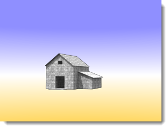

# {: .inline} {{page.title}}
Ci sono vari tipi di [ambienti in Rhino](http://docs.mcneel.com/rhino/5/help/it-it/commands/environmenteditor.htm). In questa sezione, si esaminerà l'ambiente di Flamingo.

L'ambiente influisce sulla parte visibile dello sfondo e sulle riflessioni.  Per gli effetti che influiscono sull'illuminazione della scena, si veda l'argomento della guida in linea [Cielo](sun-and-sky-tabs.html).

Flamingo presenta un ambiente speciale denominato **Ambiente di Flamingo predefinito**.  Questo ambiente si sincronizza con l'[Impostazione di illuminazione predefinita](lighting-tab.html) corrente. Usando le [impostazioni di illuminazione predefinite](lighting-tab.html), sia l'illuminazione che l'ambiente vengono impostati sui valori predefiniti  appropriati per la scena.

L'ambiente di Flamingo presenta i seguenti gruppi di proprietà:

  * [Nome](#name)
  * [Ambiente di Flamingo](#environment)
  * [Colore dello sfondo](#color-backgrounds)
  * [Sfondo avanzato](#advanced-background-reflected-sky)

## Nome dell'ambiente
{: #name}
Il nome dell'ambiente nel modello di Rhino.  Gli ambienti vengono memorizzati nel modello di Rhino. Ciò significa che un ambiente con lo stesso nome nella libreria o in un modello diverso non verrà influenzato dalle modifiche applicate all'ambiente nel modello corrente. Per usare un ambiente in un altro modello, occorre prima esportarlo nella [Libreria](libraries.html). Il nome dell'ambiente viene usato anche come nome del file esportato.

## Ambiente di Flamingo
{: #environment}
In un rendering, ci sono tre principali effetti di ambiente:

  1. Sfondo visibile
  1. [Sfondo riflettente](#advanced-background-reflected-sky)
  1. [Sfondo rifrangente](#advanced-background-refracted-sky)

Lo sfondo visibile è il colore dello sfondo di base della scena.  Lo sfondo visibile si trova nel pannello delle proprietà generali. Gli sfondi [riflettente](#advanced-background-reflected-sky) e [rifrangente](#advanced-background-refracted-sky) possono differire e sono disponibili nella sezione Sfondo avanzato.

#### Intensità
{: #background-intensity}
Modifica la luminosità relativa dello sfondo. Il valore di intensità viene usato per moltiplicare i colori nello sfondo e dà come risultato un valore di illuminazione.  I colori possono variare da 0 a 255 per canale. L'intensità moltiplica tali valori.  Ciò diventa importante se lo sfondo ha un aspetto molto scuro rispetto al modello renderizzato.

#### Tipo di sfondo
{: #background-type}
Specifica la combinazione di colori che andrà a riempire lo sfondo dell'immagine renderizzata. Si hanno i seguenti tipi di sfondo:

* [Cielo](#environment-sky)
* [A colore singolo ed a gradiente di colore](#color-backgrounds)
* [Immagine](#environment-image)
* [Immagini HDR ed HDR planari](#hdr-background)

## Sfondo con cielo
{: #environment-sky}
L'ambiente Cielo usa le impostazioni di sole e cielo della scheda [Illuminazione](lighting-tab.html).  Si tratta dell'impostazione predefinita per i rendering in cui si vede il cielo.

*Automatico (sinistra) ed immagine HDR e sole (destra).*

## Sfondo con colore
{: #color-backgrounds}
I controlli per il colore dello sfondo sono sempre presenti. Lo sfondo a colori è sempre presente, anche se il colore viene completamente oscurato da un'immagine, un'HDRI o uno sfondo con cielo.

#### Colore solido
{: #solid-color}
Uno sfondo con colore solido è uno sfondo in tinta unità.

*Sfondo con colore solido.*
Vedi i [controlli colore](#enviroment-sky-color-controls) qui sotto per maggiori informazioni sulla modifica del colore solido.

#### Gradiente a due colori
{: #two-color-gradient}
Gli sfondi con gradienti a due o a tre colori si applicano solo alle viste prospettiche. Gli sfondi con gradiente a due colori interpolano il colore dello sfondo tra i due colori selezionati.

*Sfondo a gradiente di 2 colori: azzurro e giallo.*
Vedi i [controlli colore](#enviroment-sky-color-controls) qui sotto per maggiori informazioni sulla modifica di un gradiente a due colori.

#### Gradiente a tre colori
{: #three-color-gradient}
Gli sfondi con gradiente a tre colori interpolano il colore dello sfondo tra i tre colori selezionati.

*Sfondo a gradiente di 3 colori: azzurro, bianco, giallo.*
Vedi i [controlli colore](#enviroment-sky-color-controls) qui sotto per maggiori informazioni sulla modifica di un gradiente a tre colori.

### Controlli colore
{: #enviroment-sky-color-controls}
Il numero di controlli disponibile può cambiare in base al tipo di sfondo con colore attualmente selezionato. Gli sfondi a gradiente possono avere fino a tre selettori dei colori, i quali possono includere un colore superiore, centrale ed inferiore.



#### Scambia colori
Si usi questo pulsante per riordinare il colore del gradiente da sopra a sotto.

#### Controllo di mappatura del gradiente
{: #gradient-mapping}
I colori di uno sfondo a gradiente di colore vanno mappati sulla sfera dell'ambiente. Per farlo, si usi il mappatore del gradiente.  I controlli di mappatura del gradiente si attivano solo se risulta selezionato un gradiente a due o tre colori. I gradienti si possono mappare solo sulle viste prospettiche.

#### Angoli da vista
{: #angle-from-views}
Se Angoli da vista è spuntata, il gradiente di colore corrente si sincronizza con la vista prospettica renderizzata corrente.  Il colore superiore viene mappato sulla parte superiore della vista ed il colore inferiore viene mappato sulla parte inferiore della vista.  Tutti gli altri colori si distribuiscono in modo uniforme tra questi estremi.

#### Mappatore di altitudine della vista
{: #colorrange}
Se la vista corrente è una proiezione prospettica, si possono controllare i colori superiore ed inferiore e l'estensione del gradiente della vista.

{: style="float: left; padding-right: 25px;padding-bottom: 15px;padding-top:15px;"}

* Il controllo mostra l'ambiente in una vista di sezione.  L'indicatore dei 90 gradi rappresenta la coordinata Z positiva. La coordinata 0 rappresenta il piano d'appoggio orizzontale. L'indicatore dei -90 gradi rappresenta la coordinata Z negativa.
* Il cono di visione grigio mostra le ultime coordinate della vista prospettica corrente.
* La freccia rossa rappresenta la posizione del colore superiore. Il colore superiore sarà presente in corrispondenza di tale angolo e al di sopra di esso.
* La doppia freccia verde rappresenta il centro della fusione tra i colori superiore ed inferiore.  Se si tratta di un gradiente a tre colori, rappresenta anche la posizione del colore intermedio.
* La freccia blu rappresenta la posizione del colore inferiore.  Al di sotto di questo angolo ci sarà solo il colore inferiore.

####  Pulsante Ottieni angoli da vista
Si usi questo pulsante per reimpostare il controllo di mappatura del gradiente sulle coordinate della vista prospettica corrente.

#### Angoli Superiore/Centro/Inferiore
Si tratta di dati angolari sui colori superiore, centrale ed inferiore dei gradienti correnti.  Corrispondono alla posizione delle frecce rossa, verde e blu nel mappatore di altitudine della vista.

## Immagine di sfondo
{: #environment-image}

Sullo sfondo, viene proiettata un'immagine che funge da sfondo. Spesso si usa per sistemare un modello in un determinato contesto oppure per impostare una vista dalle finestre di un interno. Si possono usare fotografie, illustrazioni scansionate oppure immagini create usando programmi di digital painting. Per ottenere i migliori risultati, conviene usare come immagini di sfondo delle immagini ad alta risoluzione. Per simulare una messa a fuoco naturale o una prospettiva aerea, può essere una buona idea sfocare e schiarire un'immagine nitida. L'immagine di sfondo si può mappare sullo sfondo con una proiezione planare, cilindrica o sferica all'interno della scena.

*Un'immagine planare impostata come sfondo.*

### File immagine
{: #image-properties}
Impostare l'immagine di sfondo facendo clic sul pulsante grande con la scritta *(vuoto - clic qui per assegnare)*, quindi selezionare una bitmap.  Per assegnare un'immagine diversa, fare clic sull'immagine di anteprima del pulsante.

### Proiezione
{: #backgroud-image-projection}
Selezionare una delle tre proiezioni dal controllo a discesa:

* [Planare](#planar)
* [Cilindrica](#cylindrical)
* [Sferica](#spherical)

Ciascun metodo di proiezione ha i propri parametri di controllo per il posizionamento dell'immagine.

### Proiezione planare
{: #planar}
Proietta l'immagine su uno sfondo piatto nella vista corrente. Le coordinate della proiezione planare sono sempre relative alla vista corrente.

#### Angolo da vista
La casella Angolo da vista mantiene l'immagine sincronizzata con la vista corrente.  L'immagine viene adattata alla vista corrente.

#### Controllo di posizionamento dell'immagine
Si usi il controllo di posizionamento per sistemare l'immagine rispetto alla vista corrente. La forma della vista viene visualizzata come un rettangolo grigio. Trascinare il rettangolo rosa oppure usare i parametri di controllo numerici per spostare o scalare l'immagine di sfondo rispetto alla vista.

*Area della vista corrente (1), forma della vista (2).*

#### Scala X / Scala Y
Specifica le dimensioni dell'immagine di sfondo nella scala 0 - 1.0 della larghezza ed altezza della vista. Per esempio, una valore pari ad 1.0 corrisponde al 100% delle dimensioni dell'immagine, un valore pari a 0.5 al 50% e così via.

#### Offset X / Offset Y
Specifica lo scostamento dell'immagine di sfondo rispetto al vertice sinistro inferiore della vista, nella scala 0 - 1.0 della larghezza ed altezza della vista. Per esempio, una valore pari ad 0.25 corrisponde ad uno scostamento del 25% rispetto alle dimensioni dell'immagine, un valore pari a 0.5 al 50% e così via.

#### Controllo di posizionamento dell'immagine
Si usi il controllo di posizionamento per sistemare l'immagine rispetto alla vista corrente. La forma della vista viene visualizzata come un rettangolo grigio. Trascinare il rettangolo rosa oppure usare i parametri di controllo numerici per spostare o scalare l'immagine di sfondo rispetto alla vista.

*Area della vista corrente (1), forma della vista (2).*

<!-- TODO: The next two sections are repeated. Maybe they belong to the "Cylindrical Projection" below? -->

#### Scala X / Scala Y
Specifica le dimensioni dell'immagine di sfondo nella scala 0 - 1.0 della larghezza ed altezza della vista. Per esempio, una valore pari ad 1.0 corrisponde al 100% delle dimensioni dell'immagine, un valore pari a 0.5 al 50% e così via.

#### Offset X / Offset Y
Specifica lo scostamento dell'immagine di sfondo rispetto al vertice sinistro inferiore della vista, nella scala 0 - 1.0 della larghezza ed altezza della vista. Per esempio, una valore pari ad 0.25 corrisponde ad uno scostamento del 25% rispetto alle dimensioni dell'immagine, un valore pari a 0.5 al 50% e così via.

### Proiezione cilindrica
{: #cylindrical}
La proiezione cilindrica mappa l'immagine su un cilindro immaginario che circoscrive il modello. Nonostante questa proiezione funzioni al meglio con delle immagini realmente cilindriche, essa dà dei risultati soddisfacenti anche con panorami standard tratti da fotografie.

Si specifichi la dimensione e la posizione della mappa immagine definendo gli angoli di elevazione e di ampiezza. Per posizionare l'immagine e ridimensionarla, utilizzare gli strumenti grafici ed il mouse. Il cono di visione corrente viene visualizzato nel grafico come un'area ombreggiata di colore grigio chiaro.

#### Angolo da vista
La casella Angolo da vista mantiene l'immagine sincronizzata con la vista corrente.  L'immagine viene adattata alla vista corrente.

#### Controllo Piana
Specifica l'ampiezza angolare della mappa immagine. Inserire un angolo oppure trascinare gli indicatori del widget di controllo per impostare la larghezza. La zona blu indica l'intervallo dell'ampiezza angolare.

{: .float-img-left}

* Il controllo mostra l'ambiente in una vista piana.
* Il cono di visione grigio scuro mostra le ultime coordinate nella vista prospettica corrente.
* Il cono blu mostra l'intervallo di angoli nel quale l'immagine sarà visibile.
* La freccia blu rappresenta la coordinata sinistra della mappa immagine.
* Il punto rosso rappresenta il centro dell'immagine di sfondo.
* La freccia porpora rappresenta la coordinata destra della mappa immagine.

#### Controllo Verticale
{: .clear-img}
Specifica l'estensione verticale della proiezione cilindrica. Inserire un angolo oppure trascinare gli indicatori del widget di controllo per impostare gli angoli superiore ed inferiore. La proiezione cilindrica è limitata a 45 gradi sopra o sotto l'orizzonte.

{: .float-img-left}

* Il controllo mostra il cilindro in una vista di sezione.
* Il cono di visione grigio mostra le ultime coordinate nella vista prospettica corrente.
* La freccia blu rappresenta il bordo inferiore della mappa immagine.
* La freccia rossa rappresenta il bordo superiore della mappa immagine.

#### Rotazione
{: .clear-img}
Specifica la rotazione dell'immagine. Il punto rosso indica il centro dell'immagine.

#### Larghezza
Specifica la larghezza dell'immagine in gradi rispetto alla vista piana.

#### Superiore / Inferiore
Specifica gli angoli verticali dell'immagine in base alla direzione del piano d'appoggio orizzontale nel modello.

####  Pulsante Ottieni angoli da vista
Imposta l'angolo di rotazione per la corrispondenza con la vista prospettica corrente.  Una buona opzione per reimpostare i valori della proiezione.

### Proiezione sferica
{: #spherical}
La proiezione sferica mappa l'immagine su una sfera completa. Questo metodo in genere dà dei buoni risultati solo se si usa un'immagine sferica equirettangolare.  Un'immagine equirettangolare ha il rapporto di aspetto di un rettangolo 2:1.

#### Angolo da vista
La casella Angolo da vista mantiene l'immagine sincronizzata con la vista corrente.  L'immagine viene adattata alla vista corrente.

#### Controllo sferico
Specifica la direzione della mappa immagine. Inserire un angolo oppure trascinare l'indicatore del widget di controllo per impostare la larghezza. Il punto rosso rappresenta il centro dell'immagine di sfondo.

#### Rotazione
{: .clear-img}
Specifica la rotazione dell'immagine. Il punto rosso indica il centro dell'immagine.

####  Pulsante Ottieni angoli da vista
Imposta l'angolo di rotazione per la corrispondenza con la vista prospettica corrente.  Una buona opzione per reimpostare i valori della proiezione.

## Sfondo HDRi
{: #hdr-background}
L'uso di un'immagine HDR come ambiente consente un maggiore controllo sul rapporto tra la luce sullo sfondo e le altre luci presenti nell'immagine. Questo procedimento è particolarmente utile per rappresentare uno spazio interno illuminato da uno spazio esterno luminoso visibile attraverso una finestra. Un'immagine HDR che funge da ambiente presenta un intervallo di valori di luminosità più ampio rispetto a quello di una normale immagine bitmap e gli si può assegnare un canale per poter gestire il contrasto in un rendering [multicanale](lights-tab.html#channel).

#### File immagine
{: #hdri-image}
Impostare l'immagine HDR di sfondo facendo clic sul pulsante grande con la scritta *(vuoto - clic qui per assegnare)*, quindi selezionare una bitmap.  Per assegnare un'immagine diversa, fare clic sull'immagine di anteprima del pulsante.






## Opzioni HDRi planare
{: #planar-hdr-options}

Le immagini ad alta gamma dinamica planari vengono usate raramente, ma possono essere molto utili.  Un'HDRi fornisce un intervallo di colori più ampio. I file HDRi planari sono adatti per essere usati all'esterno delle finestre nei rendering architettonici in cui lo sfondo può essere troppo chiaro o troppo scuro.  I file HDRi planari vengono sempre mappati in modo planare.

*L'immagine di sfondo (sinistra) e l'HDR planare (destra) mostrano una leggera differenza di illuminazione sullo sfondo.*

#### File immagine
{: #hdri-planar-image}
Impostare l'immagine HDR di sfondo facendo clic sul pulsante grande con la scritta *(vuoto - clic qui per assegnare)*, quindi selezionare una bitmap.  Per assegnare un'immagine diversa, fare clic sull'immagine di anteprima del pulsante.



## Sfondo avanzato
{: #advanced-background}
Le impostazioni "Sfondo avanzato" controllano gli ambienti che non sono visibili nel rendering, ma che si vedono nelle riflessioni e nelle rifrazioni degli oggetti. Si possono avere situazioni in cui l'ambiente visibile può avere un aspetto e le riflessioni e rifrazioni reagiscono ad un ambiente diverso.  Per esempio, nell'immagine sottostante lo sfondo è nero, ma l'ambiente riflesso è un'immagine HDR di un interno.

*Ambiente normale (sinistra) ed ambiente cielo HDR riflesso (destra).*

### Riflesso
{: #advanced-background-reflected-sky}
Un ambiente riflesso non è visibile nell'immagine renderizzata, ma viene riflesso dagli oggetti lucidi presenti nella scena.

#### Cielo
Gli oggetti riflettono il cielo come specificato nelle impostazioni [Illuminazione: Sole e cielo](sun-and-sky-tabs.html).

#### Personalizzato
Gli oggetti riflettono un [colore o gradiente](#color-backgrounds), un'[immagine](#environment-image) oppure uno sfondo [HDR](#hdr-background).

#### Sfondo visibile
Gli oggetti riflettono lo sfondo visibile come specificato nelle impostazioni [Ambiente](environment-tab.html).

### Rifratto
{: #advanced-background-refracted-sky}

#### Cielo
Gli oggetti rifraggono il cielo come specificato nelle impostazioni [Illuminazione: Sole e cielo](sun-and-sky-tabs.html).

#### Personalizza
Gli oggetti rifraggono un [colore o gradiente](#color-and-gradient-backgrounds), un'[immagine](#image) oppure uno sfondo [HDR](#hdr-background).

#### Sfondo visibile
Gli oggetti rifraggono lo sfondo visibile come specificato nelle impostazioni [Ambiente](environment-tab.html).

#### Nessun oggetto trasparente alfa
{: #no-transparent-alpha-objects}
Impedisce la visualizzazione del canale alfa attraverso gli oggetti trasparenti, così come il compositing con canale alfa attraverso gli oggetti trasparenti.
Se le immagini verranno incollate sul canale alfa, si disattivi questa opzione.