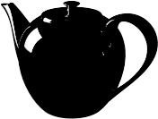

---
---

# {:height="75px" width="75px"} Impostazioni di illuminazione predefinite
L'illuminazione è uno degli aspetti più importanti e da non trascurare quando si crea un'immagine. Non si tratta solo di un modo di illuminare il modello. L'illuminazione è fondamentale per creare una determinata atmosfera e rappresenta un ingrediente chiave nella determinazione della composizione di un'immagine.

*Immagine di Christopher Soto Gutiérrez.*

#### Dove trovo il controllo di illuminazione di Flamingo?

* Menu > Flamingo nXt 5.0 > Mostra pannello di controllo > Flamingo nXt.
* Fare clic destro su una scheda qualsiasi e spuntare Flamingo nXt.

Nella fase di illuminazione di un modello, si consiglia di:

* Iniziare da un'impostazione di illuminazione predefinita.
* Visto che Flamingo nXt simula l'illuminazione del mondo reale, fornire sempre le informazioni più accurate possibili.
* Evitare l'uso di livelli di intensità non realistici per le sorgenti luminose.
* Impostare correttamente le unità in funzione del modello. Se non si usano le unità corrette, l'illuminazione non risulterà corretta. Per esempio, se il modello corrente è in millimetri, si impostino i millimetri come unità.
* Regolare la luminosità globale del rendering usando il controllo [Luminosità](render-window.html#brightness) nella finestra di visualizzazione del rendering. Non si tenti di regolare la luminosità globale della scena cambiando l'intensità di tutte le sorgenti luminose; la regolazione automatica dell'[esposizione](render-window.html#brightness) annullerà l'impostazione.

Per migliorare le tecniche di illuminazione, occorre prestare attenzione alla luce e valutare in che modo essa influisce sulle varie superfici. I materiali possono mascherare gli effetti di ombre e riflessioni, per cui alcuni esperti in rendering preferiscono applicare l'illuminazione ai modelli prima di applicare i materiali.Occorre cercare di osservare la luce in modo obiettivo, così come lo fa una fotocamera.

## Impostazioni di illuminazione predefinite
{: #lighting-presets}
Un buon punto di partenza per l'illuminazione è rappresentato dalle impostazioni di illuminazione predefinite, le quali corrispondono a situazioni di illuminazione reali. Flamingo nXt fornisce alcune impostazioni di illuminazione predefinite che vi possono aiutare a prendere dimestichezza nell'applicazione dell'illuminazione. Anche se sono disponibili molte altre opzioni di illuminazione, le impostazioni predefinite risultano spesso sufficienti per molti rendering. Si selezioni di volta in volta lo schema predefinito che più si avvicina al tipo di scena che si desidera modellare.

In Flamingo nXt, si usano quattro categorie predefinite per l'illuminazione:

> [Illuminazione da studio](lighting-tab.html#studio-lighting)
> [Luce diurna esterno](lighting-tab.html#exterior-daylight)
> [Luce diurna interno](lighting-tab.html#interior-daylight)
> [Illuminazione artificiale](lighting-tab.html#artificial-lighting)

### Illuminazione da studio
{: #studio-lighting}
Questo schema simula le condizioni di illuminazione di uno studio fotografico. Risulta particolarmente utile per i rendering di oggetti isolati di dimensioni medio-piccole.  Si può anche usare nelle scene illuminate tramite ambienti HDRI.

{: .float-img-left} Un file immagine ad alta gamma dinamica (HDR) fornisce l'illuminazione principale. La luce proveniente dall'immagine HDR simula i livelli di illuminazione interna di uno studio. Le impostazioni dell'HDR si trovano nella [scheda Cielo](sun-and-sky-tabs.html#sky). È anche possibile aggiungere delle luci artificiali alla scena usando la scheda Luci. Nella configurazione da studio, lo sfondo visibile è nero.

L'illuminazione da studio è ottimizzata per l'uso in allestimenti da studio con piccoli articoli di design ed è indicata per la progettazione orafa ed il design di prodotti. Nello schema predefinito, il sole risulta disattivato e viene fornita un'immagine HDR di un cielo affinché gli oggetti lucidi la riflettano.

Per un maggiore controllo, si usino le sorgenti luminose per illuminare la scena. Quando si illumina una scena da studio, è importante che il contrasto luminoso sia elevato. Questo tipo di illuminazione si ottiene generando forti contrasti di illuminazione. Ciò significa che le aree di colore scuro sono tanto importanti quanto quelle di colore chiaro. Per ottenere forti contrasti di illuminazione occorre sistemare varie sorgenti luminose in modo tale che esse generino alcune zone molto scure ed altre molto chiare.

L'illuminazione nei rendering in genere si avvale delle tecniche di illuminazione usate in fotografia. Per avvicinarsi al suo studio, può quindi risultare utile consultare alcune delle tante guide alle tecniche di illuminazione fotografica disponibili sul mercato. Per ulteriori informazioni su come impostare un'illuminazione da studio, si veda: [Nozioni di base sull'illuminazione da studio](../guides/studio-lighting-basics.html).

### Luce diurna esterno
{: #exterior-daylight .clear-img}
Questo schema simula la luce diurna per gli esterni architettonici usando un sole e un cielo naturale.

{: .float-img-right} Specificare le impostazioni nelle schede [Sole](sun-and-sky-tabs.html#sun) e [Cielo](sun-and-sky-tabs.html#sky). Impostare direttamente gli [angoli d'inclinazione della luce solare](sun-and-sky-tabs.html#set-azimuth-and-altitude) oppure specificare una [posizione geografica](sun-and-sky-tabs.html#set-location-on-earth) e temporale. Lo sfondo visibile predefinito per questa configurazione è il cielo simulato.

L'illuminazione di una spazio esterno rappresenta il modello di illuminazione più semplice. Nella maggior parte dei casi di illuminazione di scene esterne, è sufficiente l'uso della sorgente di luce [Sole](sun-and-sky-tabs.html#sun) predefinita.

Quando il [Sole](sun-and-sky-tabs.html#sun) è attivo, occorre indicare se la scena è uno spazio [interno](#interior) o [esterno](#exterior). Ciò è necessario poiché il contributo della luce del cielo, della luce riflessa da terra e di quella riflessa dalle altre superfici è molto diverso a seconda del tipo di spazio considerato. Usando la corretta impostazione [Interno/Esterno](#indirect), si otterrà un'illuminazione d'effetto e realistica.

In alcuni casi, è facile determinare se una scena è interna oppure esterna. Se il punto di osservazione è esterno ad un edificio, si tratta di una scena esterna. Se il punto di osservazione si trova all'interno di una stanza, si tratta di una scena interna. Per determinati tipi di scene, la cosa non è così ovvia. Pensiamo, per esempio, ad un cortile, un gazebo, una vista esplosa o una sezione. Se un cortile è molto più largo che alto (per cui lascia entrare una gran quantità di luce proveniente dal cielo), si provi ad illuminarlo come una scena esterna. Se esso è più alto che largo, lo si illumini come una scena interna. In questo caso, come stratagemma, si possono inserire delle entrate di luce diurna nella parte superiore del cortile per favorire l'indirizzamento della luce del cielo nella scena.

Le luci possono simulare anche l'illuminazione di scenari paesaggistici. Si usino dei riflettori per mettere in risalto gli elementi architettonici e gli alberi. Questa tecnica funziona bene nel caso di scene notturne o crepuscolari. Durante il giorno, così come succede nel mondo reale, la luce del sole tenderà a sopraffare la luce di qualsiasi altra sorgente artificiale presente in una scena esterna.

Anche le viste esplose, le sezioni ed i disegni assonometrici dall'alto richiedono una speciale attenzione, non essendo sempre evidente se si tratta di spazi interni od esterni. La decisione da prendere dipende dai risultati desiderati. Se si vuole renderizzare velocemente una scena esterna, si usi la modalità di rendering per esterni. Se questa modalità non produce delle immagini sufficientemente interessanti, si provi ad usare il rendering per interni. In questo modo, la scena diventa più interessante, anche se si impiegherà più tempo per impostare l'illuminazione.

### Luce diurna interno
{: #interior-daylight .clear-img}
Questo schema simula un interno illuminato da luce naturale.

{: .float-img-left} Consta di due componenti: la luce solare diretta del [Sole](sun-and-sky-tabs.html#sun) e la luce indiretta proveniente dal [Cielo](sun-and-sky-tabs.html#sky), dalla terra e da altri oggetti circostanti.

Le impostazioni relative al [Sole](sun-and-sky-tabs.html#sun) ed al [Cielo](sun-and-sky-tabs.html#sky) sono simili a quelle della configurazione [esterna](lighting-tab.html#exterior-daylight).
La componente della luce solare diretta può essere impostata facilmente dall'utente, che deve solo attivare il sole ed impostare in modo accurato la data e l'ora e la posizione geografica del luogo da renderizzare.

Note sui rendering di interni:
{: .clear-img}

* Si usino i valori più accurati possibili per le [luci](lights-tab.html), le [impostazioni del cielo](sun-and-sky-tabs.html#sky) ed il materiale vetro delle finestre.
* Visto che il sole ed il cielo sono molto più luminosi delle altre luci, se applicate un'illuminazione artificiale quando il sole è attivo, è possibile che non percepiate una grande differenza nell'effetto. È normale. Evitate di aumentare artificialmente la potenza delle sorgenti luminose.
* Potete impostare l'intensità del [Sole](sun-and-sky-tabs.html#sun-intensity) o del [Cielo](sun-and-sky-tabs.html#sky-intensity) su un valore più basso. Visto che queste impostazioni simulano un cielo chiaro, la riduzione di intensità simulerà un'illuminazione diurna con condizioni di cielo nuvoloso o comunque più scuro.
* Per ottenere l'immagine desiderata mantenendo l'accuratezza dei dati, può essere d'aiuto usare un rendering [multicanale](lights-tab.html#channel).

### Illuminazione artificiale
{: #artificial-lighting}
{: style="float: right; padding-left: 25px;"} Questo schema simula un interno architettonico notturno illuminato da lampade. Usare la [scheda Luci](lights-tab.html) oppure i [comandi per le luci di Rhino](lights-tab.html#rhino-light-commands) per l'inserimento e la gestione delle luci nel modello.

L'illuminazione indiretta, la luce riflessa dalle superfici, è attiva quando si selezionano le impostazioni predefinite interne, mentre risulta disattivata nel caso delle impostazioni studio o esterna. Questo tipo di illuminazione è di fondamentale importanza nelle simulazioni interne. Nei modelli di esterni e studio, gli effetti dell'illuminazione indiretta sono molto meno percepibili, per cui essa è disattivata di default.

### Illuminazione personalizzata
{: #custom  style="clear:both;"}
Nella scheda Personalizzata si possono combinare tra di loro porzioni di impostazioni di illuminazione predefinite.  Per esempio, se la scena è impostata su Luce diurna esterno, ma illuminata con l'aggiunta di un ambiente HDRI, si usi la scheda Personalizzata per attivare e disattivare parti del modello di illuminazione.  Quando si usano dei valori diversi da quelli predefiniti per ciascuna configurazione, gli schemi diventano degli schemi personalizzati.

####  [Sole](sun-and-sky-tabs.html#sun)
{: #sun}
Attivare e disattivare la scheda Sole nel menu a discesa. La [scheda Sole](sun-and-sky-tabs.html#sun) contiene i controlli per modificare i parametri della posizione del sole.

*Sole attivato e disattivato.*
Il sole è una sorgente di luce direzionale molto luminosa, infinitamente lontana dal modello. I controlli del sole ne specificano la direzione usando le coordinate sferiche. Per maggiori informazioni, si veda l'argomento [scheda Sole](sun-and-sky-tabs.html#sun).

####  [Cielo](sun-and-sky-tabs.html#sky)
{: #sky}
Impostare il canale Cielo su una delle quattro opzioni:

> Auto
> HDRI
> Colore
> Immagine

Per maggiori informazioni, si veda l'argomento [scheda Cielo](sun-and-sky-tabs.html#sky).
Definisce una sorgente di luce emisferica infinitamente lontana dal modello.

#### Off
{: #off}
Disattiva il cielo.

#### Auto
{: #auto}
Fornisce un modello analitico basato su condizioni di cielo reali. Le impostazioni della scheda [Sole](sun-and-sky-tabs.html) controllano l'aspetto e le qualità della luce del cielo.

#### HDRi
{: #hdri}
Fornisce un'immagine HDR affinché gli oggetti lucidi la riflettano.

#### Colore
{: #color}
Imposta il cielo su un colore solido (in tinta unita) oppure su un gradiente a due o tre colori, usando dei controlli simili a quelli di [Ambiente: Sfondi a colore singolo ed a gradiente di colore](environment-tab.html#color-and-gradient-backgrounds).

#### Immagine
{: #image}
Usa un'immagine di sfondo con una proiezione planare, cilindrica o sferica come in [Ambiente: Immagine](environment-tab.html#image).

### Luminosità studio
{: #studio-brightness}
Riduce la luminosità del [sole](sun-and-sky-tabs.html) e del cielo per simulare i livelli di illuminazione interna di uno studio fotografico.

*Luminosità studio disattivata (sinistra) ed attivata (destra).*

### Luci
{: #lights}
Attiva e disattiva l'illuminazione artificiale.

*Luci attivate (sinistra) e disattivate (destra).*

### Indiretta
{: #indirect}
Definisce la luce riflessa dalle superfici. Di default, essa è attivata nello schema predefinito per l'illuminazione di interni, mentre risulta disattivata negli schemi predefiniti per l'illuminazione di esterni e da studio. È possibile attivare l'illuminazione indiretta per i rendering di esterni.

#### Metodo
Imposta il metodo di calcolo per l'illuminazione indiretta.

#### Off
Disattiva il calcolo dell'illuminazione indiretta.

#### Interno
{: #interior}
Ottimizza l'illuminazione indiretta per situazioni all'interno.

#### Esterno
{: #exterior}
Ottimizza l'illuminazione indiretta per situazioni all'aperto.

La luce indiretta riflessa dalle altre superfici può aggiungere un tocco di sottigliezza e realismo ai rendering di esterni. In particolare, le parti inferiori di elementi sporgenti quali gronde o terrazzi vengono renderizzate in modo più accurato con l'illuminazione indiretta.

#### Rimbalzi
{: #bounces}
Specifica il numero di riflessioni generate dalla luce indiretta.

### Ambiente
{: #ambient}
La luce d'ambiente è una sorgente di luce costante inserita nel rendering. Queste impostazioni consentono di definire l'intensità della luce ambiente come percentuale del totale di luce ambiente stimato sulla scena.
Quanto più diminuisce la quantità di luce ambiente, tanto maggiore sarà in genere il contrasto delle immagini prodotte. Valori troppo alti di luce ambiente possono generare un'immagine renderizzata piatta e poco interessante; valori troppo bassi possono causare un contrasto eccessivo.

#### Nessuno
Nessuna luce ambiente.

#### Esterno
Ottimizza la luce ambiente per scene esterne.

#### Interno
Ottimizza la luce ambiente per scene interne.

#### Studio
Ottimizza la luce ambiente per scene da studio.

## Salvataggio dell'illuminazione personalizzata

### Salva schema di illuminazione
{: #save-lighting-scheme}
 Salva lo schema di illuminazione corrente.

### Apri schema di illuminazione
{: #open-lighting-scheme}
 Apre uno schema di illuminazione salvato.