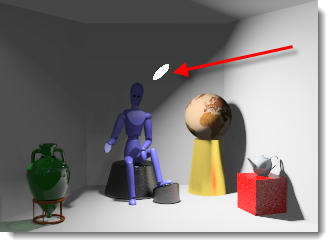

# {: .inline} {{page.title}}
Le sorgenti di luce artificiale usano le normali sorgenti luminose di Rhino, con l'aggiunta di alcune proprietà di Flamingo per controllare la distribuzione della luce. Quando si usano le sorgenti luminose, occorre scegliere accuratamente il tipo che più si addice al tipo di lampada che si sta modellando.

## Scheda Luci
{: #light-tab}
La scheda Luci elenca tutte le luci artificiali presenti nella scena. Questo argomento si riferisce alla scheda Luci di Flamingo.  Esiste anche una [scheda Luci di Rhino](http://docs.mcneel.com/rhino/5/help/it-it/index.htm#commands/lights.htm).  Flamingo e Rhino mantengono le impostazioni delle luci in sincronizzazione tra le due schede.  La scheda Luci di Flamingo è un po' più flessibile grazie all'aggiunta di alcune [Proprietà delle luci](#light-properties).

La scheda Luci va attivata tramite le [Impostazioni di illuminazione predefinite](lighting-tab.html#lighting-presets) oppure le [Impostazioni di illuminazione personalizzate](lighting-tab.html#sun).

<!-- #### Is this supposed to be a code? It's showing up as ####. To fix this, there needs to be a new line above the headline for the markdown to work.-->

#### Dove trovo il controllo di illuminazione di Flamingo?
Se la scheda Luci è attivata tramite le [Impostazioni di illuminazione predefinite](lighting-tab.html#lighting-presets) oppure le [Impostazioni di illuminazione personalizzate](lighting-tab.html#sun), essa si trova qui:

 1. {: .inline} Barre degli strumenti >{: .inline} Barra strumenti di Flamingo nXt
 1. {: .inline} Menu > Flamingo nXt 5.0 > Mostra pannello di controllo > Scheda Flamingo > Luci

Dalla scheda Luci è possibile inserire ed attivare/disattivare una luce, così come cambiare l'intensità ed il canale di ciascuna luce.

Flamingo supporta i seguenti tipi di luce:

* [Contrassegna oggetti come luci](#tag-objects-as-lights)
* [Riflettore](#spotlight)
* [Luce puntiforme](#pointlight)
* [Luce rettangolare](#rectangularlight)
* [Luce lineare](#linearlight)

**Nota:** Le luci direzionali di Rhino {: .inline} non sono supportate. Esse non appaiono nell'elenco delle luci e non gli si possono assegnare le proprietà di Flamingo nXt.

Alcune proprietà delle luci vengono mostrate nella scheda Luci per modifiche veloci delle proprietà comuni.

Le proprietà contenute nella scheda sono:

* [On/Off](#on)
* [Nome](#name)
* [Distribuzione](#light-distribution)
* [Dirigi verso](#aim-light)
* [Watts](#watts)
* [Canale](#channel)

Fare clic con il pulsante destro del mouse sulla scheda Luci per aprire il menu delle [opzioni aggiuntive](#additional-options).

Accedere alle [Proprietà delle luci](#light-properties) selezionando la luce ed accedendo all'icona delle proprietà delle luci {: .inline} del [Pannello delle proprietà oggetto](http://docs.mcneel.com/rhino/5/help/it-it/commands/properties.htm).

## Tipi di luci
{: #light-types}
Le luci si possono inserire dalla barra degli strumenti di Rhino oppure dalla scheda Luci di Flamingo. Con Flamingo, gli oggetti si possono contrassegnare come luci.

#### {: .inline} Contrassegna oggetti come luci
{: #tag-objects-as-lights}
Qualsiasi oggetto sottoponibile a rendering (superficie, solido, ecc.) può essere contrassegnato come sorgente di luce ed associato a determinate proprietà. Si possono inoltre assegnare altre proprietà quali la [distribuzione](#light-distribution), la [direzione](#aim-light) e l'[intensità](#watts). Gli oggetti contrassegnati come luci possono mostrare un widget di anteprima che mostra la direzione della luce ed il suo punto centrale.

*Fari a LED contrassegnati come sorgenti di luce*

#### {: .inline} Riflettore
{: #spotlight}
Il riflettore ha una distribuzione della luce conica con una direzione specifica.  Le proprietà di questo tipo di luce includono un [raggio](#radius), un [angolo del fascio di luce](#beam-angle), un raggio di decadimento ed una direzione. Quanto più grande il raggio della sorgente, tanto più morbide saranno le ombre generate dalla luce. Di default, si visualizza un disco nel punto in cui si trova la luce. Ulteriori informazioni su come modificare l'ubicazione, la direzione e l'angolo del fascio di luce servendosi delle maniglie si possono trovare consultando l'argomento della guida in linea [Riflettore di Rhinoceros](http://docs.mcneel.com/rhino/5/help/it-it/commands/lights.htm#Spotlight).

*Un riflettore diretto verso la scatola rossa*

#### {: .inline} Luce puntiforme
{: #pointlight}
Le luci puntiformi sono delle piccole sfere che distribuiscono la luce uniformemente in tutte le direzioni. Come proprietà per questa luce si ha il [raggio](#radius). Quanto più grande il raggio, tanto più morbide saranno le ombre generate dalla luce. Di default, si visualizza una sfera di luce nel punto in cui si trova la luce quando si esegue il rendering. Se la luce puntiforme viene parzialmente oscurata da un oggetto che la interseca, possono verificarsi degli effetti anomali.

*Una piccola luce puntiforme vicino alla parete destra*

#### {: .inline} Luce rettangolare
{: #rectangularlight}
Simula una luce da incasso con diffusore o deflettore. Questa sorgente distribuisce la luce con un pattern diffuso in base all'orientamento del rettangolo. Sul punto centrale della luce, viene tracciata una freccia di direzione. Direttamente davanti al rettangolo, si ha l'intensità massima di luce.  Quindi la luce decade a partire dal rettangolo con una certa inclinazione rispetto agli oggetti. Di default, quando si esegue il rendering, si visualizza un rettangolo bianco. Un errore comune è inserire questi rettangoli esattamente alla stessa altezza del piano del soffitto. Per ottenere dei risultati coerenti, assicurarsi che le luci si trovino leggermente al di sotto del soffitto. Ulteriori informazioni su come modificare l'ubicazione, la direzione e l'angolo del fascio di luce servendosi delle maniglie si possono trovare consultando l'argomento della guida in linea [Luce rettangolare di Rhinoceros](http://docs.mcneel.com/rhino/5/help/it-it/commands/lights.htm#RectangularLight).

*Una luce rettangolare giusto sotto al soffitto*

#### {: .inline} Luce lineare
{: #linearlight}
Distribuisce la luce secondo un modello cilindrico che simula un tubo fluorescente. Come proprietà per questa luce si hanno il [raggio](#radius) e la lunghezza. Quanto più grande il raggio, tanto più morbide saranno le ombre generate dalla luce. Di default, si visualizza un cilindro di luce nel punto in cui si trova la luce quando si esegue il rendering. Se la luce cilindrica viene parzialmente oscurata da un oggetto che la interseca, possono verificarsi degli effetti anomali. Si usino i punti di controllo di Rhino per attivare le maniglie della luce per poter modificarla sullo schermo.

## Proprietà delle luci
{: #light-properties}
Quando Flamingo viene scelto come applicazione di rendering corrente per Rhino, si possono impostare ulteriori proprietà per le luci. Le luci hanno alcune proprietà in comune, ma non tutte.

#### Nome
{: #name}
Il nome dell'oggetto luce. Un modo facile di differenziare le luci dello stesso tipo all'interno del modello.

#### {: .inline} On/Off
{: #on}
Commuta (attiva/disattiva) lo stato di una luce. Nella tabella delle luci, se l'icona della lampadina è gialla, la luce è attivata. Se l'icona della lampadina è grigia, la luce risulterà disattivata nel rendering. Fare doppio clic sull'icona per attivarla o disattivarla. Nella finestra di dialogo delle proprietà, c'è una casella di selezione On/Off.

#### Visibile
{: #visible}
Di default, le luci si visualizzano come sorgenti luminose nel rendering.  Togliendo la spunta della proprietà Visibile, l'oggetto luce sarà invisibile nel rendering. Continuerà comunque a proiettare luce sulla scena.

#### Distribuzione luce *([solo oggetti contrassegnati](#tag-objects-as-lights))*
{: #light-distribution}
Quando si contrassegna un oggetto come luce, si usi l'opzione Distribuzione per specificare il pattern proiettato dalla luce sulla scena. Nel pannello delle luci, fare doppio clic sulla cella Distribuzione per ottenere un menu a discesa con le varie opzioni. Tipi di distribuzione: [Tutte le direzioni](#pointlight), [Riflettore](#spotlight) e [Diffusa](#rectangularlight). Sia per Riflettore che per Diffusa occorre specificare una [direzione](#aim-light).

#### Dirigi luce *([solo oggetti contrassegnati](#tag-objects-as-lights))*
{: #aim-light}
Per gli oggetti contrassegnati come luci aventi una distribuzione Riflettore o Diffusa, specificare una direzione.  Fare doppio clic sull'opzione "Dirigi >>" e seguire i prompt della linea di comando.

#### Watt
{: #watts}
Specifica la potenza elettrica della luce.  Si consiglia di iniziare con dei valori realistici per la scena. Nel pannello delle luci, fare doppio clic sulla cella per cambiare il valore.

#### Angolo del fascio di luce *([solo riflettori](lights-tab.html#spotlight))*
{: #beam-angle}
L'angolo in gradi che controlla l'ampiezza della luce che emana da una sorgente di luce. Questo valore si può cambiare anche usando le maniglie sullo schermo.  Troverete informazioni sulla modifica servendosi delle maniglie consultando l'argomento della guida in linea [Riflettore di Rhinoceros](http://docs.mcneel.com/rhino/5/help/it-it/commands/lights.htm#Spotlight).

#### Raggio
{: #radius}
Le dimensioni della sorgente di luce visibile. Quanto più piccole le sorgenti di luce, tanto più nette le ombre proiettate.

#### Colore
{: #color}
Il colore della luce emanata dalla sorgente.

#### Usa colore materiale *([solo oggetti contrassegnati](#tag-objects-as-lights))*
Usa il colore del materiale assegnato all'oggetto luce per la luce da esso prodotta.

#### Canale
{: #channel}
Le luci si possono assegnare ad uno degli otto canali. Questa funzione consente di regolare l'illuminazione dell'immagine renderizzata in tempo reale, una volta generato il rendering. Questa funzione è molto potente quando si tratta di bilanciare molteplici sorgenti di luce in un rendering. Per maggiori informazioni, si veda l'argomento [Canali di rendering](render-channel.html).

#### File IES
{: #iesfile}
I file IES (Illuminating Engineering Society) sono file di dati fotometrici che definiscono la distribuzione della luce da una sorgente di luce. Spesso questi file vengono forniti dai fabbricanti di dispositivi di illuminazione. Usando il file IES per definire la distribuzione, una sorgente di luce può essere rappresentata in modo più preciso. La geometria dell'oggetto contrassegnato come luce non presenta alcuna relazione con la distribuzione della luce. La definizione della distribuzione della luce proviene infatti solo dal file fotometrico.

Note:

* Flamingo nXt supporta i file di dati fotometrici generati da un goniometro di tipo C, ossia, la maggior parte dei file IES. I file di tipo A, usati occasionalmente dall'industria automobilistica per definire i fari, ed i file di tipo B, usati a volte per definire l'illuminazione a giorno, non sono supportati.
* Le distribuzioni IES includono gli effetti di elementi dei dispositivi di illuminazione quali deflettori, pannelli riflettenti e diffusori.
* Essendo le distribuzioni IES spesso asimmetriche, per dirigere una sorgente di luce, occorre definire non solo una destinazione ma anche un angolo di rotazione.

#### Luminosità dal file
Usa l'intensità memorizzata nel file IES. Se questa opzione non è spuntata, si usa il valore specificato in [Watt](lights-tab.html#watts).

## Menu delle opzioni aggiuntive
{: #additional-options}
Facendo clic con il tasto destro sulla tabella delle luci, si può accedere a delle opzioni aggiuntive per le luci.

####  On
Commuta [attiva/disattiva](#on) lo stato di una luce.

#### Elimina
Elimina la luce selezionata.

#### Rimuovi etichetta luce
Rimuove l'[etichetta](#tag-objects-as-lights) che contrassegna un oggetto come luce.

#### Proprietà
Consente l'accesso alle [Proprietà](#light-properties) di quella luce.

#### Seleziona oggetti e voci corrispondenti
Seleziona la luce nella vista.