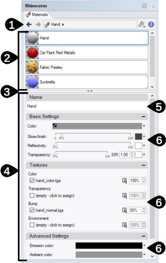

---
---

# {:height="75px" width="75px"} Pannello dell'editor dei materiali
I materiali contengono le specifiche sul colore, sulla riflettività, sulla trasparenza e sulle texture e mappe di rilievo per la rifinitura di una superficie. Tutti i materiali presentano una serie di impostazioni di base. Il materiale predefinito è bianco ed opaco, senza riflettività né trasparenza. Per ottenere i migliori risultati, si usino i materiali specifici di Flamingo.

I materiali si possono assegnare ai livelli, agli oggetti ed ai blocchi. Le assegnazioni si possono effettuare trascinando e rilasciando sugli oggetti o tramite vari controlli. Si veda [Assegnazione dei materiali](material_assignment.html) per ulteriori informazioni.

Una volta assegnati, i materiali vengono memorizzati nel modello. I materiali, le texture e tutti i file di supporto per il rendering si possono memorizzare all'interno del modello di Rhino impostando opportunamente le [Opzioni di rendering](http://docs.mcneel.com/rhino/5/help/it-it/index.htm#options/rendering.htm).

Materiali, ambienti e texture vengono memorizzati nel modello; anche i contenuti di rendering possono essere salvati su dei file condivisibili da vari modelli. I contenuti si possono trascinare da una sessione all'altra di Rhino e su una cartella. I campioni di colore si possono trascinare e rilasciare nello stesso modo. Il [Pannello Librerie](libraries.html) mostra la cartella dei contenuti di default. La si usi per trascinare e rilasciare i contenuti nel modello oppure per trascinare e rilasciare i contenuti del modello su un file esterno.

{:  #panel_map .float-img-right}

##### Dove trovo questo comando?
La scheda Materiali è accessibile in vari modi.

* Scheda Materiali
* Barra degli strumenti Strumenti di rendering >  Editor dei materiali
* Menu > Rendering > Editor dei materiali
* Nella linea di comando, digitare EditorMateriali

Il pannello dell'editor dei materiali è suddiviso in varie sezioni.  I pannelli avanzati possono variare in base al tipo di materiale.

È possibile trascinare i colori e le texture dal campione di colore e rilasciarli su qualsiasi altro campione di colore o controllo dell'Editor dei materiali, della  [Tavolozza delle texture](texturepalette.html) o dell'[Editor degli ambienti](environmenteditor.html).

##### Pannello dei materiali

 1. [Barra delle impostazioni](#settings)
 1. [Elenco dei materiali](#material_list)
 1. [Divisore della finestra](#divider)
 1. [Sezione delle proprietà del materiale](#properties)
 1. [Nome](#name)
 1. [Pannelli delle proprietà del materiale](#panels)

## [Barra delle impostazioni](#panel_map) 
{: #settings .clear-img}
Si usi questa barra per la navigazione all'interno del materiale durante il suo sviluppo.

####  Freccia indietro
Si sposta a ritroso all'interno del materiale corrente o per passare ai materiali selezionati in precedenza.  Per esempio, i materiali con texture hanno vari livelli.  Si usi questa freccia per ritornare sui materiali genitori dai dettagli delle texture.

####   Freccia avanti
Si sposta a ritroso all'interno del materiale corrente o per passare ai materiali selezionati in precedenza.  Per esempio, i materiali con texture hanno vari livelli.  Si usi questa freccia per ritornare sulla texture usata di recente dal materiale genitore.

####  Nome del materiale attualmente selezionato
Mostra il nome del materiale corrente ed il livello.  Per esempio, in presenza di una texture o di un materiale procedurale, viene visualizzata una ">". Utile per vedere dove si trova l'editor in un materiale.

####  Menu Strumenti
Mostra il [menu Strumenti](#tools-menu).  Si tratta di un vasto menu di comandi, impostazioni e utility che hanno a che vedere con i materiali.

## [Elenco dei materiali](#panel_map) 
{: #material_list}
Elenca tutti i materiali contenuti nel modello. Da questo elenco:

* Scorrere l'elenco verso l'alto e verso il basso per vedere tutti i materiali presenti nel modello.
* Trascinare un materiale da questo elenco e rilasciarlo su un livello all'interno del [Pannello Livelli](http://docs.mcneel.com/rhino/5/help/it-it/index.htm#commands/layer.htm) oppure direttamente su un oggetto per assegnarlo ad un oggetto.Si veda [Assegnazione dei materiali](material_assignment.html) per ulteriori informazioni.
* Aggiungere un nuovo materiale usando il pulsante Aggiungi nuovo  che si trova nella parte inferiore dell'elenco.

* Cliccare su ciascun materiale per selezionarlo. Una volta selezionato, nei pannelli sottostanti verranno visualizzate le proprietà del materiale. Si veda [Proprietà dei materiali di rendering](#properties) per maggiori informazioni.
* Cliccare con il tasto destro su una miniatura per visualizzare il menu di scelta rapida dei materiali.
* Cliccare con il tasto destro sull'area vuota per visualizzare il menu di scelta rapida nuovo materiale.

###   Aggiungi nuovo materiale
{: #add_material}
Scorrere verso il basso l'elenco dei materiali per visualizzare l'icona Aggiungi.

Apre la [libreria](libraries.html) dei contenuti di rendering dei materiali.
I materiali della libreria fungono da modelli per la creazione di nuovi materiali nel modello.

### Menu di scelta rapida del materiale
{: material_context}
Questo menu è disponibile se si clicca con il tasto destro su un elenco di materiali.  Si veda [Menu Strumenti](#tools_menu) per maggiori dettagli sulle varie opzioni del menu.

### Menu di scelta rapida per i nuovi materiali
{: new_material_context}
Questo menu è disponibile se si clicca con il tasto destro su un'area vuota dell'elenco di materiali.

####  Crea nuovo materiale
Crea un nuovo materiale di base bianco opaco.

####  Incolla
Crea un nuovo materiale in base ai contenuti degli Appunti.

####  Incolla come istanza
Crea un nuovo materiale in base ai contenuti degli Appunti, collegato all'originale tramite la creazione di istanze.

####  Griglia
Mostra le anteprime come una griglia di miniature.

####  Elenco
Mostra le anteprime come un elenco di miniature.

####  Albero
Mostra le anteprime come un albero con i livelli di nidificazione.

####  Layout orizzontale
Mostra le anteprime a sinistra dei controlli.

####  Mostra riquadro di anteprima
Mostra le proprietà anteprima della miniatura attualmente selezionata. Impostare la geometria, le dimensioni, lo sfondo ed il comportamento di rotazione.

####  Rendi mobile
Rende mobile l'immagine di anteprima in una finestra ridimensionabile.

#### Miniature

#####  Piccolo
Imposta le dimensioni delle miniature sulle dimensioni piccole.

#####  Medio
Imposta le dimensioni delle miniature sulle dimensioni medie.

#####  Grande
Imposta le dimensioni delle miniature sulle dimensioni grandi.

#####  Mostra etichette
Mostra le etichette dei nomi delle anteprime quando si è nella modalità Griglia.
La modalità Elenco mostra sempre le etichette.

#####  Mostra unità
Mostra le dimensioni nelle unità del modello.

#####  Autoaggiornamento anteprima
Aggiorna automaticamente tutte le anteprime man mano che cambiano le impostazioni.

#####  Aggiorna tutte le anteprime
Aggiorna le anteprime manualmente quando l'Autoaggiornamento anteprima è disattivato.

## [Divisore della finestra](#panel_map) 
{: #divider}
Trascinare questo divisore per cambiare l'estensione dell'elenco dei materiali. Se si allunga l'elenco dei materiali, si accorcia la sezione delle proprietà dei materiali.

## [Sezione delle proprietà del materiale](#panel_map) 
{: #properties}

#### [Nome del materiale](#panel_map) 
{: #name}
Il nome del materiale. Il nome del materiale viene anche salvato come nome del file quando il materiale viene esportato nella libreria. Nota: I materiali vengono memorizzati nel modello di Rhino. Materiali unici possono avere lo stesso nome in vari modelli di Rhino.

#### [Pannelli dei materiali](material-editor.html#panel_map) 
{: #panels}
La sezione delle proprietà dei materiali è costituita da una serie di pannelli. Se si fa clic sulla barra del titolo grigia di un pannello, il pannello si chiude ed i suoi contenuti vengono nascosti.  Per visualizzarne di nuovo i contenuti, fare di nuovo clic sulla barra del titolo.

I pannelli dei materiali variano in base al tipo di materiale ed al livello corrente del materiale attivo. Per ulteriori informazioni sui pannelli specifici dei materiali, si veda [Materiali di Flamingo](material-type-simple.html).

## Menu Strumenti 
{: #tools-menu}
<!-- This comes from the page http://docs.mcneel.com/rhino/5/help/en-us/popup_moreinformation/materialthumbnail_contextmenu.htm -->
Queste impostazioni appaiono anche nei menu di scelta rapida tramite clic destro delle anteprime e degli sfondi delle anteprime.

####  Assegna a selezione
Assegna il materiale corrente agli oggetti selezionati.

##### Per assegnare un materiale agli oggetti
 1. Cliccare su Assegna a selezione.
 1. Nella vista di Rhino, selezionare gli oggetti di destinazione.

##### Per preselezionare gli oggetti
 1. Nella vista di Rhino, selezionare gli oggetti di destinazione.
 1. Cliccare su Assegna a selezione.
Gli oggetti di destinazione si possono selezionare sia prima che dopo aver cliccato su "Assegna a selezione".

##### Per trascinare i materiali sugli oggetti
 * Trascinare il materiale dalle anteprime in miniatura o dall'elenco, rilasciandolo sugli oggetti di destinazione.
Il trascinamento della selezione funziona solo con un oggetto per volta.

####  Assegna a livelli
Assegna il materiale corrente ai livelli.

##### Per assegnare un materiale ai livelli
 1. Cliccare su Assegna a livelli.
 1. Nella finestra di dialogo Seleziona livelli, spuntare le caselle per l'assegnazione del materiale.

##### Per assegnare i materiali dal pannello dei livelli
 1. Nel pannello [Livelli](http://docs.mcneel.com/rhino/5/help/it-it/index.htm#commands/layer.htm), selezionare uno o più livelli e fare clic sulla colonna [Materiale](http://docs.mcneel.com/rhino/5/help/it-it/commands/layer.htm#Material).
 1. Nella finestra di dialogo Materiale livello, selezionare il materiale da assegnare.

##### Per trascinare i materiali sugli oggetti
 * Trascinare il materiale dalle anteprime in miniatura o dall'elenco, rilasciandolo sul livello di destinazione.
Il trascinamento della selezione funziona solo con un livello per volta.

####  Seleziona oggetti
Selezionare gli oggetti nel modello per l'assegnazione del materiale.

####  Crea nuovo materiale
Apre la [libreria](libraries.html) dei contenuti di rendering dei materiali.
I materiali della libreria fungono da modelli per la creazione di nuovi materiali nel modello.

####  Importa materiale da file
Importa i materiali da un file .rmtl di Rhino salvato.

####  Salva su file
Salva un materiale su un file .rmtl di Rhino.

####  Cambia tipo
Imposta il materiale su un tipo diverso.

####  Cambia tipo (copia impostazioni simili)
Imposta il materiale su un tipo diverso.
Il comportamento predefinito dipende dallo stato attuale della casella [Opzioni di rendering](http://docs.mcneel.com/rhino/5/help/it-it/index.htm#options/rendering.htm) &gt;  [Copia impostazioni simili quando il tipo di contenuto viene modificato](http://docs.mcneel.com/rhino/5/help/it-it/options/rendering.htm#Copy_similar_settings_when_content_type_is_changed). Se spuntata, le impostazioni compatibili del contenuto precedente verranno copiate in quello nuovo.

####  Reimposta su predefiniti
Modifica le impostazioni del materiale, impostandole su quelle predefinite: materiale bianco, opaco, non riflettente e senza texture.

####  Copia
Copia il materiale selezionato negli appunti di Windows. I contenuti degli appunti possono quindi venire incollati nell'editor per creare un nuovo materiale, oppure si possono incollare direttamente in una cartella per creare un file [libreria](libraries.html).

####  Incolla
Crea un nuovo materiale in base ai contenuti degli Appunti.

####  Incolla come istanza
Crea un nuovo materiale in base ai contenuti degli Appunti, collegato all'originale tramite la creazione di istanze.

####  Elimina
Elimina il materiale selezionato.

####  Rinomina...
Rinomina il materiale selezionato.

####  Duplica
Copia il materiale selezionato su un nuovo materiale con le stesse impostazioni.

####  Rimuovi istanze
Rimuove il collegamento tra i materiali [istanziati](http://docs.mcneel.com/rhino/5/help/it-it/commands/materialeditor.htm#Paste_as_Instance).


####  Filtro dei contenuti
Apre la finestra di dialogo [Filtri dei contenuti](content_filters.html).

####  Proprietà
Apre la finestra di dialogo [Proprietà anteprima](http://docs.mcneel.com/rhino/5/help/it-it/index.htm#options/rendering.htm).