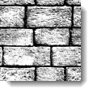
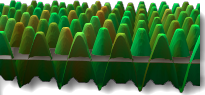
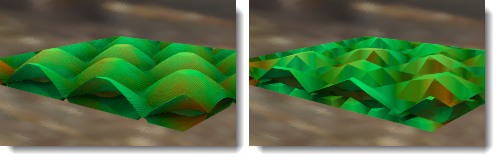

# {: .inline} {{page.title}}

I materiali si possono creare a partire da immagini. Si possono scansionare fotografie o materiali reali, creare dei pattern mediante programmi di fotoritocco oppure utilizzare immagini provenienti da altre sorgenti bitmap.

Immaginiamo che il materiale si estenda all'infinito nello spazio in tutte le direzioni. Il materiale diventa visibile solo quando un oggetto lo attraversa. I pattern vengono applicati al materiale e ripetuti all'infinito (sottoposti a tiling) nelle quattro direzioni secondo la scala impostata.

I migliori risultati si ottengono con immagini di piccole dimensioni sottoponibili a tiling con bordi continui. Se il tiling di una bitmap non dovesse essere soddisfacente, si usi l'opzione che consente di eseguire delle copie speculari. In questo modo, ci si assicura che i bordi combacino.

**Nota:** Se si desidera che un'immagine bitmap copra solo una parte dell'oggetto (etichette di bottiglie, loghi di prodotti, ecc), si usi la funzione [Decal](properties-decal.html).

Le mappe immagine si possono usare in vari modi. Normalmente, si usano delle fotografie di materiali reali che fungono da colori per i materiali.

## Nome
Alle texture immagine si può assegnare un nome. Questo nome viene usato dalla libreria delle texture dell'RDK e non ha alcun impatto reale su Flamingo.

## Immagine di Flamingo

### Anteprima immagine
{: #image-preview}
Mostra un'anteprima del file immagine selezionato. Mantenere il puntatore sull'immagine per visualizzare un pop-up con il nome del file immagine.  Fare clic sull'immagine per selezionare un'immagine diversa.

#### Risoluzione immagine
{: #image-resolution}
Mostra la risoluzione del file immagine corrente in pixel.

### Mattonelle
{: #tiles}
Le mappe immagine usate nella definizione dei materiali sono ripetute ad effetto mattonella (sottoposte a tiling). Questa impostazione specifica l'ampiezza di ciascuna unità (mattonella) nelle unità di misura correnti del modello.

#### Larghezza/Altezza
{: #width-height}
Imposta le dimensioni della mattonella nelle unità del modello.




### Tipo di mappatura
{: #mapping-type}
Le immagini di solito vengono applicate al canale di colore. Tuttavia, esistono altre modalità di utilizzo delle immagini.  Le immagini si possono impostare come:

* [Standard](#standard)
* [Normale](#normal)
* [Scostamento](#displacement)

### Standard
{: standard}
L'immagine fornisce al materiale un colore ed un effetto rilievo. Si usino i valori di Intensità e Rilievo per controllare il modo in cui la bitmap influirà sul materiale.

#### Intensità del colore
{: #color}
Specifica i valori di influenza della mappa immagine sull'aspetto del materiale. Nell'esempio qui sotto, il materiale sottostante è di color magenta. L'intensità del colore aumenta fino a quando il colore sottostante viene completamente mascherato dalla texture bianca e nera.

*Intensità del colore 0.2, 0.5, 1.0.*

#### Intensità del rilievo
{: #bump}
Simula rilievi e rugosità sulla superficie di un oggetto alterando le normali alla superficie dell'oggetto. L'oggetto sottostante non viene modificato. Nell'immagine, il materiale sulla sinistra fa uso della mappatura di scostamento, mentre il materiale sulla destra usa la mappatura bump impostata sul valore massimo. Valori di rilievo negativi invertono l'effetto. I bordi e le ombre del materiale con mappatura bump risultano morbidi. Vedi: [Articolo di Wikipedia: Mappatura bump](https://it.wikipedia.org/wiki/Bump_mapping).

*Intensità del rilievo 0.5 (sinistra) e intensità del rilievo 1.0 (destra).*

### Normale
{: #normal}
Simula l'illuminazione di rugosità e solchi senza usare un numero maggiore di poligoni per renderizzare la mesh. Vedi: [Articolo di Wikipedia: Mappatura normale](https://it.wikipedia.org/wiki/Normal_mapping).

Le mappe normali funzionano in modo simile alle mappe di rilievo, visto che modificano la normale della superficie. L'effetto è essenzialmente lo stesso, tuttavia, le mappe normali consentono un maggiore controllo sulla normale rispetto alle mappe di rilievo. Una mappa di rilievo usa la media dei grigi dei canali RGB di una bitmap. I canali RGB di una mappa normale corrispondono alla modifica delle coordinate XYZ della normale. Visto che il canale blu dell'immagine controlla la direzione z della normale, le mappe normali hanno una quantità considerevole di blu.

### Scostamento
{: #displacement}
Questa mappa immagine provoca uno spostamento della mesh di rendering della superficie in base ai valori di colore dell'immagine. Interviene direttamente sulla posizione geometrica della superficie, modificandola. Lo scostamento spesso avviene lungo la normale locale della superficie. Vedi: [Articolo di Wikipedia: Mappatura di scostamento](https://it.wikipedia.org/wiki/Displacement_mapping).

 **Note:** La mappatura di scostamento va usata moderatamente con gli oggetti piccoli. Lo scostamento aumenta i tempi di rendering in modo considerevole.

#### Altezza
{: #height}
L'altezza del punto di scostamento più alto.

#### Offset
{: #offset}
Imposta il punto iniziale dello scostamento in base alla normale alla superficie. Lo scostamento può avvenire completamente o parzialmente all'interno o all'esterno della parte.

*Offset Z = -1.0*

*Offset Z = -0.5*

*Offset Z = 0.0*

#### Dimensioni facce
{: #facet-size}
La dimensione delle facce della mesh di scostamento. Valori maggiori fanno sì che lo scostamento sia più dettagliato, ma fanno aumentare anche le dimensioni del rendering e l'utilizzo di memoria.

## Immagine avanzata di Flamingo
{: #advanced}
Di solito, un'immagine di Flamingo si applica al canale di colore principale di un materiale. La finestra di dialogo Flamingo Avanzato specifica altri canali su cui può avere effetto la bitmap.  Questi vengono usati per degli effetti molto speciali.

####  Colore base
Si tratta dell'impostazione predefinita.  Un'immagine ha effetto sul [colore](material-type-advanced.html#color) di un materiale.

####  Colore speculare
Ha effetto sul colore del [canale di riflessione](material-type-advanced.html#highlight-color) in base al colore dell'immagine in quel punto.

####  Intensità speculare
Ha effetto sulla [quantità di riflessione](material-type-advanced.html#intensity) in base alla scala di grigi dell'immagine in quel punto.  Viene usato spesso nei pacchetti di texture come mappa speculare.

####  Nitidezza delle riflessioni speculari
Regola la nitidezza delle [riflessioni speculari](material-type-advanced.html#intensity) in base al valore di scala di grigi della mappa in quel punto.

#### Forma delle riflessioni speculari
{: #advanced-highlight-shape}
Ha effetto sulla forma delle riflessioni speculari.

####  Trasparenza
Ha effetto sulla quantità di [trasparenza](material-type-advanced.html#intensity) del materiale in base alla scala di grigi dell'immagine.

####  Traslucidità
Ha effetto sulla quantità di [traslucidità](material-type-advanced.html#translucency) del materiale in base alla scala di grigi dell'immagine.

####  Attenuazione
Ha effetto sulla quantità di [attenuazione](material-type-advanced.html#attenuation) del materiale in base alla scala di grigi dell'immagine.

#### Offset X/Y
{: #advanced-x-y-offset}
Esegue un offset del materiale rispetto agli assi x ed y.

####  Rotazione
Ruota la mappa immagine.  Se necessario, si usi per ruotare l'immagine di 90 o 180 gradi e riorientarla rispetto alla sua rotazione predefinita.