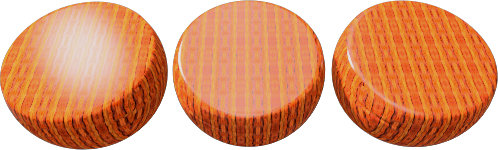
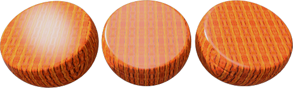
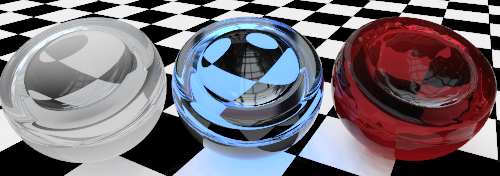
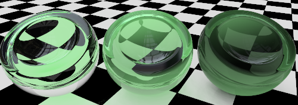
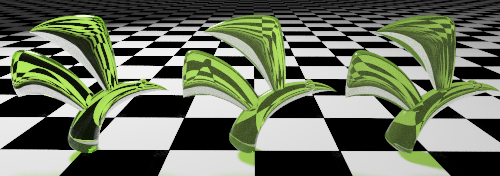
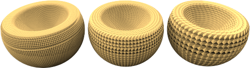

#  {{page.title}}

Flamingo presenta sia dei tipi di [materiali semplici](material-type-simple.html) che un tipo di materiale avanzato.  Il materiale avanzato contiene la serie completa di gruppi di proprietà per un materiale.  Si usi il tipo di materiale Avanzato per la massima flessibilità ed il massimo controllo di un materiale.

L'insieme completo di gruppi di proprietà del materiale avanzato è costituito da:

> [Nome](#name)
> [Procedura](#procedures)
> [Proprietà dei materiali avanzate](#advanced-materials-properties)
> [Rifinitura riflettente](#reflective-finish-and-highlight)
> [Trasparenza](#transparency)
> [Texture procedurali](#bump-patterns)
> [Texture bitmap](#textures)
> [Note](#notes)

## Nome del materiale
{: #name}
Il nome del materiale nel modello di Rhino.  I materiali vengono memorizzati nel modello di Rhino. Ciò significa che un materiale con lo stesso nome nella libreria o in un modello diverso non verrà influenzato dalle modifiche applicate al materiale nel modello corrente. Per usare un materiale in un altro modello, occorre prima esportarlo nella [Libreria](libraries.html). Il nome del materiale viene usato anche come nome del file esportato.

## Procedure materiali
{: #procedures}
L'albero delle Procedure combina uno o più materiali usando un insieme di regole che ne definiscono le modalità di interazione. L'albero mostra i componenti usati per creare il materiale e consente l'aggiunta di ulteriori componenti. I materiali standard sono costituiti da un solo componente: la "Base".

Ciascuna procedura mette insieme due materiali "figli" usando un determinato metodo. Ciascun materiale "figlio" può a sua volta consistere in una procedura, derivante dalla combinazione dei suoi propri "figli". In questo modo, partendo da dei componenti semplici, si possono generare dei materiali estremamente elaborati. Tra le procedure per combinare tra di loro i materiali si includono: [Blend angolare](procedural-materials.html#angular-blend), [Fusione](procedural-materials.html#blend), [Marmo](procedural-materials.html#marble), [Granito](procedural-materials.html#granite), [Mattonella](procedural-materials.html#tile) e [Legno](procedural-materials.html#wood).

Per esempio, la procedura [Marmo](procedural-materials.html#marble) combina un materiale Base con un materiale Venatura creando un motivo a vortice.

##### Per aggiungere una procedura
1. Cliccare con il tasto destro nella finestra delle Procedure.
1. Dal menu, cliccare sul tipo di procedura desiderato.
  * [Base](procedural-materials.html#base)
  * [Blend angolare](procedural-materials.html#angular-blend)
  * [Fusione](procedural-materials.html#blend)
  * [Granito](procedural-materials.html#granite)
  * [Marmo](procedural-materials.html#marble)
  * [Mattonella](procedural-materials.html#tile)
  * [Legno](procedural-materials.html#wood)

##### Per rimuovere una procedura
 1. Nella finestra delle Procedure, cliccare con il tasto destro sul nome della procedura.
 2. Dal menu, cliccare su Rimuovi.

## Proprietà dei materiali avanzate
{: #advanced-materials-properties}



#### Rifinitura riflettente e riflessione speculare
{: #reflective-finish-and-highlight}
Consente di variare il modo in cui un materiale riflette la luce. L'effetto di riflessione speculare di solito è associato alle zone di luce generate su un materiale lucido nei punti in cui la luce colpisce l'oggetto. L'effetto di rifinitura riflettente di solito è definito da riflessioni speculari che riflettono gli oggetti nel resto della scena. È importante ricordare che il cromo ed altri materiali riflettenti di norma creano degli effetti interessanti solo se hanno qualcosa da riflettere. Quando si lavora con dei materiali riflettenti, è anche importante usare degli ambienti interessanti ed altri oggetti che vengano riflessi da questi materiali.
 Nota: Per attivare queste impostazioni, il valore di Intensità deve essere maggiore di zero.

#### Colore delle riflessioni speculari
{: #highlight-color}
Il colore delle riflessioni speculari è il colore che il materiale applica alle riflessioni. Esistono tre impostazioni per questo controllo: Bianco, Metallico e Personalizzato.

#### Bianco
I materiali con riflessioni speculari bianche non aggiungono nessun colore alle riflessioni.   I materiali con zone di massima riflessione luminosa di colore bianco tendono ad assomigliare alle vernici o plastiche standard o alle rifiniture a specchio.

#### Metallico
{: #metallic}
Imposta il colore delle riflessioni speculari in modo che corrisponda al colore base dell'oggetto. Molte finiture metalliche di solito usano il colore base come colore riflettente.  Questa opzione metallica usa il colore base del materiale come colore riflettente.

#### Personalizzato
In alcune finiture molto particolari, le riflessioni degli oggetti hanno un colore diverso dal colore base del materiale.  Di solito ciò succede nei materiali che sono costituiti da vari livelli. Si usi Personalizzato per specificare un colore qualsiasi per le zone di massima riflessione luminosa. Si usi il [Selettore dei colori](select-color.html)  per selezionare un colore riflettente.

#### Intensità
{: #intensity}
Regola l'intensità delle zone di massima riflessione luminosa. Valori inferiori tendono a creare degli oggetti lucidi che riflettono la luce, ma non gli oggetti circostanti. Valori maggiori aumentano le dimensioni e l'intensità delle zone di massima riflessione luminosa e delle riflessioni.  I valori più alti rendono speculare il materiale, facendolo riflettere gli altri oggetti e l'ambiente nella scena.

#### Fresnel
{: #fresnel}
Pronunciato (fray-NELL). Controlla la riflettività dei materiali opachi, un fenomeno noto come [riflessione di Fresnel nei conduttori](http://en.wikipedia.org/wiki/Fresnel_equations). L'impostazione Fresnel regola la tendenza di molti materiali a diventare più speculari se osservati con angoli radenti alle superfici, conservando invece un maggior numero di proprietà opache se osservati in modo perpendicolare ad esse.

Ridurre il valore quando si hanno materiali molto scuri per evitare troppe riflessioni. Aumentare il valore nel caso di materiali quali il legno verniciato, in cui la riflettività di Fresnel è più pronunciata.

#### Nitidezza
{: #sharpness}
Imposta le dimensioni delle zone di massima riflessione luminosa. Valori inferiori definiscono zone di massima riflessione luminosa più ampie; valori maggiori concentrano le riflessioni speculari su un'area minore.  Quando applicata a riflettività ad alta intensità, rende sfocate (fuori fuoco) o nitide (a fuoco) le riflessioni.

#### Tipo
{: #type}
Modifica la modalità di calcolo delle riflessioni quando vengono riflesse sorgenti di luce artificiale. Le riflessioni vengono calcolate usando due metodi: *ray casting* e *riflessione speculare*. Anche se alla fine questi due metodi danno dei risultati identici, in certe situazioni, si possono ottenere dei buoni risultati più velocemente usando un metodo piuttosto che l'altro. Per esempio, l'aspetto di un oggetto può risultare non ottimale quando la riflessione di una sorgente luminosa nasconde l'aspetto del suo materiale.

Nell'immagine qui sotto, corrispondente al tipo Bilanciato, l'oggetto sulla sinistra mostra una riflessione bianca e luminosa che predomina sul materiale.

A volte, nei rendering di interni con sorgenti luminose di piccole dimensioni, le superfici possono presentare degli artefatti maculati. Le superfici che presentano tali artefatti in genere hanno delle riflessioni diffuse. Impostare il tipo su [Lucido](advanced-material-properties-main.html#glossy), [Nessuna riflessione sorgenti di luce](advanced-material-properties-main.html#no-light-source-reflection), o [Monte Carlo](advanced-material-properties-main.html#monte-carlo) può aiutare ad alleviare questo problema.

#### Bilanciato
{: #balanced}
Bilancia automaticamente ray casting e riflessione speculare in base all'impostazione della Nitidezza. Vengono calcolate sia la riflessione reale della sorgente di luce che la riflessione speculare artificiale.

#### Lucido
{: #glossy}
Aumenta la sfocatura della riflessione speculare ed impedisce il ray casting. Non viene calcolata nessuna riflessione, né degli oggetti, né delle luci. In questo modo, aumentano le prestazioni e si evita la presenza di artefatti nei materiali con riflessioni molto sfocate. Qualche sottigliezza nelle riflessioni potrebbe andare persa.

#### Monte Carlo
{: #monte-carlo}
Viene usato solo il ray casting per calcolare le riflessioni delle sorgenti luminose. Il ray casting inizialmente risulta molto "disturbato", per poi convergere gradualmente nella corretta soluzione. Risulta particolarmente utile quando la riflessione speculare non è sfocata.

#### Nessuna riflessione speculare
{: #no-highlight}
Viene usato solo il ray casting per calcolare le riflessioni delle sorgenti luminose. Questa opzione è utile quando si hanno sorgenti luminose grandi ed il materiale non è sfocato; in tal caso, il calcolo della riflessione speculare può essere più dispendioso in termini di tempo. Le riflessioni della sorgente luminosa convergono gradualmente.

#### Nessuna riflessione sorgenti di luce o riflessione speculare
{: #no-light-source-reflection-and-no-highlight}
Esclude tutte le riflessioni delle sorgenti di luce artificiale e l'effetto riflessione speculare artificiale. Le riflessioni degli oggetti continuano ad essere calcolate.

#### Nessuna riflessione sorgenti di luce
{: #no-light-source-reflection}
Esclude le riflessioni di ray casting delle sorgenti di luce. Viene usata solo la riflessione speculare. Questa opzione a volte è utile per evitare artefatti granulosi se il materiale è sfocato e la scena contiene delle sorgenti di piccole dimensioni e molto luminose.

## Trasparenza
{: #transparency}
Le opzioni di trasparenza controllano le proprietà associate al passaggio della luce attraverso un materiale.

#### Intensità della trasparenza
Controlla la "quantità" di trasparenza di un materiale: da opaco a trasparente. I materiali trasparenti accrescono i tempi di rendering.

#### Indice di rifrazione
{: #index-of-refraction}
Determina il peso della rifrazione della luce quando si osserva il materiale in trasmissione.

La tabella seguente illustra gli indici di rifrazione di alcuni materiali:

 | Materiale      |     | IOR         |
 |:--------------|:---:|:------------|
 | Vuoto        |     | 1,0         |
 | Aria           |     | 1,0029      |
 | Ghiaccio           |     | 1,309       |
 | Acqua         |     | 1,33        |
 | Vetro         |     | Da 1,52 a 1,8 |
 | Smeraldo       |     | 1,57        |
 | Rubino/Zaffiro |     | 1,77        |
 | Diamante       |     | 2,417       |
{: .grided-table}

#### Traslucidità
{: #translucency}
Una misura di diffusione. Un valore alto di traslucidità genera un effetto "sabbiato", visto che viene diffusa in modo casuale attraverso il materiale una maggiore quantità di luce. Si tratta di un effetto molto sensibile. Piccole variazioni possono fare una grande differenza.

#### Diffusione
{: #scattering}
Controlla la probabilità che la luce incontri una particella per unità di lunghezza. Per questo effetto si richiede il [Path Tracer](render-tab.html#path-tracer).

La diffusione interna fa sì che la luce penetri nella superficie dell'oggetto e si diffonda in qualsiasi direzione. Molti materiali traslucidi si possono modellare usando questo effetto. Certe superfici, quali la pietra o la pelle, possono essere "ammorbidite" in modo realistico consentendo alla luce di penetrare in esse per una breve distanza.

Affinché si abbia diffusione interna, il materiale deve avere una certa trasparenza. Si tratta di un effetto volumetrico. Affinché esso funzioni correttamente, gli oggetti associati a questo materiale devono essere solidi o racchiudere comunque uno spazio.

#### Attenuazione
{: #attenuation}
Determina in che quantità viene assorbita la luce quando attraversa un oggetto: quanto maggiori sono i valori, tanto più "torbido" sarà l'aspetto dell'oggetto. Si usi l'Attenuazione per modellare un liquido. I liquidi limpidi presentano un valore basso di Attenuazione, mentre i liquidi torbidi hanno un valore di Attenuazione maggiore.

#### Dispersione
{: #dispersion}
Controlla quanta luce viene suddivisa nelle sue componenti spettrali con diverse lunghezze d'onda.

#### Saturazione
{: #saturation}
Determina la quantità di dispersione.

#### Trasparenza diffusa
{: #blurry-transparency}
Quando un materiale è parzialmente trasparente, viene introdotto un leggero "disturbo" nella trasparenza per dargli un aspetto più naturale.

#### Sfocatura
Controlla la quantità di disturbo aggiunta.

#### Bagliore
{: #glow}
Crea l'illusione di illuminazione.

## Texture
{: #textures}
Si possono applicare due tipi di texture ad un materiale: le texture immagine ed i pattern rilievo. Le texture immagine si basano su bitmap, fotografie o immagini scansionate.  I pattern rilievo sono dei motivi casuali o ripetitivi generati da Flamingo.

### Immagini
{: #images}
Per aggiungere dei particolari ad un materiale, si possono usare fino a quattro immagini bitmap. Le mappe immagine si possono usare in vari modi per modificare il colore e le caratteristiche superficiali tridimensionali delle superfici. Le mappe immagine sono dei pattern bidimensionali creati usando programmi di fotoritocco raster, eseguendo la scansione di fotografie o altri materiali. Normalmente, si usano delle fotografie di materiali reali che fungono da colori per i materiali. Le immagini possono essere costituite da fino a quattro immagini. A volte un'immagine controlla il colore, mentre un'altra può controllare le proprietà di rilievo della texture. Per controllare il modo in cui un'immagine influisce su un materiale, si vada alla finestra di dialogo [Proprietà dell'immagine](material-image-properties.html).



### Pattern rilievo
{: #bump-patterns}
I pattern rilievo ricreano l'aspetto di un tipo specifico di superficie senza dover usare ulteriori mappe o delle mappe di scostamento. I rilievi utilizzano una serie di regole matematiche per fornire l'impressione che la superficie abbia dei rilievi. Come pattern, si includono:

> [Carta vetrata](#sandpaper)
> [Pietrisco](#rubble)
> [Piramide](#pyramid)
> [Rugoso](#wrinkled)
> [Marmorizzato](#marbled)

Materiali quali lo stucco, il cemento e l'argilla hanno una texture fine. In genere, a meno che il punto di osservazione non sia estremamente vicino, non vale la pena eseguire una scansione di materiali di questo tipo per creare una bitmap. Usando una mappa procedurale Carta vetrata su un [Colore base](advanced-material-properties-main.html#color) si può facilmente riprodurre questo tipo di pattern. Si crei un [Colore base](advanced-material-properties-main.html#color) che rappresenti il colore del materiale. Quindi, si applichi una mappa di rilievo procedurale al materiale. Si usi l'opzione Carta vetrata se si desidera una texture fine oppure l'opzione Pietrisco per una texture più grossolana.

Spuntando le caselle delle mappe di rilievo, diventano disponibili ulteriori controlli. Su un materiale si possono applicare vari pattern rilievo.

#### Carta vetrata
{: #sandpaper}
Genera una texture smerigliata dall'aspetto fine e casuale. Per l'editing della carta vetrata, modificarne la [Scala](#scale), l'[Intensità](#strength) e la [Rotazione](#rotation).

*Carta vetrata: da valori più bassi a valori più alti di [Scala](#scale) ed [Intensità](#strength).*

#### Pietrisco
{: #rubble}
Dà l'idea di una superficie grumosa e bocciardata. Può essere ridimensionato per creare degli effetti tipo macchie o imbrattature su una superficie. Le macchie si possono creare usando una [Scala](#scale) grande e valori molto ridotti di [Intensità](#strength) con il pattern Pietrisco. Pietrisco ha un intervallo di estensione maggiore rispetto a Carta vetrata.

*Pietrisco: da valori più bassi a valori più alti di [Scala](#scale) ed [Intensità](#strength).*

#### Piramide
{: #pyramid}
Ha l'aspetto di una serie di piccole protrusioni a forma piramidale, come in un pattern zigrinato.  La [Scala](#scale) controlla solo le dimensioni X ed Y della base della piramide. L'[Intensità](#strength) influisce sull'effetto "altezza" della piramide.

*Piramide con una [Scala](#scale) sempre maggiore.*

#### Rugoso
{: #wrinkled}
Conferisce un aspetto rugoso. Per l'editing di Rugoso, modificarne la [Scala](#scale), l'[Intensità](#strength) e la [Rotazione](#rotation).

*Rugoso con una [Scala](#scale) sempre maggiore. L'[Intensità](#strength) viene mantenuta costante.*

#### Marmorizzato
{: #marbled}
Conferisce un aspetto marmorizzato.  Si tratta di un pattern a vortice. Per l'editing di Marmorizzato, modificarne la [Scala](#scale), l'[Intensità](#strength) e la [Rotazione](#rotation).

*Marmorizzato con una [Scala](#scale) sempre maggiore. L'[Intensità](#strength) viene mantenuta costante.*

### Scala
{: #scale}
Modifica la dimensione assoluta dei rilievi.

#### X/Y/Z
Specifica la scala in ciascuna direzione separatamente.

#### Blocca
Conserva l'aspect ratio.

### Intensità
{: #strength}
Definisce la visualizzazione dell'etichetta descrittiva dello snap all'oggetto prescelta.

### Rotazione
{: #rotation}
Imposta l'angolo di rotazione del pattern. Le modifiche relative all'orientamento di solito sono visibili solo se la mappa procedurale possiede un pattern chiaro o se essa è stata ridimensionata usando valori di x, y e z diversi per produrre un pattern direzionale.
