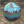

# {: .inline} {{page.title}}
I materiali di Flamingo sono definiti da una serie di gruppi di proprietà. Si tratta di una serie di tipi di materiali semplici comunemente usati.  Questi materiali presentano un gruppo di controlli molto semplici. Tali controlli offrono un facile accesso alle proprietà più comunemente usate per modificare l'aspetto di un materiale senza la complessità di ulteriori controlli. Per la maggior parte dei materiali semplici, modificarne l'aspetto significa semplicemente modificarne il colore.

#### Tipi di materiali semplici:

> {: .inline} [Colore solido](#solid-color)
> {: .inline} [Plastica](#plastic)
> {: .inline} [Metallo](#metal)
> {: .inline} [Vetro](#glass)
> {: .inline} [Lucido](#glossy)
> {: .inline} [ClearFinish](#clearfinish)
> {: .inline} [Flamingo Con texture](#flamingo-textured)
> {: .inline} [Set di texture](#texture-set)

Qualsiasi materiale si può trasformare in un materiale avanzato.  I materiali avanzati presentano tutti i controlli possibili per modificare un materiale in Flamingo nXt.  Per un maggiore controllo dei materiali, si usino i materiali avanzati oppure si converta un materiale esistente in un materiale avanzato.

#### I materiali avanzati sono costituiti dai seguenti gruppi di proprietà:

> [Nome](material-type-advanced.html#name)
> [Procedura](material-type-advanced.html#procedures)
> [Proprietà dei materiali avanzate](material-type-advanced.html#advanced-materials-properties)
> [Rifinitura riflettente](material-type-advanced.html#reflective-finish-and-highlight)
> [Trasparenza](material-type-advanced.html#transparency)
> [Texture procedurali](material-type-advanced.html#bump-patterns)
> [Texture bitmap](material-type-advanced.html#textures)
> [Note](material-type-advanced.html#notes)

I materiali vengono salvati e memorizzati nel modello di Rhino. Materiali unici possono avere lo stesso nome in vari modelli di Rhino.

## Colore solido
{: #solid-color}
I materiali Colore solido hanno solo un [nome](material-type-advanced.html#name) ed un [colore](material-type-advanced.html#color).





## Plastica
{: #plastic}
I materiali Plastica sono leggermente riflettenti, con zone di [massima riflessione luminosa](material-type-advanced.html#highlight-color) di colore bianco.



 Si usi l'Editor avanzato per sovrascrivere le impostazioni predefinite di: [Colore delle riflessioni speculari](material-type-advanced.html#highlight-color), [Intensità](material-type-advanced.html#intensity), [Fresnel](material-type-advanced.html#fresnel) e [Nitidezza](material-type-advanced.html#sharpness).

## Metallo
{: #metal}
Nei materiali Metallo, il colore delle riflessioni speculari coincide con il [colore](material-type-advanced.html#color). È anche possibile controllare la [Nitidezza](material-type-advanced.html#sharpness) della riflessione.



#### Nitidezza
Controlla il valore di nitidezza vs quello di sfocatura della riflessione. Per maggiori informazioni, si veda il punto [Nitidezza](material-type-advanced.html#sharpness) nelle proprietà avanzate.

 Si usi l'Editor avanzato per sovrascrivere le impostazioni predefinite di: [Colore delle riflessioni speculari](material-type-advanced.html#highlight-color), [Intensità](material-type-advanced.html#intensity), [Fresnel](material-type-advanced.html#fresnel) e [Tipo](material-type-advanced.html#type).

## Vetro
{: #glass}
I materiali Vetro hanno un [Colore](material-type-advanced.html#color) ed un [Indice di rifrazione](advanced-material-properties-main.html#index-of-refraction) (IOR).



#### Indice di rifrazione
Controlla la quantità di deviazione della luce quando attraversa un materiale. Per maggiori informazioni, si veda il punto [Indice di rifrazione](advanced-material-properties-main.html#index-of-refraction) nelle proprietà avanzate.

 Si usi l'Editor avanzato per sovrascrivere le impostazioni predefinite di: [Colore delle riflessioni speculari](material-type-advanced.html#highlight-color), [Intensità](material-type-advanced.html#intensity), [Fresnel](material-type-advanced.html#fresnel), [Nitidezza](material-type-advanced.html#sharpness) e [Trasparenza](material-type-advanced.html#transparency).

## Lucido
{: #glossy}
I materiali Lucidi in genere hanno valori bassi di [Intensità](material-type-advanced.html#intensity) e [Nitidezza](material-type-advanced.html#sharpness).



#### Intensità
Controlla l'intensità della zona di massima riflessione luminosa sulla superficie. Per maggiori informazioni, si veda il punto [Intensità](material-type-advanced.html#intensity) nelle proprietà avanzate.

#### Nitidezza delle riflessioni speculari
Controlla il valore di nitidezza della zona di massima riflessione luminosa sulla superficie. Per maggiori informazioni, si veda il punto [Nitidezza delle riflessioni speculari](material-type-advanced.html#sharpness) nelle proprietà avanzate.

 Si usi l'Editor avanzato per sovrascrivere le impostazioni predefinite di: [Fresnel](material-type-advanced.html#fresnel) e [Tipo](material-type-advanced.html#type).

## ClearFinish
{: #clearfinish}
Il materiale ClearFinish simula la verniciatura, le porcellane e le ceramiche, i legni verniciati o qualunque altro materiale con un rivestimento plastico o trasparente. ClearFinish usa l'impostazione [Fresnel](material-type-advanced.html#fresnel) per cambiare il colore del materiale in base all'angolo di osservazione. Questi materiali tendono ad apparire più scuri quando osservati perpendicolarmente alla superficie, mentre diventano sempre più riflettenti se osservati con un angolo man mano più radente la superficie. Un esempio di ciò può essere facilmente riscontrato nelle verniciature delle automobili.



 Si usi l'Editor avanzato per sovrascrivere le impostazioni predefinite di: [Colore delle riflessioni speculari](material-type-advanced.html#highlight-color), [Intensità](material-type-advanced.html#intensity), [Fresnel](material-type-advanced.html#fresnel) e [Nitidezza](material-type-advanced.html#sharpness).

## Flamingo Con texture
{: #flamingo-textured}
I materiali con texture usano immagini per creare colori e motivi. Il nome dell'immagine, la risoluzione, le dimensioni delle mattonelle e l'intensità e nitidezza delle riflessioni speculari si possono controllare da questo materiale semplice.



#### Intensità
Controlla l'intensità della riflessione speculare della superficie. Per maggiori informazioni, si veda il punto [Intensità](material-type-advanced.html#intensity) nelle proprietà avanzate.

#### Nitidezza
Controlla il valore di nitidezza vs quello di sfocatura della riflessione. Per maggiori informazioni, si veda il punto [Nitidezza](material-type-advanced.html#sharpness) nelle proprietà avanzate.

#### Immagine
Imposta la mappa immagine e le proprietà del materiale. Presenta molte opzioni. Per maggiori informazioni, si veda il punto [Immagini](material-type-advanced.html#texture) nelle proprietà avanzate.


 Si usi l'Editor avanzato per sovrascrivere le impostazioni predefinite di questo materiale.

## Set di texture
{: #texture-set}

I materiali "Set di texture" sono un insieme coordinato di texture che definisce un materiale.  Questi insiemi coordinati si possono creare tramite mappe texture contenenti informazioni quali scostamento, mappe normali e mappe di rilievo. Le mappe di scostamento conferiscono profondità ai materiali. Combinando queste mappe texture in un insieme, si possono creare dei materiali molto realistici. Usando software quali [PixPlant](http://www.pixplant.com/), per esempio, si possono creare dei set di texture a partire da bitmap standard.


#### Larghezza ed altezza
Controlla le dimensioni di tutte le texture del set. Si usi questo controllo per mantenere tutte le bitmap allineate e con le stesse dimensioni.

#### Intensità
Controlla l'intensità della riflessione speculare della superficie. Per maggiori informazioni, si veda il punto [Intensità](material-type-advanced.html#intensity) nelle proprietà avanzate.

#### Nitidezza
Controlla il valore di nitidezza vs quello di sfocatura della riflessione. Per maggiori informazioni, si veda il punto [Nitidezza](material-type-advanced.html#sharpness) nelle proprietà avanzate.

#### Tipi
Questa opzione controlla il tipo di riflessione sulla superficie. Per maggiori informazioni, si veda il punto [Tipo](material-type-advanced.html#type) nelle proprietà avanzate.

### Mappe texture
All'interno della scheda Mappa texture, vengono elencate le texture che fanno parte del set di texture.  Fare clic con il pulsante destro sulla scheda per aggiungere, rimuovere o cambiare le texture del set.

#### Aggiungi mappe...
Usare questa opzione del menu di scelta rapida per aggiungere nuove texture all'elenco.  Si possono aggiungere varie texture alla volta. Se i nomi delle texture contengono dei suffissi per uno dei tipi di mappatura, il tipo di mappa viene aggiunto automaticamente.  Per esempio, se una mappa contiene *-normal* all'interno del suo nome, essa verrà automaticamente contrassegnata come tipo di mappa normale.

#### Rimuovi mappa
Questa opzione del menu di scelta rapida elimina una mappa texture dalla scheda.

#### Colore
Questo tipo di mappatura contribuirà al colore visibile della texture. Per maggiori informazioni si veda il [Tipo di mappatura standard](material-image-properties.html#standard)

#### Rilievo
La mappa di rilievo userà la scala di grigi della texture per simulare una variazione di altezza o rilievo nel materiale. Per maggiori informazioni si veda [Mappa di rilievo - Avanzato](material-image-properties.html#standard)

#### Normale
Le mappe normali sono delle mappe di rilievo particolari che usano il canale rosso, verde e blu della bitmap per regolare la direzione del rilievo su ciascun pixel.  Essendo il canale blu la direzione Z del rilievo, le immagini tendono ad assumere una tonalità blu. Per maggiori informazioni si veda [Mappa normale - Avanzato](material-image-properties.html#normal)

#### Speculare
Una mappa speculare usa i colori della scala di grigi del materiale per controllare la quantità di riflessione nell'immagine in corrispondenza di un dato punto. Per maggiori informazioni si veda [Mappa di trasparenza - Avanzato](material-image-properties.html#transparency)

#### Opacità
Una mappa opacità controlla la trasparenza di un materiale su ciascun pixel in base alla scala di grigi dell'immagine. Per maggiori informazioni si veda [Mappa normale - Avanzato](material-image-properties.html#normal)

#### Scostamento
Una mappa di scostamento sposta la mesh di rendering in base al colore della scala di grigi della mappa. Per maggiori informazioni si veda [Mappa di scostamento - Avanzato](material-image-properties.html#displacement)

### Materiale avanzato
Il [materiale avanzato di Flamingo](material-type-advanced) contiene un insieme di proprietà completo per un materiale di Flamingo.  Se nessuno di questi materiali semplici funziona, si usi il [materiale avanzato di Flamingo](material-type-advanced) per creare un materiale con la massima flessibilità.