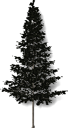
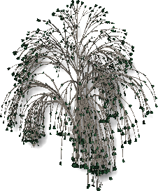

<!-- TODO: This could use an update. But the material is a start.  Let's localize what is here.  We can fill in the details later.-->

# {: .inline} {{page.title}}
{: #tree-editor}

### Menu File

#### Nuovo
Crea una nuova definizione di pianta in base a un modello template.

 | {: .inline} | {: .inline} | {: .inline} |
 |:-------------------------------------------:|:-----------------------------------------:|:-------------------------------------:|
 | **Standard**                                |   **Conifera**                             | **Chioma ampia**                       |
 | {: .inline}         | {: .inline} | {: .inline} |
 | **Palma**                                    |  **Coprisuolo**                          | **Complesso**                                  
{: .plant-table}

#### Apri
Apre una definizione di albero estistente.

#### Salva
Salva la definizione di albero corrente.

#### Salva con nome
Salva la definizione di albero corrente con un nome diverso.

### Menu Raytracing
Renderizza l'immagine di anteprima.

*Vista predefinita (sinistra) e vista con raytracing (destra).*

#### Avvia
Inizia a renderizzare l'immagine di anteprima.

#### Interrompi
Arresta il rendering dell'immagine di anteprima.

### Menu Vista
Mantenere premuto il tasto sinistro del mouse e trascinare per ruotare la camera della vista attorno alla destinazione.
Mantenere premuto il tasto destro del mouse e trascinare per ruotare la destinazione attorno alla camera.
Far scorrere la rotellina del mouse per ridurre o ingrandire l'inquadratura.

#### Ripristina predefiniti
Ripristina la vista ombreggiata predefinita.

#### Mostra foglie
Mostra l'anteprima dell'albero con le foglie.

*Senza foglie (sinistra) e con foglie (destra).*

### Menu Impostazioni
Imposta le unità dell'editor in modo che corrispondano alle unità di lavoro.