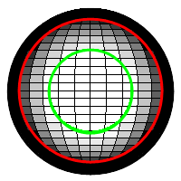
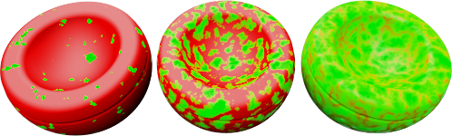
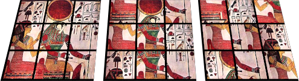
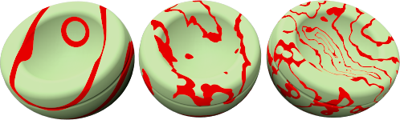

#  {: .inline} {{page.title}}
L'albero delle Procedure combina uno o più materiali usando un insieme di regole che ne definiscono le modalità di interazione. L'albero mostra i componenti usati per creare il materiale e consente l'aggiunta di ulteriori componenti. I materiali semplici sono costituiti da un solo componente: la "Base".

Ciascuna procedura mette insieme due materiali "figli" usando un determinato metodo. Ciascun materiale "figlio" può a sua volta consistere in una procedura, derivante dalla combinazione dei suoi propri "figli". In questo modo, partendo da dei componenti semplici, si possono generare dei materiali estremamente elaborati. Tra le procedure per combinare tra di loro i materiali si includono:

* [Base](#base)
* [Blend angolare](#angular-blend)
* [Fusione](#blend)
* [Marmo](#marble)
* [Granito](#granite)
* [Mattonella](#tile)
* [Legno](#wood)

##### Per aggiungere una procedura
1. Cliccare con il tasto destro su un punto qualsiasi della finestra delle Procedure.
1. Dal menu, cliccare sul tipo di procedura desiderato.

##### Per rimuovere una procedura
 1. Nella finestra delle Procedure, cliccare con il tasto destro sul nome della procedura.
 2. Dal menu, cliccare su Rimuovi.

## Base
{: #base}
Si tratta del materiale semplice di base, senza nessun livello. La procedura predefinita.

## Blend angolare
{: #angular-blend}
Molti materiali cambiano colore, riflessione o trasparenza in base all'angolazione da cui vengono visualizzati. La procedura Blend angolare attua una fusione tra due materiali in base all'angolo di visione relativo alla superficie dell'oggetto.

La procedura Blend angolare attua una fusione tra due materiali diversi per creare degli effetti speciali. I due livelli della procedura sono il livello Interno e quello Esterno.

#### Interno
Da 0 gradi dal punto di osservazione all'Angolo iniziale, la componente Interno sarà completamente visibile. Lo si pensi come un materiale base.

#### Esterno
Dall'Angolo finale sino a 90 gradi dalla direzione di osservazione, la componente Esterno sarà l'unico materiale visibile. Lo si pensi come un rivestimento.

#### Angolo iniziale
L'angolo a partire dal punto di osservazione in corrispondenza del quale inizia il materiale della componente Esterno.

#### Angolo finale
L'angolo a partire dal punto di osservazione in corrispondenza del quale finisce il materiale della componente Esterno.
Tra l'Angolo iniziale e l'Angolo finale, le componenti Interno ed Esterno si fondono.

Nell'immagine sottostante, l'Angolo iniziale{: .inline} è pari a 30 gradi (nel rendering, corrisponde al cerchio verde sulla destra) e l'Angolo finale{: .inline} è pari a 60 gradi (nel rendering, corrisponde al cerchio rosso).

L'immagine sulla destra mostra il materiale Interno in bianco e quello Esterno in nero.

 

* Tra 0 e 30 gradi dal punto di osservazione, si vede il bianco.
* Tra 30 e 60 gradi dal punto di osservazione, si vede un gradiente che va dal bianco al nero.
* Tra 60 e 90 gradi dal punto di osservazione, si vede il nero.

## Fusione
{: #blend}
La procedura Fusione consente di combinare due componenti base e di controllarne la reciproca proporzione. Per riprodurre l'effetto legno, tutte le librerie standard di materiali utilizzano la procedura Fusione per modificare le rifiniture del legno e le sue tonalità.

Questa procedura fornisce i risultati attesi modificando il materiale ed applicando un colore d'insieme al materiale base sottoposto a patterning.

#### Fusione
Varia la percentuale di ciascun materiale componente usato nel materiale finale. Per esempio, il materiale sottostante mostra una fusione tra il materiale a strisce ed il colore solido verde. Nell'immagine sulla sinistra, lo slider è a sinistra ed il materiale a strisce prevale sul colore verde.  Nell'immagine centrale, lo slider si trova al centro e si ha un 50% di materiale a strisce ed un 50% di colore verde.  Nell'immagine sulla destra, lo slider è a destra ed il materiale verde prevale sul materiale a strisce.

#### Usa immagine
Si può usare un'immagine per controllare in che modo interagiranno due materiali. Quando si usa un'immagine bitmap, i valori dei toni di grigio dei pixel definiscono dove si mescolano due materiali componenti. Si usi una mappa immagine a toni di grigio per mediare tra la prima e la seconda componente. La componente Primo verrà disposta nelle zone nere del pattern della bitmap, mentre la componente Secondo sarà disposta in corrispondenza delle zone bianche del pattern della bitmap.

Nell'immagine, vengono usati gli stessi materiali per la prima e per la seconda componente, tuttavia la fusione è controllata da tre bitmap diverse.

La risoluzione della bitmap a maschera influisce sulla qualità del materiale. Immagini bitmap ad elevata risoluzione permettono di ottenere un maggior grado di dettaglio ma normalmente richiedono maggiore memoria.

#### Usa canale alfa
Se l'immagine ha un canale alfa, esso si può usare al posto delle gradazioni di grigio della bitmap per determinare dove si fondono i colori.

#### Inverti
La componente Primo verrà disposta nelle zone bianche del pattern della bitmap, mentre la componente Secondo sarà disposta in corrispondenza delle zone nere del pattern della bitmap.

#### Mattonelle
La dimensione del materiale è invece indipendente dalla risoluzione della bitmap usata per definirlo. Per impostare correttamente la scala di un materiale, è importante definire l'area occupata in unità reali. Se la bitmap è costituita da 6 mattonelle da 4 unità in altezza e da 12 mattonelle da 4 unità ciascuna in lunghezza, la scala sarà di 48 unità nella direzione x e 24 unità nella direzione y. Ciò adatta la bitmap alla dimensione opportuna per il pattern.

#### Larghezza
La larghezza in pixel di una singola istanza dell'immagine.

#### Altezza
L'altezza in pixel di una singola istanza dell'immagine.

## Granito
{: #granite}
Crea un materiale 3D in cui la componente Base si combina con un secondo materiale solido granulare in esso inglobato. La procedura Granito combina in modo casuale la componente macchie e quella base. La procedura Granito definisce la modalità di combinazione delle componenti base e macchie. Le procedure Granito si possono usare per vari materiali, tra cui la plastica brillante, la ruggine ed altri materiali puntinati in modo casuale.

#### Base/Macchie
Le componenti Base e Macchie sono due materiali. Le loro proprietà vengono specificate così come lo si fa per qualsiasi altro materiale.



#### Densità
Definisce la frazione del pattern totale. Aumentando questo valore, si aumenta la dimensione relativa della grana.



## Marmo
{: #marble}
Crea degli strati alternati a partire dalle componenti base e venatura. La procedura Marmo definisce la modalità di combinazione delle componenti base e venatura. Le fasce sono infinitamente grandi e l'orientamento dell'oggetto influisce sul modo in cui esse sono orientate rispetto all'oggetto stesso.

La [mappatura](properties-object.html#mapping) texture degli oggetti controlla l'orientamento del materiale sull'oggetto.

*Nessuna mappatura texture (sinistra). Con mappatura texture (destra).*

#### Base/Venatura
Le componenti Base e Venatura sono due materiali. Le loro proprietà vengono specificate così come lo si fa per qualsiasi altro materiale.


#### Spessore venatura
Modifica la dimensione relativa degli strati, l'uno rispetto all'altro. Spessore venatura rappresenta la frazione della distanza da una striscia Base a quella successiva. L'intervallo varia da zero, per nessuna componente Venatura, ad 1 per nessuna componente Base.




*Rivestimento (sinistra); normale (destra).*

## Mattonella
{: #tile}
Mattonella è un materiale 2D. La [mappatura](properties-object.html#mapping) texture degli oggetti controlla l'orientamento del materiale sull'oggetto. Il materiale Mattonella combina una componente Base con una componente Giuntura. Ciascuno di questi materiali può a sua volta includere qualsiasi altro materiale.

Per ottenere degli effetti speciali, si scalino le mattonelle diversamente in ciascuna direzione. Per esempio, si usi un materiale mattonella molto più lungo in una direzione per creare materiali per rivestimenti esterni.

#### Mattonella
Imposta la dimensione globale della mattonella. Larghezza ed altezza si possono impostare indipendentemente.

#### Larghezza/Altezza
Specifica la larghezza e l'altezza delle mattonelle.


#### Giuntura
Specifica le dimensioni del materiale giuntura.

#### Giuntura orizzontale/Giuntura verticale
Specifica la larghezza e l'altezza del materiale giuntura.

#### Blocca
Conserva l'aspect ratio tra le dimensioni delle giunture orizzontali e verticali.

#### Offset
Fornisce un offset orizzontale relativo per l'unità di ripetizione mattonella verticale. Per esempio, se si imposta il valore sullo 0.5, si produce uno sfalsato convenzionale. Ciò consente di modellare materiali quali piastrelle di marmo senza che sembri che il pavimento sia stato tratto dallo stesso blocco di marmo.

#### Varia mattonelle
Applica casualità al colore del materiale di ciascuna mattonella. Ciò consente di modellare materiali quali un muro di mattoni disposti in modo non uniforme.

#### R/G/B
Modifica i componenti rosso, verde e blu del colore.  Ciò fa variare leggermente il materiale di base di ciascuna mattonella in modo casuale.

#### X/Y/Z
Esegue un offset del materiale rispetto all'origine del sistema di riferimento assoluto per ciascuna mattonella in modo casuale. Tale procedura può risultare molto utile qualora una giunzione che definisce l'inizio del materiale appaia in una posizione poco appropriata.

## Legno
{: #wood}
Il legno è formato da una serie di cilindri concentrici in cui si alternano le componenti Base ed Anello. Le impostazioni del Legno definiscono la modalità di combinazione delle componenti Base ed Anello.

Si usi questo metodo per creare dei materiali legno se gli oggetti non vengono osservati da vicino. Per un materiale legno più particolareggiato, si usi un [materiale texture](material-type-simple.html#textured) per creare il legno.  Se l'osservatore non è troppo vicino al legno, è possibile usare un colore a tinta unita per generare l'effetto legno senza dover sacrificare troppo la qualità dell'immagine. In questo modo, la velocità di rendering sarà più elevata. Un ulteriore vantaggio dell'uso di un materiale legno è che, quando si esegue il rendering di un oggetto da diversi lati, si ottiene un "effetto legno" preciso. Grazie a questa procedura, si vedranno degli anelli concentrici alle estremità e delle venature ai lati dell'oggetto.

#### Base/Anello
Le componenti Base e Anello sono due materiali. Le loro proprietà vengono specificate così come lo si fa per qualsiasi altro materiale.


#### Spessore anello
Definisce la frazione di distanza tra una striscia Base e quella successiva. L'intervallo varia da zero, per nessuna componente Anello, ad 1 per nessuna componente Base.




Rivestimento (sinistra); normale (destra).