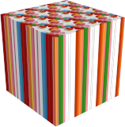

#  {: .inline} {{page.title}}
Le proprietà oggetto di Flamingo nXt influiscono solo sul modo in cui gli oggetti vengono renderizzati in Flamingo nXt.

### {: .inline} Sorgente materiale
{: #material-source}
I materiali si possono assegnare ai livelli, ai blocchi ed agli oggetti.  Per ulteriori informazioni sull'assegnazione di materiali, si veda l'argomento della guida in linea [Assegnazione dei materiali](material_assignment.html). Se il materiale è impostato su PerOggetto, in questa finestra di dialogo vengono visualizzate anche le proprietà del materiale.  Per maggiori informazioni su come modificare un materiale, vedi [Proprietà dei materiali](material-type-simple.html).

### {: .inline} Mappatura texture
{: #texture-mapping}
La mappatura controlla in che modo un materiale viene sistemato (mappato) su un particolare oggetto. Il metodo usato per assegnare un materiale ad un livello o ad un oggetto non influisce sulla mappatura. Se un materiale non possiede un pattern particolare, di solito non è necessario controllarne la mappatura. Si usi la mappatura nel caso in cui un materiale sia "direzionale" oppure quando esso presenta un pattern ben definito. Anche in questi casi, comunque, può essere sufficiente la mappatura predefinita. La mappatura rimane vincolata agli oggetti e li segue qualora essi vengano ruotati, mossi o ridimensionati. Per ulteriori informazioni sui tipi di mappatura, si veda l'argomento della guida in linea [Mappatura texture](http://docs.mcneel.com/rhino/5/help/it-it/index.htm#properties/texturemapping.htm).

 
*Due direzioni di mappatura diverse*

### {: .inline} Decal
{: #decals}
Le decal sono mappe immagine non a mattonella applicabili direttamente sugli oggetti (anziché indirettamente tramite un materiale). Le decal si possono usare per modificare, in una zona determinata, il colore di un oggetto, la sua riflettività o i rilievi della sua superficie. Per ulteriori informazioni sulla creazione ed applicazione delle decal, si veda l'argomento della guida in linea [Decal di Rhino](http://docs.mcneel.com/rhino/5/help/it-it/index.htm#properties/decal.htm).

 
 
*Quattro esempi diversi di decal*

### {: .inline} Mesh personalizzate
{: #custom-meshes}
In Rhino, si possono usare vari modificatori mesh per applicare una serie di effetti sui modelli renderizzati. Si usino questi modificatori per arrotondare i bordi, applicare scanalature e creare mesh tubolari a partire da curve.

Per ulteriori informazioni, consultare i seguenti argomenti:

* [Arrotondamento bordi](http://docs.mcneel.com/rhino/5/help/it-it/index.htm#commands/applyedgesoftening.htm)
* [Conversione curve in mesh tubolari](http://docs.mcneel.com/rhino/5/help/it-it/index.htm#commands/applycurvepiping.htm)
* [Scanalatura](http://docs.mcneel.com/rhino/5/help/it-it/index.htm#commands/applyshutlining.htm)
* [Scostamento](http://docs.mcneel.com/rhino/5/help/it-it/index.htm#commands/applydisplacement.htm)

### {: .inline} Proprietà di Flamingo
{: #flamingo-properties}

#### Canale alfa
{: #alpha-channel}
Rende invisibile l'oggetto. Le ombre gettate da e sull'oggetto vengono renderizzate. L'immagine si può quindi sovrapporre ad un'altra immagine e, nell'immagine composita, si vedranno le ombre.

Nell'esempio qui sopra, abbiamo creato alcune superfici planari semplici che combaciano con l'immagine per intercettare le ombre gettate sull'edificio dagli alberi. I piani sono stati contrassegnati con la proprietà "Canale alfa", per cui, quando renderizzati, risultavano invisibili ma continuavano a mostrare le ombre. Quest'immagine parzialmente trasparente è stata quindi sovrapposta all'altra immagine.

#### Caustiche
{: #caustics}
I raggi di luce riflessi o rifratti da un oggetto curvo o la proiezione di tali raggi su un'altra superficie. Le caustiche vanno usate in situazioni molto specifiche. Le caustiche vengono renderizzate solo con i motori di rendering [Path Tracer](render-tab.html#path-tracer) o [Ibrido](render-tab.html#hybrid).  Il calcolo delle caustiche per la loro resa richiede varie passate. Vedi [articolo di Wikipedia: Caustica (ottica)](http://en.wikipedia.org/wiki/Caustic_(optics)) per ulteriori informazioni.

*Caustiche generate da un bicchiere d'acqua.*

*Senza caustiche (sinistra) e con caustiche (destra).*

#### Sottile
{: #thin}
Un oggetto trasparente che racchiude uno spazio normalmente viene trattato come un solido per la rifrazione trasparente. Se si imposta la proprietà Sottile, ciascuna superficie verrà trattata come un oggetto a due facce ai fini della rifrazione. Questa impostazione va usata se singole superfici quali il vetro vengono usate in modelli architettonici.

 
*Modello base di Rhino (sinistra), Normale (centro) e Sottile (destra).*

#### Entrata di luce diurna
{: #daylight-portal}
Un'entrata di luce diurna è un'apertura per l'[illuminazione proveniente dal sole e dal cielo](lighting-tab.html#interior-daylight) per i rendering di interni. Le entrate di luce diurna consentono l'ingresso naturale in uno spazio interno della luce proveniente dal sole, dal cielo e riflessa da terra. Le entrate di luce diurna hanno effetto solo se il [Sole](sun-and-sky-tabs.html#sun) è stato attivato. Quando lo schema di illuminazione è impostato su [Luce diurna interno](lighting-tab.html#interior-daylight), tutte le superfici trasparenti fungono automaticamente da entrate di luce diurna. Solo nel caso in cui lo schema di illuminazione sia impostato su "Studio" o "Luce diurna esterno" e si desideri comunque che la luce esterna del sole e del cielo entrino in uno spazio interno, occorrerà contrassegnare le finestre come entrate di luce diurna.

*Con entrata di luce diurna (sinistra), senza entrata di luce diurna (destra).*