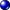

#  {{page.title}}
{: #channel}
Una funzione molto utile di Flamingo nXt 5 è la possibilità di impostare le luci su otto canali diversi. Ciascuna sorgente di luce presente nel disegno, compresi il sole ed il cielo, può essere assegnata ad un canale. In fase di rendering, la luce di ciascun canale viene messa sul suo proprio livello.  Quindi, una volta ultimato il rendering, si può regolare l'intensità di ciascun canale.  La modifica avviene in tempo reale senza il bisogno di effettuare di nuovo il rendering.  

I canali sono molto efficaci in queste situazioni:

* Quando si cerca di bilanciare un ambiente HDRI con la luce del sole.  Non tutti gli ambienti HDRI sono calibrati.  È utile impostare il cielo HDRi su un canale ed il sole su un altro canale.  Quindi, regolare l'intensità relativa della luce del cielo rispetto a quella del sole dopo il rendering.
* Rendering da studio che usano la configurazione a tre luci: luce principale, luce di riempimento e controluce. Impostare ciascuna luce su un canale diverso e quindi regolarne l'intensità in tempo reale nel rendering usando i canali.
* Quando si usano varie serie di riflettori in un rendering esterno o interno.  Ciascuna serie di riflettori si può impostare su un canale diverso in modo tale che i corrispondenti regolatori controllino l'intensità luminosa di ognuna di esse.
* Quando si renderizza con tutte le luci attivate e quindi si attivano e disattivano certe luci. Non è necessario calcolare varie volte il rendering di un interno per generare uno scatto notturno ed uno diurno.

Ciascun canale può essere scalato singolarmente nella finestra di rendering una volta eseguito il rendering dell'immagine e prima del suo salvataggio oppure l'immagine può essere esportata su un file .nXtImage di Flamingo nXt per modificarla successivamente.

Si usino i canali per regolare le varie intensità delle luci tra di loro, non per illuminare tutta l'immagine.  Per illuminare tutta l'immagine in una volta, si usino i controlli della sezione Regola immagine.

<video id="channelsvideo" src="images/flamingo-lights-onoff.mp4" poster="images/flamingo-lights-onoff.jpg" controls preload></video>
*Cliccare per riprodurre il videoclip.*

Per generare e manipolare un'immagine multicanale devono essere soddisfatte le seguenti condizioni:

 1. Tutte le luci coinvolte devono essere attivate.
 2. Ciascuna sorgente di luce va assegnata ad un canale. Di default, Sole e Cielo sono impostati sul canale 0 e le luci artificiali sono impostate sul canale 1.
 3. Immediatamente dopo il rendering, si usino i controlli della sezione Canali nella finestra di rendering.
 3. L'unico formato salvato che conserva le informazioni sui canali è il formato .nXtImage. In esso, si può regolare l'illuminazione per poi salvare l'immagine in formato bitmap.

## Impostare i canali
{: setting}
Il primo passo per impostare un rendering multicanale è impostare ciascuna luce su un canale. Il numero del canale di solito si imposta nelle proprietà di ciascuna luce.   Per informazioni sull'impostazione di luci specifiche si veda:

>[Canale del sole](sun-and-sky-tabs.html#sun-channel)
>[Canale del cielo](sun-and-sky-tabs.html#sky-channel)
>[Canale delle luci artificiali](lights-tab.html#channel)
>[Canale del bagliore dei materiali](documentproperties-flamingo.html#channel)

Sullo stesso canale, si può impostare un numero qualsiasi di luci.  La regolazione del canale è un moltiplicatore. Le luci che si trovano sullo stesso canale manterranno le loro intensità relative durante la regolazione.

## Regolare i canali
{: adjusting}
I canali di illuminazione si possono regolare subido dopo il rendering oppure nell'editor delle immagini di Flamingo se il rendering viene salvato come file .nXtImage.  I canali si possono regolare mentre Flamingo sta renderizzando, tuttavia, consigliamo di arrestare il rendering prima di fare delle modifiche importanti.

#### Dove trovo il controllo di illuminazione di Flamingo?
I controlli dei canali si trovano nella scheda Flamingo nXt, nella [finestra di rendering](render-window.html) sotto Canali.

Esistono otto controlli per i canali, dallo 0 al 7. Solo i canali che contengono delle luci si attiveranno.

Ciascun canale presenta un valore relativo allo slider ed un valore relativo alla casella di selezione.  Il valore della casella rappresenta il valore massimo dello slider. Se lo slider è completamente a destra, per moltiplicare i valori di illuminazione su quel canale, verrà usato il valore indicato nella casella.  Quindi, se lo slider si trova a metà della barra di scorrimento, per moltiplicare i valori di illuminazione che si trovano su quel canale, verrà usata la metà del valore indicato nella casella.  Se lo slider è completamente a sinistra, tutte le luci che si trovano su quel canale verranno disattivate.

Il valore della casella può essere molto importante.  Visto che Sole e Cielo possono essere molto più luminosi delle luci artificiali, per percepire qualche differenza, può essere necessario aumentare a 20 o a 50 il valore della casella corrispondente alle luci artificiali.

Dopo aver regolato correttamente i canali, si salvi l'immagine come file JPG o PNG per il rendering finale.