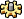

#  {{page.title}}
La scheda di rendering controlla le proprietà principali del rendering finale.  Si usi questa scheda per controllare la qualità ed il tempo che può impiegare un rendering.  La risoluzione dell'immagine finale è uno dei fattori che influisce maggiormente sui tempi di rendering globali.

Nota: Una buona prassi è quella di mantenere bassa la risoluzione di rendering durante i rendering iniziali. Si usino risoluzioni alte solo nei rendering finali.

#### Dove trovo il controllo di illuminazione di Flamingo?

 1. Barre degli strumenti >Barra strumenti di Flamingo nXt > Scheda Opzioni di rendering
 1. Menu > Flamingo nXt 5.0 > Mostra pannello di controllo > Flamingo nXt > Scheda Opzioni di rendering

## Vista da renderizzare
{: #viewtorender}
Impostare la vista che verrà renderizzata da Flamingo nXt 5.  Questa impostazione è utile quando si sta lavorando sul modello e va renderizzata sempre una vista specifica.  Ad esempio, spesso la vista di interesse è la vista Prospettica.  Impostando questo menu, non è necessario accertarsi che la vista sia corrente prima di iniziare il rendering.

#### Vista attiva
Usare questa opzione per renderizzare la vista corrente attiva.  Si tratta dell'impostazione predefinita.

#### Elenco delle viste disponibili
Questo elenco include tutte le viste con nome presenti nel modello.  Selezionare il nome della vista da renderizzare sempre.

## Risoluzione rendering
{: #resolution}
La risoluzione di rendering è una delle impostazioni di rendering più importanti.  Questo controllo imposta le dimensioni e la risoluzione dell'immagine da salvare nel file di Rhino.  A maggiori risoluzioni si ha una crescita esponenziale dei tempi di rendering.  È quindi importante gestire questa impostazione con cautela.

#### Numero totale di pixel
{: #resolutionimagepixels}
Imposta il numero totale di pixel presenti nel rendering finale, usando la vista corrente per i rapporti di altezza e larghezza.  Un'impostazione ottima da usare mentre si sta lavorando sui rendering.  La migliore impostazione da usare con l'opzione vista corrente. La risoluzione dell'immagine si può aumentare o diminuire cambiando semplicemente il numero totale di pixel.

### Risoluzione della vista
Usa le dimensioni della vista in pixel per determinare le dimensioni dell'immagine renderizzata.  Ciò crea una rappresentazione 1 a 1 del rapporto di aspetto e della risoluzione della vista.  Si tratta di una modalità utile, ma che può diventare lenta quando si renderizza una vista a tutto schermo in contrapposizione ad una vista a un quarto di schermo nella configurazione delle viste standard di Rhino.

### Dimensione immagine
{: #resolutionprintedsize}
Imposta la risoluzione finale in base ad una serie di variabili diverse.  Questa opzione si usa per definire delle dimensioni specifiche ed una risoluzione determinata per l'immagine finale. Se l'altezza e la larghezza del rendering finale non danno lo stesso rapporto di aspetto della vista che si sta renderizzando, la vista può venire tagliata sui bordi superiore ed inferiore o laterali. Nota: Questi controlli possono inoltre portare a dei rendering con delle risoluzioni molto alte, i quali possono richiedere dei tempi molto lunghi per il completamento.  Si usino per rendering finali con risoluzioni elevate.

Si possono usare quattro tipi di unità:

>Pixel
>Pollici
>Millimetri
>Centimetri

#### Pixel
Imposta le unità dell'immagine del rendering sui pixel.  Si usi questa impostazione per impostare la larghezza e l'altezza del rendering finale in pixel.

#### Pollici
Imposta le unità di pagina sui pollici. I pollici vengono usati in combinazione con le impostazioni di risoluzione per determinare la risoluzione finale dell'immagine renderizzata.  Per determinare la risoluzione finale, moltiplicare il numero di pollici in larghezza ed altezza per il valore di risoluzione in punti per pollice.

#### Millimetri
Imposta le unità di pagina sui millimetri. I millimetri vengono usati in combinazione con le impostazioni di risoluzione per determinare la risoluzione finale dell'immagine renderizzata.  Per determinare la risoluzione finale, moltiplicare il numero di millimetri in larghezza ed altezza per il valore di risoluzione in punti per millimetro.

#### Centimetri
Imposta le unità di pagina sui centimetri. I centimetri vengono usati in combinazione con le impostazioni di risoluzione per determinare la risoluzione finale dell'immagine renderizzata.  Per determinare la risoluzione finale, moltiplicare il numero di centimetri in larghezza ed altezza per il valore di risoluzione in punti per centimetro.

#### Applica rapporto di aspetto vista
Si usi questa impostazione per mantenere le impostazioni di larghezza ed altezza sullo stesso rapporto di aspetto della vista corrente.  In questo modo, si garantisce che venga renderizzata la vista completa nell'immagine finale.

#### Larghezza
La larghezza dell'immagine stampata nelle unità correnti.  Moltiplicare questa impostazione per quella della risoluzione per raggiungere le dimensioni dell'immagine finale in totale di pixel.

#### Altezza
L'altezza dell'immagine stampata nelle unità correnti.  Moltiplicare questa impostazione per quella della risoluzione per raggiungere le dimensioni dell'immagine finale in totale di pixel.

### Risoluzione
{: #printsizepixelsperunit}
{: #printsizedpi}
{: #printsizeresolution}

#### Schermo
L'immagine viene renderizzata usando la risoluzione DPI (punti per pollice) della vista. Si tratta della densità di pixel su un dispositivo.  Normalmente esprime i [punti per pollice (DPI)](https://en.wikipedia.org/wiki/Dots_per_inch).

#### Personalizza
L'immagine viene renderizzata usando una risoluzione personalizzata. Definire la risoluzione personalizzata specificando l'altezza e la larghezza della vista nel controllo **Pixels per:**.

#### Stampante, qualità bassa
Imposta la risoluzione su 100 pixel per pollice oppure 4 pixel per mm.

#### Stampante, qualità normale
Imposta la risoluzione su 150 pixel per pollice oppure 6 pixel per mm.

#### Stampante, qualità alta
Imposta la risoluzione su 300 pixel per pollice oppure 12 pixel per mm. Questa risoluzione è piuttosto alta per un rendering.  È indicata per i rendering di piccole dimensioni, ma per rendering dalle dimensioni di un poster o di una parete con questa impostazione la risoluzione globale può raggiungere dei valori molto alti. Risoluzioni alte possono portare a dei tempi di rendering molto lunghi. 

#### Pixel per
Quando il controllo Risoluzione è impostato su Personalizza, si usi questo controllo per impostare la risoluzione per unità selezionata. Quando si seleziona una risoluzione predefinita, questo controllo mostra la risoluzione corrente.

## Profondità di campo
{: #depthoffieldoption}
Consente di creare un effetto "sfuocato" simulando l'uso delle proprietà ottiche degli obiettivi. Per ogni impostazione dell'obiettivo, esiste un'unica distanza a cui gli oggetti appaiono perfettamente a fuoco; la nitidezza diminuisce gradualmente in avanti e indietro rispetto alla distanza focale.

#### Attivato
Attiva l'effetto profondità di campo.

#### Intensità
Controlla le dimensioni della zona a fuoco. Impostando l'Intensità sullo zero, tutta l'immagine risulta nitida. Aumentando l'Intensità, le zone oltre la distanza focale diventano più sfuocate e la zona a fuoco si riduce.

#### Distanza focale
{: #focaldistance}
Imposta la distanza per la profondità di campo. La distanza, rispetto al punto della profondità di campo, entro la quale gli oggetti sono a fuoco. Se la Distanza focale è impostata su 10 unità, gli oggetti che si trovano a circa 7 unità dietro al punto della profondità di campo e a circa 3 unità davanti al punto della profondità di campo saranno a fuoco.

#### Selezione >>
Specificare un punto nel modello per la distanza focale.

## Motore di rendering
{: #render-engine}
All'interno di Flamingo ci sono tre motori di rendering diversi.  In condizioni normali di rendering, ciascun motore di rendering produrrà dei risultati leggermente diversi.

Flamingo usa delle tecniche progressive a più passi per generare i rendering.  Ad ogni passo, ci possono essere degli artefatti nel rendering. Gli artefatti lasciano degli insoliti effetti incompiuti in un rendering.  Tecnicamente, con un periodo sufficiente di tempo, tutti e tre i mototi di rendering generano lo stesso rendering.  Il tempo, però, è sempre un fattore limitante. Il trucco è quindi quello di selezionare il motore di rendering che renderizzi al meglio la scena corrente nel minor numero di passi.

Selezionare un motore di rendering diverso e quindi renderizzare per visualizzare i risultati è semplice.

### Predefinito
L'algoritmo predefinito produce simulazioni di elevata qualità. Il motore di rendering predefinito è efficace per un'ampia varietà di scene.  Gli altri due motori hanno maggiori punti forti, ma anche maggiori punti deboli.  Il motore predefinito è un buon punto di partenza.

Il motore di rendering predefinito presenta un artefatto abbastanza evidente nelle prime passate.  Si tratta di ombre "dure" che si sovrappongono.  Con l'avanzare delle passate, queste ombre diventano più morbide.  Il motore predefinito è quindi in grado di restituire velocemente un risultato, ma può richiedere più passate per ammorbidire le ombre.

La differenza in termini di qualità tra il metodo predefinito ed il metodo path tracer può essere piuttosto impercettibile, specialmente se l'illuminazione indiretta è attivata. Le differenze in termini di qualità possono non valere la pena, verificandosi a discapito dei tempi di calcolo.

### Path Tracer
{: #path-tracer}
Il path tracer inizia col mostrare un'immagine a grana grossa che diventa gradualmente sempre più fine. Questo processo viene denominato *convergenza*. Il path tracer, per molti modelli e con un'impostazione più semplice, può generare dei prodotti finiti di miglior qualità, ma lo fa con tempi di calcolo più lunghi e servendosi di calcoli più complessi. **Nota:** L'uso del path tracer può far sì che appaiano delle macchie luminose oppure degli artefatti granulosi durante il processo di rendering. Questi artefatti sono normali se si usa il path tracer e vengono risolti con il passare del tempo.

Alcuni effetti avanzanti, quali le caustiche o la trasmissione sfuocata, possono essere calcolati con una precisione maggiore usando il path tracer. Le immagini renderizzate con istanze, piante e mappe di scostamento possono convergere più velocemente. Di solito il path tracer è più facile da configurare rispetto al metodo predefinito. Quando si seleziona il path tracer non si usano impostazioni avanzate quali shader di riflessione, entrate di luce diurna ed illuminazione ambiente.

Le immagini renderizzate con il path tracer di solito richiedono tempi maggiori per la convergenza rispetto a quelle renderizzate con il metodo predefinito. Le simulazioni della luce diurna in ambienti interni, soprattutto le scene in cui le finestre sono relativamente piccole, possono richiedere più tempo per il completamento.

### Ibrido
Il motore ibrido è un tentativo di utilizzare il meglio del motore predefinito e del motore Path Tracer.  Usa gli effetti di entrambi.  Il motore ibrido calcola sempre la luce indiretta.  L'artefatto generato dal motore ibrido è un esteso pattern a punti che si riduce dopo varie passate. In alcuni casi, possono occorrere varie passate per rimuovere tale pattern. Per molti rendering, questo motore può rivelarsi quello migliore.

###  **Avanzato**
Apre la finestra di dialogo Proprietà del documento, alla scheda [Flamingo nXt](documentproperties-flamingo.html). Qui trovate varie proprietà di rendering avanzate che si possono impostare per personalizzare ulteriormente la qualità del rendering finale.