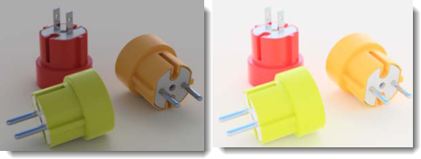

---
---

# {:height="75px" width="75px"} Finestra di rendering
La finestra di rendering fornisce opzioni per la regolazione dell'esposizione e per l'aggiunta di effetti di post-processing. La struttura principale della finestra di rendering fa parte del quadro di rendering di Rhino.  Per maggiori dettagli sui menu e le icone della finestra di rendering, si veda l'argomento [Finestra di rendering](http://docs.mcneel.com/rhino/5/help/it-it/index.htm#information/renderwindowpostprocess.htm).  Questo argomento tratta delle aggiunte specifiche di Flamingo al processo di rendering.

## Gestione di un rendering attivo
Una volta iniziato il rendering, appare la [Finestra di rendering](http://docs.mcneel.com/rhino/5/help/it-it/index.htm#information/renderwindowpostprocess.htm) ed inizia il rendering.  Flamingo è un sistema multipassata che aggiorna l'immagine renderizzata in varie fasi. Quando si avvia un rendering, Flamingo prima controlla se ci sono eventuali modifiche nel suo modello interno e quindi inizia un processo di inizializzazione.  Questo processo può richiedere alcuni secondi o alcuni minuti.  In questa fase viene importato il modello, le bitmap dei materiali vengono raccolte dal disco rigido e viene creato il buffer dell'immagine di rendering. Esistono dei passi chiave nel processo di gestione del rendering:

>[Rendering multipassata](#multi-pass)
>[Arresto di un rendering](#stop-render)
>[Regolazione dell'immagine](#adjusting)
>[Salvataggio dell'immagine](#saving)

### Rendering multipassata
{: #multi-pass}
Flamingo nXt è un motore di rendering completamente nuovo. Usando un metodo di rifinitura multipassata, consente degli effetti di rendering più avanzati senza avere un'interfaccia complicata. Nelle prime passate di rendering, ci saranno degli strani artefatti.  All'inizio, le ombre appariranno molto nette e lineari. Quindi, sfumandosi tra di loro ad ogni successiva passata, esse diventeranno più morbide. Ad ogni passata di rendering, migliorano molti altri effetti.  Si usi la [scheda Flamingo](#flamingo-tab) per monitorare il processo di rendering.

In un certo senso, i rendering di nXt non sono mai del tutto "finiti"; sta a voi decidere quando la loro qualità soddisfa le vostre esigenze e quindi quando fermarvi. Siete liberi di lasciare che le immagini continuino a migliorare. Se volete modificare o salvare qualcosa, potete anche arrestare un'immagine in qualsiasi momento.

Alcuni degli effetti che migliorano ad ogni passata:

>Illuminazione (come l'illuminazione globale, se attivata)
>Ombre morbide
>Riflessioni (diffuse)
>Rifrazione
>Antialiasing
>Profondità di campo

### Arresto di un rendering
{: #stop-render}
È possibile arrestare il rendering in vari modi:

 Cliccare sulla “X” in alto a destra della finestra di rendering per arrestare il rendering immediatamente e chiudere la finestra di rendering. Il miglior metodo per ritornare velocemente al modello per effettuare delle modifiche.

 Cliccare sul pulsante Arresta rendering per arrestare il rendering al termine della passata in corso. La migliore opzione prima di salvare un'immagine.

 Fare doppio clic sul pulsante Arresta rendering per arrestare il rendering immediatamente e lasciare aperta la finestra di rendering.

### Regolazione di un rendering
{: #adjusting}
Dopo aver arrestato un'immagine, si usino i controlli della [scheda Flamingo](#flamingo-tab) per regolare velocemente l'immagine e l'illuminazione. Si tratta di una serie di strumenti molto importanti per la generazione di immagini di alta qualità.

Tra i controlli usati per la regolazione delle immagini si includono:

>[Regola immagine](#adjust-image)
>[Canali](#channels)
>[Effetti di post-processing](#post-process-effects)

### Salvataggio delle immagini
{: #saving}
Un'immagine può essere salvata in vari modi, a seconda di ciò che si desidera fare con essa.  Per la maggior parte delle immagini, salvare come immagine JPG o PNG è la procedura consigliata.  Tuttavia, esistono altre opzioni.

####  Salva immagine
Salvare come file immagine JPG o PNG è la procedura normale dopo aver regolato un'immagine.  

 Il JPG è un formato immagine molto efficiente che genera file di dimensioni ridotte.  Questo formato è adatto per le immagini che andranno poi inserite in un sito o inviate per email.  Tuttavia, rimuove alcuni colori dalle immagini.

Il PNG è un formato compresso che contiene il 100% delle informazioni sul colore e sul canale alfa. È un formato adatto ad immagini di alta qualità.

#### Salva con canale alfa
{: #save-with-alpha-channel}
Salva l'immagine nei formati PNG a 32-bit, TIF e BMP includendo lo sfondo con canale alfa. Le versioni con canale alfa dei formati file vengono usate in operazioni di compositing di alta qualità. Quando il rendering viene salvato con canale alfa, gli sfondi appaiono neri.  Per salvare il canale alfa, si usi la relativa casella di selezione che si trova nella [scheda Flamingo](#flamingo-tab) o nella [finestra di dialogo di salvataggio](#saving). Il formato file PNG è quello corretto da usare per catturare le informazioni alfa.

#### Esporta su file nativo di Flamingo nXt (.nXtImage)
{: #export-to-nxtimage}
Salva informazioni non compresse su luminanza e colore. Salva tutti i canali renderizzati, compreso il canale [alfa](environment-tab.html#alpha). I file nXtImage si possono aprire nell'[Editor delle immagini](image-editor.html) per applicare loro dei valori di [esposizione](#adjust-image) ed [effetti di post-processing](#effects) o per risalvare le immagini in un altro formato bitmap.
Il formato .nXtImage è il formato immagine nativo dei motori di rendering nXt. Si tratta del formato raccomandato per l'archiviazione dei rendering, visto che conserva il massimo numero di informazioni sui rendering generati. Le immagini archiviate in questo formato possono essere manipolate nell'[Editor delle immagini di nXt](image-editor.html) ed è inoltre possibile aggiungervi degli effetti speciali. Da questo editor, è possibile salvare in molti formati file standard, compresi tutti i formati supportati in nXt. Si può anche salvare nel formato [file EPix di Piranesi (.epx)](http://www.piranesi.co.uk/).

#### Esporta su file HDR
{: #export-to-hdr}
Salva informazioni non compresse su luminanza e colore. Il formato .hdr conserva i dati sulla luminanza direttamente in un formato ad alta gamma dinamica. Gli sfondi senza dati di luminanza, come le normali fotografie, appaiono neri se salvati in uno di questi formati.

#### Esporta su file EXR
{: #export-to-exr}
Un formato file per immagini ad alta gamma dinamica rilasciato come standard aperto assieme ad un set di strumenti software creati dalla Industrial Light and Magic (ILM), a loro volta rilasciati con una licenza di software libero. Questo formato file supporta valori in virgola mobile a 16 bit per canale (in mezza precisione) con 1 bit per il segno, 5 bit per l'esponente e 10 bit per la mantissa. Ciò consente un intervallo dinamico di oltre trenta stop di esposizione. Vedi [articolo di Wikipedia: OpenEXR](https://it.wikipedia.org/wiki/OpenEXR).
Il formato .exr conserva i dati sulla luminanza direttamente in un formato ad alta gamma dinamica. Gli sfondi senza dati di luminanza, come le normali fotografie, appaiono neri se salvati in uno di questi formati.

####  Esci
Chiude la finestra di rendering.

#### Menu a discesa
Per maggiori dettagli sui menu e le icone della finestra di rendering, si veda l'argomento [Finestra di rendering](http://docs.mcneel.com/rhino/5/help/it-it/index.htm#information/renderwindowpostprocess.htm).

## Scheda Flamingo
{: #flamingo-tab}
La scheda Flamingo della finestra di rendering aggiunge molti controlli specifici del motore di rendering di Flamingo. La comprensione di questi controlli è importante per la gestione dei rendering attivi di Flamingo.

#### Salva con canale alfa
Salva le immagini PNG a 32-bit, TIF e BMP includendo lo sfondo con canale alfa. Le versioni con canale alfa dei formati file vengono usate in operazioni di compositing di alta qualità. Quando il rendering viene salvato con canale alfa, gli sfondi appaiono neri.  Si usino questa casella di selezione e quella che si trova nella [finestra di dialogo di salvataggio](#saving) per salvare correttamente il canale alfa. Il formato file PNG è quello corretto da usare per catturare le informazioni alfa.

## Progresso
{: #progress}
Si usino le informazioni della sezione Progresso per verificare lo stato e l'avanzamento di un rendering di Flamingo.

#### Azione
Mostra lo stato attuale del rendering del modello.

Tra i messaggi di stato si includono:

* Rendering iniziato - Una volta iniziato il rendering, inizia la fase di conversione del modello e l'impostazione di memoria per il rendering.
* Azione completata - Una volta premuto il pulsante di arresto e dopo che il motore di rendering ha ultimato una passata, l'azione di arresto giunge a compimento.
* Passata completa - Questo messaggio viene visualizzato al completamento di ciascuna passata.
* Riprendi rendering - Viene visualizzato nei casi in cui è possibile una ripresa del rendering.
* Aggiornamento in corso - Il motore di rendering si trova nel mezzo di una passata e sta aggiornando il rendering.

#### Passata
La passata che Flamingo sta renderizzando.  Flamingo è un motore di rendering multipassata.  In ciascuna passata, vengono aggiunti gli effetti di illuminazione e vengono rifiniti gli effetti di rendering complessi.

#### Linea di scansione
Una passata procede lungo un tratto di pixel orizzontali.  Ciascuna riga di pixel è una linea di scansione.  Questo valore riporta la linea di scansione corrente restituita dal motore di rendering.

#### Tempo trascorso
Il tempo trascorso dall'inizio del rendering.  Non include il tempo di configurazione del rendering.

#### Raggi / secondo
Il numero di raggi risolti nella scena per secondo.

#### Pixel / secondo
Il numero di pixel risolti nell'immagine per secondo.

## Regola immagine
{: #adjust-image}
Si tratta di uno dei controlli più importanti di Flamingo. Così come in una fotocamera, è possibile regolare l'esposizione dell'immagine.  Questo controllo è ideale per rendere più luminosi o più scuri i rendering, aggiungere del contrasto o aumentare la saturazione del colore. Questo processo di regolazione viene denominato [mappatura dei toni](https://en.wikipedia.org/wiki/Tone_mapping). Flamingo lavora nello spazio della luminanza, un intervallo di colori e luminosità molto più ampio rispetto a quello visualizzabile sul monitor di un computer o su una stampa.  La mappatura dei toni è un processo che consiste nel convertire i dati sulla luminanza in pixel Rossi, Verdi e Blu (RGB) visualizzabili su uno schermo o stampabili. Le impostazioni controllano anche in che modo vengono salvate le immagini.

  
*L'immagine predefinita sulla sinistra. L'immagine corretta dopo l'applicazione di luminosità (0.20), sovraesposizione (0.16) e saturazione (1.20).*
Si usi questo processo per regolare velocemente la luminosità di un'immagine ed il suo colore d'insieme senza il bisogno di effettuare di nuovo il rendering.

### Luminosità
{: #brightness}
Definisce la luminosità globale. Per esempio, se una superficie bianca viene renderizzata come grigia, si aumenti il valore di luminosità affinché essa appaia di colore bianco. Oppure, se una scena esterna appare sovraesposta, si diminuisca il valore di luminosità sino a raggiungere il risultato desiderato.

*Luminosità sul valore predefinito (sinistra) ed impostata su un valore più alto (destra).*



### Sovraesposizione
{: #burn}
Regola il punto di bianco dell'immagine. Si tratta del bianco più luminoso dell'immagine. Una leggera sovraesposizione può aggiungere intensità, vivacità e chiarezza ad un rendering applicando ulteriori zone di bianco per contrastare le zone scure.
Vedi [articolo di Wikipedia: Punto bianco](http://en.wikipedia.org/wiki/White_point).

*Sovraesposizione sul valore predefinito (sinistra) ed impostata su un valore più alto (destra).*

### Saturazione
{: #saturation}
La saturazione controlla la quantità di colore nell'immagine. Una saturazione pari a 0.00 dà un'immagine in scala di grigi. Valori superiori a 1.00 possono rendere i colori più ricchi.

*Saturazione sul valore predefinito (sinistra) ed aumentata di circa 3 (destra).*

### Istogramma
{: #histogram}
Mostra graficamente la distribuzione delle zone chiare e scure nell'immagine dopo l'applicazione dei controlli di "Regola immagine". Sulla sinistra del grafico si trovano i toni più scuri fino al nero. Sulla destra, i toni più chiari fino al bianco. Aiuta a determinare le parti importanti dell'immagine. Un buon obiettivo è regolare l'immagine affinché essa presenti una gamma completa di valori.  Per esempio, se l'istogramma si arresta prima di arrivare sull'estrema destra del grafico, si usino valori maggiori di luminosità o sovraesposizione per spingere verso il bianco le porzioni più chiare del rendering. Vedi: [Articolo di Wikipedia: Istogramma](http://en.wikipedia.org/wiki/Histogram). Su internet troverete numerosi articoli sull'uso degli istogrammi per valutare l'esposizione nella fotografia digitale. Gli stessi principi si possono applicare al rendering.

*Un esempio di istogramma con pochissime zone scure ed un ampio intervallo di colori chiari.  Questo grafico mostra anche l'esistenza di alcuni pixel completamente bianchi poiché cade prima di raggiungere il bordo destro (sull'estrema destra si trovano i colori luminosi fino al bianco).*

#### Opzioni dell'istogramma
Cliccare con il tasto destro sull'istogramma per visualizzare le seguenti opzioni.  Queste opzioni cambiano semplicemente il modo in cui l'istogramma mostra le informazioni. Esse in realtà non modificano i valori dell'istogramma.

* **Adatta** - Adatta le verticali più alte al grafico.
* **Mediana** - Adatta il valore mediano alla verticale. Utile per vedere i dettagli sui bordi del grafico.
* **Media** - Adatta il valore medio alla direzione verticale.
* **Mostra grafico ordinato** - Ordina tutti i valori in base alla quantità con cui appaiono nell'immagine.
* **Mostra scala** - Mostra i valori corrispondenti lungo la parte inferiore del grafico.
* **Colore del grafico...** - Impostare il colore del grafico.

### Blocca esposizione
{: #lock-exposure}
Se i parametri relativi all'esposizione sono bloccati, le variazioni apportate all'illuminazione non avranno effetto sull'esposizione.

## Restrizioni rendering
{: #number-of-passes}
{: #time}
{: #render-constraints}


## Informazioni
{: #information}

#### Risoluzione
Mostra la [risoluzione del rendering](render-tab.html#resolution) corrente.

#### Facce
Mostra il numero di facce mesh usate per renderizzare il modello.  Un buon valore per paragonare varie [impostazioni delle mesh di rendering](http://docs.mcneel.com/rhino/5/help/it-it/index.htm#documentproperties/mesh.htm) in Rhino.

#### Facce visibili
In presenza di blocchi nel modello, Flamingo nXt è in grado di usare le definizioni dei blocchi per renderizzare le istanze di blocco senza ricalcolare le mesh di ciascuna istanza. Facce visibili mostra quante ulteriori facce provvisorie verrebbero generate se non esistessero le istanze di blocco.

#### Informazioni sull'illuminazione
Alcune informazioni sulle impostazioni di illuminazione correnti del rendering.  Le informazioni sull'illuminazione elencate sono:

>[Impostazioni predefinite](lighting-tab.html)
>[Sole](sun-and-sky-tabs.html#sun)
>[Cielo](sun-and-sky-tabs.html#sky)
>[Luci](lights-tab.html)
>[Indiretta](lighting-tab.html#indirect)
>[Ambiente On/Off](lighting-tab.html#ambient)

## Canali
{: #channels}
Si usino questi controlli per cambiare i canali delle luci in tempo reale. Assegnare le luci ad uno degli otto canali. Quindi, regolare l'illuminazione dell'immagine renderizzata una volta generato il rendering. Questa funzione risulta potente quando si tratta di bilanciare varie sorgenti di luce in un rendering. Per maggiori informazioni, si veda l'argomento [Canali di rendering](render-channel.html#adjustng-channels).

## Effetti di post-processing
{: #post-process-effects}
Applicare gli effetti di post-processing dopo aver effettuato il rendering dell'immagine. Tali effetti si possono attivare, disattivare e riordinare all'interno dell'elenco. Ciascun effetto possiede i suoi propri settaggi. Elenco degli effetti:

>Nebbia
>Bagliore
>Glare
>Profondità di campo
>Punti
>Curve
>Isocurve
>Annotazioni

Per maggiori informazioni sui vari filtri, si veda l'argomento [Post-processing di immagini](http://docs.mcneel.com/rhino/5/help/en-us/index.htm#information/renderwindowpostprocess.htm).