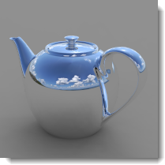
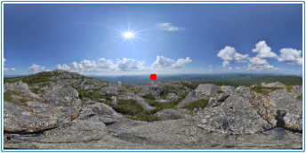

# {: .inline} {{page.title}}
Il [Sole](#sun) ed il [Cielo](#sky) sono strettamente connessi tra di loro. Il sole può cambiare la luminosità del cielo in modalita automatica. Se il sole è attivo ed il cielo è un'HDRI, è importante bilanciarne le intensità.

## Sole
{: #sun}
Il sole è una sorgente di luce parallela invisibile molto intensa. Fattori che simulano le condizioni di luce solare nell'ambiente reale (quali la latitudine e la longitudine, l'ora del giorno e la stagione) controllano la direzione della luce solare e la sua luminosità.

Questo argomento si incentra sul controllo Sole di Flamingo.  Per sistemare il sole, si può usare anche il controllo [Sole di Rhinoceros](http://docs.mcneel.com/rhino/5/help/it-it/commands/sun.htm).  Flamingo manterrà sincronizzati i due controlli sole.

##### Dove trovo il controllo Sole di Flamingo?

Il Sole va attivato tramite le [Impostazioni di illuminazione predefinite](lighting-tab.html#lighting-presets) oppure le [Impostazioni di illuminazione personalizzate](lighting-tab.html#sun).

* {: .inline} Barre degli strumenti >{: .inline} Barra strumenti di Flamingo nXt
* {: .inline} Menu > Flamingo nXt 5.0 > Mostra pannello di controllo > Scheda Flamingo nXt > Sole

**Nota:** La scheda Sole sarà visibile solo se il sole viene attivato tramite un'impostazione di illuminazione.

I valori delle inclinazioni solari sono necessari per eseguire i calcoli relativi all'illuminazione solare. L'inclinazione dei raggi solari si può specificare in due modi: tramite l'ora, il giorno ed il luogo oppure indicando l'angolo diretto. La prima modalità è indicata nei casi in cui si voglia simulare l'effetto reale della luce solare nello studio della posizione del modello. Si specifichi invece l'angolo solare diretto se si desidera controllare l'angolo di illuminazione senza alcun riferimento all'effettiva posizione del sole nella realtà. Si usi l'angolo solare diretto per sperimentare effetti di illuminazione.

  
*Sydney, Australia, 21 Giugno, ore 9:30 (sinistra). Stoccolma, Svezia, 21 Giugno, ore 9:30 (destra).*

### Imposta azimuth ed altitudine
{: #set-azimuth-and-altitude}
Imposta l'inclinazione solare manualmente specificando azimut ed altitudine. Attiva i controlli [Azimuth](#azimuth) ed [Altitudine](#altitude).

#### Azimuth
{: #azimuth}
Imposta la direzione del sole in gradi angolari rispetto al Nord (0) sul piano orizzontale.  La mappa circolare mostra il mondo in una vista piana.

#### Altitudine
{: #altitude}
Imposta l'altezza del sole nel cielo in gradi angolari rispetto all'equatore (0).  La mappa semicircolare simula una sezione che attraversa la direzione verticale delle coordinate assolute.

### Imposta posizione sulla Terra
{: #set-location-on-earth}
Usare il calcolatore degli angoli solari per sistemare il sole in base a Data, Ora, Posizione.  **Nota:** Come accade con tutti i calcolatori solari, la precisione della posizione del sole può variare. Se si richiede una precisione assoluta, si consiglia di verificare la posizione del sole.  

#### Data
{: #date}
Specifica la data.

#### Ora
{: #time}
Specifica l'ora del giorno.

#### Ora legale
{: #daylight-savings-time}
Avanza di un'ora le lancette dell'orologio.

#### Latitudine/Longitudine
{: #latitude-longitude}
Inserire una latitudine ed una longitudine oppure specificare un punto sulla mappa.
Se si specifica un punto sulla mappa servendosi del cursore, si aggiornano anche i relativi valori di latitudine e longitudine.

#### Zona oraria
{: #time-zone}
Mostra la zona oraria in base alla latitudine e longitudine relativa al punto specificato.

#### Elenco delle città
{: #city-list}
Selezionare una città per impostare la posizione.

#### Mappa
{: #map}
Cliccare sulla mappa per specificare una zona. Mantenere premuto il tasto sinistro del mouse e trascinare per effettuare una panoramica della mappa.

### Intensità del sole
{: #sun-intensity}
Definisce la luminosità della componente sole della luce diurna (luce diretta). L'intensità della luce solare viene calcolata automaticamente in base alle condizioni del cielo e all'inclinazione solare, ma può essere modificata per bilanciarsi con le altre luci.

### Illuminazione sole
{: #sun-highlight}
La nitidezza del punto di massima illuminazione del sole.

*Illuminazione sole=0 (sinistra) ed 1 (destra).*

**Nota:** Quando si usa l'impostazione Illuminazione sole, possono apparire degli artefatti di luce solare nei rendering di esterni. Per attenuare od eliminare questi artefatti, si imposti il settaggio Illuminazione sole su un valore più basso.
{: #speckle-artifacts}



#### Direzione nord
{: #north}
**Nota:** Nord è la direzione Y del sistema assoluto.

## Cielo
{: #sky}
Il cielo è una grande sfera che circonda il rendering e che può essere usata per l'illuminazione. Il Cielo è molto diverso dall'ambiente.  Il cielo controlla l'illuminazione. L'ambiente controlla ciò che viene riflesso ed è visibile sullo sfondo. Ci sono molte situazioni in cui Cielo ed Ambiente potrebbero essere impostati in modo diverso.

#### Dove trovo il controllo Cielo di Flamingo?
Il Cielo va attivato tramite le [Impostazioni di illuminazione predefinite](lighting-tab.html#lighting-presets) oppure le [Impostazioni di illuminazione personalizzate](lighting-tab.html#sky).

 1. {: .inline} Barre degli strumenti >{: .inline} Barra strumenti di Flamingo nXt
 1. {: .inline} Menu > Flamingo nXt 5.0 > Mostra pannello di controllo > Scheda Flamingo nXt > Cielo

Gli schemi di illuminazione predefiniti per la luce diurna [Esterna](lighting-tab.html#exterior-daylight) ed [Interna](lighting-tab.html#interior-daylight) usano il cielo automatico di default. Lo schema predefinito per l'illuminazione da [Studio](lighting-tab.html#studio-lighting) usa l'illuminazione per immagini HDR di default.

Il cielo si può impostare in cinque modi:

* [Off](lighting-tab.html#off)
* [Cielo automatico](#automatic-sky)
* [Immagine ad alta gamma dinamica (HDRI)](#high-dynamic-range-image-sky)
* [Colore](#color-sky)
* [Immagine](#image-sky)

Le due impostazioni migliori per l'illuminazione proveniente dal cielo sono il cielo con [Immagine HDR](#high-dynamic-range-image-sky) ed il [Cielo automatico](#automatic-sky). Il cielo in HDR usa un'immagine con i valori di illuminazione memorizzati in ciascun pixel per ricreare l'illuminazione ed i riflessi che questa crea sugli oggetti. Il cielo automatico usa valori reali di posizione del sole e nuvolosità per simulare un cielo.  Queste impostazioni producono i rendering più dinamici.

### Cielo automatico
{: #automatic-sky}
Il cielo automatico usa le impostazioni della [Scheda sole](sun-and-sky-tabs.html) per specificare l'intervallo di colore e l'intensità della luce del cielo.  Per esempio, quando il sole è alto nel cielo, l'illuminazione ed i colori del cielo sono molto diversi da quando il sole è basso nel cielo.

*Cielo automatico: sole alto nel cielo (sinistra) e basso all'orizzonte (destra).*

#### Nuvolosità
{: #sky-cloudiness}
Quando la Nuvolosità è disattivata, il cielo viene considerato terso e si creano delle ombre marcate. Maggiore è il livello di nuvolosità, minore sarà il contrasto tra luce ed ombre. Alti livelli di nuvolosità creano ombre più morbide ed un effetto di illuminazione più uniforme. L'opzione Nuvolosità ha delle importanti conseguenze sul calcolo della luce diurna come, ad esempio, la quantità relativa di luce diretta verso quella indiretta, il modo con il quale viene calcolata la luce indiretta ed il colore dello sfondo, qualora sia stata selezionata l'opzione Cielo automatico. L'impostazione Nuvolosità varia da 0 (chiaro) ad 1 (completamente coperto). Impostazioni di nuvolosità attorno a 0,35 - 0,50 rappresentano un intervallo molto sensibile e dinamico.

*Nuvolosità 0 (sinistra) e nuvolosità 1 (destra).*

#### Intensità del cielo
{: #sky-intensity}
Definisce la luminosità della componente cielo della luce diurna (luce indiretta). L'intensità della luce del cielo viene calcolata automaticamente in base alle condizioni del cielo ed all'inclinazione solare. **Nota:** Questa impostazione è importante solo se nella scena ci sono altre luci da compensare. In assenza di altre luci, l'indicatore del tono compenserà l'esposizione e l'immagine renderizzata non sarà più luminosa o più tenue in base a tale impostazione.



### Cielo con immagini ad alta gamma dinamica
{: #high-dynamic-range-image-sky}
Un'immagine [ad alta gamma dinamica (HDR o HDRI)](https://it.wikipedia.org/wiki/High_dynamic_range_imaging) è uno speciale file immagine 2D. Queste immagini contengono un intervallo di valori di luminosità su ciascun pixel molto più ampio rispetto ai comuni file immagine quali .jpg o .png. Questi dati aggiuntivi si possono usare per illuminare un modello. Se i valori contenuti nell'HDR sono accurati, anche l'illuminazione sarà accurata. Ciò può produrre un'illuminazione molto dinamica nella scena. Lo schema predefinito per l'illuminazione da studio usa le immagini HDR per il cielo. Se pensiamo all'illuminazione da studio come un'attività al chiuso, possiamo paragonare l'immagine HDR ad un soffitto che emette luce in base ai colori dell'immagine stessa.

*Illuminazione con immagini HDR.*

Si presuppone che le immagini HDR contengano valori di radianza espressi in unità di watt. Per poter ottenere dei corretti livelli di illuminazione, è possibile che l'intensità di queste immagini HDR abbia bisogno di essere regolata.

Oltre al Cielo, si può usare un'immagine HDR diversa per ciascuno dei tre sfondi visibili: Sfondo [Visibile](environment-tab.html#advanced-background), [Riflesso](environment-tab.html#advanced-background) e [Rifratto](environment-tab.html#advanced-background). 

#### Immagine HDRI
Specifica il file immagine HDR (HDR ed HDRI sono lo stesso tipo di file). Fare clic sull'immagine per selezionare un'HDRI diverso.

*Proiezione equirettangolare.*

Le immagini HDR vengono fornite con due tipi di proiezione, che consentono all'immagine di adattarsi correttamente alla sfera del cielo. Quella più usata è quella equirettangolare.  Queste immagini sono rettangolari con un rapporto di aspetto di 2:1. Le immagini equirettangolari hanno una risoluzione simile su tutta la loro superficie. La seconda proiezione è quella sferica. Le immagini HDRI sferiche sono quadrate nel rapporto di aspetto e presentano una grande curvatura. Le proiezioni sferiche presentano una minore risoluzione in corrispondenza delle giunzioni.

#### Intensità
Regola la luminosità della luce dell'immagine HDR. Questa impostazione è importante solo se nella scena ci sono altre luci da compensare. In assenza di altre luci, l'indicatore del tono compenserà l'esposizione e l'immagine renderizzata non sarà più luminosa o più tenue in base a tale impostazione.

*Bassa intensità HDR ed alta intensità HDR.*

{: .inline} Nell'illustrazione, l'immagine è stata ruotata in modo tale che la riflessione del sole appaia sull'oggetto. Inserire i gradi di rotazione oppure spostare interattivamente l'indicatore del widget di rotazione.

*Immagine ruotata affinché il sole sia visibile sull'oggetto.*

#### Saturazione
La saturazione del colore della luce. Visto che la luce proveniente da un'immagine HDR è del colore dei pixel dell'immagine, a volte si possono produrre degli effetti di colore indesiderati. Impostare la saturazione su valori bassi se si desidera usare la luce proveniente dall'immagine, ma non il colore.

*Saturazione bassa (sinistra) e saturazione alta (destra).*





### Colore
{: #color-sky}
È possibile usare un colore o gradiente di colore per illuminare la scena. I colori del cielo vengono moltiplicati per il valore di intensità per dare ai colori un valore di illuminazione.

#### Intensità
Il valore di intensità viene usato per moltiplicare i colori nel cielo e dà come risultato un valore di illuminazione.  I colori possono variare da 0 a 256 per canale. L'intensità moltiplica tali valori.

#### Tipo di colore
Il colore del cielo si può controllare in tre modi.  I controlli sono simili a quelli dell'ambiente con colore.  Si vedano i controlli [Sfondo con colore](environment-tab.html#environment-color-and-gradient-backgrounds) per maggiori informazioni.

### Immagine
{: #image-sky}
È possibile usare un'immagine per illuminare la scena. I colori dell'immagine vengono moltiplicati per il valore di intensità per dare ai colori un valore di illuminazione.

#### Intensità
Il valore di intensità viene usato per moltiplicare i colori nel cielo e dà come risultato un valore di illuminazione.  I colori possono variare da 0 a 256 per canale. L'intensità moltiplica tali valori.

#### Proiezione dell'immagine
La mappatura di un'immagine sul cielo si può controllare in vari modi.  I controlli sono simili a quelli dell'immagine di sfondo.  Si vedano i controlli [Immagine di sfondo](environment-tab.html#environment-image) per maggiori informazioni.